# IdeaNest — Kickstarter tipli Crowdfunding Platforması

**Tam Funksionallıq, Arxitektura və Texnologiya Spesifikasiyası**

| | |
|---|---|
| **Versiya** | 1.0 |
| **Tarix** | 14 Avqust 2026 |
| **Status** | Draft — təsdiq gözləyir |
| **Əhatə** | Web (Next.js) + Mobil (React Native/Expo) + Backend (NestJS) |
| **Referans məhsul** | [kickstarter.com](https://www.kickstarter.com) (14.08.2026 tarixində canlı araşdırılıb) |

---

## Mündəricat

1. [İcmal və Məhsul Strategiyası](#1-icmal-və-məhsul-strategiyası)
2. [Domain Lüğəti](#2-domain-lüğəti)
3. [Aktorlar və Rollar](#3-aktorlar-və-rollar)
4. [Tam Funksionallıq İnventarı](#4-tam-funksionallıq-i̇nventarı)
5. [Kritik Biznes Qaydaları](#5-kritik-biznes-qaydaları)
6. [Domain Modeli və State Machine-lər](#6-domain-modeli-və-state-machine-lər)
7. [Verilənlər Bazası Sxemi](#7-verilənlər-bazası-sxemi)
8. [Sistem Arxitekturası](#8-sistem-arxitekturası)
9. [Ödəniş Arxitekturası (Azərbaycan)](#9-ödəniş-arxitekturası-azərbaycan)
10. [API Dizaynı](#10-api-dizaynı)
11. [Axtarış və Discovery](#11-axtarış-və-discovery)
12. [Real-time və Bildirişlər](#12-real-time-və-bildirişlər)
13. [Media Pipeline](#13-media-pipeline)
14. [Texnologiya Stack — Tam Siyahı](#14-texnologiya-stack--tam-siyahı)
15. [Asılılıqlar (Dependencies)](#15-asılılıqlar-dependencies)
16. [Monorepo Strukturu](#16-monorepo-strukturu)
17. [Təhlükəsizlik](#17-təhlükəsizlik)
18. [Observability](#18-observability)
19. [DevOps və İnfrastruktur](#19-devops-və-i̇nfrastruktur)
20. [Test Strategiyası](#20-test-strategiyası)
21. [Lokalizasiya və Valyuta](#21-lokalizasiya-və-valyuta)
22. [Hüquqi və Uyğunluq (Compliance)](#22-hüquqi-və-uyğunluq-compliance)
23. [Yol Xəritəsi (Roadmap)](#23-yol-xəritəsi-roadmap)
24. [Risklər və Açıq Suallar](#24-risklər-və-açıq-suallar)

---

## 1. İcmal və Məhsul Strategiyası

### 1.1 Nə qururuq

**Reward-based (mükafat əsaslı) crowdfunding platforması.** Yaradıcılar (creator) layihələrini yerləşdirir, dəstəkçilər (backer) pul vəd edir (pledge) və əvəzində maddi/rəqəmsal mükafat alır. Platforma **all-or-nothing** modeli ilə işləyir: layihə son tarixə qədər hədəfə çatmasa, heç kimdən pul tutulmur.

> **Vacib fərq:** Bu **investisiya deyil**. Backer səhm, pay və ya faiz almır — yalnız məhsul/mükafat alır. Bu fərq Azərbaycan qanunvericiliyi baxımından kritikdir (bax: [Bölmə 22](#22-hüquqi-və-uyğunluq-compliance)).

### 1.2 Kickstarter-in əsas dəyər təklifi (araşdırma nəticəsi)

Canlı araşdırma göstərdi ki, platformanın nüvəsi 4 sütuna dayanır:

| Sütun | Təsvir |
|---|---|
| **All-or-nothing funding** | Risk azaldıcı mexanizm. Backer yalnız layihə uğurlu olduqda ödəyir. Creator natamam büdcə ilə qalmır. |
| **Discovery mühərriki** | 15 kateqoriya, ~100+ alt-kateqoriya, teq sistemi, "Projects We Love" kuratorluğu, coğrafi filtr, 7 sıralama alqoritmi. Trafikin böyük hissəsi platformanın daxilindən gəlir. |
| **Story-driven kampaniya səhifəsi** | Video + zəngin mətn + mükafat pillələri + "Risks and challenges" bölməsi + FAQ + Updates + Comments. Bu, sadə e-ticarət səhifəsi deyil — inandırma alətidir. |
| **Post-campaign fulfillment** | Pledge Manager: survey, add-on satışı, gecikmiş vəd (late pledge), çatdırılma hesablanması, VAT/vergi yığımı, backer report/eksport. Kampaniya bitəndə iş bitmir. |

### 1.3 Məhsul prinsipləri

1. **Etibar hər şeydən vacibdir.** Pul insanların cibindən çıxır və aylarla gözləyirlər. Şəffaflıq, moderasiya və hesabatlılıq birinci dərəcəli funksiyalardır, sonradan əlavə olunan şey deyil.
2. **Creator-un uğuru = platformanın uğuru.** Creator alətləri (analitika, marketinq linkləri, backer idarəetməsi) backer alətləri qədər dərin olmalıdır.
3. **Mobil ikinci dərəcəli deyil.** Kickstarter trafikinin ~60%-i mobildir. Mobil app kampaniyaya baxış, pledge, update oxuma və bildirişlər üçün tam funksionaldır.
4. **Pul axını audit edilə bilən olmalıdır.** Hər manat üçün immutable ledger. Heç bir balans "hesablanmır" — həmişə ledger-dən oxunur.

---

## 2. Domain Lüğəti

| Termin | Azərbaycanca | Tərif |
|---|---|---|
| **Project / Campaign** | Layihə / Kampaniya | Maliyyələşdirmə tələb edən yaradıcı təşəbbüs |
| **Creator** | Yaradıcı | Layihəni yaradan və idarə edən şəxs/təşkilat |
| **Backer** | Dəstəkçi | Layihəyə pul vəd edən istifadəçi |
| **Pledge** | Vəd | Backer-in verdiyi maliyyə öhdəliyi (dərhal tutulmur) |
| **Reward Tier** | Mükafat pilləsi | Müəyyən vəd məbləği müqabilində vəd olunan mükafat paketi |
| **Add-on** | Əlavə | Əsas mükafata əlavə olaraq alına bilən məhsul |
| **Item** | Element | Mükafat və add-on-ların qurulduğu atomik fiziki/rəqəmsal vahid |
| **Goal** | Hədəf | Uğur üçün lazım olan minimum məbləğ |
| **Stretch Goal** | Genişləndirilmiş hədəf | Əsas hədəfdən sonra elan olunan bonus hədəflər |
| **All-or-Nothing** | Ya hamısı, ya heç nə | Hədəfə çatmasa ödəniş olmur |
| **Funding Period** | Maliyyələşdirmə dövrü | Kampaniyanın aktiv olduğu müddət (1–60 gün) |
| **Late Pledge** | Gecikmiş vəd | Kampaniya bitdikdən sonra da vəd qəbulu |
| **Pledge Manager** | Vəd meneceri | Kampaniyadan sonrakı survey/add-on/çatdırılma idarəetmə aləti |
| **Backer Survey** | Dəstəkçi sorğusu | Ünvan, ölçü, rəng və s. məlumatların toplanması |
| **Fulfillment** | İcra / Çatdırılma | Mükafatların istehsalı və backer-lərə çatdırılması |
| **Projects We Love** | Sevdiyimiz Layihələr | Redaksiya heyətinin seçdiyi layihələr (kuratorluq nişanı) |
| **Superbacker** | Super dəstəkçi | Son 1 ildə ≥25 layihəyə ≥10 AZN vəd etmiş istifadəçi |
| **Collaborator** | Əməkdaş | Creator-un layihəyə dəvət etdiyi məhdud icazəli komanda üzvü |
| **Referrer** | Yönləndirici | Trafikin/vədin gəldiyi mənbə (UTM/custom link) |
| **Escrow** | Depozit hesabı | Vəd tutulduqdan payout-a qədər vəsaitin saxlandığı hesab |
| **Payout** | Ödəniş / Köçürmə | Komissiya çıxıldıqdan sonra creator-a köçürülən məbləğ |
| **Chargeback** | Geri tələb | Kart sahibinin bank vasitəsilə ödənişi mübahisələndirməsi |

---

## 3. Aktorlar və Rollar

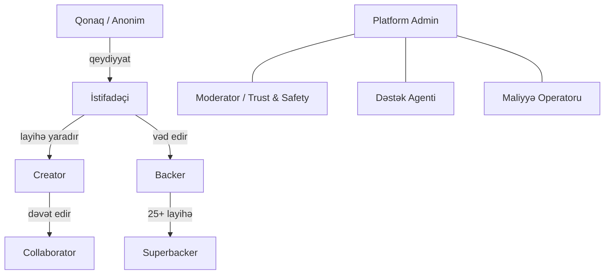

### 3.1 İcazə matrisi (RBAC)

| Əməliyyat | Guest | User | Backer | Creator | Collaborator | Moderator | Admin | Finance |
|---|:-:|:-:|:-:|:-:|:-:|:-:|:-:|:-:|
| Layihələrə baxış | ✅ | ✅ | ✅ | ✅ | ✅ | ✅ | ✅ | ✅ |
| Axtarış / filtr | ✅ | ✅ | ✅ | ✅ | ✅ | ✅ | ✅ | ✅ |
| Layihə saxlama (save) | ❌ | ✅ | ✅ | ✅ | ✅ | ✅ | ✅ | ✅ |
| Vəd etmə (pledge) | ❌ | ✅ | ✅ | ✅ | ✅ | ✅ | ✅ | ❌ |
| Şərh yazma | ❌ | ❌ | ✅¹ | ✅ | ✅ | ✅ | ✅ | ❌ |
| Layihə yaratma | ❌ | ✅ | ✅ | ✅ | ❌ | ❌ | ✅ | ❌ |
| Layihə redaktəsi | ❌ | ❌ | ❌ | ✅ | ✅² | ❌ | ✅ | ❌ |
| Update dərci | ❌ | ❌ | ❌ | ✅ | ✅² | ❌ | ✅ | ❌ |
| Backer report görmə | ❌ | ❌ | ❌ | ✅ | ✅² | ❌ | ✅ | ✅ |
| Payout başlatma | ❌ | ❌ | ❌ | ❌ | ❌ | ❌ | ❌ | ✅ |
| Layihə dayandırma | ❌ | ❌ | ❌ | ❌ | ❌ | ✅ | ✅ | ❌ |
| "Projects We Love" nişanı | ❌ | ❌ | ❌ | ❌ | ❌ | ✅ | ✅ | ❌ |
| İstifadəçi banlama | ❌ | ❌ | ❌ | ❌ | ❌ | ✅ | ✅ | ❌ |
| Geri qaytarma (refund) | ❌ | ❌ | ❌ | ❌ | ❌ | ❌ | ✅ | ✅ |

¹ Yalnız həmin layihənin backer-i və ya creator-u şərh yaza bilər (Kickstarter modeli).
² Creator tərəfindən verilən qranulyar icazələrə görə (`can_edit_project`, `can_post_update`, `can_view_backers`, ...).

---

## 4. Tam Funksionallıq İnventarı

Bu bölmə platformanın **hər** funksiyasını sadalayır. Hər funksiya `[W]` = Web, `[M]` = Mobil, `[A]` = Admin panel işarəsi ilə qeyd olunub.

### 4.1 Autentifikasiya və Hesab

| # | Funksiya | Platforma | Qeyd |
|---|---|---|---|
| A-01 | Email + parol ilə qeydiyyat | W, M | Email təsdiqi məcburi |
| A-02 | Email təsdiq linki / OTP | W, M | 24 saat etibarlı token |
| A-03 | Giriş (login) | W, M | Rate-limit: 5 cəhd / 15 dəq |
| A-04 | Sosial giriş — Google | W, M | OAuth 2.0 / OIDC |
| A-05 | Sosial giriş — Apple | W, M | iOS App Store tələbi |
| A-06 | Sosial giriş — Facebook | W, M | Opsional |
| A-07 | Parol bərpası | W, M | Tək istifadəlik token, 1 saat |
| A-08 | 2FA — TOTP (authenticator) | W, M | Creator-lar üçün tövsiyə, payout üçün məcburi |
| A-09 | 2FA — SMS | W, M | Backup metod |
| A-10 | Aktiv sessiyaların idarəsi | W, M | Cihaz siyahısı, uzaqdan çıxış |
| A-11 | Hesabın silinməsi (GDPR) | W, M | 30 gün gecikmə, anonimləşdirmə |
| A-12 | Məlumatların eksportu (GDPR) | W | JSON/ZIP arxiv |
| A-13 | Email dəyişikliyi | W, M | Hər iki emailə təsdiq |
| A-14 | Parol dəyişikliyi | W, M | Köhnə parol tələb olunur |
| A-15 | Biometrik giriş (Face ID / Touch ID) | M | Keychain / Keystore-da refresh token |

### 4.2 İstifadəçi Profili

| # | Funksiya | Platforma |
|---|---|---|
| P-01 | Profil şəkli (avatar) yükləmə və kəsmə | W, M |
| P-02 | Ad, bio, yerləşmə, veb-sayt | W, M |
| P-03 | Sosial şəbəkə linkləri | W, M |
| P-04 | "Backed" tabı — dəstəklənən layihələr arxivi (məbləğsiz) | W, M |
| P-05 | "Created" tabı — yaradılan layihələr | W, M |
| P-06 | "About" tabı | W, M |
| P-07 | Superbacker nişanı (göstərmə/gizlətmə seçimi) | W, M |
| P-08 | Profilin gizliliyi (public / private) | W, M |
| P-09 | Bloklanmış istifadəçilər siyahısı | W |
| P-10 | Bildiriş tənzimləmələri (granular) | W, M |
| P-11 | Dil və valyuta seçimi | W, M |

### 4.3 Discovery və Axtarış `[W] [M]`

Canlı araşdırmadan çıxarılmış **dəqiq** struktur:

**4.3.1 Kateqoriyalar (15 əsas)**

| Kateqoriya | Alt-kateqoriya nümunələri |
|---|---|
| **Art** | Ceramics, Conceptual Art, Digital Art, Illustration, Installations, Mixed Media, Painting, Performance Art, Public Art, Sculpture, Social Practice, Textiles, Video Art |
| **Comics** | Anthologies, Comic Books, Events, Graphic Novels, Webcomics |
| **Crafts** | Candles, Crochet, DIY, Embroidery, Glass, Knitting, Pottery, Printing, Quilts, Stationery, Taxidermy, Weaving, Woodworking |
| **Dance** | Performances, Residencies, Spaces, Workshops |
| **Design** | Architecture, Civic Design, Graphic Design, Interactive Design, Product Design, Toys |
| **Fashion** | Accessories, Apparel, Childrenswear, Couture, Footwear, Jewelry, Pet Fashion, Ready-to-wear |
| **Film & Video** | Action, Animation, Comedy, Documentary, Drama, Experimental, Family, Fantasy, Festivals, Horror, Movie Theaters, Music Videos, Narrative Film, Romance, Science Fiction, Shorts, Television, Thrillers, Webseries |
| **Food** | Bacon, Community Gardens, Drinks, Events, Farms, Farmer's Markets, Food Trucks, Restaurants, Small Batch, Spaces, Vegan |
| **Games** | Gaming Hardware, Live Games, Mobile Games, Playing Cards, Puzzles, STL, Tabletop Games, TTRPG, Video Games |
| **Journalism** | Audio, Photo, Print, Video, Web |
| **Music** | Blues, Chiptune, Classical, Comedy, Country & Folk, Electronic Music, Faith, Hip-Hop, Indie Rock, Jazz, Kids, Latin, Metal, Pop, Punk, R&B, Rock, World Music |
| **Photography** | Animals, Fine Art, Nature, People, Photobooks, Places |
| **Publishing** | Academic, Anthologies, Art Books, Audiobooks, Calendars, Children's Books, Comedy, Fiction, Letterpress, Literary Journals, Literary Spaces, Nonfiction, Periodicals, Poetry, Radio & Podcasts, Translations, Young Adult, Zines |
| **Technology** | 3D Printing, Apps, Camera Equipment, DIY Electronics, Fabrication Tools, Flight, Gadgets, Hardware, Makerspaces, Robots, Software, Sound, Space Exploration, Wearables, Web |
| **Theater** | Comedy, Experimental, Festivals, Immersive, Musical, Plays, Spaces |

**4.3.2 Filtrlər**

| Filtr | Dəyərlər |
|---|---|
| Layihə statusu | Upcoming, Live, Late Pledge, Successful (ended), Unsuccessful |
| Kateqoriya | 15 əsas + alt-kateqoriyalar (hər biri üçün sayğac) |
| Yerləşmə | Ölkə / şəhər / "Mənə yaxın" (geo-radius) |
| Hədəf məbləği | <1000, 1000–10000, 10000–100000, özəl aralıq |
| Toplanmış məbləğ | <1000, 1000–10000, 10000–100000, özəl aralıq |
| Faiz | <25%, 25–50%, 50–75%, 75–100%, >100% |
| Yalnız göstər | Sizin üçün tövsiyə, Projects We Love, Saxlanmış layihələr |
| Teqlər | `collectibles`, `rpg`, `sci-fi`, `stem`, `magic`, `robots`, ... |
| Kampaniyalar (Open Calls) | `make-100`, `zine-quest`, `long-story-short`, `micromay`, `kiss-and-tell`, ... |

**4.3.3 Sıralama alqoritmləri**

| Sort | Məntiq |
|---|---|
| **Relevance / Magic** | Kompozit skor: son 48s momentum × sosial siqnallar × kuratorluq × şəxsiləşdirmə |
| **Popularity** | Vaxt çürüməsi ilə çəkilmiş vəd sürəti |
| **Newest** | `launched_at DESC` |
| **End Date** | `deadline ASC` (bitməyə yaxın olanlar) |
| **Most Funded** | `pledged_amount DESC` |
| **Most Backed** | `backers_count DESC` |
| **Near Me** | Geo-məsafə ASC (PostGIS) |

**4.3.4 Digər discovery funksiyaları**

| # | Funksiya |
|---|---|
| D-01 | Tam mətn axtarışı (layihə adı, blurb, story, creator adı) |
| D-02 | Avtomatik tamamlama (autocomplete) və axtarış təklifləri |
| D-03 | Səhv yazı düzəlişi (fuzzy matching) |
| D-04 | Sonsuz sürüşdürmə / "Load more" (cursor pagination) |
| D-05 | Layihə kartı: şəkil, ad, creator, faiz, qalan gün, PWL nişanı |
| D-06 | "Similar projects" tövsiyəsi (layihə səhifəsinin altında) |
| D-07 | Şəxsiləşdirilmiş feed ("Recommended for you") |
| D-08 | Kuratorluq kolleksiyaları / Open Calls landing səhifələri |
| D-09 | Trend teqləri |
| D-10 | Filtrlərdə canlı sayğaclar (faceted counts) |
| D-11 | Axtarış tarixçəsi (mobil) |
| D-12 | Paylaşıla bilən filtr URL-ləri (`/discover/advanced?...`) |

### 4.4 Layihə Səhifəsi (Backer görünüşü) `[W] [M]`

Canlı Kickstarter layihə səhifəsindən çıxarılan **dəqiq** struktur:

**Header bloku:**
- Video/şəkil pleyer (avtomatik olmayan, poster şəkilli)
- "Project We Love" nişanı
- Alt-kateqoriya + Yerləşmə linkləri
- **Toplanmış məbləğ** / hədəf
- **Backer sayı**
- **Qalan gün/saat/dəqiqə** (canlı geri sayım)
- Proqres bar (100%-dən çox olduqda vizual göstərici)
- `Back this project` — əsas CTA
- `Remind me` — xatırlatma (upcoming layihələr üçün)
- Paylaşma düymələri (link kopyala, sosial şəbəkələr)
- Saxlama (❤️ / bookmark)
- All-or-nothing izahat bloku + dəqiq son tarix (saat qurşağı ilə)

**Etibar bloku (hər layihədə sabit mətn):**
> "Platforma creator-ları backer-lərlə birləşdirir. Mükafatlar zəmanətli deyil, lakin creator-lar müntəzəm olaraq backer-ləri məlumatlandırmalıdır. Sizdən yalnız layihə son tarixə qədər hədəfə çatarsa pul tutulur."

**Tab-lar:**

| Tab | Məzmun |
|---|---|
| **Campaign** | Zəngin mətn hekayə (şəkil, video, GIF, başlıq, siyahı, sitat, embed), avtomatik yaradılan bölmə naviqasiyası (anchor menyu), **"Risks and challenges"** bölməsi (məcburi), "Report this project" linki |
| **Rewards** | Bütün mükafat pillələrinin siyahısı — "Available rewards" və "All gone" ayrılıqda. Hər pillə: qiymət, backer sayı, çatdırılma bölgəsi, təxmini çatdırılma tarixi, məhdud say (`564 left of 1000`), daxil olan elementlərin siyahısı (miqdar ilə), şəkillər |
| **Creator** | Bio, "First created • X backed" statistikası, əvvəlki layihələr, əlaqə |
| **FAQ** | Creator tərəfindən idarə olunan sual-cavab siyahısı |
| **Updates** | Nömrələnmiş update-lər, tarix, public/backers-only, şəkil/video, şərhlər |
| **Comments** | Xronoloji şərh axını, creator cavabları vurğulanır, Superbacker sitat şərhləri |
| **Community** | Backer statistikası: ölkələr üzrə bölgü, yeni vs. təkrar backer nisbəti, şəhərlər |

**Sidebar / Alt panel (mobil):** sabit `Back this project` düyməsi + qısa statistika.

### 4.5 Vəd Etmə (Pledge) Axını `[W] [M]`

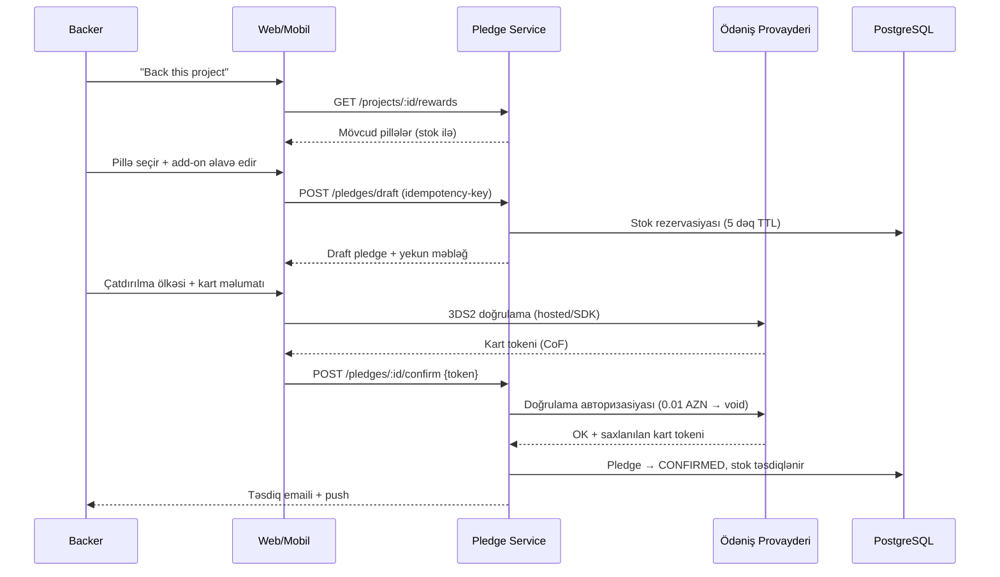

| # | Funksiya | Qeyd |
|---|---|---|
| PL-01 | Mükafat pilləsi seçimi | Stok yoxlanışı real vaxtda |
| PL-02 | "Pledge without a reward" | Sadəcə dəstək |
| PL-03 | Əlavə vəd (bonus support) | Pillə qiymətindən yuxarı |
| PL-04 | Add-on seçimi (miqdar ilə) | Kampaniya zamanı və ya Pledge Manager-də |
| PL-05 | Çatdırılma ölkəsinin seçimi | Çatdırılma haqqını dinamik hesablayır |
| PL-06 | Yekun məbləğ hesablanması | Mükafat + add-on + çatdırılma + vergi |
| PL-07 | Kart əlavə etmə / saxlanılmış kart seçimi | PCI DSS: kart nömrəsi bizim serverə DÜŞMÜR |
| PL-08 | 3D Secure 2 doğrulaması | Məcburi |
| PL-09 | Vədin redaktəsi | Kampaniya bitənə qədər |
| PL-10 | Vədin ləğvi | Kampaniya bitənə qədər, stok azad olunur |
| PL-11 | Kartın dəyişdirilməsi | Uğursuz ödənişdən sonra |
| PL-12 | Anonim vəd | Backer siyahısında görünmür |
| PL-13 | Stok rezervasiyası | Redis-də TTL ilə, race condition-a qarşı |
| PL-14 | İdempotentlik | `Idempotency-Key` header — ikiqat vədin qarşısını alır |
| PL-15 | Gizli mükafat (Secret Reward) | Yalnız xüsusi URL ilə |
| PL-16 | Late pledge | Kampaniya bitdikdən sonra (creator aktivləşdirərsə) |

### 4.6 Kampaniya Redaktoru (Creator) `[W]`

Kickstarter-dəki bölmə strukturu:

**4.6.1 Basics**
- Layihə adı (≤60 simvol)
- Qısa təsvir / blurb (≤135 simvol)
- Kateqoriya + alt-kateqoriya
- Yerləşmə (şəhər/ölkə, geo-kodlaşdırma ilə)
- Əsas şəkil (min 1024×576, 16:9)
- Layihə videosu (yükləmə + transkodlaşdırma)
- Maliyyələşdirmə hədəfi + valyuta
- Kampaniya müddəti (1–60 gün) və ya konkret son tarix
- Launch tarixi (planlaşdırılmış start)
- Late Pledge aktivləşdirmə (+ qiymət artımı seçimi)
- Pre-launch səhifəsi (followers toplamaq üçün)

**4.6.2 Rewards**
- **Items (Elementlər)** — əvvəlcə atomik elementlər yaradılır (məs. "Minimal Phone 2 | 8GB+256GB")
- **Reward Tier-lər** — elementlərdən miqdar ilə qurulur
  - Ad, təsvir, qiymət
  - Daxil olan elementlər + miqdar
  - Şəkillər (mükafat başına)
  - Təxmini çatdırılma tarixi (ay/il)
  - Məhdud say (limited quantity)
  - Çatdırılma: heç biri (rəqəmsal) / bütün dünya / seçilmiş ölkələr
  - Ölkə üzrə çatdırılma haqqı cədvəli
  - Early Bird (vaxt/say məhdudiyyətli)
  - Featured reward (yuxarıda göstərilir)
  - Secret reward (gizli URL)
  - Sıralama (drag & drop)
  - Mükafatın kopyalanması
- **Add-on-lar** — pilləyə əlavə satıla bilən elementlər

**4.6.3 Story**
- Zəngin mətn redaktoru (WYSIWYG): başlıqlar, qalın/kursiv, siyahılar, sitat, ayırıcı
- Şəkil / video / GIF yükləmə (inline)
- YouTube / Vimeo / SoundCloud embed
- Bölmə başlıqları → avtomatik anchor naviqasiya
- **Risks and challenges** (məcburi sahə)
- FAQ redaktoru (sual/cavab cütləri)
- Avtomatik saxlama (draft), versiya tarixçəsi

**4.6.4 People (About You)**
- Creator profili / bio
- Collaborator dəvəti (email ilə) + qranulyar icazələr
- Komanda üzvlərinin göstərilməsi

**4.6.5 Payment / Account**
- Şəxsiyyət doğrulaması (KYC) — sənəd yükləmə
- Fərdi sahibkar / hüquqi şəxs seçimi
- VÖEN / şəxsiyyət vəsiqəsi
- Bank hesabı (IBAN) — payout üçün
- Vergi məlumatları
- Ünvan təsdiqi

**4.6.6 Promotion**
- Custom referrer linkləri yaratma (UTM)
- Sosial paylaşım şablonları
- Pre-launch səhifə linki

**4.6.7 Review & Launch**
- Avtomatik yoxlama siyahısı (checklist) — tamamlanma faizi
- Moderasiyaya göndərmə
- Moderasiya nəticəsi (təsdiq / dəyişiklik tələbi / rədd)
- Launch düyməsi (planlaşdırılmış və ya dərhal)

### 4.7 Creator Dashboard `[W] [M-oxu]`

| # | Funksiya | Təsvir |
|---|---|---|
| CD-01 | Canlı statistika | Toplanmış məbləğ, backer sayı, faiz, qalan vaxt |
| CD-02 | Vəd qrafiki | Gün/saat üzrə vəd trendi |
| CD-03 | **Referrer analitikası** | Top 25 mənbə: domain, vəd sayı, məbləğ, ümumi %-i |
| CD-04 | Cihaz bölgüsü | Desktop vs mobil (mənbə başına) |
| CD-05 | Konversiya nisbəti | Ziyarətçi → backer |
| CD-06 | Video statistikası | Baxış sayı, tamamlanma faizi |
| CD-07 | Mükafat üzrə bölgü | Hansı pillə nə qədər satıb |
| CD-08 | Coğrafi bölgü | Ölkə/şəhər üzrə xəritə |
| CD-09 | Yeni vs təkrar backer | Nisbət |
| CD-10 | Backer siyahısı (Backer Report) | Filtr, seqment, axtarış |
| CD-11 | CSV / Excel eksport | Fulfillment partnyorları üçün uyğun format |
| CD-12 | Update dərci | Public / backers-only, planlaşdırılmış |
| CD-13 | Toplu mesaj göndərmə | Seqment üzrə |
| CD-14 | Şərh moderasiyası | Silmə, gizlətmə, istifadəçi blokla |
| CD-15 | FAQ idarəetməsi | |
| CD-16 | Maliyyə xülasəsi | Ümumi məbləğ, komissiyalar, xalis payout |
| CD-17 | Ödəniş statusu izləmə | Uğursuz ödənişlər, təkrar cəhdlər |
| CD-18 | Stretch goal elanı | |
| CD-19 | Uğursuz ödənişli backer-lərə xatırlatma | Avtomatik + manual |

### 4.8 Pledge Manager (Kampaniyadan sonra) `[W] [M]`

Bu, Kickstarter-in ən dəyərli və ən mürəkkəb modulu. **Kampaniya bitdikdən sonra** işə düşür.

| # | Funksiya | Aktor |
|---|---|---|
| PM-01 | Survey qurucusu (dinamik suallar) | Creator |
| PM-02 | Mükafat pilləsinə görə şərti suallar | Creator |
| PM-03 | Sual tipləri: mətn, seçim, çoxlu seçim, ünvan, tarix | Creator |
| PM-04 | Survey-in backer-lərə göndərilməsi | Creator |
| PM-05 | Survey cavablandırma | Backer |
| PM-06 | Cavabların sonradan redaktəsi (creator icazə verərsə) | Backer |
| PM-07 | Çatdırılma ünvanının toplanması və validasiyası | Backer |
| PM-08 | Ünvanın kilidlənməsi (deadline) | Creator |
| PM-09 | Mükafat pilləsinin yüksəldilməsi (upgrade) | Backer |
| PM-10 | Add-on mağazası (post-campaign satış) | Backer |
| PM-11 | Çatdırılma haqqının sonradan hesablanması | Creator |
| PM-12 | Çəki əsaslı və ya sabit tarif | Creator |
| PM-13 | Bölgə / məhsul tipi / pillə üzrə fərqli tarif | Creator |
| PM-14 | ƏDV / satış vergisinin hesablanması və yığımı | Sistem |
| PM-15 | Gömrük rüsumu meneceri (Tariff Manager) | Creator |
| PM-16 | Əlavə ödənişin tutulması | Sistem |
| PM-17 | **Backer Report** — filtr, seqment, eksport | Creator |
| PM-18 | Ünvanın toplu redaktəsi | Creator |
| PM-19 | Rəqəmsal mükafatların paylanması (fayl/kod) | Creator |
| PM-20 | İzləmə nömrələrinin (tracking) yüklənməsi | Creator |
| PM-21 | İzləmə məlumatının backer-ə göstərilməsi | Backer |
| PM-22 | Fulfillment statusu (gözləyir / göndərilib / çatdırılıb) | Hər ikisi |
| PM-23 | Late pledge qəbulu | Backer |
| PM-24 | Cavab verməyən backer-lərə xatırlatma | Sistem |

### 4.9 İcma və Sosial `[W] [M]`

| # | Funksiya |
|---|---|
| C-01 | Layihə şərhləri (backer + creator) |
| C-02 | Creator cavablarının vizual vurğulanması |
| C-03 | Şərhə cavab (threading) |
| C-04 | Şərh bəyənmə |
| C-05 | Superbacker sitat şərhləri (mətnin 300 simvolunu vurğulayaraq) |
| C-06 | Update-lərə şərh |
| C-07 | Layihənin şikayət edilməsi (Report this project) |
| C-08 | Şərhin şikayət edilməsi |
| C-09 | İstifadəçinin bloklanması |
| C-10 | Layihəni saxlama (save / ❤️) |
| C-11 | Creator-u izləmə (follow) |
| C-12 | "Remind me" — launch xatırlatması |
| C-13 | Creator ↔ Backer birbaşa mesajlaşma |
| C-14 | Sosial paylaşım (native share sheet mobildə) |
| C-15 | Layihə linkinin deep-link ilə mobil app-də açılması |

### 4.10 Bildirişlər

| Hadisə | Email | Push | In-app |
|---|:-:|:-:|:-:|
| Vəd təsdiqi | ✅ | ✅ | ✅ |
| Vəd redaktə olundu | ✅ | ❌ | ✅ |
| Layihə hədəfə çatdı | ✅ | ✅ | ✅ |
| Kampaniya bitməyə 48 saat qalıb | ✅ | ✅ | ✅ |
| Kampaniya bitməyə 24 saat qalıb | ❌ | ✅ | ✅ |
| Kampaniya uğurla bitdi | ✅ | ✅ | ✅ |
| Kampaniya uğursuz bitdi | ✅ | ✅ | ✅ |
| Ödəniş uğurla tutuldu | ✅ | ✅ | ✅ |
| **Ödəniş uğursuz oldu** | ✅ | ✅ | ✅ |
| Ödəniş üçün son xəbərdarlıq | ✅ | ✅ | ✅ |
| Yeni update dərc olundu | ✅ | ✅ | ✅ |
| Şərhə cavab verildi | ✅ | ✅ | ✅ |
| Creator birbaşa mesaj göndərdi | ✅ | ✅ | ✅ |
| Survey göndərildi | ✅ | ✅ | ✅ |
| Survey cavabı gecikir | ✅ | ✅ | ✅ |
| Mükafat göndərildi (tracking) | ✅ | ✅ | ✅ |
| İzlədiyin creator yeni layihə açdı | ✅ | ✅ | ✅ |
| "Remind me" — layihə start etdi | ✅ | ✅ | ✅ |
| Saxlanılan layihə bitməyə yaxındır | ✅ | ✅ | ✅ |
| Layihə moderasiyadan keçdi | ✅ | ✅ | ✅ |
| Payout göndərildi | ✅ | ✅ | ✅ |
| Təhlükəsizlik: yeni cihazdan giriş | ✅ | ✅ | ✅ |

**Bildiriş tənzimləmələri:** hər kateqoriya üzrə ayrıca on/off, kanal üzrə ayrıca on/off, "digest" (gündəlik/həftəlik toplu) rejimi.

### 4.11 Admin Paneli `[A]`

| # | Modul | Funksiyalar |
|---|---|---|
| AD-01 | **Layihə moderasiyası** | Növbə, təsdiq/rədd, dəyişiklik tələbi, qeydlər, tarixçə |
| AD-02 | **Trust & Safety** | Şikayətlərin növbəsi, avtomatik fırıldaq siqnalları, layihə dayandırma |
| AD-03 | **Kuratorluq** | "Projects We Love" nişanı, kolleksiyalar, Open Calls, homepage yerləşdirmə |
| AD-04 | **İstifadəçi idarəetməsi** | Axtarış, baxış, banlama, KYC statusu, impersonate (audit ilə) |
| AD-05 | **Maliyyə** | Ödəniş jurnalı, ledger, payout növbəsi, təsdiqləmə, mübahisələr |
| AD-06 | **Refund idarəetməsi** | Tam/qismən geri qaytarma, səbəb kodu, audit |
| AD-07 | **Chargeback idarəetməsi** | Bildirişlər, sübut yükləmə, nəticə |
| AD-08 | **Kateqoriya/teq idarəetməsi** | CRUD, sıralama, tərcümələr |
| AD-09 | **Məzmun moderasiyası** | Şərhlər, update-lər, profillər |
| AD-10 | **Dəstək (Support)** | Ticket sistemi, istifadəçi konteksti, əməliyyat tarixçəsi |
| AD-11 | **Komissiya konfiqurasiyası** | Platform haqqı, ödəniş haqqı, kateqoriya üzrə istisnalar |
| AD-12 | **Feature flag-lar** | Tədricən yayım, A/B testlər |
| AD-13 | **Analitika** | GMV, uğur nisbəti, orta vəd, kohort, funnel |
| AD-14 | **Audit jurnalı** | Bütün admin əməliyyatları (dəyişməz) |
| AD-15 | **Email şablonları** | Redaktə, önizləmə, test göndərmə |
| AD-16 | **Sistem sağlamlığı** | Növbə uzunluğu, uğursuz job-lar, PSP statusu |

### 4.12 Mobil-Spesifik Funksiyalar `[M]`

| # | Funksiya |
|---|---|
| MB-01 | Push bildirişlər (FCM / APNs) |
| MB-02 | Deep linking + Universal Links / App Links |
| MB-03 | Biometrik autentifikasiya |
| MB-04 | Offline rejim — saxlanılan layihələr və vədlərin keşi |
| MB-05 | Native paylaşım paneli |
| MB-06 | Kamera ilə profil şəkli çəkmə |
| MB-07 | Haptic feedback (vəd təsdiqində) |
| MB-08 | Pull-to-refresh |
| MB-09 | Skeleton yükləmə vəziyyətləri |
| MB-10 | Şəkil qalereyası (pinch-zoom, swipe) |
| MB-11 | Video pleyer (fullscreen, PiP) |
| MB-12 | Apple Pay / Google Pay (PSP dəstəyi olarsa) |
| MB-13 | App Clip (iOS) / Instant App (Android) — opsional |
| MB-14 | Widget — izlənilən layihənin proqresi (opsional) |
| MB-15 | OTA update (Expo Updates) |
| MB-16 | Tünd rejim (dark mode) |
| MB-17 | Dinamik şrift ölçüsü / accessibility |
| MB-18 | Geo-lokasiya ilə "Near me" |

---

## 5. Kritik Biznes Qaydaları

### 5.1 All-or-Nothing

```
ƏGƏR toplanmış_məbləğ >= hədəf VƏ indi >= son_tarix
    → Layihə UĞURLU
    → Bütün təsdiqlənmiş vədlərdən ödəniş tutulur
    → Uğursuz ödənişlər üçün 7 günlük təkrar cəhd pəncərəsi açılır
    → 7 gündən sonra payout hesablanır

ƏKS HALDA (toplanmış < hədəf VƏ indi >= son_tarix)
    → Layihə UĞURSUZ
    → HEÇ BİR ödəniş tutulmur
    → Saxlanılmış kart tokenləri 30 gün ərzində silinir
    → Heç bir komissiya alınmır
```

### 5.2 Komissiya strukturu

| Komponent | Dərəcə | Nə vaxt |
|---|---|---|
| Platforma komissiyası | **5%** toplanmış məbləğdən | Yalnız uğurlu layihələrdə |
| Ödəniş emalı haqqı | **~2.5–3% + 0.20 AZN** hər vəd üzrə | Uğurlu ödəniş başına (PSP müqaviləsindən asılı) |
| Kiçik vəd haqqı | Vəd < 10 AZN üçün alternativ dərəcə | Opsional |
| Uğursuz layihə | **0** | Heç bir haqq |

> **Diqqət:** Nəticə komissiya dərəcəsi konfiqurasiya edilə bilən olmalıdır (`fee_schedules` cədvəli) — kateqoriya, kampaniya və ya fərdi müqavilə üzrə fərqli ola bilər.

### 5.3 Layihə validasiya qaydaları

| Qayda | Dəyər |
|---|---|
| Layihə adı | 1–60 simvol |
| Blurb | 1–135 simvol |
| Hədəf | ≥ 100 AZN, ≤ 10,000,000 AZN (konfiqurasiya edilə bilər) |
| Kampaniya müddəti | 1–60 gün (tövsiyə: 30 gün) |
| Əsas şəkil | Məcburi, min 1024×576 |
| Story | Min 500 simvol |
| Risks and challenges | Məcburi, min 200 simvol |
| Mükafat pillələri | 0–100 ədəd |
| Mükafat qiyməti | ≥ 1 AZN |
| Hədəf/son tarix dəyişikliyi | Launch-dan sonra **QADAĞAN** |
| Mükafat silmə | Backer varsa **QADAĞAN** (yalnız gizlətmək olar) |
| Mükafat qiymətinin dəyişməsi | Launch-dan sonra **QADAĞAN** |
| Mükafat sayının artırılması | İcazə verilir |
| Mükafat sayının azaldılması | Yalnız satılmış saydan yuxarı |

### 5.4 Qadağan olunmuş məzmun (Rules)

Kickstarter modelindən:
- Xəstəlik diaqnozu/müalicəsi iddiası olan məhsullar
- Müsabiqə, lotereya, uduş oyunları
- Enerji qidaları və içkiləri
- Təhqiredici məzmun, irqçilik, ayrı-seçkilik
- GMO məhsullar mükafat kimi
- Alkoqol mükafat kimi
- Maliyyə, telefon, səyahət, biznes-marketinq xidmətləri
- Siyasi maliyyələşdirmə
- Pornoqrafiya
- Artıq mövcud olan və ya yenidən qablaşdırılmış məhsullar
- Yenidən satış məhsulları
- Narkotik, tütün, nikotin məhsulları
- Silah, aksesuar və replikalar

**Əlavə tələblər:**
- Bütün mükafatlar yeni və unikal olmalıdır
- Mükafatlar layihə və ya onun əməkdaşları tərəfindən istehsal/dizayn edilməlidir
- Layihə yanlış məlumat verə və ya faktları təhrif edə bilməz

### 5.5 Creator hesabatlılıq öhdəlikləri

- Uğurlu layihədən sonra **ən azı ayda 1 dəfə** update dərc etmək
- Gecikmə halında backer-ləri məlumatlandırmaq
- Mükafatı çatdıra bilmirsə geri qaytarma təklif etmək
- Sual və şikayətlərə cavab vermək

---

## 6. Domain Modeli və State Machine-lər

### 6.1 Layihə statusları

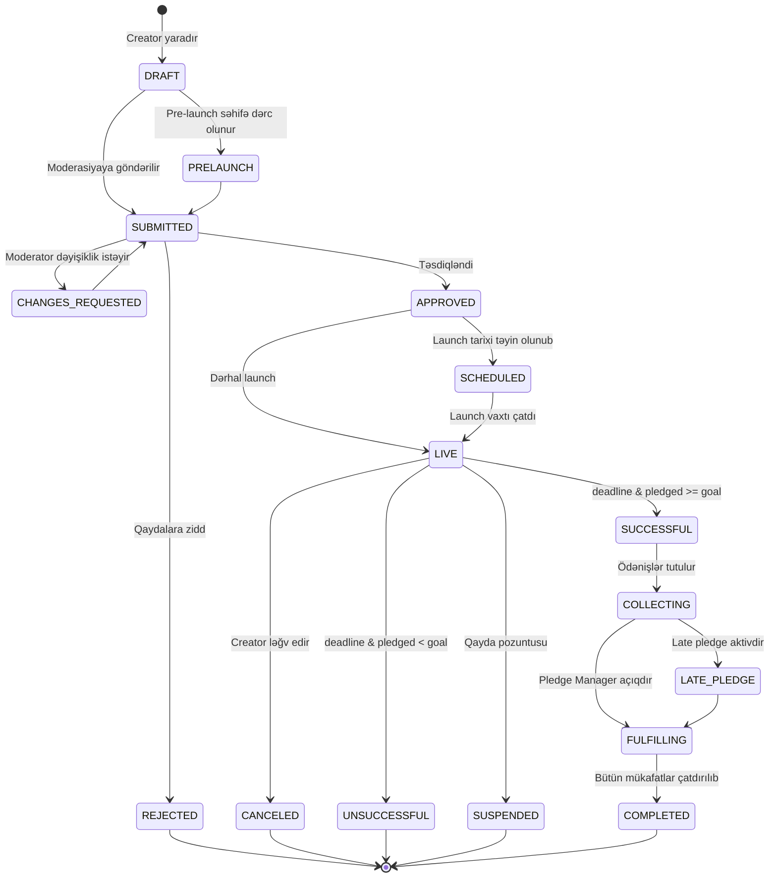

### 6.2 Vəd (Pledge) statusları

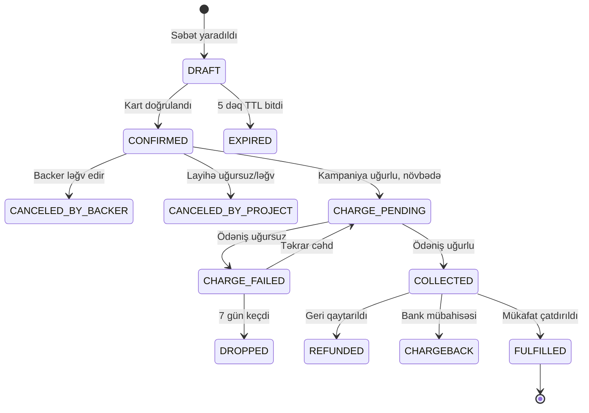

### 6.3 Payout statusları

```
PENDING → HOLD_PERIOD (14 gün) → APPROVED → PROCESSING → PAID
                                     ↓
                                  BLOCKED (fırıldaq/mübahisə)
```

---

## 7. Verilənlər Bazası Sxemi

**PostgreSQL 16+** əsas verilənlər bazası. Aşağıda əsas cədvəllər (tam DDL deyil, struktur icmalı).

### 7.1 ER Diaqramı (nüvə)

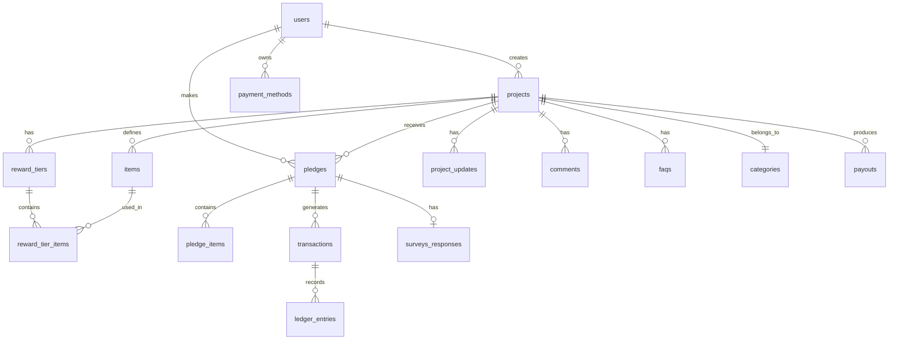

### 7.2 Əsas cədvəllər

#### `users`
| Sütun | Tip | Qeyd |
|---|---|---|
| `id` | `uuid` PK | |
| `email` | `citext` UNIQUE | |
| `email_verified_at` | `timestamptz` | |
| `password_hash` | `text` | Argon2id |
| `name` | `text` | |
| `slug` | `text` UNIQUE | Profil URL-i |
| `avatar_url` | `text` | |
| `bio` | `text` | |
| `location_id` | `uuid` FK | |
| `locale` | `text` | `az`, `en`, `ru` |
| `currency` | `char(3)` | |
| `is_superbacker` | `boolean` | Nightly job hesablayır |
| `show_superbacker_badge` | `boolean` | |
| `kyc_status` | `enum` | `none`, `pending`, `verified`, `rejected` |
| `two_factor_enabled` | `boolean` | |
| `banned_at` | `timestamptz` | |
| `deleted_at` | `timestamptz` | Soft delete |
| `created_at` / `updated_at` | `timestamptz` | |

#### `projects`
| Sütun | Tip | Qeyd |
|---|---|---|
| `id` | `uuid` PK | |
| `creator_id` | `uuid` FK → users | |
| `slug` | `text` | `/projects/:creator_slug/:project_slug` |
| `title` | `varchar(60)` | |
| `blurb` | `varchar(135)` | |
| `category_id` | `int` FK | |
| `subcategory_id` | `int` FK | |
| `location_id` | `uuid` FK | |
| `state` | `enum` | Bax 6.1 |
| `goal_amount` | `numeric(14,2)` | |
| `currency` | `char(3)` | |
| `pledged_amount` | `numeric(14,2)` | **Denormalizasiya**, ledger-dən sinxronlaşır |
| `backers_count` | `int` | Denormalizasiya |
| `launched_at` | `timestamptz` | |
| `deadline` | `timestamptz` | |
| `duration_days` | `int` | |
| `story` | `jsonb` | Strukturlaşmış blok formatı |
| `risks` | `text` | Məcburi |
| `main_image_id` | `uuid` FK → media | |
| `video_id` | `uuid` FK → media | |
| `is_staff_pick` | `boolean` | "Projects We Love" |
| `staff_picked_at` | `timestamptz` | |
| `late_pledge_enabled` | `boolean` | |
| `late_pledge_ends_at` | `timestamptz` | |
| `pledge_manager_state` | `enum` | |
| `search_vector` | `tsvector` | GIN index |
| `geo_point` | `geography(Point)` | PostGIS, "Near me" üçün |

**İndekslər:** `(state, deadline)`, `(category_id, state)`, `(creator_id)`, GIN `search_vector`, GIST `geo_point`, `(is_staff_pick, launched_at DESC)`

#### `items`
Atomik məhsul vahidləri. `id`, `project_id`, `name`, `description`, `image_id`, `weight_grams`, `is_digital`, `sku`

#### `reward_tiers`
| Sütun | Tip |
|---|---|
| `id` | `uuid` PK |
| `project_id` | `uuid` FK |
| `title` | `text` |
| `description` | `text` |
| `amount` | `numeric(14,2)` |
| `currency` | `char(3)` |
| `estimated_delivery` | `date` (ay dəqiqliyi) |
| `limit_quantity` | `int` NULL |
| `claimed_quantity` | `int` |
| `reserved_quantity` | `int` |
| `shipping_type` | `enum` (`none`, `worldwide`, `restricted`) |
| `is_early_bird` | `boolean` |
| `is_featured` | `boolean` |
| `is_secret` | `boolean` |
| `secret_token` | `text` NULL |
| `is_addon` | `boolean` |
| `sort_order` | `int` |
| `available_from` / `available_until` | `timestamptz` |

**Kritik constraint:** `claimed_quantity + reserved_quantity <= limit_quantity`

#### `reward_tier_items`
`reward_tier_id`, `item_id`, `quantity` — many-to-many + miqdar

#### `shipping_rules`
`reward_tier_id`, `country_code`, `amount`, `additional_item_amount`

#### `pledges`
| Sütun | Tip | Qeyd |
|---|---|---|
| `id` | `uuid` PK | |
| `project_id` | `uuid` FK | |
| `backer_id` | `uuid` FK | |
| `reward_tier_id` | `uuid` FK NULL | NULL = mükafatsız |
| `state` | `enum` | Bax 6.2 |
| `base_amount` | `numeric(14,2)` | Mükafat qiyməti |
| `addons_amount` | `numeric(14,2)` | |
| `bonus_amount` | `numeric(14,2)` | Əlavə dəstək |
| `shipping_amount` | `numeric(14,2)` | |
| `tax_amount` | `numeric(14,2)` | |
| `total_amount` | `numeric(14,2)` | **GENERATED** cəm |
| `currency` | `char(3)` | |
| `payment_method_id` | `uuid` FK | |
| `shipping_country` | `char(2)` | |
| `is_anonymous` | `boolean` | |
| `is_late_pledge` | `boolean` | |
| `referrer_code` | `text` | Analitika üçün |
| `idempotency_key` | `text` UNIQUE | |
| `confirmed_at`, `collected_at`, `canceled_at` | `timestamptz` | |

**UNIQUE:** `(project_id, backer_id)` WHERE `state NOT IN ('canceled_*','expired')` — bir backer bir layihəyə bir vəd

#### `pledge_items`
Add-on-ların miqdarı: `pledge_id`, `reward_tier_id` (add-on), `quantity`, `unit_amount`

#### `payment_methods`
| Sütun | Tip | Qeyd |
|---|---|---|
| `id` | `uuid` PK | |
| `user_id` | `uuid` FK | |
| `provider` | `enum` | `payriff`, `epoint`, `azericard`, `stripe` |
| `provider_token` | `text` | **Yalnız token — kart nömrəsi YOX** |
| `brand` | `text` | visa, mastercard |
| `last4` | `char(4)` | |
| `exp_month` / `exp_year` | `int` | |
| `is_default` | `boolean` | |
| `verified_at` | `timestamptz` | |

#### `transactions` (immutable)
| Sütun | Tip |
|---|---|
| `id` | `uuid` PK |
| `pledge_id` | `uuid` FK |
| `type` | `enum` (`verification`, `charge`, `refund`, `chargeback`, `chargeback_reversal`, `payout`) |
| `status` | `enum` (`pending`, `succeeded`, `failed`, `canceled`) |
| `amount` | `numeric(14,2)` |
| `currency` | `char(3)` |
| `provider` | `text` |
| `provider_transaction_id` | `text` UNIQUE |
| `provider_response` | `jsonb` |
| `failure_code` / `failure_message` | `text` |
| `attempt_number` | `int` |
| `idempotency_key` | `text` UNIQUE |
| `created_at` | `timestamptz` |

> Bu cədvəl **yalnız INSERT** — heç vaxt UPDATE/DELETE edilmir.

#### `ledger_entries` (double-entry)
| Sütun | Tip |
|---|---|
| `id` | `bigserial` PK |
| `transaction_id` | `uuid` FK |
| `account` | `text` (`escrow`, `creator:{id}`, `platform_fee`, `psp_fee`, `tax_payable`, `refunds`) |
| `direction` | `enum` (`debit`, `credit`) |
| `amount` | `numeric(14,2)` |
| `currency` | `char(3)` |
| `project_id` | `uuid` |
| `created_at` | `timestamptz` |

**İnvariant:** Hər `transaction_id` üçün `SUM(debit) = SUM(credit)`. Bu, DB constraint + nightly reconciliation job ilə yoxlanılır.

#### `payouts`
`id`, `project_id`, `creator_id`, `gross_amount`, `platform_fee`, `psp_fee`, `tax_withheld`, `net_amount`, `state`, `bank_account_id`, `scheduled_at`, `paid_at`, `provider_reference`

#### Digər cədvəllər
| Cədvəl | Məqsəd |
|---|---|
| `categories` / `subcategories` | Kateqoriya ağacı + tərcümələr |
| `tags` / `project_tags` | Teq sistemi |
| `collections` / `collection_projects` | Kuratorluq kolleksiyaları, Open Calls |
| `project_updates` | Nömrələnmiş update-lər |
| `comments` | Şərhlər (self-referencing `parent_id`) |
| `faqs` | Sual-cavab |
| `saves` | Saxlanılan layihələr |
| `follows` | Creator izləmə |
| `reminders` | "Remind me" |
| `collaborators` | Layihə əməkdaşları + icazə JSON |
| `surveys` / `survey_questions` / `survey_responses` | Pledge Manager |
| `shipping_addresses` | Backer ünvanları (şifrələnmiş) |
| `fulfillments` | Tracking, status |
| `notifications` | In-app bildiriş qutusu |
| `notification_preferences` | İstifadəçi tənzimləmələri |
| `media` | Şəkil/video metadata + transkodlaşdırma statusu |
| `referrers` | Referrer analitikası |
| `project_analytics_daily` | Aqreqasiya edilmiş gündəlik statistika |
| `moderation_cases` | Moderasiya növbəsi |
| `reports` | İstifadəçi şikayətləri |
| `audit_logs` | Bütün həssas əməliyyatlar |
| `fee_schedules` | Konfiqurasiya edilə bilən komissiyalar |
| `outbox_events` | Transactional Outbox pattern |
| `idempotency_keys` | Təkrar sorğuların qarşısının alınması |

### 7.3 Verilənlər bazası qərarları

| Qərar | Səbəb |
|---|---|
| **PostgreSQL** əsas DB | ACID, `numeric` tipi (pul üçün kritik), JSONB, tsvector, PostGIS, partial index |
| **Pul üçün `numeric(14,2)`** | `float` **heç vaxt** — yuvarlaqlaşdırma xətası |
| **Alternativ: minor units (`bigint`)** | Bəzi komandalar üçün daha təhlükəsiz — qəpiklə saxlamaq |
| **UUID v7 PK** | Sıralana bilən, index-friendly, ID-lərin sıralamasını gizlədir |
| **Soft delete** | Audit və bərpa üçün |
| **Denormalizasiya** (`pledged_amount`) | Oxu performansı; ledger həqiqət mənbəyidir |
| **PostGIS** | "Near me" filtri |
| **Partitioning** | `transactions`, `ledger_entries`, `audit_logs` — aylıq bölmə |
| **Read replica** | Discovery/analitika sorğuları üçün |

---

## 8. Sistem Arxitekturası

### 8.1 Yüksək səviyyəli görünüş

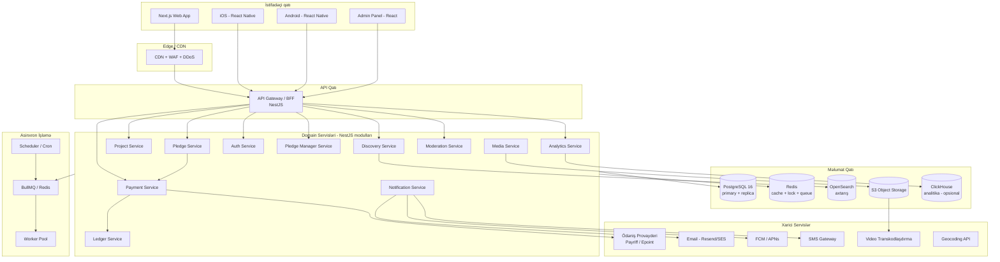

### 8.2 Arxitektura üslubu: **Modular Monolit → Seçici Mikroservis**

**Qərar:** Modular monolit ilə başla, yalnız sübut olunmuş ehtiyac yarananda ayır.

| Səbəb | İzah |
|---|---|
| Tranzaksiya bütövlüyü | Pledge + Ledger + Payment eyni DB tranzaksiyasında olmalıdır. Mikroservis burada saga/kompensasiya mürəkkəbliyi gətirir. |
| Komanda ölçüsü | Erkən mərhələdə mikroservis paylanmış monolit yaradır. |
| Sürət | Bir deploy, bir test suite, bir migrasiya. |
| Modul sərhədləri | NestJS modulları + daxili interfeys müqavilələri gələcək ayırmanı asanlaşdırır. |

**İlk ayrılacaq servislər (nə vaxt lazım olsa):**
1. **Media/Transcoding** — CPU-intensiv, fərqli miqyaslama profili
2. **Discovery/Search** — oxu-ağır, fərqli keş strategiyası
3. **Notification** — I/O-ağır, fan-out
4. **Analytics** — tamamilə ayrı yük profili

### 8.3 Kritik arxitektur pattern-lər

| Pattern | Harada | Səbəb |
|---|---|---|
| **Transactional Outbox** | Pledge, Payment | DB commit + event nəşri atomik olmalıdır |
| **Idempotency Keys** | Bütün mutasiya edən ödəniş API-ləri | Şəbəkə təkrarı = ikiqat ödəniş riski |
| **Double-Entry Ledger** | Maliyyə | Auditə davamlı, balans həmişə sıfır |
| **Optimistic Locking** | Reward stoku | `version` sütunu ilə race condition qarşısı |
| **Distributed Lock (Redis)** | Kampaniya bitirmə job-u | Bir kampaniya iki dəfə emal olunmasın |
| **Saga** | Payout | Çoxaddımlı, kompensasiya tələb edir |
| **CQRS (yüngül)** | Discovery | Yazma → PG, oxu → OpenSearch |
| **Event Sourcing** | Yalnız `transactions` | Bütün sistem üçün deyil — yalnız pul axını |
| **Circuit Breaker** | PSP çağırışları | PSP düşəndə kaskad qarşısı |
| **Rate Limiting** | Auth, pledge, axtarış | Sui-istifadə qarşısı |
| **Feature Flags** | Bütün yeni funksiyalar | Təhlükəsiz yayım |

### 8.4 Planlaşdırılmış işlər (Cron / Scheduler)

| Job | Tezlik | Təsvir |
|---|---|---|
| `campaign-launcher` | Hər dəqiqə | `SCHEDULED` → `LIVE` keçidi |
| `campaign-finalizer` | Hər dəqiqə | Deadline keçən layihələri UĞURLU/UĞURSUZ etmək |
| `charge-processor` | Hər dəqiqə | `CHARGE_PENDING` vədləri emal etmək (batch, rate-limited) |
| `charge-retry` | Hər 6 saat | Uğursuz ödənişləri təkrar sınamaq (7 gün ərzində) |
| `payout-scheduler` | Gündəlik | 14 günlük hold bitəndən sonra payout hazırlamaq |
| `reservation-cleaner` | Hər dəqiqə | Vaxtı keçmiş stok rezervasiyalarını azad etmək |
| `superbacker-calculator` | Gündəlik | Superbacker statusunu yeniləmək |
| `search-indexer` | Real-time (outbox) + gecə tam | OpenSearch indeksləmə |
| `analytics-aggregator` | Saatlıq | `project_analytics_daily` doldurmaq |
| `reminder-sender` | Hər dəqiqə | "Remind me", deadline xəbərdarlıqları |
| `survey-nudge` | Gündəlik | Cavab verməyən backer-lərə xatırlatma |
| `ledger-reconciliation` | Gündəlik | Debit=Kredit invariantını yoxlamaq, PSP ilə üzləşdirmə |
| `token-cleaner` | Gündəlik | Uğursuz layihələrin kart tokenlərini silmək |
| `denormalization-sync` | Saatlıq | `pledged_amount`, `backers_count` düzəlişi |

---

## 9. Ödəniş Arxitekturası (Azərbaycan)

> Bu, layihənin **ən riskli və ən kritik** hissəsidir. Diqqətlə oxuyun.

### 9.1 Əsas problem

All-or-nothing modeli tələb edir ki, backer-in ödəniş öhdəliyi **30–60 gün** saxlanılsın, sonra tutulsun. Lakin:

| Yanaşma | Problem |
|---|---|
| **Kart pre-authorization (hold)** | Visa/Mastercard hold-ları adətən **7 gün** (bəzi MCC-lərdə 30 günə qədər) sonra avtomatik açılır. 30–60 günlük kampaniya üçün **YARAMIR**. |
| **Dərhal tutma + geri qaytarma** | Uğursuz layihələrdə kütləvi refund → yüksək PSP xərci, mənfi UX, potensial "client funds" tənzimləmə problemi. |
| **Card-on-File token + kampaniya sonu tutma** | ✅ **Kickstarter-in real modeli.** Seçilmiş yanaşma. |

### 9.2 Seçilmiş model: Card-on-File (CoF) + Merchant-Initiated Transaction (MIT)

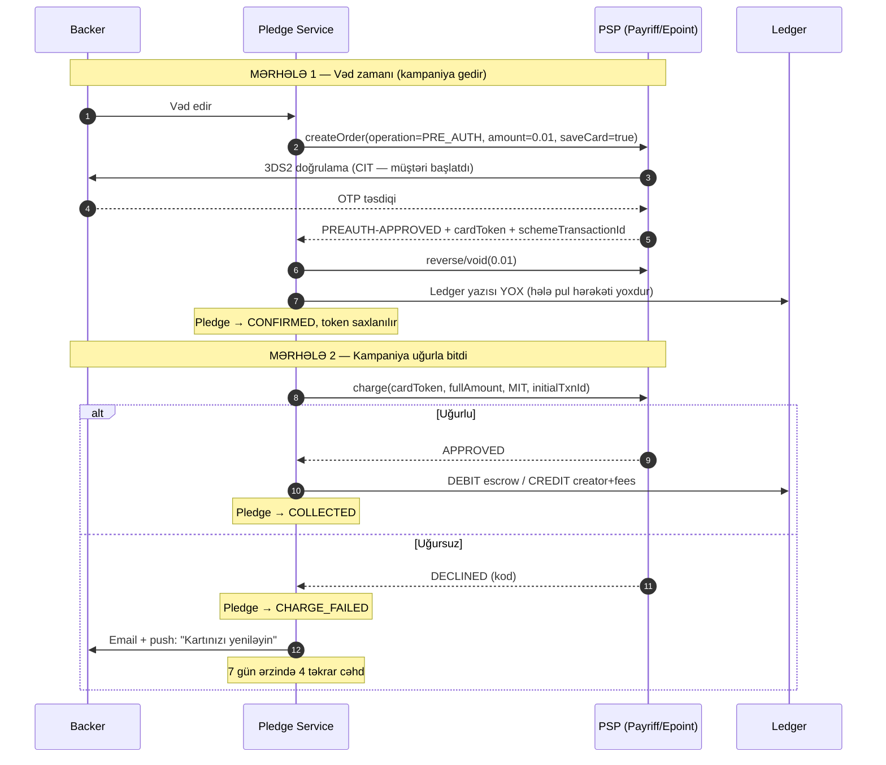

### 9.3 PSP tələbləri (müqavilədən əvvəl mütləq təsdiqlənməli)

Aşağıdakı imkanlar **olmadan bu memarlıq işləməz**. PSP seçimindən əvvəl yazılı təsdiq alın:

| # | Tələb | Niyə kritik |
|---|---|---|
| R-01 | **Kart tokenizasiyası (Card-on-File)** | Kart məlumatını saxlamadan sonradan tutma |
| R-02 | **Merchant-Initiated Transaction (MIT)** dəstəyi | Backer olmadan sonradan tutma. 3DS exemption tələb edir. |
| R-03 | **Initial transaction ID zəncirinin ötürülməsi** | Scheme qaydaları: MIT ilk CIT-ə bağlanmalıdır |
| R-04 | **3DS2 (EMV 3-D Secure)** | Fırıldaq məsuliyyətinin köçürülməsi |
| R-05 | **Sıfır/minimal məbləğli doğrulama (account verification)** | Kartın etibarlılığını yoxlamaq |
| R-06 | **Tam və qismən refund API** | Layihə ləğvi, mübahisə |
| R-07 | **Webhook + imza doğrulaması** | Asinxron nəticələr |
| R-08 | **İdempotentlik dəstəyi** | İkiqat tutmanın qarşısı |
| R-09 | **Batch/toplu tutma imkanı və rate limit-lər** | Kampaniya sonunda minlərlə ödəniş |
| R-10 | **Split payment və ya sub-merchant** | Creator-a birbaşa köçürmə (opsional) |
| R-11 | **Çoxvalyutalı dəstək** (AZN, USD, EUR) | Beynəlxalq backer-lər |
| R-12 | **Apple Pay / Google Pay** | Mobil konversiya |
| R-13 | **Chargeback bildirişləri API** | Mübahisə idarəetməsi |
| R-14 | **Sandbox mühiti** | Test |

**Araşdırma nəticələri:**

| Provayder | Müşahidə edilən imkanlar | Status |
|---|---|---|
| **Payriff** | `createOrder` API-də `operation: "PRE_AUTH"` dəstəyi, `PREAUTH-APPROVED` nəticə kodu, tamamlama (complete) əməliyyatı, refund, AZN/USD/EUR | ⚠️ CoF + MIT yazılı təsdiq tələb olunur |
| **Epoint** | API inteqrasiyası, **Split Payments** (bir ödənişin bir neçə şirkət arasında avtomatik bölünməsi) | ⚠️ Split funksiyası marketplace modeli üçün əladır; MIT təsdiqlənməlidir |
| **Azericard** | Azərbaycanın əsas prosessinq mərkəzi, 30+ bank, Visa/MC/Amex/UnionPay/JCB sertifikatlı e-commerce gateway | ⚠️ Birbaşa inteqrasiya bank vasitəçiliyi tələb edir |
| **Kapital Bank / PashaPay** | E-commerce acquiring | ⚠️ Müqavilə şərtləri fərdidir |

> **Tövsiyə:** Ən azı **2 PSP** ilə inteqrasiya edin (primary + fallback). Kampaniya bitmə günü PSP düşərsə, bütün biznes dayanır.

### 9.4 Provayder abstraksiyası

Bir PSP-yə bağlanmamaq üçün adapter interfeysi:

```typescript
// packages/payments/src/provider.interface.ts
export interface PaymentProvider {
  readonly name: 'payriff' | 'epoint' | 'azericard' | 'stripe';

  /** Kartı doğrula və CoF tokeni yarat (CIT + 3DS2) */
  verifyAndTokenizeCard(input: {
    userId: string;
    returnUrl: string;
    currency: Currency;
    idempotencyKey: string;
  }): Promise<{ redirectUrl: string; sessionId: string }>;

  /** Doğrulama sessiyasının nəticəsini oxu */
  resolveTokenizationSession(sessionId: string): Promise<{
    status: 'approved' | 'declined';
    cardToken?: string;
    schemeTransactionId?: string;   // MIT zənciri üçün
    brand?: string;
    last4?: string;
    expMonth?: number;
    expYear?: number;
    declineCode?: string;
  }>;

  /** Kampaniya sonu tutma (MIT — müştəri iştirakı olmadan) */
  chargeStoredCard(input: {
    cardToken: string;
    initialSchemeTransactionId: string;
    amount: Money;
    description: string;
    idempotencyKey: string;
    metadata: Record<string, string>;
  }): Promise<ChargeResult>;

  refund(input: {
    providerTransactionId: string;
    amount?: Money;            // undefined = tam
    reason: RefundReason;
    idempotencyKey: string;
  }): Promise<RefundResult>;

  /** Creator-a köçürmə (split və ya payout API mövcuddursa) */
  payout(input: {
    recipient: BankAccountRef;
    amount: Money;
    reference: string;
    idempotencyKey: string;
  }): Promise<PayoutResult>;

  /** Webhook imzasını yoxla və normallaşdırılmış hadisə qaytar */
  verifyWebhook(rawBody: Buffer, headers: Record<string, string>): PaymentEvent;

  readonly capabilities: {
    cardOnFile: boolean;
    merchantInitiated: boolean;
    preAuthHoldDays: number | null;
    splitPayment: boolean;
    partialRefund: boolean;
    walletPay: ('apple' | 'google')[];
    supportedCurrencies: Currency[];
  };
}
```

### 9.5 Escrow və pul axını

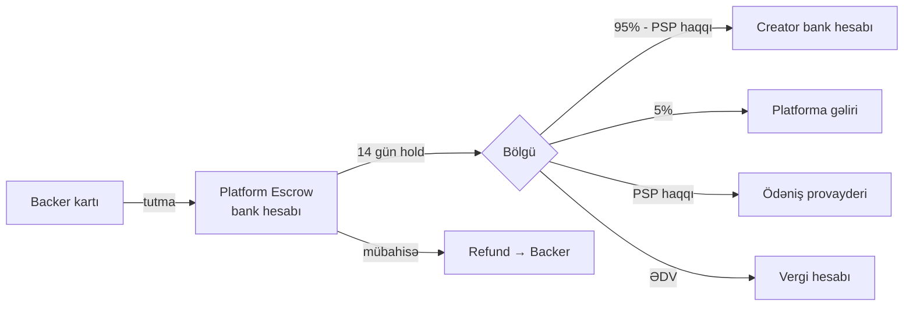

**Hold dövrü (14 gün) niyə lazımdır:**
- Chargeback riskinin qismən azalması
- Fırıldaq aşkarlanması üçün vaxt
- Uğursuz ödənişlərin təkrar cəhd pəncərəsi (7 gün) tamamlanması
- Creator-un ilkin update dərc etməsi

### 9.6 Uğursuz ödənişlərin idarəsi

Sənaye statistikası: kampaniya sonunda vədlərin **5–15%-i** uğursuz olur (vaxtı keçmiş kart, limit, bank rədd).

| Cəhd | Vaxt | Kanal |
|---|---|---|
| 1 | Kampaniya bitəndən dərhal sonra | — |
| 2 | +24 saat | Email + push |
| 3 | +72 saat | Email + push + in-app banner |
| 4 | +5 gün | Email ("son xəbərdarlıq") |
| — | +7 gün | Vəd `DROPPED`, layihə cəmindən çıxarılır |

> **Kritik nüans:** Uğursuz ödənişlər layihəni hədəfin altına sala bilər. Qayda: **layihə uğur statusu kampaniya bitəndə `CONFIRMED` vədlərə görə müəyyən olunur** və sonradan dəyişmir. Yalnız faktiki payout məbləği azalır.

### 9.7 Refund siyasəti

| Ssenari | Nəticə |
|---|---|
| Layihə uğursuz | Ödəniş yoxdur → refund lazım deyil |
| Layihə ləğv edildi (creator) | Tutulmuş vədlər tam geri qaytarılır |
| Layihə dayandırıldı (moderator) | Tutulmuş vədlər tam geri qaytarılır |
| Creator mükafatı çatdıra bilmir | Creator refund təklif etməlidir; platforma vasitəçilik edir |
| Backer fikrini dəyişdi (kampaniya gedir) | Vədi ləğv edir — ödəniş olmayıb |
| Backer fikrini dəyişdi (ödəniş tutulub) | Creator qərar verir; platforma məcbur etmir |
| Fırıldaq aşkarlandı | Platforma tam refund + hesab bloku |

### 9.8 Chargeback idarəetməsi

1. PSP webhook ilə mübahisə bildirişi gəlir
2. `transactions`-a `chargeback` yazısı, ledger-də əks yazı
3. Creator-a bildiriş + sübut yükləmə pəncərəsi (7 gün)
4. Sübut PSP-yə göndərilir
5. Nəticə: `chargeback_reversal` (uduzduq/qazandıq) — ledger yenilənir
6. Uduzsaq: məbləğ + mübahisə haqqı creator payout-undan çıxılır

---

## 10. API Dizaynı

### 10.1 Üslub: REST + seçici GraphQL

| Qat | Texnologiya | Səbəb |
|---|---|---|
| **Public API (mobil + web)** | **REST + OpenAPI 3.1** | Sadə, keşlənə bilən, CDN-friendly, mobil üçün proqnozlaşdırıla bilən |
| **Discovery/feed** | REST + cursor pagination | Sonsuz sürüşdürmə |
| **Admin panel** | **tRPC** və ya REST | Daxili, tip-təhlükəsiz |
| **Real-time** | **WebSocket (Socket.IO)** | Canlı vəd sayğacı, şərhlər |

> **GraphQL niyə əsas seçim deyil:** Kickstarter GraphQL istifadə edir, lakin bu, çoxsaylı komanda və köhnə sistemlərin nəticəsidir. Yeni layihə üçün REST + OpenAPI daha az əməliyyat mürəkkəbliyi verir və mobil app üçün keşləmə daha sadədir. Ehtiyac yaranarsa BFF qatında GraphQL əlavə edilə bilər.

### 10.2 Endpoint xəritəsi (əsas)

```
# Auth
POST   /v1/auth/register
POST   /v1/auth/login
POST   /v1/auth/refresh
POST   /v1/auth/logout
POST   /v1/auth/verify-email
POST   /v1/auth/forgot-password
POST   /v1/auth/reset-password
POST   /v1/auth/2fa/enable
POST   /v1/auth/2fa/verify
GET    /v1/auth/sessions
DELETE /v1/auth/sessions/:id
POST   /v1/auth/oauth/:provider

# İstifadəçi
GET    /v1/me
PATCH  /v1/me
GET    /v1/me/backed
GET    /v1/me/created
GET    /v1/me/saved
GET    /v1/me/notifications
PATCH  /v1/me/notification-preferences
GET    /v1/users/:slug

# Discovery
GET    /v1/discover                      ?state&category&subcategory&location&goal_min&goal_max
                                          &raised_min&raised_max&percent&tags&staff_pick
                                          &sort&cursor&limit
GET    /v1/discover/facets                # filtr sayğacları
GET    /v1/search?q=                      # tam mətn
GET    /v1/search/suggest?q=              # autocomplete
GET    /v1/categories
GET    /v1/collections
GET    /v1/collections/:slug

# Layihə (public)
GET    /v1/projects/:creatorSlug/:projectSlug
GET    /v1/projects/:id/rewards
GET    /v1/projects/:id/updates
GET    /v1/projects/:id/comments          ?cursor
GET    /v1/projects/:id/faqs
GET    /v1/projects/:id/community         # backer statistikası
GET    /v1/projects/:id/similar
POST   /v1/projects/:id/save
DELETE /v1/projects/:id/save
POST   /v1/projects/:id/remind
POST   /v1/projects/:id/report

# Layihə (creator)
POST   /v1/projects
GET    /v1/projects/:id/edit
PATCH  /v1/projects/:id
POST   /v1/projects/:id/submit
POST   /v1/projects/:id/launch
POST   /v1/projects/:id/cancel
GET    /v1/projects/:id/checklist

POST   /v1/projects/:id/items
PATCH  /v1/items/:id
DELETE /v1/items/:id
POST   /v1/projects/:id/rewards
PATCH  /v1/rewards/:id
DELETE /v1/rewards/:id
POST   /v1/rewards/:id/duplicate
PATCH  /v1/projects/:id/rewards/reorder

POST   /v1/projects/:id/updates
PATCH  /v1/updates/:id
POST   /v1/projects/:id/faqs
POST   /v1/projects/:id/collaborators
DELETE /v1/collaborators/:id

# Vəd
POST   /v1/pledges/draft                  # Idempotency-Key
GET    /v1/pledges/:id
POST   /v1/pledges/:id/confirm
PATCH  /v1/pledges/:id
DELETE /v1/pledges/:id
GET    /v1/pledges/:id/receipt

# Ödəniş metodları
GET    /v1/payment-methods
POST   /v1/payment-methods/setup          # tokenizasiya sessiyası başlat
POST   /v1/payment-methods/setup/:sessionId/resolve
DELETE /v1/payment-methods/:id
PATCH  /v1/payment-methods/:id/default

# Creator dashboard
GET    /v1/projects/:id/dashboard
GET    /v1/projects/:id/analytics         ?from&to&granularity
GET    /v1/projects/:id/referrers
GET    /v1/projects/:id/backers           ?cursor&filter&segment
GET    /v1/projects/:id/backers/export    # CSV/XLSX job
GET    /v1/projects/:id/finance

# Pledge Manager
POST   /v1/projects/:id/surveys
PATCH  /v1/surveys/:id
POST   /v1/surveys/:id/send
GET    /v1/surveys/:id/responses
GET    /v1/me/surveys                     # backer üçün gözləyən survey-lər
POST   /v1/surveys/:id/respond
PATCH  /v1/pledges/:id/shipping-address
POST   /v1/pledges/:id/upgrade
POST   /v1/pledges/:id/addons
POST   /v1/projects/:id/shipping-rules
POST   /v1/projects/:id/fulfillments/import   # tracking CSV
GET    /v1/me/fulfillments

# Şərhlər
POST   /v1/projects/:id/comments
POST   /v1/comments/:id/reply
POST   /v1/comments/:id/like
DELETE /v1/comments/:id
POST   /v1/comments/:id/report

# Media
POST   /v1/media/upload-url               # presigned S3 URL
POST   /v1/media/:id/complete
GET    /v1/media/:id

# Webhook (public deyil)
POST   /v1/webhooks/psp/:provider

# Admin
GET    /v1/admin/moderation/queue
POST   /v1/admin/moderation/:id/approve
POST   /v1/admin/moderation/:id/reject
POST   /v1/admin/projects/:id/suspend
POST   /v1/admin/projects/:id/staff-pick
GET    /v1/admin/users
POST   /v1/admin/users/:id/ban
GET    /v1/admin/finance/payouts
POST   /v1/admin/finance/payouts/:id/approve
POST   /v1/admin/finance/refunds
GET    /v1/admin/reports
GET    /v1/admin/audit-logs
```

### 10.3 API konvensiyaları

| Konvensiya | Qayda |
|---|---|
| Versiyalama | URL prefiksi: `/v1/` |
| Autentifikasiya | `Authorization: Bearer <access_token>` (JWT, 15 dəq) + refresh token (httpOnly cookie web-də, secure storage mobildə) |
| İdempotentlik | `Idempotency-Key: <uuid>` — bütün POST/PATCH ödəniş əməliyyatlarında **məcburi** |
| Pagination | Cursor əsaslı: `?cursor=<opaque>&limit=20`. Response: `{ data, meta: { nextCursor, hasMore } }` |
| Filtrləmə | Query parametrlər, massivlər `?tags[]=a&tags[]=b` |
| Xəta formatı | RFC 9457 Problem Details |
| Rate limiting | `X-RateLimit-Limit`, `X-RateLimit-Remaining`, `X-RateLimit-Reset` başlıqları |
| Keşləmə | `ETag` + `Cache-Control` public GET-lərdə |
| Lokalizasiya | `Accept-Language` başlığı |
| Valyuta | `X-Currency` başlığı və ya istifadəçi profili |
| Sıxılma | Brotli / gzip |
| Tarix formatı | ISO 8601 UTC (`2026-09-09T16:00:00Z`) |
| Pul formatı | `{ "amount": "599.00", "currency": "AZN" }` — **string, float deyil** |

### 10.4 Xəta cavabı nümunəsi

```json
{
  "type": "https://api.ideanest.az/errors/reward-sold-out",
  "title": "Mükafat pilləsi tükənib",
  "status": 409,
  "detail": "Seçdiyiniz 'Super Early Bird' pilləsində qalan yer yoxdur.",
  "instance": "/v1/pledges/draft",
  "code": "REWARD_SOLD_OUT",
  "meta": {
    "rewardTierId": "0193f2a1-...",
    "availableAlternatives": ["0193f2a2-...", "0193f2a3-..."]
  }
}
```

---

## 11. Axtarış və Discovery

### 11.1 Arxitektura

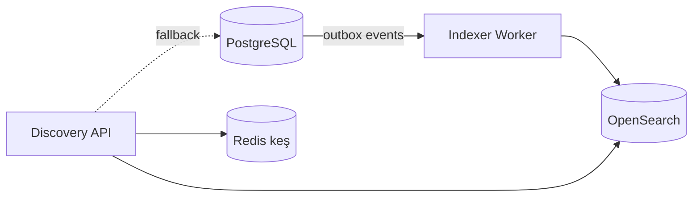

**İki qatlı yanaşma:**

| Qat | Nə vaxt | Texnologiya |
|---|---|---|
| **Qat 1 (MVP)** | İlk 10K layihəyə qədər | PostgreSQL `tsvector` + GIN index + `pg_trgm` (fuzzy) |
| **Qat 2 (miqyas)** | 10K+ layihə, mürəkkəb faceting | **OpenSearch** (və ya Typesense/Meilisearch) |

> **Tövsiyə:** PostgreSQL FTS ilə başlayın. `SearchService` interfeysi arxasında gizlədin ki, keçid ağrısız olsun.

### 11.2 "Magic" sıralama alqoritmi

Kickstarter-in relevance sıralaması gizlidir, lakin analoji skor:

```
magic_score =
    w1 × normalize(son_48s_vəd_sürəti)
  + w2 × normalize(son_48s_backer_sürəti)
  + w3 × normalize(faiz_tamamlanma)         // sigmoid, 100%-də doyma
  + w4 × staff_pick_bonus
  + w5 × normalize(baxış→vəd_konversiyası)
  + w6 × şəxsiləşdirmə_skoru                // istifadəçinin backed kateqoriyaları
  + w7 × recency_decay(launched_at)
  - w8 × spam_siqnalı
```

Çəkilər (`w1..w8`) konfiqurasiya edilə bilən olmalıdır və A/B test ilə tənzimlənməlidir.

### 11.3 İndeks sxemi (OpenSearch)

```json
{
  "mappings": {
    "properties": {
      "id":            { "type": "keyword" },
      "title":         { "type": "text", "analyzer": "az_analyzer",
                         "fields": { "kw": { "type": "keyword" } } },
      "blurb":         { "type": "text", "analyzer": "az_analyzer" },
      "story_text":    { "type": "text", "analyzer": "az_analyzer" },
      "creator_name":  { "type": "text" },
      "category_id":   { "type": "integer" },
      "subcategory_id":{ "type": "integer" },
      "tags":          { "type": "keyword" },
      "state":         { "type": "keyword" },
      "goal":          { "type": "scaled_float", "scaling_factor": 100 },
      "pledged":       { "type": "scaled_float", "scaling_factor": 100 },
      "percent_funded":{ "type": "float" },
      "backers_count": { "type": "integer" },
      "deadline":      { "type": "date" },
      "launched_at":   { "type": "date" },
      "is_staff_pick": { "type": "boolean" },
      "location":      { "type": "geo_point" },
      "country":       { "type": "keyword" },
      "city":          { "type": "keyword" },
      "magic_score":   { "type": "float" },
      "velocity_48h":  { "type": "float" }
    }
  }
}
```

**Azərbaycan dili analizatoru:** ICU folding (ə→e, ı→i, ö→o, ü→u, ğ→g, ş→s, ç→c) + snowball stemmer. `ə` hərfinin normalizasiyası kritikdir — istifadəçilər həm "əl" həm "el" yazır.

---

## 12. Real-time və Bildirişlər

### 12.1 Real-time kanallar (WebSocket)

| Kanal | Hadisə | Alıcı |
|---|---|---|
| `project:{id}` | `pledge.created` → sayğac yenilənməsi | Layihə səhifəsinə baxanlar |
| `project:{id}` | `goal.reached` → konfeti animasiyası | Hamı |
| `project:{id}:comments` | `comment.created` | Şərh tabına baxanlar |
| `project:{id}:updates` | `update.published` | Layihə səhifəsi |
| `user:{id}` | `notification.created` | Həmin istifadəçi |
| `project:{id}:dashboard` | `analytics.tick` | Creator |

**Miqyaslama:** Socket.IO + Redis adapter (çoxlu node arasında pub/sub).

**Optimizasiya:** Yüksək trafikli layihələrdə vəd sayğacı hər vəddə deyil, **1 saniyəlik pəncərədə aqreqasiya** edilərək yayımlanır.

### 12.2 Bildiriş sistemi

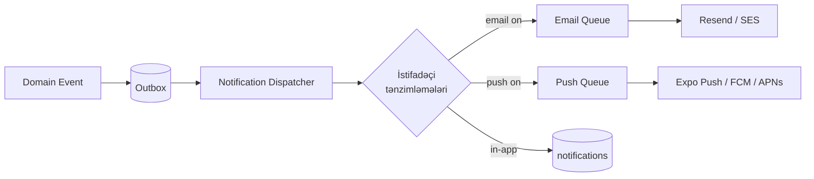

**Şablon sistemi:** React Email — HTML emailləri React komponenti kimi yazmaq, TypeScript tip təhlükəsizliyi ilə.

**Digest rejimi:** İstifadəçi "gündəlik toplu" seçərsə, bildirişlər `pending_digest` cədvəlində toplanır və cron ilə bir emailə birləşdirilir.

---

## 13. Media Pipeline

### 13.1 Şəkil axını

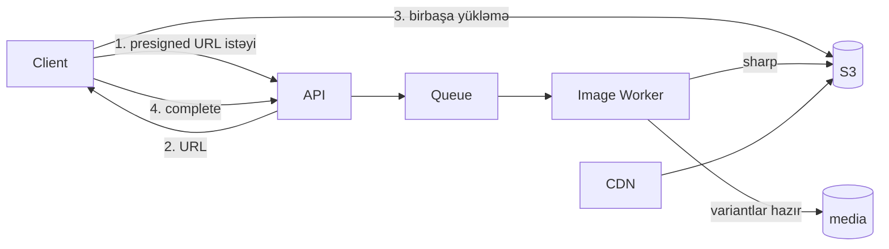

**Variantlar:** `thumb` (160w), `card` (640w), `hero` (1440w), `original`. Format: **AVIF** (əsas) + **WebP** (fallback) + JPEG.

**Təhlükəsizlik:**
- MIME tipi + magic bytes yoxlanışı (uzantıya güvənmə)
- Maksimum ölçü: şəkil 20MB, video 4GB
- EXIF metadata təmizlənməsi (GPS koordinatları sızıntısı!)
- Virus skanı (ClamAV) — opsional, yüksək risk mühitlərində
- NSFW aşkarlama (ML modeli) — moderasiya növbəsinə göndərmə

### 13.2 Video axını

| Addım | Alət |
|---|---|
| Yükləmə | S3 multipart, presigned |
| Transkodlaşdırma | **Mux** / **Cloudflare Stream** (managed) və ya **FFmpeg** worker (self-hosted) |
| Formatlar | HLS adaptiv bitrate: 360p, 480p, 720p, 1080p |
| Poster şəkli | Avtomatik + manual seçim (frame picker) |
| Altyazı | Opsional, VTT |
| Pleyer | Web: `hls.js` / `video.js`. Mobil: `expo-video` |
| Analitika | Baxış sayı, tamamlanma faizi, keçid nöqtələri |

> **Tövsiyə:** Başlanğıcda **managed transcoding** (Mux/Cloudflare Stream) istifadə edin. Öz FFmpeg klasterinizi qurmaq erkən mərhələdə əhəmiyyətli əməliyyat yüküdür.

---

## 14. Texnologiya Stack — Tam Siyahı

### 14.1 Frontend — Web

| Kateqoriya | Texnologiya | Versiya | Səbəb |
|---|---|---|---|
| Framework | **Next.js** (App Router) | 15+ | SSR/SSG — SEO layihə səhifələri üçün kritik; RSC ilə az JS |
| Dil | **TypeScript** | 5.6+ | `strict: true` məcburi |
| UI kitabxanası | **React** | 19 | |
| Stil | **Tailwind CSS** | 4 | Sürət, ardıcıllıq, kiçik bundle |
| Komponent sistemi | **shadcn/ui** + **Radix UI** | latest | Əlçatanlıq (a11y) daxilində, tam nəzarət |
| Server state | **TanStack Query** | 5 | Keş, invalidation, optimistic update |
| Client state | **Zustand** | 5 | Sadə, boilerplate-siz |
| Form | **React Hook Form** + **Zod** | 7 / 3 | Performans + tip-təhlükəsiz validasiya |
| Zəngin mətn redaktoru | **TipTap** (ProseMirror) | 2 | Genişlənə bilən, JSON çıxış |
| Cədvəl | **TanStack Table** | 8 | Backer report üçün |
| Qrafik | **Recharts** və ya **visx** | | Dashboard analitikası |
| Animasiya | **Motion** (Framer Motion) | | Mikro-interaksiyalar |
| Şəkil | `next/image` | | Avtomatik optimizasiya |
| Video pleyer | **hls.js** + custom UI | | |
| Tarix | **date-fns** + **date-fns-tz** | 4 | Tree-shakeable; geri sayım və saat qurşaqları |
| i18n | **next-intl** | | App Router uyğun |
| Real-time | **socket.io-client** | 4 | |
| Analitika | **PostHog** | | Product analytics + feature flags + session replay |
| Xəta izləmə | **Sentry** | | |
| Test | **Vitest** + **Testing Library** + **Playwright** | | |

### 14.2 Frontend — Mobil

| Kateqoriya | Texnologiya | Səbəb |
|---|---|---|
| Framework | **React Native** 0.76+ (New Architecture) | Web ilə kod paylaşımı |
| Toolchain | **Expo SDK 52+** | EAS Build, OTA update, native modul idarəsi |
| Naviqasiya | **Expo Router** | Fayl əsaslı, deep-linking daxilində |
| Dil | **TypeScript** 5.6+ | Web ilə eyni tiplər |
| Stil | **NativeWind** 4 | Tailwind sintaksisi — web ilə eyni dizayn tokenləri |
| Komponentlər | **Tamagui** və ya öz dizayn sistemi | Performanslı, tema dəstəyi |
| Server state | **TanStack Query** 5 | **Web ilə eyni query-lər paylaşılır** |
| Client state | **Zustand** 5 | Web ilə eyni store pattern-ləri |
| Form | **React Hook Form** + **Zod** | Web ilə eyni sxemlər |
| Saxlama | **MMKV** (`react-native-mmkv`) | AsyncStorage-dan ~30x sürətli |
| Təhlükəsiz saxlama | **expo-secure-store** | Token-lər üçün (Keychain/Keystore) |
| Push | **expo-notifications** | FCM + APNs abstraksiyası |
| Autentifikasiya | **expo-local-authentication** | Face ID / Touch ID |
| Şəkil | **expo-image** | Keşləmə, blurhash placeholder |
| Video | **expo-video** | |
| Siyahılar | **FlashList** (Shopify) | Böyük siyahılarda FlatList-dən çox sürətli |
| Jestlər | **react-native-gesture-handler** + **reanimated** 3 | 60fps animasiyalar |
| Deep linking | **expo-linking** + Universal/App Links | |
| Ödəniş | PSP-nin RN SDK-sı və ya **WebView** hosted checkout | PCI əhatəsini azaldır |
| Analitika | **PostHog React Native** | |
| Xəta izləmə | **@sentry/react-native** | |
| OTA | **expo-updates** | Kritik düzəlişlər store gözləmədən |
| Build/Deploy | **EAS Build** + **EAS Submit** | |
| Test | **Jest** + **Testing Library** + **Maestro** (E2E) | |

### 14.3 Backend

| Kateqoriya | Texnologiya | Səbəb |
|---|---|---|
| Runtime | **Node.js 22 LTS** | |
| Framework | **NestJS 11** | Modul strukturu, DI, dekorativ, böyük komanda üçün nizam |
| Dil | **TypeScript 5.6+** | `strict` + `noUncheckedIndexedAccess` |
| ORM | **Drizzle ORM** | SQL-ə yaxın, tip-təhlükəsiz, sürətli. *Alternativ: Prisma (daha yaxşı DX, daha az SQL nəzarəti)* |
| Migrasiya | **drizzle-kit** | |
| Validasiya | **Zod** | Frontend ilə **eyni sxemlər** paylaşılır |
| API sənədi | **@nestjs/swagger** → OpenAPI 3.1 | |
| Autentifikasiya | **Passport** + **jose** (JWT) | |
| Parol hash | **argon2** | bcrypt-dən üstün (memory-hard) |
| Növbə | **BullMQ** (Redis) | Retry, delay, rate-limit, priority |
| Cron | **@nestjs/schedule** + BullMQ repeatable | |
| Keş | **Redis** (`ioredis`) | |
| Distributed lock | **redlock** | |
| WebSocket | **Socket.IO** + Redis adapter | |
| Email | **React Email** + **Resend** və ya **AWS SES** | |
| Fayl saxlama | **AWS S3** SDK v3 (və ya MinIO / Cloudflare R2) | |
| Şəkil emalı | **sharp** | libvips — çox sürətli |
| PDF | **@react-pdf/renderer** | Qəbz, hesabat |
| CSV/Excel | **papaparse** / **exceljs** | Backer report eksportu |
| Rate limit | **@nestjs/throttler** + Redis | |
| Loglar | **Pino** | Strukturlaşdırılmış JSON, sürətli |
| Metrikalar | **prom-client** | Prometheus |
| Tracing | **OpenTelemetry** | |
| Xəta izləmə | **Sentry Node** | |
| Feature flags | **PostHog** və ya **Unleash** | |
| Test | **Vitest** + **Supertest** + **Testcontainers** | |

### 14.4 Verilənlər və İnfrastruktur

| Kateqoriya | Texnologiya | Səbəb |
|---|---|---|
| Əsas DB | **PostgreSQL 16+** | ACID, numeric, JSONB, FTS, PostGIS |
| Uzantılar | `pg_trgm`, `postgis`, `pgcrypto`, `citext`, `uuid-ossp` | |
| Keş / Növbə | **Redis 7+** | |
| Axtarış | **OpenSearch 2.x** (Faza 2) | |
| Obyekt saxlama | **S3** / **Cloudflare R2** / **MinIO** | |
| CDN | **Cloudflare** | WAF, DDoS, şəkil optimizasiyası |
| Analitika DB | **ClickHouse** (opsional, Faza 3) | Hadisə analitikası |
| Konteynerləşdirmə | **Docker** + **docker-compose** (dev) | |
| Orkestrasiya | **Kubernetes** və ya **AWS ECS** / **Fly.io** | Yükə görə |
| IaC | **Terraform** | |
| CI/CD | **GitHub Actions** | |
| Secret idarəsi | **AWS Secrets Manager** / **Doppler** / **Infisical** | |
| Monitorinq | **Grafana** + **Prometheus** + **Loki** | |
| APM | **Sentry** və ya **Datadog** | |
| Uptime | **Better Stack** / **UptimeRobot** | |

### 14.5 Xarici servislər

| Servis | Təyinat | Alternativlər |
|---|---|---|
| **Payriff / Epoint** | Ödəniş (AZ) | Azericard, Kapital Bank, PashaPay |
| **Stripe** | Ödəniş (beynəlxalq, Faza 3) | — |
| **Resend** | Transaksiya emailləri | AWS SES, Postmark |
| **Expo Push / FCM / APNs** | Push bildirişlər | OneSignal |
| **Mux / Cloudflare Stream** | Video transkodlaşdırma | Öz FFmpeg klasteri |
| **Cloudflare** | CDN, WAF, DNS | Fastly, AWS CloudFront |
| **Sentry** | Xəta izləmə | Bugsnag, Rollbar |
| **PostHog** | Analitika, feature flag, A/B | Amplitude + LaunchDarkly |
| **Mapbox / Google Maps** | Geokodlaşdırma, xəritə | Nominatim (pulsuz) |
| **hCaptcha / Turnstile** | Bot qoruması | reCAPTCHA |
| **Sumsub / Onfido** | KYC doğrulaması (Faza 2) | Manual moderasiya |
| **Twilio / lokal SMS** | SMS OTP | Atlbilgi, SMS.az |
| **Sanity / Payload CMS** | Marketinq məzmunu, help center | Öz CMS-in |

---

## 15. Asılılıqlar (Dependencies)

### 15.1 Backend — `package.json`

```jsonc
{
  "dependencies": {
    // NestJS nüvəsi
    "@nestjs/common": "^11.0.0",
    "@nestjs/core": "^11.0.0",
    "@nestjs/platform-express": "^11.0.0",
    "@nestjs/config": "^4.0.0",
    "@nestjs/swagger": "^8.0.0",
    "@nestjs/schedule": "^5.0.0",
    "@nestjs/throttler": "^6.0.0",
    "@nestjs/websockets": "^11.0.0",
    "@nestjs/platform-socket.io": "^11.0.0",
    "@nestjs/terminus": "^11.0.0",          // health check
    "@nestjs/bullmq": "^11.0.0",
    "@nestjs/cache-manager": "^3.0.0",

    // Verilənlər bazası
    "drizzle-orm": "^0.38.0",
    "postgres": "^3.4.5",                    // pg driver
    "pg": "^8.13.0",

    // Validasiya
    "zod": "^3.24.0",
    "class-validator": "^0.14.1",
    "class-transformer": "^0.5.1",

    // Autentifikasiya və təhlükəsizlik
    "@nestjs/passport": "^11.0.0",
    "passport": "^0.7.0",
    "passport-jwt": "^4.0.1",
    "passport-google-oauth20": "^2.0.0",
    "jose": "^5.9.6",
    "argon2": "^0.41.1",
    "helmet": "^8.0.0",
    "otplib": "^12.0.1",                     // TOTP 2FA
    "qrcode": "^1.5.4",

    // Növbə və keş
    "bullmq": "^5.34.0",
    "ioredis": "^5.4.1",
    "redlock": "^5.0.0-beta.2",

    // Ödəniş (öz adapterlərimiz + HTTP client)
    "axios": "^1.7.9",
    "axios-retry": "^4.5.0",
    "opossum": "^8.4.0",                     // circuit breaker

    // Media
    "sharp": "^0.33.5",
    "@aws-sdk/client-s3": "^3.700.0",
    "@aws-sdk/s3-request-presigner": "^3.700.0",
    "file-type": "^19.6.0",                  // magic bytes yoxlanışı
    "exifr": "^7.1.3",                       // EXIF təmizləmə

    // Email
    "resend": "^4.0.1",
    "@react-email/components": "^0.0.31",
    "react": "^19.0.0",
    "react-dom": "^19.0.0",

    // Push bildirişlər
    "expo-server-sdk": "^3.12.0",
    "firebase-admin": "^13.0.0",

    // Axtarış
    "@opensearch-project/opensearch": "^2.13.0",

    // Fayl emalı
    "papaparse": "^5.4.1",
    "exceljs": "^4.4.0",
    "@react-pdf/renderer": "^4.1.5",

    // Yardımçı
    "date-fns": "^4.1.0",
    "date-fns-tz": "^3.2.0",
    "decimal.js": "^10.4.3",                 // pul hesablamaları — MƏCBURİ
    "nanoid": "^5.0.9",
    "uuid": "^11.0.3",
    "slugify": "^1.6.6",
    "sanitize-html": "^2.13.1",              // XSS qoruması (story məzmunu)
    "lodash-es": "^4.17.21",
    "p-limit": "^6.1.0",                     // konkurrensiya idarəsi

    // Observability
    "nestjs-pino": "^4.1.0",
    "pino": "^9.5.0",
    "pino-http": "^10.3.0",
    "@sentry/node": "^8.42.0",
    "@sentry/profiling-node": "^8.42.0",
    "prom-client": "^15.1.3",
    "@opentelemetry/sdk-node": "^0.56.0",
    "@opentelemetry/auto-instrumentations-node": "^0.55.0"
  },
  "devDependencies": {
    "@nestjs/cli": "^11.0.0",
    "@nestjs/testing": "^11.0.0",
    "typescript": "^5.7.0",
    "vitest": "^2.1.8",
    "@vitest/coverage-v8": "^2.1.8",
    "supertest": "^7.0.0",
    "testcontainers": "^10.15.0",
    "@testcontainers/postgresql": "^10.15.0",
    "@testcontainers/redis": "^10.15.0",
    "drizzle-kit": "^0.30.0",
    "@faker-js/faker": "^9.3.0",
    "eslint": "^9.16.0",
    "prettier": "^3.4.2",
    "tsx": "^4.19.2"
  }
}
```

### 15.2 Web — `package.json`

```jsonc
{
  "dependencies": {
    "next": "^15.1.0",
    "react": "^19.0.0",
    "react-dom": "^19.0.0",

    // Stil və UI
    "tailwindcss": "^4.0.0",
    "@tailwindcss/postcss": "^4.0.0",
    "class-variance-authority": "^0.7.1",
    "clsx": "^2.1.1",
    "tailwind-merge": "^2.5.5",
    "lucide-react": "^0.468.0",
    "@radix-ui/react-dialog": "^1.1.4",
    "@radix-ui/react-dropdown-menu": "^2.1.4",
    "@radix-ui/react-popover": "^1.1.4",
    "@radix-ui/react-select": "^2.1.4",
    "@radix-ui/react-tabs": "^1.1.2",
    "@radix-ui/react-tooltip": "^1.1.6",
    "@radix-ui/react-accordion": "^1.2.2",
    "@radix-ui/react-slider": "^1.2.2",
    "@radix-ui/react-checkbox": "^1.1.3",
    "@radix-ui/react-toast": "^1.2.4",
    "vaul": "^1.1.2",                        // mobil drawer

    // State və data
    "@tanstack/react-query": "^5.62.0",
    "@tanstack/react-query-devtools": "^5.62.0",
    "@tanstack/react-table": "^8.20.6",
    "@tanstack/react-virtual": "^3.11.0",
    "zustand": "^5.0.2",

    // Form
    "react-hook-form": "^7.54.0",
    "@hookform/resolvers": "^3.9.1",
    "zod": "^3.24.0",

    // Redaktor
    "@tiptap/react": "^2.10.3",
    "@tiptap/starter-kit": "^2.10.3",
    "@tiptap/extension-image": "^2.10.3",
    "@tiptap/extension-link": "^2.10.3",
    "@tiptap/extension-youtube": "^2.10.3",
    "@tiptap/extension-placeholder": "^2.10.3",

    // Media
    "hls.js": "^1.5.17",
    "react-dropzone": "^14.3.5",
    "react-image-crop": "^11.0.7",
    "blurhash": "^2.0.5",

    // Qrafik və vizualizasiya
    "recharts": "^2.14.1",

    // Animasiya
    "motion": "^11.15.0",

    // Sürükləmə (mükafat sıralaması)
    "@dnd-kit/core": "^6.3.1",
    "@dnd-kit/sortable": "^10.0.0",

    // Yardımçı
    "date-fns": "^4.1.0",
    "date-fns-tz": "^3.2.0",
    "decimal.js": "^10.4.3",
    "next-intl": "^3.26.0",
    "nuqs": "^2.2.3",                        // URL-də filtr state
    "socket.io-client": "^4.8.1",
    "sonner": "^1.7.1",                      // toast
    "cmdk": "^1.0.4",                        // command palette / axtarış

    // Analitika
    "posthog-js": "^1.203.0",
    "@sentry/nextjs": "^8.42.0"
  },
  "devDependencies": {
    "typescript": "^5.7.0",
    "@types/react": "^19.0.0",
    "@types/node": "^22.10.0",
    "vitest": "^2.1.8",
    "@testing-library/react": "^16.1.0",
    "@testing-library/user-event": "^14.5.2",
    "@playwright/test": "^1.49.0",
    "eslint": "^9.16.0",
    "eslint-config-next": "^15.1.0",
    "prettier": "^3.4.2",
    "prettier-plugin-tailwindcss": "^0.6.9"
  }
}
```

### 15.3 Mobil — `package.json`

```jsonc
{
  "dependencies": {
    "expo": "~52.0.0",
    "react": "19.0.0",
    "react-native": "0.76.5",

    // Naviqasiya
    "expo-router": "~4.0.0",
    "react-native-screens": "~4.4.0",
    "react-native-safe-area-context": "4.12.0",

    // Stil
    "nativewind": "^4.1.23",
    "tailwindcss": "^3.4.17",
    "react-native-svg": "15.8.0",

    // State və data (web ilə eyni versiyalar)
    "@tanstack/react-query": "^5.62.0",
    "zustand": "^5.0.2",
    "react-hook-form": "^7.54.0",
    "@hookform/resolvers": "^3.9.1",
    "zod": "^3.24.0",

    // Saxlama
    "react-native-mmkv": "^3.2.0",
    "expo-secure-store": "~14.0.0",

    // Native imkanlar
    "expo-notifications": "~0.29.0",
    "expo-device": "~7.0.0",
    "expo-local-authentication": "~15.0.0",
    "expo-image": "~2.0.0",
    "expo-video": "~2.0.0",
    "expo-image-picker": "~16.0.0",
    "expo-camera": "~16.0.0",
    "expo-location": "~18.0.0",
    "expo-linking": "~7.0.0",
    "expo-haptics": "~14.0.0",
    "expo-web-browser": "~14.0.0",           // hosted checkout üçün
    "expo-auth-session": "~6.0.0",           // OAuth
    "expo-apple-authentication": "~7.1.0",
    "expo-updates": "~0.26.0",
    "expo-clipboard": "~7.0.0",
    "expo-sharing": "~13.0.0",
    "expo-file-system": "~18.0.0",
    "expo-constants": "~17.0.0",
    "expo-status-bar": "~2.0.0",
    "expo-splash-screen": "~0.29.0",
    "expo-font": "~13.0.0",

    // Performans və UI
    "@shopify/flash-list": "1.7.2",
    "react-native-reanimated": "~3.16.0",
    "react-native-gesture-handler": "~2.21.0",
    "@gorhom/bottom-sheet": "^5.0.6",
    "react-native-keyboard-controller": "^1.15.0",
    "react-native-webview": "13.12.5",

    // Yardımçı
    "date-fns": "^4.1.0",
    "decimal.js": "^10.4.3",
    "socket.io-client": "^4.8.1",
    "i18next": "^24.2.0",
    "react-i18next": "^15.2.0",
    "expo-localization": "~16.0.0",

    // Analitika
    "posthog-react-native": "^3.3.0",
    "@sentry/react-native": "^6.4.0"
  },
  "devDependencies": {
    "typescript": "~5.7.0",
    "@types/react": "~19.0.0",
    "jest": "^29.7.0",
    "jest-expo": "~52.0.0",
    "@testing-library/react-native": "^12.9.0",
    "eslint": "^9.16.0",
    "eslint-config-expo": "~8.0.0",
    "prettier": "^3.4.2"
  }
}
```

### 15.4 Paylaşılan paketlər (`packages/`)

| Paket | Məzmun | İstifadəçi |
|---|---|---|
| `@ideanest/types` | Domain tipləri, enum-lar, DTO-lar | Hamısı |
| `@ideanest/schemas` | Zod validasiya sxemləri | Backend, Web, Mobil |
| `@ideanest/api-client` | Tip-təhlükəsiz HTTP client (OpenAPI-dən generasiya) | Web, Mobil |
| `@ideanest/money` | Decimal.js əsaslı pul əməliyyatları, formatlaşdırma | Hamısı |
| `@ideanest/i18n` | Tərcümə açarları və mətnlər | Web, Mobil |
| `@ideanest/design-tokens` | Rəng, tipoqrafiya, spacing, radius | Web, Mobil |
| `@ideanest/utils` | Slug, tarix, geri sayım, formatlaşdırma | Hamısı |
| `@ideanest/analytics` | Hadisə adları və tipləri (tracking plan) | Web, Mobil, Backend |
| `@ideanest/config` | ESLint, Prettier, TypeScript baza konfiqurasiyaları | Hamısı |

### 15.5 Kritik asılılıq qərarları

| Qərar | İzah |
|---|---|
| **`decimal.js` məcburidir** | JavaScript `number` pul üçün **yararsızdır**. `0.1 + 0.2 !== 0.3`. Bütün pul hesablamaları Decimal ilə. |
| **`sanitize-html` məcburidir** | Creator story məzmunu HTML-dir → XSS vektoru. Server tərəfdə allowlist ilə təmizlənməlidir. |
| **`sharp` yerinə `jimp` YOX** | sharp libvips əsaslıdır — 5-10x sürətli və az yaddaş. |
| **`FlashList` yerinə `FlatList` YOX** | Discovery feed-də yüzlərlə kart var; FlatList yaddaş problemi yaradır. |
| **`MMKV` yerinə `AsyncStorage` YOX** | AsyncStorage async və yavaşdır; keş oxumaları UI bloklayır. |
| **Zod sxemləri paylaşılır** | Bir sxem → backend validasiyası + frontend form validasiyası + TypeScript tipi. |
| **PSP SDK-sı birbaşa istifadə YOX** | Həmişə `PaymentProvider` adapteri arxasında. Provayder dəyişməsi 1 fayl olmalıdır. |

---

## 16. Monorepo Strukturu

```
ideanest/
├── apps/
│   ├── api/                          # NestJS backend
│   │   ├── src/
│   │   │   ├── modules/
│   │   │   │   ├── auth/
│   │   │   │   ├── users/
│   │   │   │   ├── projects/
│   │   │   │   │   ├── projects.module.ts
│   │   │   │   │   ├── projects.controller.ts
│   │   │   │   │   ├── projects.service.ts
│   │   │   │   │   ├── project-state.machine.ts
│   │   │   │   │   └── dto/
│   │   │   │   ├── rewards/
│   │   │   │   ├── pledges/
│   │   │   │   ├── payments/
│   │   │   │   │   ├── providers/
│   │   │   │   │   │   ├── payriff.provider.ts
│   │   │   │   │   │   ├── epoint.provider.ts
│   │   │   │   │   │   └── provider.interface.ts
│   │   │   │   │   ├── payment.service.ts
│   │   │   │   │   └── webhook.controller.ts
│   │   │   │   ├── ledger/
│   │   │   │   ├── payouts/
│   │   │   │   ├── discovery/
│   │   │   │   ├── search/
│   │   │   │   ├── pledge-manager/
│   │   │   │   ├── comments/
│   │   │   │   ├── updates/
│   │   │   │   ├── notifications/
│   │   │   │   ├── media/
│   │   │   │   ├── moderation/
│   │   │   │   ├── analytics/
│   │   │   │   └── admin/
│   │   │   ├── common/
│   │   │   │   ├── guards/
│   │   │   │   ├── interceptors/
│   │   │   │   ├── filters/
│   │   │   │   ├── decorators/
│   │   │   │   └── pipes/
│   │   │   ├── infrastructure/
│   │   │   │   ├── database/
│   │   │   │   │   ├── schema/        # Drizzle sxemləri
│   │   │   │   │   └── migrations/
│   │   │   │   ├── redis/
│   │   │   │   ├── queue/
│   │   │   │   ├── storage/
│   │   │   │   └── outbox/
│   │   │   ├── jobs/                  # Cron və worker-lər
│   │   │   └── main.ts
│   │   └── test/
│   │
│   ├── web/                          # Next.js
│   │   ├── src/
│   │   │   ├── app/
│   │   │   │   ├── (marketing)/
│   │   │   │   ├── (auth)/
│   │   │   │   ├── discover/
│   │   │   │   ├── projects/[creator]/[slug]/
│   │   │   │   ├── back/[projectId]/     # pledge axını
│   │   │   │   ├── dashboard/[projectId]/
│   │   │   │   ├── create/               # kampaniya redaktoru
│   │   │   │   ├── settings/
│   │   │   │   └── api/
│   │   │   ├── components/
│   │   │   ├── features/                 # feature-based təşkilat
│   │   │   ├── hooks/
│   │   │   └── lib/
│   │   └── public/
│   │
│   ├── mobile/                       # Expo
│   │   ├── app/                      # Expo Router
│   │   │   ├── (tabs)/
│   │   │   │   ├── index.tsx         # Discover
│   │   │   │   ├── search.tsx
│   │   │   │   ├── saved.tsx
│   │   │   │   ├── activity.tsx
│   │   │   │   └── profile.tsx
│   │   │   ├── project/[id].tsx
│   │   │   ├── back/[id].tsx
│   │   │   └── _layout.tsx
│   │   ├── src/
│   │   ├── assets/
│   │   └── app.config.ts
│   │
│   └── admin/                        # Admin panel (Vite + React)
│       └── src/
│
├── packages/
│   ├── types/
│   ├── schemas/
│   ├── api-client/
│   ├── money/
│   ├── i18n/
│   ├── design-tokens/
│   ├── utils/
│   ├── analytics/
│   └── config/
│       ├── eslint/
│       ├── typescript/
│       └── prettier/
│
├── infra/
│   ├── terraform/
│   ├── k8s/
│   └── docker/
│
├── docs/
│   ├── ARCHITECTURE.md               # bu sənəd
│   ├── adr/                          # Architecture Decision Records
│   ├── api/
│   └── runbooks/
│
├── turbo.json
├── pnpm-workspace.yaml
└── package.json
```

**Alətlər:** **pnpm** (workspace, disk səmərəliliyi) + **Turborepo** (keşli build/test pipeline).

---

## 17. Təhlükəsizlik

### 17.1 Autentifikasiya və sessiya

| Tədbir | Detal |
|---|---|
| Parol hash | **Argon2id**, `memoryCost: 19456, timeCost: 2, parallelism: 1` |
| Access token | JWT, **15 dəqiqə**, RS256 |
| Refresh token | Opak token, DB-də hash-lənmiş, **30 gün**, rotation ilə |
| Refresh rotation | Hər istifadədə yeni token; köhnə token təkrar istifadə = **bütün sessiyaları ləğv et** (token theft aşkarlanması) |
| Token saxlama (web) | Refresh: `httpOnly; Secure; SameSite=Lax` cookie. Access: yaddaşda (localStorage **YOX**) |
| Token saxlama (mobil) | `expo-secure-store` (Keychain/Keystore) |
| 2FA | TOTP; payout əməliyyatı üçün **məcburi** |
| Sessiya idarəsi | Cihaz siyahısı, uzaqdan ləğv |

### 17.2 Ödəniş təhlükəsizliyi

| Tədbir | Detal |
|---|---|
| **PCI DSS əhatəsi** | **SAQ A** hədəflənir: kart məlumatı heç vaxt bizim serverdən keçmir. Hosted checkout / PSP iframe / PSP SDK istifadə olunur. |
| Kart məlumatı | **Heç vaxt** log-a, DB-yə, Sentry-yə düşməməlidir. Log redaction qaydaları məcburi. |
| Webhook doğrulaması | HMAC imza + timestamp yoxlanışı (replay qarşısı) + IP allowlist |
| İdempotentlik | Bütün ödəniş mutasiyalarında məcburi; `idempotency_keys` cədvəli 24 saat saxlayır |
| Payout təsdiqi | İkili təsdiq (dual approval) — 10,000 AZN-dən yuxarı |
| Fırıldaq siqnalları | Sürət limiti (eyni kart/IP-dən çox vəd), yeni hesab + böyük vəd, uyğunsuz ölkə |
| 3DS2 | Bütün CIT əməliyyatlarında məcburi |

### 17.3 Tətbiq təhlükəsizliyi

| Təhdid | Qorunma |
|---|---|
| **XSS** | Creator story HTML-i `sanitize-html` ilə allowlist əsaslı təmizlənir (server tərəfdə, saxlamadan əvvəl **və** göstərmədən əvvəl). CSP başlığı: `default-src 'self'` |
| **SQL Injection** | Drizzle ORM parametrləşdirilmiş sorğular; raw SQL-də `sql` template tag |
| **CSRF** | SameSite cookie + custom header tələbi |
| **IDOR** | Hər resurs sorğusunda sahiblik yoxlanışı (guard səviyyəsində, controller-də deyil) |
| **Mass assignment** | DTO allowlist; `class-transformer` `excludeExtraneousValues` |
| **Rate limiting** | Login: 5/15dəq/IP. Pledge: 10/dəq/user. Search: 60/dəq/IP. Global: 1000/dəq/IP |
| **Bot / spam** | Cloudflare Turnstile qeydiyyat və şərhdə |
| **File upload** | Magic bytes, ölçü limiti, ayrı domendə serving, `Content-Disposition: attachment` |
| **SSRF** | Xarici URL fetch-də (embed, webhook) allowlist + daxili IP blok |
| **Dependency** | `pnpm audit`, Dependabot, **Socket.dev** (supply chain) |
| **Secrets** | Heç vaxt repo-da; `gitleaks` pre-commit hook |

### 17.4 Məlumat qorunması

| Məlumat | Qorunma |
|---|---|
| Çatdırılma ünvanları | DB-də `pgcrypto` ilə şifrələnmiş (application-level envelope encryption) |
| Şəxsiyyət sənədləri (KYC) | Ayrı bucket, məhdud IAM, 90 gün sonra avtomatik silinmə |
| Bank hesab nömrələri | Şifrələnmiş, yalnız son 4 rəqəm göstərilir |
| PII log-larda | Pino redaction: `email`, `phone`, `address`, `card`, `token`, `password` |
| Backup | Şifrələnmiş, ayrı region, bərpa testləri rüblük |
| Məlumat saxlama müddəti | Hesab silinəndə: 30 gün gecikmə → anonimləşdirmə (maliyyə qeydləri qanuni müddət qədər saxlanılır) |

---

## 18. Observability

### 18.1 Loglar

**Strukturlaşdırılmış JSON** (Pino). Hər log sətrində: `traceId`, `spanId`, `userId`, `projectId`, `requestId`.

**Səviyyələr:** `fatal`, `error`, `warn`, `info`, `debug`, `trace`

**Kritik log hadisələri:**
- Bütün ödəniş əməliyyatları (məbləğ, status, PSP cavab kodu — kart məlumatı YOX)
- Bütün state keçidləri (layihə, vəd)
- Bütün admin əməliyyatları
- Autentifikasiya uğursuzluqları
- Rate limit aşımları

### 18.2 Metrikalar (Prometheus)

| Metrik | Tip | Niyə |
|---|---|---|
| `http_request_duration_seconds` | Histogram | Latency SLO |
| `http_requests_total{status}` | Counter | Xəta nisbəti |
| `pledge_created_total` | Counter | Biznes metriki |
| `pledge_amount_total` | Counter | GMV |
| `payment_charge_duration_seconds` | Histogram | PSP performansı |
| `payment_charge_total{status,provider}` | Counter | **Uğursuzluq nisbəti — kritik** |
| `queue_depth{queue}` | Gauge | Backlog aşkarlanması |
| `queue_job_duration_seconds{queue}` | Histogram | |
| `queue_job_failed_total{queue}` | Counter | |
| `db_pool_active` / `db_pool_waiting` | Gauge | Connection pool doyması |
| `search_query_duration_seconds` | Histogram | |
| `ledger_imbalance_detected_total` | Counter | **Sıfırdan böyükdürsə → P0 hadisə** |
| `websocket_connections_active` | Gauge | |

### 18.3 Xəbərdarlıqlar (Alerts)

| Xəbərdarlıq | Şərt | Ciddilik |
|---|---|---|
| Ledger disbalansı | `ledger_imbalance_detected_total > 0` | **P0** |
| Ödəniş uğursuzluq nisbəti | `>20%` 5 dəqiqədə | **P0** |
| PSP əlçatmazlığı | Circuit breaker açıq | **P0** |
| Kampaniya finalizer gecikməsi | Son icra >5 dəq əvvəl | **P0** |
| Xəta nisbəti | `5xx > 1%` 5 dəqiqədə | P1 |
| p99 latency | `>2s` 10 dəqiqədə | P1 |
| Növbə backlog | `queue_depth > 10000` | P1 |
| DB connection pool | `waiting > 10` | P1 |
| Disk sahəsi | `<15%` | P2 |

### 18.4 Tracing

**OpenTelemetry** ilə distributed tracing. Kritik trace-lər:
- `POST /pledges/:id/confirm` — API → DB → PSP → Ledger → Outbox
- `charge-processor` job — batch işləmə, hər vəd ayrı span
- Discovery sorğusu — API → Redis → OpenSearch → PG hydration

---

## 19. DevOps və İnfrastruktur

### 19.1 Mühitlər

| Mühit | Təyinat | Verilənlər |
|---|---|---|
| `local` | Geliştirici maşını | docker-compose (PG, Redis, MinIO, Mailpit) |
| `preview` | Hər PR üçün avtomatik | Ephemeral DB, PSP sandbox |
| `staging` | Prod-a bənzər | Anonimləşdirilmiş prod snapshot, PSP sandbox |
| `production` | Canlı | — |

### 19.2 CI/CD Pipeline (GitHub Actions)

```yaml
# Konseptual pipeline
on: [pull_request, push]

jobs:
  lint:        # ESLint + Prettier + tsc --noEmit
  test-unit:   # Vitest (api, web, packages)
  test-int:    # Testcontainers (PG + Redis)
  test-e2e:    # Playwright (web) + Maestro (mobil)
  security:    # pnpm audit, gitleaks, Semgrep
  build:       # Turborepo keşli build
  migrate:     # Migration dry-run staging-də
  deploy:      # main → staging (auto), tag → production (manual approval)
```

**Deployment strategiyası:**
- Backend: **Rolling update** (Kubernetes) və ya **Blue-Green** (kritik release-lər)
- Web: Vercel / Cloudflare Pages (atomik deploy + instant rollback)
- Mobil: EAS Build → TestFlight / Play Internal Testing → tədricən yayım (staged rollout)
- **OTA (Expo Updates):** yalnız JS dəyişiklikləri; native dəyişiklik = store release

### 19.3 Migrasiya strategiyası

| Qayda | İzah |
|---|---|
| **Expand-Contract** | Sütun silmə heç vaxt tək deploy-da: əvvəl əlavə et → kod yaz → köhnəni oxumağı dayandır → sonrakı release-də sil |
| **Geriyə uyğunluq** | Migrasiya köhnə kod versiyası ilə işləməlidir (rolling deploy zamanı hər ikisi işləyir) |
| **Böyük cədvəllər** | `CREATE INDEX CONCURRENTLY`, batch UPDATE |
| **Lock timeout** | `SET lock_timeout = '3s'` — uzun kilid prod-u dayandırır |
| **Rollback planı** | Hər migrasiya üçün down script və ya sənədləşdirilmiş bərpa |

### 19.4 Backup və Disaster Recovery

| Parametr | Hədəf |
|---|---|
| **RPO** (Recovery Point Objective) | 5 dəqiqə (PITR — point-in-time recovery) |
| **RTO** (Recovery Time Objective) | 1 saat |
| DB backup | Gündəlik tam + davamlı WAL arxivləmə |
| S3 backup | Cross-region replication, versioning aktiv |
| Bərpa testi | **Rüblük** — sənədləşdirilmiş, ölçülmüş |
| Runbook-lar | PSP kəsintisi, DB failover, kütləvi ödəniş uğursuzluğu |

### 19.5 Miqyaslama planı

| Yük | Tədbir |
|---|---|
| Normal | 2-4 API pod, 2 worker pod |
| Kampaniya bitmə saatı | Charge worker-ləri avtomatik 10x miqyaslanır (KEDA / HPA queue depth əsasında) |
| Viral layihə | Discovery/layihə səhifəsi CDN-də keşlənir (30s TTL), WebSocket ayrı miqyaslanır |
| DB | Read replica-lara oxu yönləndirmə; connection pooling (**PgBouncer**) |

---

## 20. Test Strategiyası

### 20.1 Test piramidası

```
        /\
       /E2E\          ~5%   Playwright (web) + Maestro (mobil)
      /------\
     / İnteqr.\       ~25%  Testcontainers: real PG + Redis
    /----------\
   /   Vahid    \     ~70%  Vitest / Jest
  /--------------\
```

### 20.2 Məcburi test edilməli sahələr

| Sahə | Test növü | Niyə |
|---|---|---|
| **Pul hesablamaları** | Vahid + property-based | Yuvarlaqlaşdırma xətası = real pul itkisi |
| **Ledger invariantı** | İnteqrasiya | Debit = Kredit hər ssenaridə |
| **State machine keçidləri** | Vahid | Bütün keçidlər + qadağan olunmuş keçidlər |
| **İdempotentlik** | İnteqrasiya | Eyni key ilə 2 sorğu = 1 nəticə |
| **Stok rezervasiyası** | Konkurrensiya testi | 100 paralel vəd, 10 yer → dəqiq 10 uğur |
| **All-or-nothing finalizasiyası** | İnteqrasiya | Sərhəd halları: dəqiq hədəf, 1 qəpik az |
| **Ödəniş axını** | İnteqrasiya (PSP mock) | Uğur, rədd, timeout, qismən uğursuzluq |
| **Webhook idempotentliyi** | İnteqrasiya | Eyni webhook 3 dəfə = 1 effekt |
| **İcazələr (RBAC)** | İnteqrasiya | Hər endpoint × hər rol |
| **Çatdırılma haqqı hesablanması** | Vahid | Ölkə × miqdar × çəki kombinasiyaları |

### 20.3 Kritik E2E ssenariləri

1. Qeydiyyat → email təsdiqi → profil doldurma
2. Layihə yaratma → mükafat əlavə → moderasiya → launch
3. Layihə tapma (filtr + sort) → baxış → vəd etmə → təsdiq emaili
4. Vədin redaktəsi → ləğvi
5. Kampaniya bitişi (uğurlu) → ödəniş tutulması → payout
6. Kampaniya bitişi (uğursuz) → ödəniş olmaması
7. Uğursuz ödəniş → xatırlatma → kart yeniləmə → uğurlu tutma
8. Survey göndərilməsi → cavablandırma → ünvan toplama
9. Add-on alışı → əlavə ödəniş
10. Şərh yazma → creator cavabı → moderasiya

### 20.4 Yük testi (k6)

| Ssenari | Hədəf |
|---|---|
| Discovery feed | 1000 RPS, p99 < 300ms |
| Layihə səhifəsi | 2000 RPS, p99 < 200ms (keşlə) |
| Vəd yaratma | 100 RPS, p99 < 1s |
| Kampaniya bitişi | 10,000 vəd / 10 dəqiqədə tutulmalı |

---

## 21. Lokalizasiya və Valyuta

### 21.1 Dillər

| Dil | Kod | Prioritet |
|---|---|---|
| Azərbaycan | `az` | **Əsas** |
| İngilis | `en` | Faza 1 |
| Rus | `ru` | Faza 1 |
| Türk | `tr` | Faza 3 |

**Texniki qeydlər:**
- Bütün mətnlər açar əsaslı (`t('project.back_this_project')`) — hardcode qadağan
- Cəm formaları (pluralization): ICU MessageFormat
- Tarix/say formatlaşdırması: `Intl.DateTimeFormat`, `Intl.NumberFormat`
- RTL dəstəyi lazım deyil (hazırda), lakin layout məntiqi `start/end` istifadə etsin
- **Creator məzmunu tərcümə olunmur** — creator hansı dildə yazıbsa, o dildə göstərilir

### 21.2 Valyuta

| Aspekt | Qərar |
|---|---|
| Layihə valyutası | Creator seçir, launch-dan sonra **dəyişmir** |
| Dəstəklənən (Faza 1) | **AZN** |
| Dəstəklənən (Faza 2) | AZN, USD, EUR, TRY, RUB |
| Göstərmə valyutası | İstifadəçi seçir; **təxmini çevrilmə** göstərilir, faktiki tutma layihə valyutasında olur |
| Məzənnə mənbəyi | Mərkəzi Bank API + saatlıq keş |
| Məzənnə saxlanması | Hər vəddə istifadə olunan məzənnə `pledges` cədvəlində saxlanılır (audit üçün) |
| Formatlaşdırma | `1.234,56 ₼` (AZ lokalı) |

---

## 22. Hüquqi və Uyğunluq (Compliance)

> ⚠️ **Bu bölmə texniki qiymətləndirmədir, hüquqi məsləhət deyil. Lansmandan əvvəl Azərbaycanda maliyyə tənzimləməsi üzrə ixtisaslaşmış hüquqşünasla məsləhətləşin.**

### 22.1 Azərbaycanda crowdfunding qanunvericiliyi

Araşdırma nəticələri:

| Fakt | Detal |
|---|---|
| Qanun | "Kraudfandinq haqqında" Azərbaycan Respublikasının Qanunu |
| Dərc tarixi | **24 iyul 2026** |
| Qüvvəyə minmə | **24 yanvar 2027** |
| Əhatə | **Yalnız investisiya əsaslı kraudfandinq**: pay (equity) və borc (debt) |
| Tənzimləyici | **Azərbaycan Mərkəzi Bankı** |
| Operator forması | MMC və ya ASC |
| Kapital tələbi | MB tərəfindən müəyyən edilən minimum |
| İnvestor limitləri | MB müəyyən edir |
| "Cooling-off" | 7 gün |

**Nəticə:** Bizim model **mükafat əsaslıdır** (reward-based) — backer səhm, pay və ya faiz almır, yalnız məhsul alır. Bu, qanunun birbaşa əhatəsindən **kənarda görünür**.

**Lakin diqqətlə yoxlanmalı sahələr:**

| Risk sahəsi | Sual | Prioritet |
|---|---|---|
| **Ödəniş xidmətləri lisenziyası** | Üçüncü şəxslərin vəsaitini saxlamaq (escrow) ödəniş agenti / e-pul lisenziyası tələb edirmi? | 🔴 Kritik |
| **Merchant of Record** | Platforma satıcı kimi çıxış edirsə, ƏDV öhdəliyi kimindir? | 🔴 Kritik |
| **ƏDV (18%)** | Mükafat satışı mal təchizatı sayılırmı? Platforma komissiyası ayrıca ƏDV-yə düşürmü? | 🔴 Kritik |
| **Gəlir vergisi** | Creator-a ödənişdən vergi tutulmalıdırmı (fiziki şəxs vs hüquqi şəxs)? | 🔴 Kritik |
| **AML/KYC** | Müəyyən həddi keçən creator-lar üçün şəxsiyyət doğrulaması tələbi | 🟡 Yüksək |
| **İstehlakçı hüquqları** | Mükafat çatdırılmasa, platformanın məsuliyyəti nədir? | 🟡 Yüksək |
| **Şəxsi məlumatlar** | "Fərdi məlumatlar haqqında" Qanun — məlumat operatoru qeydiyyatı | 🟡 Yüksək |
| **GDPR** | Aİ istifadəçiləri varsa tətbiq olunur | 🟢 Orta (Faza 2) |
| **Gömrük** | Beynəlxalq mükafat çatdırılması — kim idxalçıdır? | 🟢 Orta |

### 22.2 Məcburi hüquqi sənədlər

| Sənəd | Məzmun |
|---|---|
| **İstifadə Şərtləri** | Platformanın rolu (vasitəçi, satıcı deyil), məsuliyyət məhdudiyyəti |
| **Məxfilik Siyasəti** | Məlumat toplama, saxlama, paylaşma, hüquqlar |
| **Kuki Siyasəti** | + kuki razılıq banneri (kateqoriya üzrə seçim) |
| **Platforma Qaydaları** | Qadağan olunmuş məzmun, creator öhdəlikləri |
| **Creator Müqaviləsi** | Komissiya, payout şərtləri, hesabatlılıq, refund öhdəliyi |
| **Backer Razılaşması** | Risk bəyanatı ("mükafat zəmanətli deyil") |
| **Çatdırılma və Geri Qaytarma Siyasəti** | |
| **Mübahisə Həlli Siyasəti** | |

### 22.3 Şəffaflıq tələbləri (məhsulda)

Kickstarter modelindən götürülən və hüquqi risk azaldan elementlər:

- Hər layihə səhifəsində sabit risk bəyanatı
- **"Risks and challenges"** bölməsi məcburi
- "Rewards aren't guaranteed" mesajı ödəniş axınında
- Creator-un əvvəlki layihə tarixçəsinin göstərilməsi
- Layihəni şikayət etmə mexanizmi
- Aydın komissiya açıqlaması

---

## 23. Yol Xəritəsi (Roadmap)

### Faza 0 — Təməl (4-6 həftə)

| Nəticə |
|---|
| Monorepo qurulması (pnpm + Turborepo) |
| CI/CD pipeline |
| PostgreSQL sxemi + migrasiyalar |
| Autentifikasiya (email + Google + Apple) |
| İstifadəçi profili |
| Media yükləmə (şəkil) |
| Dizayn sistemi + komponent kitabxanası |
| **PSP ilə müqavilə və sandbox inteqrasiyası** ← paralel başlamalıdır |

### Faza 1 — MVP (10-14 həftə)

| Nəticə |
|---|
| Layihə yaratma (Basics + Rewards + Story) |
| Moderasiya axını + admin panel (minimal) |
| Layihə səhifəsi (Campaign, Rewards, Updates, Comments) |
| Discovery (kateqoriya, filtr, sıralama, PostgreSQL FTS) |
| Vəd axını + kart tokenizasiyası |
| All-or-nothing finalizasiyası |
| Ödəniş tutulması + uğursuzluq təkrar cəhdi |
| Double-entry ledger |
| Payout (manual təsdiqlə) |
| Email bildirişləri |
| Creator dashboard (əsas statistika) |
| **Mobil app v1** — discovery, layihə baxışı, vəd, bildirişlər |

### Faza 2 — Böyümə (10-12 həftə)

| Nəticə |
|---|
| **Pledge Manager** (survey, ünvan, add-on, çatdırılma haqqı) |
| Late Pledge |
| Backer Report + eksport |
| Referrer analitikası |
| Video yükləmə + transkodlaşdırma |
| Collaborator sistemi |
| Pre-launch səhifələri + "Remind me" |
| Superbacker proqramı |
| "Projects We Love" kuratorluğu + kolleksiyalar |
| Push bildirişlər (tam) |
| OpenSearch keçidi |
| Çoxdilli (az/en/ru) |
| Trust & Safety alətləri |

### Faza 3 — Miqyas (davamlı)

| Nəticə |
|---|
| Şəxsiləşdirilmiş tövsiyələr (ML) |
| Çoxvalyutalı dəstək |
| Beynəlxalq PSP (Stripe Connect) |
| Fulfillment partnyor inteqrasiyaları |
| Creator marketinq alətləri (reklam, referral proqramı) |
| Vergi avtomatlaşdırması (ƏDV/gömrük) |
| Real-time əməkdaşlıq (kampaniya redaktoru) |
| Açıq API (partnyorlar üçün) |
| ClickHouse analitika |
| A/B test platforması |

---

## 24. Risklər və Açıq Suallar

### 24.1 Yüksək riskli sahələr

| # | Risk | Təsir | Azaldıcı tədbir |
|---|---|---|---|
| R1 | **PSP Card-on-File + MIT dəstəkləmir** | 🔴 Bloklayıcı — bütün model dağılır | Faza 0-da yazılı təsdiq al. Alternativ: kampaniya müddətini ≤7 günə endirmək (pre-auth pəncərəsi) və ya escrow modeli |
| R2 | **Escrow üçün lisenziya tələb olunur** | 🔴 Bloklayıcı | Hüquqi rəy Faza 0-da. Alternativ: PSP-nin split payment funksiyası ilə vasitəçi olmaqdan qaçmaq |
| R3 | **Kampaniya bitişində kütləvi ödəniş uğursuzluğu** | 🔴 Yüksək | Batch işləmə + rate limit + 7 günlük təkrar cəhd + 2-ci PSP fallback |
| R4 | **Ledger disbalansı** | 🔴 Yüksək | Double-entry + DB constraint + gündəlik reconciliation + P0 alert |
| R5 | **Stok race condition** (eyni mükafata çoxlu vəd) | 🟡 Orta | Optimistic locking + Redis rezervasiya + konkurrensiya testləri |
| R6 | **Fırıldaqçı creator** | 🟡 Orta | KYC + moderasiya + 14 günlük payout hold + backer şikayət mexanizmi |
| R7 | **Chargeback dalğası** | 🟡 Orta | Hold dövrü + sübut toplama + creator payout-undan çıxma |
| R8 | **Viral layihə trafiki** | 🟡 Orta | CDN keş + read replica + auto-scaling + WebSocket aqreqasiyası |
| R9 | **Mobil app store rədd** | 🟢 Aşağı | Apple: rəqəmsal mükafatlarda IAP tələbi ola bilər — fiziki mükafat kimi təqdim et; guideline 3.2.1(vii) yoxla |
| R10 | **ƏDV/vergi səhv hesablanması** | 🟡 Orta | Vergi məsləhətçisi + hər tranzaksiyada vergi qeydi |

### 24.2 Açıq suallar (qərar tələb edir)

| # | Sual | Kim həll etməlidir |
|---|---|---|
| Q1 | Hansı PSP ilə müqavilə? Payriff, Epoint, yoxsa birbaşa bank? | Biznes + Texniki |
| Q2 | Platforma "merchant of record"-dur, yoxsa yalnız vasitəçi? Bu, ƏDV və məsuliyyəti müəyyən edir. | Hüquqi |
| Q3 | Creator-lar fiziki şəxs ola bilərmi, yoxsa yalnız hüquqi şəxs/fərdi sahibkar? | Hüquqi + Biznes |
| Q4 | Komissiya dərəcəsi: 5% + PSP haqqı Azərbaycan bazarı üçün uyğundurmu? | Biznes |
| Q5 | Rəqəmsal mükafatlar dəstəklənəcəkmi? (App Store IAP riski) | Məhsul |
| Q6 | Beynəlxalq backer-lər Faza 1-də qəbul olunurmu? | Biznes |
| Q7 | Minimum layihə hədəfi nə qədər olmalıdır? | Məhsul |
| Q8 | Moderasiya manual, yarı-avtomatik, yoxsa avtomatik? Komanda ölçüsü? | Əməliyyat |
| Q9 | Admin panel ayrı app, yoxsa web app-in içində `/admin` route? | Texniki |
| Q10 | Drizzle vs Prisma — komandanın SQL təcrübəsi nə səviyyədədir? | Texniki |

---

## Əlavə A — Mənbələr

Bu sənəd aşağıdakı canlı araşdırma və mənbələr əsasında hazırlanıb (14 Avqust 2026):

**Birbaşa sayt araşdırması (Playwright ilə):**
- `kickstarter.com/discover` — kateqoriya ağacı, filtrlər, sıralama, teqlər
- `kickstarter.com/projects/:creator/:slug` — layihə səhifəsi strukturu, tab-lar
- `kickstarter.com/projects/:creator/:slug/rewards` — mükafat strukturu, item sistemi
- `kickstarter.com/creators` — creator dəyər təklifi

**Rəsmi Kickstarter mənbələri:**
- [Features | Kickstarter](https://features.kickstarter.com/)
- [The Kickstarter Pledge Manager](https://start.kickstarter.com/pledge-manager)
- [Fees: United States — Kickstarter](https://www.kickstarter.com/help/fees)
- [Our Rules — Kickstarter](https://www.kickstarter.com/rules)
- [Late Pledges Common Questions](https://help.kickstarter.com/hc/en-us/articles/24875599658779-Late-Pledges-Common-Questions)
- [What is a Superbacker?](https://help.kickstarter.com/hc/en-us/articles/115005132773-What-is-a-Superbacker)
- [What type of bank account can I use?](https://help.kickstarter.com/hc/en-us/articles/115005136114-What-type-of-bank-account-can-I-use)
- [Building rewards — Kickstarter Handbook](https://www.kickstarter.com/help/handbook/rewards)
- [Funding — Kickstarter Handbook](https://www.kickstarter.com/help/handbook/funding)
- [Kickstarter Engineering Blog](https://kickstarter.engineering/)

**Texniki və analitik mənbələr:**
- [Behind the Scenes: Kickstarter's Advanced Creator Dashboard](https://enventyspartners.com/blog/kickstartersadvancedcreatordashboard/)
- [How Much Does Kickstarter Charge? — LaunchBoom](https://www.launchboom.com/crowdfunding-tips/how-much-does-kickstarter-charge/)
- [Kickstarter Extends its Global Reach — Stripe](https://stripe.com/customers/kickstarter)
- [Kickstarter Eligibility 2026: Requirements Checklist](https://www.boostyourcampaign.com/who-can-use-kickstarter/)

**Azərbaycan ödəniş və hüquq mənbələri:**
- [Payriff Documentation](https://docs.payriff.com/)
- [Epoint — Split Payments](https://epoint.az/en/free-business/splitpayment)
- [Epoint — API Integration](https://epoint.az/en/free-business/apiintegration)
- [AzeriCard — Processing Center](https://banks.az/en/processing-centers/azericard)
- [A Law on Crowdfunding adopted in Azerbaijan — Caspian Legal Center](https://www.caspianlegalcenter.az/news/more/crowdfunding-law)
- [President approves Law "On Crowdfunding" — APA](https://en.apa.az/official-news/president-ilham-aliyev-approves-law-on-crowdfunding-517453)
- [Crowdfunding in Azerbaijan: Market Guide](https://www.fundraisingscript.com/blog/crowdfunding-in-azerbaijan/)

---

## Əlavə B — Növbəti addımlar

1. **Bu sənədi nəzərdən keçirin** və [Bölmə 24.2](#242-açıq-suallar-qərar-tələb-edir)-dəki 10 açıq sualı cavablandırın.
2. **Faza 0-ı paralel başladın:**
   - Texniki: monorepo + CI/CD + DB sxemi
   - Biznes: PSP danışıqları (R-01…R-14 tələb siyahısı ilə)
   - Hüquqi: escrow/lisenziya/ƏDV rəyi
3. **PSP təsdiqi alındıqdan sonra** ödəniş arxitekturasını yekunlaşdırın — bu, ən böyük bloklayıcı riskdir.
4. Təsdiqdən sonra **detallı icra planı** (implementation plan) hazırlanacaq.

---

*Sənəd sonu.*
