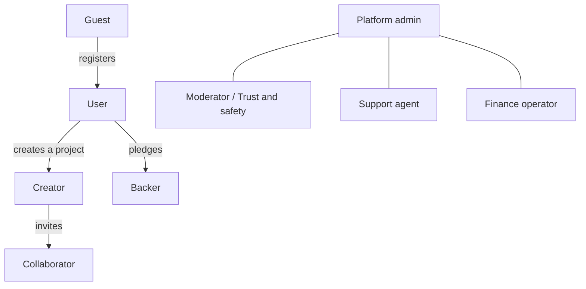
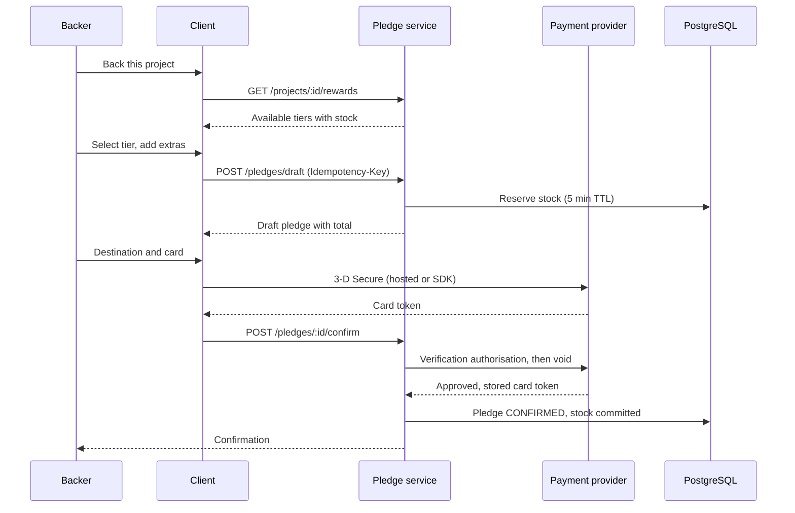
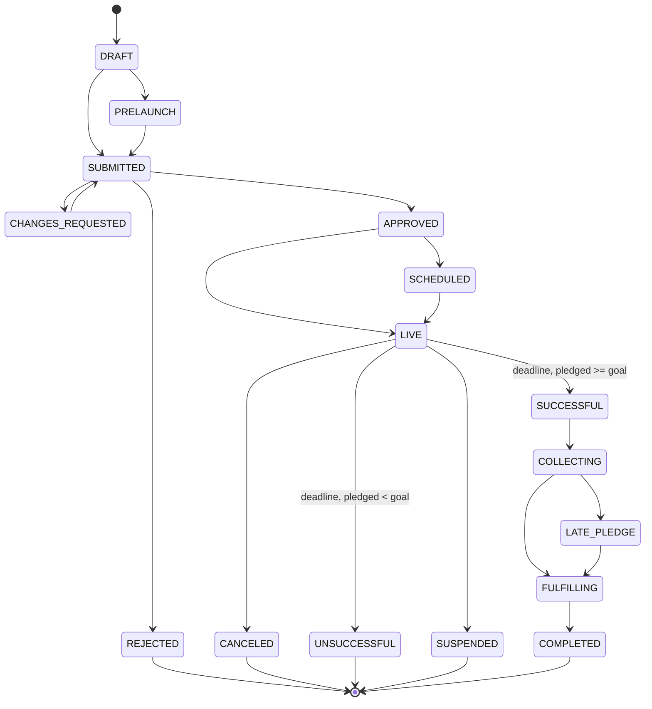
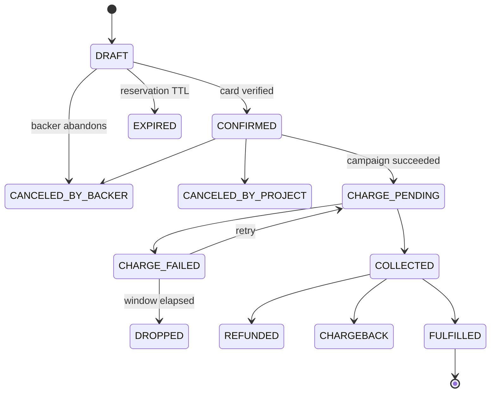
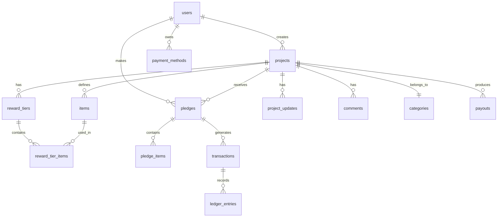
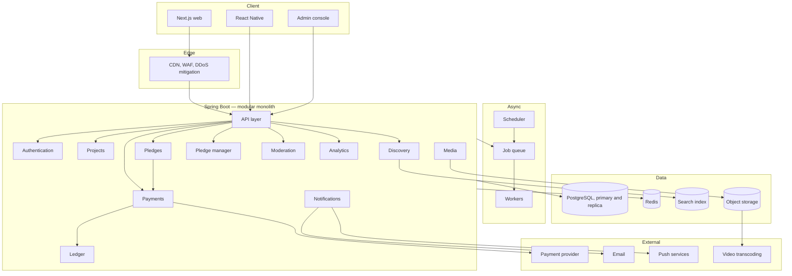
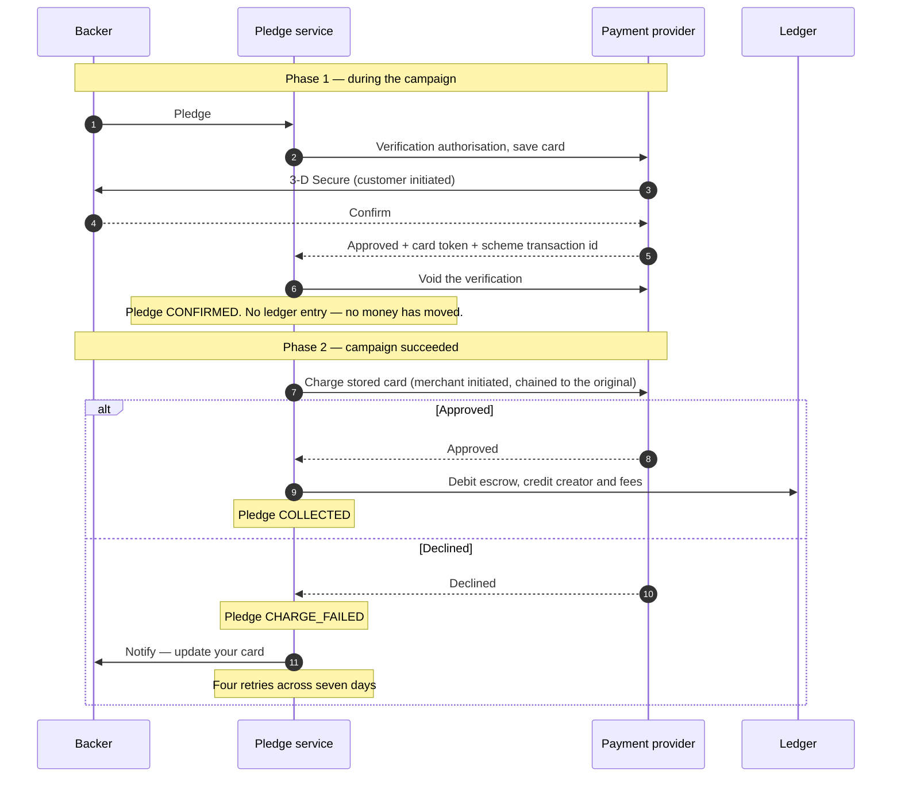
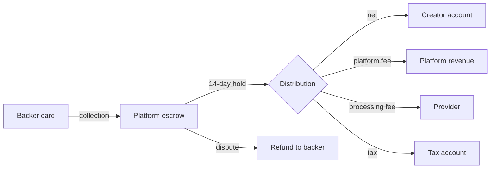
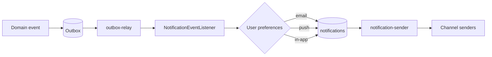

# IdeaNest — Platform Specification

**Reward-based crowdfunding. Web, mobile, and backend.**

| | |
|---|---|
| **Version** | 2.0 |
| **Status** | Draft — under review |
| **Scope** | Web (Next.js), mobile (React Native), backend (Java 21 / Spring Boot) |

---

## Contents

1. [Overview and product strategy](#1-overview-and-product-strategy)
2. [Glossary](#2-glossary)
3. [Actors and roles](#3-actors-and-roles)
4. [Functional inventory](#4-functional-inventory)
5. [Business rules](#5-business-rules)
6. [Domain model and state machines](#6-domain-model-and-state-machines)
7. [Database schema](#7-database-schema)
8. [System architecture](#8-system-architecture)
9. [Payments](#9-payments)
10. [API design](#10-api-design)
11. [Discovery and search](#11-discovery-and-search)
12. [Real-time and notifications](#12-real-time-and-notifications)
13. [Media pipeline](#13-media-pipeline)
14. [Technology stack](#14-technology-stack)
15. [Dependencies](#15-dependencies)
16. [Repository layout](#16-repository-layout)
17. [Security](#17-security)
18. [Observability](#18-observability)
19. [Infrastructure and delivery](#19-infrastructure-and-delivery)
20. [Testing strategy](#20-testing-strategy)
21. [Localisation and currency](#21-localisation-and-currency)
22. [Legal and compliance](#22-legal-and-compliance)
23. [Roadmap](#23-roadmap)
24. [Risks and open questions](#24-risks-and-open-questions)

---

## 1. Overview and product strategy

### 1.1 What we are building

A **reward-based crowdfunding platform**. Creators publish projects; backers
pledge money and receive a physical or digital reward in return. The platform
operates an **all-or-nothing** funding model: if a project does not reach its
goal by the deadline, nobody is charged.

> **This is not investment.** A backer receives no equity, no share, and no
> interest — only a product or an experience. That distinction is decisive under
> the applicable regulation (see [§22](#22-legal-and-compliance)).

### 1.2 What makes this category work

Four pillars, observed across established platforms in this category:

| Pillar | Description |
|---|---|
| **All-or-nothing funding** | A risk-reduction mechanism. The backer pays only if the project succeeds; the creator is never left with a partial budget that cannot deliver. |
| **A discovery engine** | Fifteen categories, roughly a hundred subcategories, a tag vocabulary, editorial curation, geographic filtering, and seven sort orders. A large share of traffic originates inside the platform, not from search. |
| **A story-led campaign page** | Video, rich narrative, reward tiers, a mandatory risks section, FAQ, updates, and comments. This is not a product page; it is an instrument of persuasion. |
| **Post-campaign fulfilment** | Surveys, add-on sales, late pledges, shipping calculation, tax collection, and backer reporting. The work does not end when funding closes. |

### 1.3 Product principles

1. **Trust outranks everything.** Money leaves people's accounts and they wait
   months. Transparency, moderation, and accountability are first-class
   features, not additions.
2. **Creator success is platform success.** Creator tooling — analytics,
   attribution, backer management — must be as deep as the backer experience.
3. **Mobile is not secondary.** Most traffic in this category is mobile. The
   application must fully support browsing, pledging, updates, and
   notifications.
4. **Every movement of money must be auditable.** An immutable ledger, always.
   No balance is ever *computed* — it is read from the ledger.

---

## 2. Glossary

| Term | Definition |
|---|---|
| **Project / Campaign** | A creative undertaking seeking funding |
| **Creator** | The person or organisation running a project |
| **Backer** | A user who pledges money to a project |
| **Pledge** | A financial commitment, not charged immediately |
| **Reward tier** | A package promised in exchange for a pledge amount |
| **Add-on** | An extra item purchasable alongside a reward |
| **Item** | The atomic physical or digital unit rewards are composed from |
| **Goal** | The minimum amount required for success |
| **Stretch goal** | A bonus target announced beyond the goal |
| **All-or-nothing** | No money moves unless the goal is met |
| **Funding period** | The window a campaign is open, 1–60 days |
| **Late pledge** | A pledge accepted after the deadline |
| **Pledge manager** | Post-campaign tooling for surveys, add-ons, and shipping |
| **Fulfilment** | Manufacturing and delivering rewards |
| **Collaborator** | A team member granted scoped access to a project |
| **Referrer** | The source a pledge is attributed to |
| **Escrow** | Where funds sit between collection and payout |
| **Payout** | The net amount transferred to the creator |
| **Chargeback** | A cardholder dispute raised through their bank |

---

## 3. Actors and roles



### 3.1 Permission matrix

| Action | Guest | User | Backer | Creator | Collaborator | Moderator | Admin | Finance |
|---|:-:|:-:|:-:|:-:|:-:|:-:|:-:|:-:|
| View projects | ✅ | ✅ | ✅ | ✅ | ✅ | ✅ | ✅ | ✅ |
| Search and filter | ✅ | ✅ | ✅ | ✅ | ✅ | ✅ | ✅ | ✅ |
| Save a project | ❌ | ✅ | ✅ | ✅ | ✅ | ✅ | ✅ | ✅ |
| Pledge | ❌ | ✅ | ✅ | ✅ | ✅ | ✅ | ✅ | ❌ |
| Comment | ❌ | ❌ | ✅¹ | ✅ | ✅ | ✅ | ✅ | ❌ |
| Create a project | ❌ | ✅ | ✅ | ✅ | ❌ | ❌ | ✅ | ❌ |
| Edit a project | ❌ | ❌ | ❌ | ✅ | ✅² | ❌ | ✅ | ❌ |
| Publish an update | ❌ | ❌ | ❌ | ✅ | ✅² | ❌ | ✅ | ❌ |
| View the backer report | ❌ | ❌ | ❌ | ✅ | ✅² | ❌ | ✅ | ✅ |
| Initiate a payout | ❌ | ❌ | ❌ | ❌ | ❌ | ❌ | ❌ | ✅ |
| Suspend a project | ❌ | ❌ | ❌ | ❌ | ❌ | ✅ | ✅ | ❌ |
| Apply an editorial badge | ❌ | ❌ | ❌ | ❌ | ❌ | ✅ | ✅ | ❌ |
| Ban a user | ❌ | ❌ | ❌ | ❌ | ❌ | ✅ | ✅ | ❌ |
| Issue a refund | ❌ | ❌ | ❌ | ❌ | ❌ | ❌ | ✅ | ✅ |

¹ Only backers of that project and its creator may comment. **As shipped in #84
this is enforced by half**: a signed-in account and a campaign it may see, but
not "has an active pledge here", which no module publishes an answer to. §4.9
has the argument for why that fails open rather than closed, and what closes it.
² Subject to the granular grants the creator issued.

---

## 4. Functional inventory

Marked `[W]` web, `[M]` mobile, `[A]` admin.

### 4.1 Authentication and account

| # | Capability | Platform | Note |
|---|---|---|---|
| A-01 | Email and password registration | W, M | Verification required |
| A-02 | Email verification link or code | W, M | 24-hour token |
| A-03 | Sign in | W, M | Rate limited: 5 attempts / 15 min |
| A-04 | Google sign-in | W, M | Client obtains an ID token; the server verifies it against Google's JWKS |
| A-05 | Apple sign-in | W, M | Required by the iOS store once social sign-in exists. Same path, Apple's issuer and keys |
| A-06 | Password reset | W, M | Single-use token, 1 hour |
| A-07 | Two-factor via authenticator app | W, M | Mandatory for payout actions |
| A-08 | Two-factor via SMS | W, M | Fallback |
| A-09 | Active session management | W, M | Device list, remote revocation |
| A-10 | Account deletion | W, M | 30-day delay, then anonymisation |
| A-11 | Personal data export | W | Machine-readable archive |
| A-12 | Email change | W, M | Confirmation to both addresses |
| A-13 | Password change | W, M | Requires the current password |
| A-14 | Biometric unlock | M | **Built (#29)** at `/account`. The refresh token moves into a `requireAuthentication` keychain entry, so the platform — not the application — refuses to hand it over without a prompt. §17.1 has the full argument, including why it is a local gate and not a second factor |

> **The web client cannot read a session on the server, and that is a property
> of the cookie rather than of the client.** The refresh token is issued on
> `Path=/v1/auth` (§17, `ideanest.auth.refresh-cookie.path`), deliberately, so a
> thirty-day credential is not attached to every request to the API. A browser
> sends a cookie only to paths under its own, so a request for `/` carries
> nothing a Server Component could read.
>
> So the web session is bootstrapped once per page load in the browser: the
> cookie is spent against `POST /v1/auth/refresh`, the fifteen-minute access
> token is held in memory, and `GET /v1/me` answers who is reading. It costs one
> round trip after hydration, and the shell renders a neutral state until it
> lands rather than guessing. Reading it on the server would mean widening the
> cookie's path, which is a decision for §17 and not for the client.

> **The web client's second factor is a step on the sign-in form, not a route,
> and that is a property of the challenge.** `POST /v1/auth/login` answers a
> confirmed account with a challenge rather than tokens, and `TokenController`
> marks that response `no-store` because the challenge is a credential for the
> next few minutes. A URL is the one place such a value must not go — a query
> string is written to access logs, kept in browser history, and forwarded in the
> `Referer` header of whatever the page loads next, which is the same argument
> `VerifyEmailRequest` makes about the verification token. #272 built the step;
> there is no `/two-factor` path to look for.
>
> **A-06's reset does not say whether the address has an account, and #271 kept
> it that way.** `POST /v1/auth/forgot-password` answers 202 either way, for the
> reason registration answers 202 either way: an endpoint that says "no such
> account" turns a breach list into the subset of those people who are here, and
> that subset is what somebody wants before writing a phishing email. What differs
> is invisible from outside — an address with no account receives **nothing**.
> Registration writes to an already-registered address because its owner deserves
> to know somebody is probing it; the reset form takes whatever was typed into it,
> so mailing that would make this platform a delivery service for strangers.
>
> The link is single-use, lasts **one hour** rather than the verification link's
> twenty-four, and issuing a second one retires the first. The password policy is
> checked **before** the link is spent, so a rejected password leaves the link
> usable — burning it on the way to a 400 is the reset flow's most common
> self-inflicted support ticket. Every session dies when it succeeds.
>
> **An account with no password can still reset one.** Somebody who registered
> through Google or Apple has no `user_credentials` row and the reset creates one.
> That is the documented way back for a person who has lost the provider account
> they signed up with; the proof required is control of the mailbox, which is what
> would recover the provider account too.

> **A-12 does not move the address until the new one answers, and V44 is written
> about why (#277).** Writing `users.email` immediately and clearing the verified
> flag is the obvious alternative and it fails on one typo: sign-in is by address,
> and so is the reset that would fix it, so the account would already be behind a
> mailbox nobody can read. The request is held in `email_change_requests` and the
> address moves in a single statement when the link is spent.
>
> **Both addresses are written to**, which is what the capability asks for. The new
> one gets the link. The old one gets a notice with no link at all — it cannot
> approve the change and does not need to; what it does is make an address takeover
> visible to the person losing the account, at the address they still hold.
>
> **A-13 revokes every session including the caller's; A-12 revokes none.** A
> password is changed precisely when somebody believes the old one is known, and
> leaving the sessions it issued alive makes the change ceremonial. An address
> change alters no credential: the same password still opens the same sessions.
> Both require the current password, because a stolen access token is fifteen
> minutes of somebody else's session and neither of these should be what makes it
> permanent.

> **`GET /v1/me` does not say whether two-factor is on, and #278's screen cannot
> ask.** Its six fields carry no `twoFactorEnabled`, and no other read answers it
> either. The enrolment screen therefore offers both directions and lets
> `POST /v1/auth/2fa/enable` decide — it refuses an already-confirmed enrolment
> with a sentence written for the account's owner. A field on `GET /v1/me` is the
> honest fix and belongs to whoever owns this section rather than to an epic
> scoped to the web client.

### 4.2 Profile

| # | Capability | Platform |
|---|---|---|
| P-01 | Avatar upload and crop | W, M |
| P-02 | Name, bio, location, website | W, M |
| P-03 | Social links | W, M |
| P-04 | Backed projects archive (no amounts) | W, M |
| P-05 | Created projects | W, M |
| P-06 | About tab | W, M |
| P-07 | Profile visibility | W, M |
| P-08 | Blocked users | W |
| P-09 | Notification preferences | W, M |
| P-10 | Language and currency. **Both halves built** — the language with #280 and #324, the display currency with #327 | W, M |

> **The web client's account area is one navigation over two prefixes**, built by
> #275: `/settings/*` for what somebody decides — notifications, devices,
> two-factor, data and closure — and `/account/*` for what they have — saved
> campaigns, followed creators, surveys, deliveries. The split is a fact about the
> existing URLs rather than a design. `/settings/notifications` is the address in
> every notification email the platform has sent, and moving it under `/account`
> to buy a tidier tree would break links this repository does not own.
>
> **P-02 and P-03 joined that navigation with #276, and P-10 still has not.** The
> profile editor had no write to save to, and now it does: `GET` and
> `PATCH /v1/me/profile`, beside P-07's switch rather than folded into a general
> `PATCH /v1/me`, for the reason `ProfileVisibilityController` gives — a PATCH over
> the whole account is a surface every future column joins by default, and the first
> one added without thinking becomes writable by anybody holding a token. The write
> covers the name, the biography, a website, a location from V16's gazetteer, and up
> to five social links, all of them **https only**: a profile link is a spam vector
> and a `javascript:` scheme is an XSS one, so the scheme is refused at the column,
> at the domain and at the request.
>
> **P-01 is half-served and the half that is missing is the half the capability
> names.** `users.avatar_url` is writable now — as an address of an image that is
> already published, which is exactly what `projects.cover_image_url` has always
> been and is stated in the same words in `OwnProfileResponse` as in `CoverImage`.
> The server has never seen the bytes. **Upload and crop wait on §13.1**, and until
> that pipeline exists an uploader here would be a control with nowhere to write.
>
> **P-10 arrived with #280, as one half offered and one half stated.** Its blocker
> was misattributed until #324: the dependency was §21.1's message catalogue, not
> #123's locale-prefixed URLs, which are an indexing decision. The catalogue now
> exists and `/settings/language` is in the account navigation.
>
> **The language is a control.** `GET /v1/me` returns the account's `locale` and
> `PATCH /v1/me/locale` writes it — a path that names the one setting, on
> `PATCH /v1/me/profile-visibility`'s reasoning rather than a general account
> patch. The screen writes the column and a cookie together, because a render has
> to know the language before its first byte and cannot wait on an API call;
> `SessionProvider` mirrors the column into the cookie when a session bootstraps,
> so a person who chose Russian on one device is not met by English on the next.
> The options are named in their own languages — a list of endonyms — because
> somebody stranded in a script they cannot read needs to find their own, and
> "Azerbaijani" spelled in Russian is unreadable to exactly that person.
>
> **The currency is a control since #327, and the argument it replaces was about a
> rate rather than about a second project currency.** This paragraph used to say a
> selector would convert AZN to AZN, because §21.2's approximation needs a
> published rate and the service had none. #327 built one: the Central Bank of
> Azerbaijan's daily publication, refreshed hourly into `exchange_rates`, with the
> rate a backer was shown stamped on their pledge.
>
> The two currencies are not the same currency. The **project** currency is what a
> creator sets a goal in and what a card is charged in, it is pinned to manat under
> phase 1, and nothing here changes it. The **display** currency is a property of
> the reader: a backer in Istanbul looking at a manat campaign wants to know
> roughly what it costs in lira, and that is answerable today.
>
> `PATCH /v1/me/currency` writes it, and refuses what the platform cannot price —
> which is a property of what a central bank published and when the platform last
> reached it, so the refusal carries the list of what it can. On a deployment whose
> source is unreachable, or one with the feature switched off, the panel is a
> sentence again. That is #280's shape, and the reason it was right: a control with
> one option is a control that cannot be used.
>
> **What the language does not yet change is the public site**, which is still
> English. §21.1 explains why — a per-visitor language on a cached route turns one
> shared render into a render each — and names the work that lifts it.
> `SiteFooter` therefore goes on stating both values as facts, and is now telling
> the truth about a smaller claim than before: the public site is in English, and
> the account area is in whatever its owner chose.
>
> **The location is a slug from a closed vocabulary, and that vocabulary is
> published now (`GET /v1/locations`).** V16 seeded eighteen places for §4.3's
> `?city=` filter and gave them no index, which left a form two bad options: a
> free-text box that refuses every spelling but one, or the list copied into the
> client — the thing §4.3 forbids in its second sentence. The endpoint is on
> `GET /v1/categories`' terms: public, an hour, `Vary: Accept-Language`, and a
> requested-locale → `az` → slug fallback so a name is never empty.
>
> **P-04 to P-07 are a third surface and not part of that navigation either
> (#274).** `/u/{slug}` is somebody else's page: it is read by strangers, it is
> indexable, and it belongs to no account area. What lives under `/settings` is the
> one thing about it its owner decides — P-07's visibility, on the privacy screen
> that already holds the closure and export controls.
>
> **PRIVATE answers 404 and never 403.** A 403 confirms that the slug names a real
> account, which is exactly the fact a withheld profile is withholding; the reads
> answer a private profile, a closed account and a slug that never existed with one
> response. What PRIVATE does *not* retract is stated in `ProfileVisibility`,
> because a setting that overpromises is worse than none: a creator's name and
> avatar are on every campaign page they have published, and choosing PRIVATE
> withdraws the profile rather than the campaigns.
>
> **P-04's archive carries no amounts, and that is the capability's own wording.**
> What a stranger may see is that somebody backed a campaign, never for how much —
> and §4.5's PL-12 anonymous pledges are omitted from it entirely rather than
> listed without a name, since a list of campaigns is frequently identifying on its
> own.

### 4.3 Discovery and search `[W] [M]`

**Categories (15).** Art, Comics, Crafts, Dance, Design, Fashion, Film & Video,
Food, Games, Journalism, Music, Photography, Publishing, Technology, Theatre.

Each carries between four and nineteen subcategories — roughly a hundred in
total. The taxonomy is data, not code: it must be editable without a deployment,
and each entry needs a translation per supported locale.

**Filters**

| Filter | Values |
|---|---|
| Status | Upcoming, live, late pledge, successful, unsuccessful |
| Category | 15 primary plus subcategories, each with a live count |
| Location | Country, city, or proximity |
| Goal amount | Bands plus a custom range |
| Amount raised | Bands plus a custom range |
| Completion | Under 25%, 25–50%, 50–75%, 75–100%, over 100% |
| Show only | Recommended, editorially featured, saved |
| Tags | Free vocabulary |
| Programmes | Themed open calls |

**Sort orders**

| Sort | Logic |
|---|---|
| Relevance | Composite of §11.2's weighted terms. Live today: text match, completion, curation, recency. Momentum and personalisation are inert — see §11.2 |
| Popularity | Pledge velocity with time decay |
| Newest | `launched_at DESC` |
| Ending soon | `deadline ASC` |
| Most funded | `pledged_amount DESC` |
| Most backed | `backers_count DESC` |
| Near me | Geographic distance |

> **Decisions this table leaves open, resolved by `GET /v1/discover` (#42).** They
> live in `az.ideanest.discovery.domain` — `DiscoveryStatus`, `CompletionBand`,
> `AmountBand`, `DiscoverySort` — with the reasoning beside each.
>
> **Status is a grouping, not a state.** The five words above are discovery-facing
> names for sets of the sixteen states in §6.1: *upcoming* is `PRELAUNCH`; *live* is
> `LIVE`; *late pledge* is `LATE_PLEDGE`; *successful* is `SUCCESSFUL`,
> `COLLECTING`, `LATE_PLEDGE`, `FULFILLING`, and `COMPLETED` together, because
> reaching the goal is one event and everything after it is fulfilment; and
> *unsuccessful* is `UNSUCCESSFUL` alone. `CANCELED` is publicly visible and belongs
> to no grouping — the creator withdrew it, which is not a claim about whether it
> found backers. **`DRAFT`, `SUBMITTED`, `CHANGES_REQUESTED`, `REJECTED`,
> `APPROVED`, `SCHEDULED`, and `SUSPENDED` are never returned by discovery, under
> any filter or sort.**
>
> **Bands are closed below and open above** — `[lower, upper)` — so that the five
> partition the line rather than overlapping at four boundaries. A campaign at
> exactly its goal is "over 100%": the question is "did it make it", and it did. The
> money bands are `<1000`, `1000–5000`, `5000–20000`, `20000–50000`, `>50000` in the
> campaign currency, and a custom range alongside them is inclusive at both ends.
>
> **Multiple values within one dimension are OR'd, except tags, which are AND'd.** A
> campaign has one state, one category, and one band, so AND there returns nothing;
> it has several tags, and ticking a second tag is a refinement like every other
> control on the panel.
>
> **The default sort is newest.** It is the only order that is meaningful with no
> filter: ending-soon opens an unfiltered feed on whatever finished longest ago, and
> the two amount orders open on the same handful of campaigns for everybody for
> ever.
>
> **Relevance is served (#44) and so is near-me (#47).** What is still refused is
> an RFC 9457 problem detail naming the issue rather than a quiet fall back to a
> different order: *saved* (no saved-projects table exists) and *recommended*
> (D-07; see below). Nothing in the sort column above is refused any more.
>
> **Location is one dimension with three controls (#47).** `country` is ISO
> 3166-1 alpha-2; `city` is a `locations.slug`, folded by §11.3 so `Bakı`,
> `BAKI` and `baki` are one filter — and the localised exonym deliberately is
> not, because a slug is a handle from an open vocabulary exactly as `category`
> and `programme` are, and the facet panel is where a client gets it. `near=lat,lon`
> with an optional `radiusKm` is the third. All three count as **one** facet
> dimension, so the country counts are computed with the city filter and the
> radius excluded too — the same rule that makes category and subcategory one
> dimension.
>
> **The origin comes from the request and never from a profile, and it is
> quantised to two decimal places — about a kilometre — before it reaches a query,
> a cursor, a log, or an ETag.** Three reasons that agree. It is already finer
> than the data: a campaign is located at a city centroid. Precise coordinates in
> a query string end up in access logs, `Referer` headers and shared caches, and
> §17.4's position is that data the platform does not need is data it does not
> keep. And `/v1/discover` is public and cached for a minute; a key that varied at
> ten centimetres would never be hit twice, whereas at a kilometre everybody in a
> neighbourhood shares one entry. A profile-supplied origin was rejected for the
> reason `showOnly=recommended` is: the endpoint is unauthenticated *because* that
> is what makes §20's thousand requests a second reachable.
>
> **A radius is bounded at 500 km and refused above it**, not clamped — Azerbaijan
> is about 500 km across, so a larger circle contains every campaign on the
> platform and is "everywhere" with arithmetic attached; and clamping would
> silently narrow somebody's search, which is the direction that hides results. The
> boundary is **inclusive**.
>
> **A campaign with no location sorts last under near-me and is excluded by a
> radius.** Near-me is a sort and proximity is a filter, and the two answer
> differently on purpose: a sort that dropped rows would take a reader who changed
> order and silently remove most of the platform from their feed, while a campaign
> whose location is unknown genuinely cannot be shown to be within fifty kilometres
> of anywhere. Nulls last, like `newest` and `ending_soon`, with the same null-tail
> branch in the cursor.
>
> **`sort=near_me` with no origin is refused, not resolved to another order** —
> unlike `sort=best_match` with no `q`, which falls back to `newest` because a text
> score over no text is zero for every campaign. A distance from no origin is
> undefined rather than zero.
>
> **Relevance is opt-in, not a default.** An unstated sort still resolves to
> *newest* while browsing and *best match* while searching. Making the composite
> the default would change what every existing shared link means and would make the
> web client's sort control show an order that is not the one in force; it stays
> `?sort=relevance` until it has been measured against the two defaults, which is
> what §11.2's tunable weights and its per-campaign diagnostic exist for. Three of
> §11.2's eight terms are live and five are inert; §11.2 says which and why.
>
> **Editorially featured and Programmes are served (#48).** `showOnly=featured` and
> `?programme={slug}` compose with every filter, every sort, and the cursor, and both
> appear in the facet panel under the same exclude-own-dimension rule as everything
> else. *Featured* is **derived, not a flag**: a campaign is featured exactly when it
> is a member of a published, in-window collection whose `grants_badge` is set, which
> is what the `project_editorial_badges` view says and the only place it is said.
> `projects.is_featured` is still deliberately absent — V6 refused it because
> "curation is an editorial workflow, not a boolean somebody sets by hand", and a
> per-project badge flag would be that boolean with a timestamp on it. *Programmes*
> narrows to one open call, and only to collections of kind `OPEN_CALL` that are
> published and inside their window, so a slug that leaked from an admin screen is not
> a way to read an unpublished list.
>
> **Show-only is one filter with three values and two of them are still refused**, on
> purpose. *Recommended* is personalisation (§11.2's `w6`, D-07), and it survived #44:
> the composite ranks campaigns and does not know who is reading, because
> `/v1/discover` is unauthenticated and publicly cached — which is what makes §20's
> thousand requests a second reachable. So `w6` is inert and this filter is still
> refused, now naming D-07 rather than #44. Answering it out of the composite would
> tell every reader that a feed computed identically for all of them had been
> assembled for them personally; answering it with the platform's staff picks would
> present an editorial decision as a personal one.
>
> **Free text is served (#43).** `?q=` composes with every filter, every sort, the
> cursor, and the facet counts on both `/v1/discover` and `/v1/search`. It narrows
> the set the facets are counted over rather than being a facet dimension of its
> own — there is no filter control for the search box, and counts that ignored what
> was typed would describe a different result set from the one on screen.
>
> **D-02's suggestions are `GET /v1/search/suggest`.** Campaign titles, categories,
> subcategories and tags, each row saying which of the four it is so the client
> knows where it leads; drawn round robin so no one source fills the list; bounded
> at ten by default and twenty at most; and empty — not everything — for a blank or
> one-character fragment.
>
> **There is an eighth sort, `best_match`,** and it is not relevance. It is
> `ts_rank` over the search vector — a title match above a blurb match above a
> story match — and it is what an unstated sort resolves to when `?q=` is present,
> because ordering search results by launch date puts the campaign that mentions
> the word once in its ninth paragraph above the one named after it. §11.2's
> relevance is a composite of eight terms, none of which is about what the reader
> typed. **#44 landed and `best_match` did become its text term rather than being
> replaced by it** — the composite adds a ninth term which is this same `ts_rank`
> expression, so the two orders share one definition of a good text match and
> neither changed meaning. `sort=best_match` with no `q` has nothing to rank and
> still resolves back to newest.

**Additional**

| # | Capability |
|---|---|
| D-01 | Full-text search across title, summary, story, and creator |
| D-02 | Autocomplete and suggestions |
| D-03 | Misspelling tolerance |
| D-04 | Cursor-paginated infinite scroll |
| D-05 | Project card: image, title, creator, completion, days left, badge |
| D-06 | Similar projects |
| D-07 | Personalised feed |
| D-08 | Curated collections and open-call landing pages |
| D-09 | Trending tags |
| D-10 | Live faceted counts |
| D-11 | Search history (mobile) |
| D-12 | Shareable filter URLs |

### 4.4 Project page `[W] [M]`

> **The page is server-rendered, and #119 is what that had to mean.** The
> requirement is not "renders on the server" but "the content is in the initial
> HTML, not assembled by the client" — so the read behind it,
> `GET /v1/projects/{creatorSlug}/{projectSlug}`, carries the story document
> rather than leaving the page's own body to a second request. A page that
> fetched its narrative separately would satisfy the letter and fail the thing
> the issue is about, since the narrative is the entire content a crawler and a
> link unfurler are given.
>
> **The first pass was the header, the story, the risks and the reward tiers.**
> Those are the parts a stranger reads before deciding whether to register, and
> each of the remaining tabs already has a public endpoint of its own — folding
> them in would produce one response whose cost is decided by the longest comment
> thread on the platform, cached for as long as its least cacheable part.
>
> **The rest arrived with #281, #282, #283, #284 and #285, and the split above is
> why the tab is a query parameter.** `?tab=` keeps one canonical URL for one
> campaign — a route per tab would be five, four of them thin — while still being
> a link somebody can send and a crawler can follow, which local state is not.
> Only the active tab is fetched, so the second read is paid for by the reader who
> asked for it.
>
> **The FAQ tab needed a schema before it could need a design (#283).** §4.4 has
> always listed it and nothing on the platform stored a question: a tab that always
> said "no questions yet" would have been a claim about the campaign rather than
> about the platform, which is why it was the one tab left out of the four above.
> `project_faqs` is a table rather than a `jsonb` column on `projects`, because
> §10.2 addresses single entries — an entry needs an identifier that survives a
> reorder, and a jsonb array is read-mutate-write whole, so two editors silently
> lose one of the edits. Ordering is `sort_order` and a reorder rewrites the whole
> list from zero, the rule `reward_tiers` already follows and for its reason: two
> concurrent reorders then produce one of the two orders rather than a blend of
> both. The list is capped at fifty entries and unpaged, and the cap is what makes
> the absent cursor honest — if fifty stops being enough the answer is a cursor,
> never a bigger cap, because the failure mode of the alternative is silent
> truncation.
>
> **Managing it is its own grant, `MANAGE_FAQ`, and not `EDIT_BASICS`.** §16.1's
> argument about coarse questions is the whole reason `shared/access` exists, and
> a hatch wide enough to be convenient on a published surface is one that gets
> taken. Reading stays coarse, so a collaborator writing the story can still see
> the campaign's own FAQ. V9's `collaborator_capabilities_known` check constraint
> is widened in the same migration — an enum value the database refuses is a grant
> that fails at the moment a creator issues it.
>
> **The tab strip is a list of links and deliberately not an ARIA tab widget.**
> `role="tab"` promises arrow-key movement, a single tab stop, and a panel that
> changes without the page moving; the first two need JavaScript to manage a
> roving `tabindex` on the route §4.4 is server-rendered for, and the third would
> be false anyway because activating one of these navigates. A widget whose roles
> promise behaviour it does not have is worse than no roles at all.
>
> **The media player has no video to play, and says so by not offering one.**
> `ProjectPageResponse` carries a cover image and §13.2's pipeline is not built,
> so the player is the poster. A play control that did nothing would be worse than
> its absence, so the affordance exists as an unreachable branch with the seam
> documented rather than as a button.
>
> **The Creator tab has a biography and previous campaigns, and no contact row.**
> §4.4 asks for history and contact; `users` has `bio` and nothing else, and
> §4.9's C-12 has no reply half. The tab omits the rows rather than inventing
> them. It reads §4.2's public profile, so a creator who has set their profile to
> PRIVATE degrades to the byline with no link — and with no explanation, because
> an explanation would rebuild in the interface the 404-not-403 oracle the service
> exists to avoid.
>
> **The Comments tab attributes the creator and nobody else.** `CommentResponse`
> carries an `authorId` and no display name, and the profile read is keyed on a
> slug, so nothing on the platform turns one into the other. The tab marks the
> campaign's own replies and leaves every other comment unattributed rather than
> inventing a byline; a name beside a comment is worth having only when it is the
> right name.
>
> **A closed campaign shows two totals.** What it raised at its deadline, frozen
> by §5.1, beside what has actually been collected since — see §5.1 for why
> conflating them eventually contradicts the word printed next to them.

**Header:** media player (poster-first, no autoplay), editorial badge,
subcategory and location links, amount raised, backer count, live countdown,
progress bar, primary call to action, reminder control, share, save, and an
explicit all-or-nothing statement with the deadline in the viewer's timezone.

**Trust block** — fixed copy on every project:

> The platform connects creators with backers. Rewards are not guaranteed, but
> creators must keep backers informed. You are only charged if the project
> reaches its goal by the deadline.

**Tabs**

| Tab | Contents |
|---|---|
| **Campaign** | Rich narrative with images, video, and embeds; auto-generated section navigation; a **mandatory risks and challenges section**; a reporting link |
| **Rewards** | Available and exhausted tiers separately. Each: price, backer count, shipping destinations, estimated delivery, remaining quantity, included items with quantities, images |
| **Creator** | Biography, history, previous projects, contact |
| **FAQ** | Creator-managed question and answer list |
| **Updates** | Numbered updates, public or backers-only, with comments |
| **Comments** | Chronological thread, creator replies highlighted |
| **Community** | Backer statistics: countries, new versus returning, cities |

> **Both backer counts on this page come from one place (#57).**
> `GET /v1/projects/{id}/backers/public` answers the header's backer count and the
> Rewards tab's count beside each tier in one body. The campaign's total is its own
> query rather than a sum of the tiers, because a sum of the tiers omits every
> pledge that took no reward — §4.5's PL-02 — and the omission is invisible on a
> campaign where nobody happens to have done that.
>
> The count is taken from `pledges`, not from `projects.backers_count`. That
> denormalised counter exists (V6) and discovery reads it, but nothing writes it
> yet, so today it is zero for every campaign. Whichever issue starts maintaining
> it owns reconciling the two.
>
> **This page names no backer, and that is a decision rather than a gap.** Every
> public surface here is an aggregate: a count in the header, a count per tier, and
> the Community tab's statistics. Whether a campaign should publish *who* backed it
> is **#209**, which is open and labelled `status: needs-decision`. §4.5 has what
> #57 built against the day it is answered.
>
> **The Community tab's statistics are not built, and #209 has to be settled
> first.** Countries and cities are aggregates, but a small aggregate is an
> identifier: "1 backer in Georgia" beside any list of names identifies that person,
> and it identifies them whether or not they asked to be anonymous. Publishing those
> counts needs a minimum cell size — suppress any bucket below *k* — and *k* is a
> product and legal question rather than an implementation detail.

### 4.5 Pledge flow `[W] [M]`



| # | Capability | Note |
|---|---|---|
| PL-01 | Reward tier selection | Live stock check |
| PL-02 | Pledge without a reward | Support only |
| PL-03 | Bonus support above the tier price | |
| PL-04 | Add-on selection with quantities | Campaign or pledge manager; a limited add-on holds stock like a tier |
| PL-05 | Shipping destination | Drives the shipping charge |
| PL-06 | Total calculation | Reward + add-ons + shipping + tax |
| PL-07 | Card entry or stored card | Card data never reaches our servers |
| PL-08 | 3-D Secure | Mandatory |
| PL-09 | Edit a pledge | Until the deadline |
| PL-10 | Cancel a pledge | Releases reserved stock |
| PL-11 | Replace the card | After a failed collection |
| PL-12 | Anonymous pledging | Hidden from public lists |
| PL-13 | Stock reservation | A DRAFT pledge, expiring five minutes after it is made |
| PL-14 | Idempotency | `Idempotency-Key` prevents duplicates |
| PL-15 | Secret rewards | Reachable only by a private URL |
| PL-16 | Late pledge | If the creator enables it. Built (#81) |

> **PL-16, as #81 built it.** A campaign takes pledges in two windows and not one:
> while it is `LIVE` and before its deadline, and again while it is `LATE_PLEDGE` and
> inside a window its creator opened. **Three facts have to be true**, and each is a
> different decision — the campaign is in `LATE_PLEDGE`, `late_pledge_enabled` is on,
> and `late_pledge_ends_at` has not passed. Keeping the switch and the window apart is
> what gives a creator who has run out of stock a way to stop taking money on the next
> request; the alternative was a transition, and §6.1 has no edge back out of
> `FULFILLING`. Switching off clears the window with it, because
> `projects_late_pledge_window_needs_the_feature` refuses a window without the feature
> and one checkbox must not become a constraint violation; the window that was
> announced survives on the `project_state_transitions` row.
>
> **A late pledge is stamped as one.** `pledges.is_late_pledge` is written from what
> `PledgeAcceptance` answered — never from anything a client sent — and it is the whole
> point of the feature being more than one extra state in a condition: §5.1 judged the
> campaign against its goal at its deadline, and money taken afterwards must not join
> the number that decision was made from. An **edit** re-prices a pledge and never
> re-stamps the flag, so a backer changing their shirt size in the late window does not
> move their original pledge into the late column.
>
> **The window is bounded** by `ideanest.project.late-pledges.max-window`, ninety days.
> That is a bound on a promise rather than a technical limit: a campaign still taking
> money nine months after it closed has customers rather than backers, and it has no
> stock to sell them.
>
> **What is not built is the way in.** `COLLECTING → LATE_PLEDGE` is the only edge into
> the state §6.1 draws, and the edge into `COLLECTING` is the batched collection of
> epic #59 — blocked on #60. So the feature is complete and unreachable in production
> until collection lands: a stub that let a creator declare their campaign collected
> would be the platform claiming cards had been charged.

> **PL-13 used to say "Redis TTL", and #51 changed it after building the
> feature**, exactly as #47 changed §7.3's PostGIS row. §7.2 had already
> described the other mechanism — "reservation increments `reserved_quantity`
> under a row lock and relies on this constraint refusing the transaction when it
> gets that wrong" — and V7 had built the constraint for it, so the two halves of
> this document disagreed and the database half won.
>
> The deciding argument is that **taking the place and recording who took it are
> one fact**. A Redis key and `reward_tiers.reserved_quantity` are two records of
> it in two systems with no transaction across them, and the process that writes
> one and then the other can die in between; whichever half survives is now lying,
> and nothing reconciles them. The constraint that refuses an oversold tier also
> lives in PostgreSQL, so a reservation held anywhere else is one it cannot see.
> Against that, Redis buys expiry without a sweep — and §8.4 already lists the
> sweep.
>
> The sequence diagram above is unchanged and still correct: "Reserve stock (5 min
> TTL)" is what happens, and the five minutes are configuration
> (`ideanest.pledge.reservation.ttl`). V17's header carries the whole argument and
> the reverse.

> **PL-13 covers PL-04's add-ons too, and for one release it did not (#203).** An
> add-on is a `reward_tiers` row with `is_addon` set, so a limited one has the same
> `limit_quantity` and the same constraint over the same two counters — but #52 quoted
> it without holding it, and nothing incremented anything, so two backers could each
> take the last one and the database could not refuse either. What a pledge reserves
> is now every tier it names: one place on its reward, and PL-04's quantity on each
> add-on, taken and released together. All of a quantity or none of it, so a backer
> asking for three of something with two left is refused rather than sold two —
> §10.4's `REWARD_SOLD_OUT`, naming the add-on and offering the campaign's other
> add-ons rather than its reward tiers, which are not a substitute for one.
>
> The five minutes are unchanged and are the draft's, not the line's: an abandoned
> checkout gives back its reward's place and its add-ons' quantities in the same sweep
> and the same transaction. See §7.2's `pledge_addons`.

> **PL-14 is built (#52), and it is more than a unique column.** §10.3 has the four
> answers a key can produce and §7.2 has the table; the part worth stating beside
> the capability is that a replay returns *the original response* rather than a
> fresh one, so the guarantee covers the mutations that create no row to find — the
> cancellation of PL-10 in particular, where a retry has to answer 204 and there is
> no pledge left in an active state to carry a key.
>
> The diagram's `POST /pledges/:id/confirm` is also built, minus one step: the
> provider call beside it is #55, blocked on #60, and §9.2 carries what that means
> and why the transition is correct without it.

> **PL-09 and PL-10 are built (#56), and "until the deadline" turned out to be two
> rules rather than one.** A backer may change or withdraw a pledge when **both**
> of these hold, and the pair is composed in exactly one place —
> `PledgeService.requireEditable`:
>
> 1. **The pledge is `DRAFT` or `CONFIRMED`** (`PledgeState.EDITABLE`). A draft is
>    a checkout in progress; a confirmed pledge is PL-09's real case, a backer who
>    committed and has since changed their mind. `EXPIRED` and the two cancelled
>    states are over, and a pledge that ended cannot be edited back into existence
>    — the backer's move is to pledge again, which §7.2's partial index permits
>    precisely because those states are not active. `CHARGE_PENDING` onwards are
>    past the campaign's close, where money is moving or has moved: changing an
>    amount there is a refund or a second charge, not an edit.
> 2. **The campaign is still accepting pledges** — launched, `LIVE`, and before its
>    deadline. This is not a second rule that could drift from the checkout's; it
>    is `PledgeAcceptance`, the same call `POST /v1/pledges/draft` makes, so a
>    campaign that will not take a new pledge will not take a change to an old one
>    either. A closed campaign is therefore answered `PROJECT_NOT_LIVE` rather than
>    `PLEDGE_NOT_EDITABLE`, with the deadline in `meta`; `PLEDGE_NOT_EDITABLE` is
>    left to mean the thing only it can mean, which is that the pledge itself has
>    moved on.
>
> **An edit does not extend a draft's reservation.** `reservation_expires_at` is
> left exactly where it was, and PL-13's five minutes therefore run from when the
> draft was *made* and not from when it was last touched. The alternative is worse
> in a way that is hard to see: a backer who could restart the clock by editing
> would be able to hold a limited tier's last place indefinitely by changing their
> mind every four minutes, and it would look like an ordinary checkout rather than
> like abuse. The cost is real and falls the right way — a backer who spends their
> window deciding gets what is left of it, and if it runs out the sweep releases
> the place and they start again, which is what the window is for. Clearing the
> column is not representable in any case: `pledges_drafts_are_time_bounded`
> refuses a draft without one.
>
> **Cancellation refunds nothing, because nothing was collected** (§9.7). There is
> no refund path on `DELETE /v1/pledges/{id}` and there should not be one; the
> refund of a pledge that really was collected is #67's. What cancellation does
> move is stock, and *which* stock depends on the pledge: a `DRAFT` gives back a
> **reserved** place and a `CONFIRMED` pledge gives back a **claimed** one. They
> are separate statements against separate columns, because releasing the wrong one
> leaves the tier counting a place nobody holds while it is short of one somebody
> does — and the sum, which is what the limit is checked against, still looks
> correct.
>
> **Add-ons move the same two columns (#203), and an edit moves the difference.**
> Cancelling gives back every place the pledge held — the reward's and each add-on's
> quantity — from whichever column was counting them. An edit takes what the new
> selection needs more of and releases what it needs less of: two mugs held and three
> wanted takes one more, two held and one wanted gives one back, and an edit that
> changes only a destination or a name writes to `reward_tiers` not at all.
>
> **Everything is taken before anything is given back**, across every line at once and
> not merely for the reward. That is the same rule as switching tiers and for the same
> reason: an edit that is refused — because the add-on the backer wanted more of has
> run out — must leave them holding exactly what they had, and the other order would
> briefly leave them holding nothing.

> **PL-12 is built (#57), and what it needed was not a column.** `is_anonymous` was
> already stored and already accepted from `POST /v1/pledges/draft` (#52). What was
> missing was the guarantee.
>
> **Anonymity hides who, never how many.** An anonymous backer is counted in the
> campaign's backer count and in the per-tier counts of §4.4, exactly like anybody
> else. A count that excluded the people who asked not to be named would understate
> the campaign to everybody, including the creator reading their own page, and would
> turn a privacy preference into a funding penalty. That is the half of PL-12 the
> platform serves today, at `GET /v1/projects/{id}/backers/public`.
>
> **The ledger is untouched.** `pledges.backer_id` is retained on an anonymous
> pledge exactly as on any other, because §7.2 and §17.4 both require "pledge #123
> was made by user X" to stay true. Anonymity is a decision about rendering on the
> way out, never a redaction of the row, and it does not reach the creator: they
> have to ship the reward to somebody, and their list is `GET
> /v1/projects/{id}/backers` under Dashboard.
>
> **The other half has nothing to hide from yet, and the scope is stated rather than
> implied.** There is no public per-backer list on this platform. §4.4's public
> surfaces are all aggregates, the creator's list is #97, and the pledge manager is
> epic #72 — so "hidden from public lists" was, and remains, a guarantee about a
> surface that does not exist. Whether it should exist is **#209**
> (`status: needs-decision`): §4.4 never asks for one, and `CLAUDE.md` §5 is explicit
> that an endpoint is not the place to answer a question like that by default.
>
> What #57 built for that day is `PublicBacker`, a sealed pair of `Named` and
> `Anonymous` in which the anonymous variant has no field an identity could be read
> out of — not the name, and not the account identifier either, which is the join key
> to §4.2's profile and would resolve back to the name. A rule spelled
> `if (!pledge.isAnonymous())` at each call site is a rule that survives until the
> second call site; a shape with nowhere to put a name does not need remembering.
> **It has no consumer today**, deliberately and with the argument written on the
> type: whoever implements #209 is writing a query, a response, and a controller, and
> the anonymity rule would be one line of their diff — the line that is easy to get
> subtly wrong. If #209 comes back "no public list", the type and its tests are
> deleted in one commit.
>
> Note that #97's creator backer list is **not** a future consumer of it. The creator
> sees every backer by name, anonymous ones included, because they have to ship — a
> different projection with the opposite rule.
>
> One more thing #57 did not do: it did not make `is_anonymous` patchable after the
> draft. That is PL-09's edit endpoint and belongs to #56.

### 4.6 Campaign editor `[W]`

**Basics** — title (≤60 characters), summary (≤135), category and subcategory,
location with geocoding, cover image (min 1024×576), video, goal and currency,
duration (1–60 days), scheduled launch, late-pledge toggle, pre-launch page.

**Rewards** — atomic **items** first, then **tiers** composed from them:
title, description, price, included items with quantities, images, estimated
delivery, quantity limit, shipping scope, per-country rates, early-bird windows,
featured and secret flags, reordering, duplication. **Add-ons** are items
sold alongside a tier.

> **Two notes on how the editor delivers this** (#34).
>
> **Reordering is a pair of move controls per tier, not dragging.** Dragging is
> unreachable by keyboard, by switch control, and on every touch device, and an
> accessibility failure is a build error rather than a nicety (CLAUDE.md §2).
> Each control names the tier it moves and the move is announced with its new
> position. Pointer dragging remains a layer that can be added on top of that;
> it is not a substitute for it.
>
> **A tier's images are its items' images.** `reward_tiers` has no image column
> and neither does its response — §7.2 puts `image_url` on `items` — so the
> pictures a backer sees for a tier are the pictures of what is in it. Both
> become references into the media pipeline (§13) when there is one.

**Story** — rich text editor (headings, emphasis, lists, quotes, rules), inline
media, third-party embeds, section headings that generate anchor navigation, a
**mandatory risks and challenges** field, FAQ editor, autosave and version
history.

**People** — creator profile, collaborator invitations with granular grants,
team display.

**Account** — identity verification, individual or legal entity, tax
identification, bank account for payout, address verification.

**Promotion** — custom referrer links, share templates, pre-launch link.

**Review and launch** — automated completeness checklist, submission,
moderation outcome, launch (scheduled or immediate).

### 4.7 Creator dashboard `[W]` `[M read-only]`

| # | Capability |
|---|---|
| CD-01 | Live totals: raised, backers, completion, time remaining. Built (#93). Read from `projects` at the moment of the request, which is why it is not folded into CD-02's endpoint — that one is as fresh as #95's last rollup, and a screen mixing them would show a total from this second beside a chart that stopped at midnight. **"Time remaining" crosses as `deadline` and `serverTime` rather than as a countdown**: a remainder computed on the server is wrong the moment it is sent and grows more wrong for as long as the page stays open, so the client measures its own clock's offset once and counts down against it. Completion is rounded **down** and is not capped — a campaign at 99.99% has not reached its goal, and one at 240% should say so |
| CD-02 | **Pledge trend over time.** Built (#96). Read from #95's daily rollup through `GET /analytics`, so it is as fresh as the last aggregation pass and never a scan of `pledges` — which is what stops the chart from getting slower as the campaign succeeds. The line is the **running total**, not the day's takings: a campaign's daily figures are famously front-and-back loaded and mostly noise, and the shape that answers "are we going to make it" is the cumulative one. The daily figures are in a table under the chart. **The series is sparse** — a day with no pledges has no row at all — so points are placed by which day they are rather than by position, and a quiet fortnight is a gap rather than a compressed stretch. `computedAt` is printed beside it, because a stalled aggregator and a quiet week draw the same flat line |
| CD-03 | **Referrer attribution** — top sources with pledge count, value, and share. Built (#94, §7.2). The rule is **last non-direct touch inside a thirty-day window**: a visit carrying a source is recorded against an opaque visitor token, and a confirmed pledge belongs to the most recent such visit that was not direct, ignoring any past its window and any recorded after the pledge. A pledge with none is reported as `DIRECT` rather than left out, so a share is a share of the campaign and not of the part that could be explained. Nothing in the report names a backer: `referral_attributions` has nowhere to put one |
| CD-04 | Device split per source |
| CD-05 | Visitor-to-backer conversion |
| CD-06 | Video engagement |
| CD-07 | **Sales per reward tier.** Built (#96), from `GET /backers/breakdown` and **not** from the rollup beside it: `referral_attributions` carries an amount and a source and has no tier on it by construction, so this is grouped over `pledges` at read time and its cost grows with the campaign's backers. Stated rather than hidden — the day that matters, it moves into #95's job. The tiers **sum to at most the campaign's total**, and the difference is §4.5's PL-02, support that took no reward; the screen says so, because a creator who added them up and found a shortfall would be right |
| CD-08 | **Geographic distribution.** Built (#96), from the same endpoint, grouped on `pledges.shipping_country`. Pledges that named no destination — a digital reward, or support with no reward — are **a group rather than a gap**, because a chart whose parts do not add up to the total beside it is one somebody has to reconcile by hand. Country codes rather than country names: nothing on the platform maps ISO 3166-1 to a name in a locale, and `locations` is the eighteen Azerbaijani cities a campaign can be *in*, which is a different vocabulary |
| CD-09 | New versus returning backers |
| CD-10 | **Backer report with filtering and segmentation.** Built (#97). `GET /backers`, guarded by `VIEW_FINANCES` — **the one dashboard read that returns personal data**, which is what makes that capability worth granting narrowly. Four axes: state, reward tier, destination, and a search over name and email. **A saved segment stores the question and never the answer**: `backer_segments` holds the filter, membership is re-evaluated on every read, and no backer identifier is copied into it — a stored list would be wrong the moment somebody pledged and would be personal data with a second retention rule. §4.5's PL-12 hides an anonymous backer from the *public* page; the creator sees the name, flagged, because a parcel cannot be addressed to a number. Only the five states that are a backing are selectable — a reservation is not a backer and a cancelled pledge is no longer one, and what a creator needs about the terminal states is CD-17, which is not built |
| CD-11 | **Export in fulfilment-partner formats.** Built (#79). `POST /backers/export` answers `text/csv`: a POST because the filter is a nested body and because the export is audited, and a GET that writes an audit row is one a browser may prefetch. Bounded by `ideanest.pledge.report.export-row-cap` and **the response says when the cap was reached**, in a header rather than in the file — a truncated fulfilment list looks exactly like a complete one. Cells beginning `=`, `+`, `-` or `@` are prefixed, because a display name is the most attacker-controlled string on the platform and the person who opens the file is the creator; the document leads with a byte order mark so Excel reads it as UTF-8. **It carries no postal address**, which is a gap and not a decision: §4.8's PM-07 collects one and #75 is the issue that builds it. A column of blanks would look like the backers declined to give one |
| CD-12 | Publish updates, public or backers-only, scheduled |
| CD-13 | **Bulk message a segment.** Built (#98). `POST /messages` sends to a saved segment or to every backer, and which capability it needs depends on which: `PUBLISH_UPDATES` always, because it speaks in the campaign's name; **plus `VIEW_FINANCES` only when a segment is named**, because choosing one is an act of CD-10's report — it selects people by state, tier, country or a search over their names, and a collaborator who may not read that report should not be able to interrogate it by sending messages and watching the recipient counts. Messaging everybody reveals nothing and needs neither. Rate limited **per campaign, not per account** (the harm is to the campaign's backers, so four collaborators must not get four allowances for reaching the same people), audited as the act and never the content, and bounded at 2,000 characters — long-form is CD-12's update, which stores the text once |
| CD-14 | Comment moderation |
| CD-15 | FAQ management |
| CD-16 | Financial summary: gross, fees, tax, net |
| CD-17 | Collection status and failed-payment tracking |
| CD-18 | Stretch goal announcements |
| CD-19 | Automated and manual reminders to backers with failed payments |

### 4.8 Pledge manager `[W] [M]`

The most valuable and most complex module. It begins when funding closes.

| # | Capability | Actor |
|---|---|---|
| PM-01 | Survey builder with dynamic questions | Creator |
| PM-02 | Questions conditional on reward tier | Creator |
| PM-03 | Question types: text, choice, multi-choice, address, date | Creator |
| PM-04 | Send surveys to backers | Creator |
| PM-05 | Complete a survey | Backer |
| PM-06 | Edit responses until a cut-off | Backer |
| PM-07 | Address collection and validation | Backer |
| PM-08 | Lock addresses | Creator |
| PM-09 | Upgrade a reward tier | Backer |
| PM-10 | Post-campaign add-on store | Backer |
| PM-11 | Shipping calculated after the campaign | Creator |
| PM-12 | Weight-based or flat rates | Creator |
| PM-13 | Rates varying by region, item, or tier | Creator |
| PM-14 | Tax calculation and collection | System |
| PM-15 | Customs and duty handling | Creator |
| PM-16 | Charge the additional amount | System |
| PM-17 | **Backer report** with segmentation and export | Creator |
| PM-18 | Bulk address editing | Creator |
| PM-19 | Digital reward distribution | Creator |
| PM-20 | Tracking number import | Creator |
| PM-21 | Tracking visible to the backer | Backer |
| PM-22 | Fulfilment status | Both |
| PM-23 | Late pledges | Backer |
| PM-24 | Reminders to non-responders | System |

> **PM-01 to PM-13, PM-20 to PM-23 and PM-24 are built; the rest of this section is
> not.** #73 built the survey builder and #74 its distribution and responses: a
> creator writes questions of five types (PM-03), makes any of them conditional on a
> reward tier (PM-02), sends the set once to every backer (PM-04), and reads what came
> back; a backer answers and may keep editing until a stated cut-off (PM-05, PM-06),
> and §8.4's `survey-nudge` chases the ones who have not (PM-24). #75 built address
> collection and the creator's lock (PM-07, PM-08) — `shipping_addresses` is encrypted
> at rest with an application-managed key, and V36 states what that costs. #77 built
> the shipping calculation: regions a creator names (PM-13), rates by weight as well as
> flat (PM-11, PM-12), and a resolution order in which a named country always beats the
> region it falls in.
>
> **#80 built fulfilment tracking (PM-20 to PM-22).** A creator uploads the file their
> carrier or fulfilment partner sent back — `text/csv`, keyed on `pledge_id`, which is
> the first column of §4.7's CD-11 export, so the round trip is export, forward, fill
> in, upload. Each row is applied on its own and **a row that cannot be applied is
> reported with its line number while the rest of the file still lands**: refusing a
> four-thousand-row file over three typos sends a creator away with nothing, twice,
> because the second attempt fails on the typo they had not found. `fulfilments` holds
> one parcel per pledge in one of four statuses, and V38 constrains its two timestamps
> to agree with that status rather than to be a second opinion about it — so a
> correction from `DELIVERED` back to `SHIPPED` clears the delivery instant, and
> `audit_logs` is what keeps the history of the claim. There is deliberately **no
> transition table**: a fulfilment status is a claim about the physical world, imported
> from somebody else's file, and a creator who scanned the wrong box has to be able to
> take it back. Both sides read it — the creator at `GET /projects/{id}/fulfilments`
> with counts including the backings nobody has said anything about, the backer at
> `GET /me/fulfilments` across every campaign they have backed. **Nobody is notified**:
> "your reward has shipped" is a notification type §4.10 does not have, and a bulk
> import fanning out four thousand emails from inside a request is not the way to
> introduce one. **No pledge state moves either** — §6.2's `FULFILLED` is reached from
> `COLLECTED`, and marking a parcel delivered must not skip the charge.
>
> **#81 built late pledges (PM-23).** §4.5's PL-16 carries the design; what belongs
> here is the shape of the creator's side. `POST /projects/{id}/late-pledges` takes the
> `COLLECTING → LATE_PLEDGE` edge and names the date the window closes, and
> `POST …/late-pledges/close` takes `LATE_PLEDGE → FULFILLING` and stops them. The
> campaign's public page carries `latePledgeEnabled` and `latePledgeEndsAt`, because a
> visitor arriving after the deadline has to be able to see that there is still a way
> in — the state alone does not say it, since a campaign can sit in `LATE_PLEDGE` with
> the switch turned off.
>
> **#76 built the upgrades and the post-campaign add-on store (PM-09, PM-10), and
> recorded rather than performed PM-16.** A backer whose campaign has closed can move
> up a tier at `POST /pledges/{id}/upgrade` or buy more things at
> `POST /pledges/{id}/addons`, and what they owe for it is a `pledge_supplements` row —
> **beside the pledge and never inside it**. Two reasons, and V39 argues both: §5.1
> judged the campaign by comparing what it raised against its goal at its deadline and
> V29 froze that comparison, so rewriting `base_amount` months later would change a
> number the platform has already reported; and the issue's own requirement is that an
> additional purchase is charged as a *separate transaction*, which a total folded back
> into `pledges` could not express.
>
> The consequence is stated rather than discovered: **after an upgrade a pledge's
> `base_amount` is no longer the price of the tier named beside it.** The tier is what
> gets shipped, the amount is what the campaign raised, and the difference between them
> is the supplement. Post-campaign add-ons get their own lines in `supplement_addons`
> for the same reason — a backer who bought two mugs during the campaign and one after
> it would otherwise have one `pledge_addons` row of three, with no way to say which
> part of it `addons_amount` paid for. **What goes in the box is both tables**, which is
> the one cost of keeping the two purchases apart.
>
> Stock is not duplicated: a post-campaign add-on claims its places through the same
> statements the checkout uses, so a limited add-on cannot be oversold by being bought
> late. The two endpoints are **refused while the campaign is still taking pledges**,
> with a code naming §4.5's PL-09 edit — two ways to change one pledge, and the campaign
> decides which applies. A downgrade is refused rather than recorded as a negative
> supplement: money that has been collected comes back through #67. And **nothing is
> charged**: PM-16 is the charge, `collected_at` is null on every row this platform
> holds, and a stub that marked one collected would tell a creator money had arrived.
>
> **PL-09 and PL-10 have a screen now (#287), and a list to reach it from.**
> `GET /v1/me/pledges` answers the caller's own rows and nothing else; there is no
> "list somebody's pledges" read anywhere on the platform, because §4.4 already
> states that this page names no backer and #209 is where that would be settled.
>
> The list carries all six amounts, the tier's title and enough of the campaign to
> render a card — including campaigns in states the public may not see, which is
> the one place a backer is shown more than a stranger and is correct: somebody who
> committed money to a campaign trust and safety later stopped still has a pledge,
> and hiding it would make the money look like it had gone somewhere unnameable.
> §4.2's P-04 archive is the opposite case and drops exactly those rows.

> **Not built:** PM-14 to PM-16's tax and customs (#78, blocked on a decision) and the
> charge PM-16 asks for (epic #59), PM-17's backer report *for the pledge manager* —
> §4.7's CD-10 is built and is the same list — PM-18's bulk address editing, and PM-19's
> digital distribution. Each has an issue; none of them is implied by what is here.
>
> **The one boundary worth naming.** PM-03 lists `address` as an answer type and an
> ADDRESS question **stores no answer**: it records that the survey asks for a postal
> address, and the answer is the pledge's `shipping_addresses` row. Copying it into
> `survey_answers` would give the platform two addresses per backer that can disagree,
> in a table with none of #75's encryption, and would put a home address somewhere
> §17.4's erasure does not know to look.

### 4.9 Community `[W] [M]`

| # | Capability |
|---|---|
| C-01 | Project comments |
| C-02 | Creator replies visually distinguished |
| C-03 | Threaded replies |
| C-04 | Comment reactions |
| C-05 | Comments on updates |
| C-06 | Report a project |
| C-07 | Report a comment |
| C-08 | Block a user |
| C-09 | Save a project |
| C-10 | Follow a creator |
| C-11 | Launch reminders |
| C-12 | Direct messages between creator and backer |
| C-13 | Sharing, native sheet on mobile |
| C-14 | Deep links opening the mobile app |

> **Project updates (#83) and comments (#84) are built; the rest of this section
> is not.** §4.4's Updates tab and §4.7's CD-12 — numbered updates, public or
> backers-only, with scheduling — behind §10.2's two endpoints; and C-01, C-02,
> C-03 and CD-14 behind the community module's four comment endpoints, with
> C-07 behind the moderation module's fifth. C-04 reactions,
> **C-09, C-10 and C-11 are built.** Saving a campaign and following an account
> are #90's, behind four writes and two lists; launch reminders are #39's and live
> in the project module rather than the community one, because a reminder is
> collected by a pre-launch page and is the one signal of the three that can come
> from somebody with no account. What those rows are *for*, beyond a reader's own
> two lists, is #245: the community module publishes `SAVERS` and `FOLLOWERS`
> through `shared.audience`, which is what finally gives §4.10's "followed creator
> launched" and "saved project ending soon" an audience.
>
> **C-12 is half built.** #98 sends a creator's message to a segment of backers and
> it renders as §4.10's "direct message"; the reply half — a conversation a backer
> can answer in — is not built.
>
> C-04 reactions, C-05 comments *on* an update, C-08 blocking and C-13/C-14
> sharing are not built.
>
> **A comment thread is two levels deep, and the bound is structural.** A reply
> answers a root; a reply to a reply is a 422 naming the bound. Not a preference:
> an unbounded tree is a read whose cost depends on how deep the argument went,
> paged by something no keyset can express, and a page that has to be assembled
> in memory before any of it can be sent. The rule is stated three times, on
> purpose — `Comment.replyTo` refuses it, V25's
> `comments_reply_hangs_below_its_parent` refuses it under a support script too,
> and every row carries `acceptsReplies` so a client places the reply control
> rather than discovering the rule by being refused.
>
> **The creator highlight is computed at write time, from what the server
> knows.** C-02 asks for the campaign's own replies to be distinguished, so
> `by_creator` is settled once, by `ProjectAccess`, at the moment the comment is
> written — never accepted from the request body, where it would be a claim of
> authority made by the side making the claim, and never derived on read, where
> a year-old comment would silently lose its highlight the day its author left
> the team.
>
> **Deleting a comment is a tombstone, not a removal.** The row stays, its body
> stays, and the read serves neither: `body: null`, `authorId: null`,
> `deleted: true`. Three separate reasons, each sufficient — replies must not be
> orphaned when their root is removed, a moderator holding a report about the
> comment has to be able to read what it said, and "removed" printed beside a
> name is an accusation published to everybody on the campaign page. Author,
> campaign team (CD-14) and staff (AD-09) may all remove; the removal is audited
> unless the author is withdrawing their own, which is not a privileged action.
> It is idempotent, so a retry cannot rewrite who removed it.
>
> **Who may comment is enforced by half, and the missing half is named.** §3.1
> says "backers of that project and its creator". Enforced: a signed-in account
> outside §17.4's deletion grace period, and a campaign in one of §6.1's public
> states. Not enforced: "has an active pledge on this campaign", which is a
> statement about `pledges` that the pledge module's application layer does not
> publish — `PublicBackers` counts backers and exposes none of them (#209).
> **This fails open where `ProjectUpdateService` fails closed, deliberately.** A
> backers-only update shown to the public cannot be taken back; a comment box
> open to a signed-in non-backer costs spam, which is rate limited, reportable,
> and removable by the campaign's team. Closing it is one method on the pledge
> module's application layer and one line in `CommentService`.
>
> **§17.3 names no number for commenting, so the budget is argued rather than
> quoted.** The table names a CAPTCHA for "bot traffic: challenge on
> registration and comment", and this platform has none — so the limiter is the
> whole of the defence on a public write surface. Ten comments per account and a
> hundred per source address per five minutes, the second much looser because
> registration is already limited per address and a tight number here refuses
> the office NAT a real backer sits behind. **One budget across posting and
> replying**, or a flood simply moves one level down; **and none spent by
> deleting**, or a creator clearing a flood is stopped part way through by the
> control that exists to stop it.
>
> **There is no edit endpoint.** §10.2 gives a comment none. Withdrawing is the
> delete, and a comment nobody can quietly rewrite is what makes a screenshot of
> a thread worth anything.
>
> **Scheduling is a timestamp, not a state machine and not a job.**
> `project_updates.published_at` in the future is the whole of it: the public read
> filters on `published_at <= now()`, so an update becomes visible at the instant
> it was scheduled for, with no sweep in between and therefore no window in which a
> scheduled update is late because a job did not fire. That is why §8.4 gains no
> row here. What a timestamp cannot do is *send* anything at that moment: §4.10's
> "new update published" needs the notification service (#85), and until it exists
> a scheduled update appears on the page and nobody is told.
>
> **The number is stored, not derived.** "Update 7 said the moulds were late" is a
> thing a person says to support six months later, so the number is allocated once
> — `max + 1` per campaign, behind a lock on the newest row — and never recomputed.
> A `row_number()` at read time would renumber every earlier update the first time
> one was withdrawn. It also fixes the order: because the page is ordered by a
> number allocated on insert, an update may not be scheduled *before* the one that
> precedes it, or update 6 would appear a week after update 7.
>
> **`BACKERS_ONLY` is stored and enforced, and not yet against backers.** The
> column, the write path and the public filter are all real; what is missing is the
> question "has this account an active pledge on this campaign", which is a
> statement about `pledges` that the pledge module's application layer does not
> publish — `PublicBackers` counts backers and deliberately exposes none of them
> (#209). Rather than reach into another module's tables, the read fails closed: a
> backers-only update is withheld from everybody outside the campaign's team. That
> is a promise kept too tightly, rather than the other failure, which cannot be
> taken back. Closing it is one method on the pledge module's application layer and
> one line in `ProjectUpdateService`.
>
> **Publishing is authorised as `PUBLISH_UPDATES` (#236).** It used to be the
> coarse "may this account edit this campaign at all", because the deciding enum
> lives in the project module's `domain` package and the community module could
> not name it — so a collaborator invited to price reward tiers could make an
> announcement in the campaign's name to everybody following it, and no endpoint
> takes one back. §16.1 is the contract that closed it. Reading is a different
> question and stays coarse: the timeline decides which updates a caller *sees*,
> and any editing capability is the right answer to "does this account work on
> this campaign".
>
> **There is no edit endpoint and no withdrawal.** §10.2 gives an update neither,
> and the row is immutable to match: an update is a statement to people who have
> already read it. Withdrawing one is AD-09's content moderation of updates, which
> is not built — and it is why `project_updates` has no `deleted_at` yet. A
> nullable column nothing writes and every read has to remember to filter on is a
> trap rather than a policy.

### 4.10 Notifications

| Event | Email | Push | In-app |
|---|:-:|:-:|:-:|
| Pledge confirmed | ✅ | ✅ | ✅ |
| Pledge edited | ✅ | ❌ | ✅ |
| Goal reached | ✅ | ✅ | ✅ |
| 48 hours remaining | ✅ | ✅ | ✅ |
| 24 hours remaining | ❌ | ✅ | ✅ |
| Campaign succeeded | ✅ | ✅ | ✅ |
| Campaign unsuccessful | ✅ | ✅ | ✅ |
| Payment collected | ✅ | ✅ | ✅ |
| **Payment failed** | ✅ | ✅ | ✅ |
| Final payment warning | ✅ | ✅ | ✅ |
| New update published | ✅ | ✅ | ✅ |
| Reply to your comment | ✅ | ✅ | ✅ |
| Direct message | ✅ | ✅ | ✅ |
| Survey available | ✅ | ✅ | ✅ |
| Survey overdue | ✅ | ✅ | ✅ |
| Reward shipped | ✅ | ✅ | ✅ |
| Followed creator launched | ✅ | ✅ | ✅ |
| Reminder: project launched | ✅ | ✅ | ✅ |
| Saved project ending soon | ✅ | ✅ | ✅ |
| Project approved | ✅ | ✅ | ✅ |
| Payout sent | ✅ | ✅ | ✅ |
| Sign-in from a new device | ✅ | ✅ | ✅ |

Preferences are per category and per channel, with a digest option.

> **"Reminder: project launched" is the first row of this table with anything
> behind it, and only one of its three channels is expressible.** #39 built who
> gets told and when it is decided, behind a port in the project module; there is
> no device registry, no `notifications` table, and no preference model, so a port
> with three methods would be two methods nobody could implement. The notification
> service (#85) is what fans one event out to email, push, and the in-app inbox,
> and transactional email itself is #86 — until then the adapter writes a log line
> saying what would have been sent.
>
> **Five more rows have a producer since #90 and #98.** "48 hours remaining" and
> "24 hours remaining" come from §8.4's `deadline-reminder`, to the creator and the
> campaign's backers; "saved project ending soon" comes out of the same event at
> the 48-hour threshold, to the savers who are not backers; "followed creator
> launched" comes from `project.launched`, to the creator's followers and
> deliberately not to the creator, who pressed the button; and "direct message" is
> CD-13's bulk message to a segment. The remaining rows without a producer belong
> to features that are not built — payments, the pledge manager, and §17.1's
> device history.
>
> **Two of the three columns are now real.** #86 built the email transport (§12.3)
> and the in-app inbox was #85's; push is still #87, and still a log line. Every
> row in the table above marked ✅ under Email has copy written for it, including
> the thirteen types nothing publishes an event for yet — `EmailComposer`'s switch
> is exhaustive, so a type is a compilation error until somebody decides what its
> email says. The one row that has copy and can never be sent is "24 hours
> remaining", which this table gives no email column: it renders, and the preview
> endpoint refuses it.
>
> **The two screens this table describes exist since #88 and #89.**
> `/notifications` is the in-app inbox: rows grouped by calendar day, an unread
> marker that is a word as well as a dot, opening one marks it read, and the badge
> is the service's whole-inbox `unreadCount` rather than a count of the loaded
> page. `/settings/notifications` is this table as a grid — one row per category,
> one control per channel, each offering *as it happens*, *daily digest* where
> `digestOffered` says the channel can batch, and *off*. Every one of those
> answers comes from the response rather than from a rule the client restates: a
> client that decided which categories are mandatory would drift from this table
> and offer a choice the service then refuses.
>
> Two limits are stated rather than hidden. **The inbox filters what has
> loaded**, because `GET /v1/me/notifications` takes a cursor and nothing else, so
> "nothing here" says *in what has loaded* and keeps the button that fetches more;
> server-side filtering is a change to the endpoint and its index. And **there is
> no "mark all as read"**, because there is no bulk endpoint and one request per
> row would be a button whose cost is the size of somebody's backlog.
>
> Both screens render the campaign's name, from the `projectTitle` #249 put in
> `notifications.params`, and link to `/projects/{creatorSlug}/{projectSlug}`. A
> row whose document names no campaign is plain text rather than a link: the
> reader is already inside the application, so a link to the home page is not a way
> back to anything.

### 4.11 Administration `[A]`

| # | Module | Capabilities |
|---|---|---|
| AD-01 | Project moderation | Queue, approve, reject, request changes, notes, history. **The queue was the missing half until #381**: the three outcomes shipped with #101 and nothing listed what they applied to, so the console's only route to a submitted campaign was a report somebody had filed about it — a campaign nobody complained about waited in `SUBMITTED` indefinitely, invisible here, while its creator was shown "submitted for review". `/admin/moderation/submissions` is that queue |
| AD-02 | Trust and safety | Report queue, fraud signals, suspension. Reporting and the queue are built (#102, §7.2's `content_reports`), **suspension is built (#103)**, and **fraud signals are built (#108)** — `risk_assessments`, a queue at `/v1/admin/risk/queue`, and the identity review at `/v1/admin/verifications/queue` (#105). The signals **advise and do not decide**: nothing refuses a pledge or suspends an account on a score. See §17.2 |
| AD-03 | Curation | Editorial badges, collections, open calls, placement. The endpoints arrived with #48; **the four screens are built (#300 to #303)** at `/admin/curation` and its three siblings |
| AD-04 | User management | Search, inspect, ban, verification status, audited impersonation. **Search, inspect and the ban are built (#104)**, and **`/admin/staff` is built (#295)** — the role model that replaced the configured list. Impersonation is not, and is the one thing in this table still waiting on a decision (#299) |
| AD-05 | Finance | Payment log, ledger, payout queue, approvals, disputes, and whether the sum of them is right. **All of it is built**: the log and the ledger with #304 and #305, the payout queue and its dual approval with #69 and #306, and the reconciliation with #106 at `/admin/reconciliation`. That last screen is what kept "financial operations tooling" open with the other three built — #70's nightly pass answered "do the books balance" to a log line and a Prometheus gauge and to nobody who works in this console. It reports and never repairs, so there is no control on it that corrects anything |
| AD-06 | Refunds | Full and partial with reason codes. **Built (#67, #307)** at `/admin/refunds`. The decision — reason code, author, state — is `refunds`; the money is a `REFUND` transaction and a ledger posting, and the two are deliberately separate tables |
| AD-07 | Chargebacks | Notification, evidence, outcome. **Built (#68, #308)** at `/admin/disputes`. Intake is a provider webhook and no endpoint opens one; evidence is recorded here and still submitted through the provider's own console, because §9.3's interface has no upload |
| AD-08 | Taxonomy | Category and tag management with translations. **Built (#309)** at `/admin/taxonomy`. Handles are permanent — they are in the public URL of every campaign filed under them — and nothing can be retired, because `projects.category_id` references these rows |
| AD-09 | Content moderation | Comments, updates, profiles. **All three are built**: the profile queue with #298 and the comment and update queue with #297, which published `POST /v1/updates/{id}/report` and cost no migration because V23's constraint had named the value since #102 |
| AD-10 | Support | Tickets with user context and action history. **Built (#310)** at `/admin/support`. Staff record a conversation against an account; there is no public form, which is a separate surface with its own rate limiting |
| AD-11 | Fee configuration | Platform and processing rates, exceptions. **Built (#311)** at `/admin/fees`. There is no edit: a change closes the schedule in force and opens a new one, so a payout calculated last month still prices against last month's terms. **The creator subscription catalogue is here too**, at `/admin/plans` — §5.6's plans, and the payments waiting to be recorded against them. Filed under this module rather than a seventeenth row: a fee comes out of a backer's pledge and a plan comes out of a creator's pocket, which is one authority over two subjects. Unlike a fee schedule, a plan **is** edited in place, because what a subscriber was charged is written on their own subscription |
| AD-12 | Feature flags | Gradual rollout, experiments. **Rollout is built (#312)** at `/admin/flags`; experiments are not, because a variant needs a metric to judge it by and nothing measures one |
| AD-13 | Analytics | Volume, success rate, average pledge, cohorts, funnels. **The first three are built (#313)** at `/admin/analytics`, over V27's rollups summed across campaigns rather than within one. Cohorts and funnels are not, and the screen says what each waits on |
| AD-14 | Audit log | Immutable record of privileged actions. The record is built (#107, §7.2) and **the screen that reads it is built (#314)** at `/admin/audit` |
| AD-15 | Email templates | Edit, preview, test send. **All three are built**: preview and test send with #86, editing with #315 at `/admin/email-templates`. An edit appends a version and overrides the shipped catalogue rather than replacing it |
| AD-16 | System health | Queue depth, failed jobs, provider status. **Built (#316)** at `/admin/health`, over counts the service already takes. It does not alert — #138 is what will, and the page says so

> **All sixteen have a screen now, and #259 is what built them.** The
> distinction that table used to hide is between a capability's *record* and its
> *console*: #107 built the audit log and nothing displayed it, #86 built email
> preview and test send and nothing edited a template, #102 and #103 built
> reporting and suspension and only the queue had a page. Where a module had no
> endpoint at all, #259 carried an issue for the screen, labelled
> `status: blocked` and naming what it waited on — a backlog in which the missing
> fourteen were simply absent would have read as a console that was nearly
> finished.
>
> **Four of those blockers turned out to be stale rather than real**, which is
> the argument for having written them down. AD-08's taxonomy tables had existed
> since V6 and V11 and only lacked a write endpoint; AD-09's updates became
> reportable the moment #83 built `project_updates`; AD-13's rollups were already
> being written per campaign and needed summing the other way; and AD-16 was
> labelled blocked on #138 when every number it wanted was a `COUNT` the service
> could already take. Each was found by reading the blocker rather than by
> trusting the label.
>
> **What is genuinely still open is one half of one module.** AD-04's audited
> impersonation is a policy question §17 does not answer — what a session issued
> in somebody else's name may *not* do — and #299 stays open rather than being
> implemented around, which §5 of `CLAUDE.md` requires of a
> `status: needs-decision` issue.
>
> **The console lives in `apps/web` under an `(admin)` route group**, not in a
> separate application; §16 has the argument and the condition under which it
> reverses.

> **The console itself, as #294 built it.** `/admin` is a page rather than a redirect to
> the first screen, which is what `/settings` and `/account` are, and the difference is what
> it has to say. This epic's definition of done is that every module in the table above has
> either a screen or an open blocker naming what it waits on — so the front door lists all
> sixteen, links the nine that work, and prints beside each of the other seven what it is
> blocked on and which issue owns it. A console showing only the nine reads as a console that
> is nine screens, and the seven become something a new member of staff discovers by asking.
>
> The screens sit under `app/admin/layout.tsx` with a shell of their own rather than the
> public one. **No route among them is a gate**, and that is still deliberate after #295
> gave the platform a role model. `GET /v1/admin/me` now tells the console what the reader
> may do, so the console renders honestly instead of drawing a grid of refusals — but the
> route itself is not gated, for a reason that is about the session rather than about
> authorisation: the web client holds its access token in a module variable and its refresh
> token in a `SameSite=Strict` `HttpOnly` cookie that rotates on every use, so a Server
> Component could only authenticate by spending that cookie and would end the session it was
> trying to check. A layout gate would therefore be a second, weaker copy of a check the
> service already makes correctly, and the dangerous direction is the one where the browser
> says yes.
>
> **The rail does not vary by capability either.** Hiding the screens somebody cannot use is
> available since #295 and is not done: a member of staff who cannot see the fee screen has
> no way to learn it exists, and the first thing they do is ask whether the console is
> broken. Every screen refuses and names the capability it wanted, which is a better answer
> than an absence.

> **AD-04, as #104 built it.** `GET /v1/admin/users` searches the accounts by address,
> display name or profile slug — staff arrive holding whatever the complaint gave them, so
> matching one of the three would send them to guess which — with a `suspended=true` filter
> and a keyset cursor. `GET /v1/admin/users/{id}` inspects one. Both are **staff-only and
> both are audited**, which almost no read on this platform is: it is the one endpoint that
> hands somebody else's email address to an account with no relationship to them, and "who
> looked up whom" cannot be asked afterwards of a read nobody recorded. Both answer
> `no-store`.
>
> **The ban is two writes and they are one transaction**: V40's `suspended_at`,
> `suspended_by` and `suspension_reason` — all three or none, by constraint — and every
> session the account holds, revoked. Either alone is a hole, because an account marked
> suspended whose refresh tokens still work is an account that goes on being used. Sign-in
> then refuses it with **403 and `ACCOUNT_SUSPENDED` rather than the usual 401**: the
> refusal comes after the password has been verified, so it tells the person nothing they
> did not know about their own account, and a 401 would put them in a loop with a password
> that is correct. **An access token already issued is not revoked** — they are signed and
> short-lived, and a database lookup in the token filter would put a query on the hot path
> of every endpoint to close a window of minutes.
>
> **Reversible, unlike a campaign's suspension**, and `POST …/reinstate` is why the endpoint
> list above gained a line: a campaign cannot go back to `LIVE` because its funding window
> has moved on, an account has no window, and a ban with no reversal makes the first
> mistaken one permanent. Sessions are not restored — the person signs in again.
>
> **The columns are orthogonal to V5's deletion lifecycle**, deliberately: an account can be
> suspended *and* inside its grace period, and a single `state` column would have forced
> whoever wrote the update to choose which fact to keep. Staff cannot suspend themselves —
> `users_suspension_has_another_author` — because the row would then answer "who did this"
> with the person it was done to.
>
> **Impersonation is not built**, and it is the half of AD-04 that needs a decision rather
> than an endpoint: an audited session issued in somebody else's name is a token that can do
> everything they can do, and what it may *not* do is a policy question §17 does not answer
> yet.
>
> **AD-02's suspension, as #103 built it.** `POST /v1/admin/projects/{id}/suspend`
> takes §6.1's `LIVE → SUSPENDED`, staff-only through the same configured list the three
> moderation decisions use, audited as `project.suspended`, and with a reason that is
> required because it is the only thing anybody is ever told about why. **It is
> terminal**: a suspension that could be lifted back into `LIVE` would restart a funding
> window whose deadline has moved on.
>
> **The half that matters is what happens to the pledges**, and the creator's own
> cancellation had exactly the same gap until this issue. Both halts record a
> `project.suspended` / `project.canceled` event through §8.3's outbox in the transaction
> that performs the transition, and the pledge module's listener ends every `DRAFT` and
> `CONFIRMED` pledge as `CANCELED_BY_PROJECT` and gives every place they hold back to the
> tier. Without it a campaign taken down while holding four hundred places would hold
> them for ever, on a campaign nobody can back.
>
> **An event rather than a call, and that is not indirection.** `pledges` is the pledge
> module's table and the project module may not read it; the pledge module already
> depends on the project module through `PledgeAcceptance`, so a call the other way would
> be a cycle `ModuleBoundaryTests` fails the build over. The outbox is what makes the
> halt and the release one commit and still leaves them in two modules.
>
> **A pledge whose money has moved is left alone** — `CHARGE_PENDING`, `CHARGE_FAILED`,
> `COLLECTED`. Marking one `CANCELED_BY_PROJECT` would say the money was never taken;
> §6.2 gives the honest edge a different name, `COLLECTED → REFUNDED`, which is #67's and
> needs a provider behind it. None of those states can exist today, so the release counts
> them and logs a warning naming the campaign rather than acting on them.
>
> **Nobody is notified yet.** §4.10 has no notification type for a campaign that was
> stopped, and inventing one inside this issue would be a fan-out to every backer written
> in passing. The event carries the reason precisely so that the type, when it exists, has
> something to say.
>
> **AD-02's intake and queue, as #102 built them.** Reporting is
> `POST /v1/projects/{id}/report` (§10.2, C-06) and `POST /v1/users/{id}/report`
> — the second is not in §10.2's list and is what AD-09's "profiles" and AD-04's
> ban are decided from, since a complaint about a person filed against one of
> their campaigns is filed against the wrong object. Both require a signed-in
> account: duplicate suppression is unstateable without an identity to compare,
> and the open-report count is the queue's only triage signal, so an
> unauthenticated form would make that number one script's to choose. Both are
> limited per account and per source address.
>
> The queue is `GET /v1/admin/moderation/reports` with
> `?state=&after=&limit=`, plus `GET`, `POST …/{id}/uphold` and
> `POST …/{id}/dismiss` on a single report. Staff-only through the same
> configured moderator list AD-01 uses, because there is no role model until
> epic #100 and two lists that can disagree about who is staff is worse than one
> dependency that #100 deletes. Both resolutions are terminal and both are
> written to `audit_logs` in the transaction that performs them — including the
> dismissals, since "who dismissed the fourteen reports about this campaign" is
> the question an investigation starts from.
>
> **`POST /v1/comments/{id}/report` is published as of #84, and it cost no
> migration.** It was withheld by #102 because with no `comments` table an
> identifier could not be checked and a moderator would open a report with
> nothing behind it — but `COMMENT` was already in the taxonomy and in the
> table's check constraint, so publishing the route was a controller method and
> a `ReportTargets` branch. That is the whole of the bet #102 made by
> enumerating the value early, and it paid. The comment is resolved through the
> community module's `PublicComments` rather than by the moderation module
> reading `comments` itself, and **a removed comment is deliberately
> unreportable**, for the same reason a suspended campaign is: it is already off
> the page, so a further report adds a queue row and no information. A report
> filed *before* the removal stays open and stays readable — which is what V25's
> tombstone keeps the body for. Deduplication is unchanged: a comment is a
> target like any other, so a second report on one comment by one reporter is
> the same 202 carrying the report already on file.
>
> **Two things are still deliberately absent.** `PROJECT_UPDATE` has no report
> route at all — §10.2 gives an update none, and AD-09's moderation of updates
> is not built — and it stays in the taxonomy and the check constraint on the
> same argument. **Deciding a report does not act on what was reported** — this
> epic's suspension, AD-04's ban, and AD-09's removal are separate privileged
> actions, and folding them in would mean a moderator could not agree with a
> report without also taking somebody's funding down. And nothing is hidden
> automatically on a report count: auto-hiding is the mechanism by which a
> competitor removes a campaign with fifty free accounts.

### 4.12 Mobile-specific `[M]`

| # | Capability |
|---|---|
| MB-01 | Push notifications |
| MB-02 | Deep links and universal links |
| MB-03 | Biometric authentication. **Built (#29)** — and the name is wrong in a way worth keeping: it re-opens a session rather than proving anything to the service. See A-14 and §17.1 |
| MB-04 | Offline cache for saved projects and pledges |
| MB-05 | Native share sheet |
| MB-06 | Camera capture for avatars |
| MB-07 | Haptic feedback on pledge confirmation |
| MB-08 | Pull to refresh |
| MB-09 | Skeleton loading states |
| MB-10 | Image gallery with pinch and swipe |
| MB-11 | Video player with fullscreen and picture-in-picture |
| MB-12 | Wallet payment, provider permitting |
| MB-13 | Over-the-air updates |
| MB-14 | Dark mode |
| MB-15 | Dynamic type and accessibility sizing |
| MB-16 | Proximity search |

### 4.13 Web shell and site-level surfaces `[W]`

> **This section was late, and its absence is why the surfaces in it were never
> built.** Sections 4.1 to 4.11 enumerate what a *feature* does. None of them
> owns the frame those features render inside, so the frame was specified
> nowhere, appeared in no epic, and did not exist: twenty routes shipped with no
> shared header, no footer, and no route at `/` — the application answered its
> own root with a 404. A capability that belongs to every screen belongs to no
> feature, and that is exactly the kind of gap an inventory has to be told to
> look for. Epic #258 works from this table, and the first pull request under it
> built WS-01 through WS-06 and WS-09. **WS-07 (#292) landed with the account
> area**, so the footer carries About, How it works and Trust and safety and the
> sitemap advertises all three. WS-08 (#293) is still to come and is blocked on a
> legal deliverable §22 owns; the footer still has no Legal column, deliberately.
> `apps/web/README.md`'s route table is the inventory of what actually exists.

| # | Capability | Note |
|---|---|---|
| WS-01 | Global header | Wordmark, primary navigation, search entry, and the signed-in or signed-out action pair. `packages/ui`'s `layout/TopBar` is the primitive; §8.6 of `docs/ui-kit.md` governs its surfaces and §4.7 of `docs/motion-system.md` its collapse |
| WS-02 | Global footer | Navigation, legal links, language and currency, and the platform's own statement of what it is |
| WS-03 | Mobile navigation | Off-canvas drawer carrying WS-01's navigation and search below the layout's breakpoint |
| WS-04 | Home page | The route at `/`. Featured campaigns, categories, and what is ending soon. It is the only page whose content is entirely editorial, so AD-03 decides most of it |
| WS-05 | Category browse | An indexable landing page per category and subcategory, distinct from §4.3's filter panel because a crawler cannot operate a filter |
| WS-06 | Search results | A dedicated route behind WS-01's search field. §4.3's panel is a refinement surface; this is an entry point with its own URL. `noindex`: the URL space is written by whoever types in the box |
| WS-07 | Static content | About, how it works, and trust and safety |
| WS-08 | Legal | Terms, privacy, and cookie policy. The copy is a legal deliverable and §22 owns it |
| WS-09 | Failure states | Not found, error, and maintenance, all of them inside a shell rather than replacing it. Which shell is a performance decision — see the note below |

> **WS-01 and WS-02 are the accessibility and performance surface of every other
> page in this document.** A skip link, the focus order of the navigation, and
> the header's contribution to Largest Contentful Paint are paid once and
> inherited everywhere, which is the argument for treating them as one
> capability rather than as part of whichever page is built first.
>
> **That cuts both ways, and the first build of WS-09 proved it.** A failure
> state has to live at the root of the route tree, because a request that matched
> nothing is not inside any route group — and a root file's client components are
> pulled into every route's first load. Rendering the full header there put 83 KiB
> onto the checkout, every campaign-editor tab and the admin console, none of
> which use it. So there are **two frames**: the site shell, and a minimal one
> that is a wordmark and a footer line. The minimal frame carries the failure
> states at the root and the §4.1 screens, which want it anyway — a sign-in page
> should not offer eleven other things to do. `apps/web/README.md` records which
> route has which.
>
> **WS-04 and WS-05 are indexable; the rest of §4.3 mostly is not.** A filtered
> discovery URL is a query string a crawler will not enumerate. These two are
> the pages §11 and the SEO epic (#118) actually have to rank, and that is why
> they are named separately rather than folded into "discovery".
>
> **D-08's `/collections` and `/collections/{slug}` joined them with #266**, on the
> same argument: a curated list is a path a crawler can follow and `?programme=` is
> not, and the pages carry editorial copy that exists nowhere else on the platform.
> They are in the sitemap — the index as a fixed route beside `/categories`, and one
> URL per collection alongside the taxonomy, because a collection is data a curator
> publishes rather than a page somebody deployed. **Only what `GET /v1/collections`
> actually lists reaches the file**: an unpublished collection in a sitemap would be
> a 404 counted against the whole document *and* an announcement of exactly the fact
> the 404-not-403 rule exists to withhold. The index is linked from the footer's
> Explore column and deliberately not from the header, which §8.6 keeps at two
> entries.

---

## 5. Business rules

### 5.1 All-or-nothing

```
IF pledged_total >= goal AND now >= deadline
    → SUCCESSFUL
    → collect every confirmed pledge
    → open a 7-day retry window for failures
    → after 7 days, compute the payout

ELSE IF pledged_total < goal AND now >= deadline
    → UNSUCCESSFUL
    → collect nothing
    → delete stored card tokens within 30 days
    → charge no fee
```

> **This is applied by §8.4's `campaign-finalizer` (#63), and the decision is
> frozen when it is taken.** V29 gives `projects` four columns — `finalized_at`,
> `outcome_goal_amount`, `outcome_pledged_amount`, `outcome_backers_count` —
> written once, in the same transaction as the `LIVE → SUCCESSFUL` or
> `LIVE → UNSUCCESSFUL` edge and the `project.succeeded` / `project.unsuccessful`
> outbox event.
>
> **The copies are the point.** `projects.pledged_amount` is denormalised from
> the pledge ledger and keeps moving after the deadline: a card is refused, a
> retry window elapses, a pledge is `DROPPED` (§6.2), a charge is refunded or
> charged back (§9.7, §9.8). A campaign that closed at 105% of its goal and then
> lost eight percent of its collections would, read from the live total, appear
> to have failed — and would appear to have failed *retroactively*, on a page a
> backer is looking at, weeks after being told it succeeded. **A later collection
> failure reduces the payout, never the outcome.** The campaign page shows both
> numbers, each labelled as what it is.
>
> What the job does *not* do is collect: §6.1 makes `SUCCESSFUL → COLLECTING` a
> separate edge so that deciding and charging are two decisions with a durable
> record between them, and #64 owns the second. Nor does it purge tokens, which
> is `token-cleaner` on a thirty-day horizon rather than this job's minute.

### 5.2 Fees

| Component | Rate | When |
|---|---|---|
| Platform fee | 5% of the amount raised | Successful projects only |
| Processing fee | Roughly 2.5–3% plus a fixed amount per pledge | Per successful collection |
| Small pledge fee | An alternative rate below a threshold | Optional |
| Unsuccessful project | **Zero** | No fee of any kind |

Rates are configuration, not code — a `fee_schedules` table, so a category or an
individual agreement can differ without a deployment.

### 5.3 Validation

| Rule | Value |
|---|---|
| Title | 1–60 characters |
| Summary | 1–135 characters |
| Goal | Minimum and maximum are configurable |
| Duration | 1–60 days (30 recommended) |
| Cover image | Required, minimum 1024×576 |
| Story | Minimum 500 characters |
| Risks and challenges | **Required**, minimum 200 characters |
| Reward tiers | 0–100 |
| Reward price | At least the smallest chargeable amount |
| Goal or deadline after launch | **Immutable** |
| Delete a reward with backers | **Forbidden** — it may only be hidden |
| Reward price after launch | **Immutable** |
| Increase reward quantity | Permitted |
| Decrease reward quantity | Only above the number already claimed |

> **The first nine rules are the submission checklist.** They are evaluated by a
> single class — `SubmissionChecklist`, a pure type in the project module's domain
> package with no Spring and no database — and that class has exactly two callers:
> `GET /v1/projects/{id}/checklist`, which advises the creator, and
> `POST /v1/projects/{id}/submit`, which refuses with `409 PROJECT_NOT_SUBMITTABLE`
> and names every unmet requirement. One implementation, two callers, so the screen
> and the write cannot disagree about whether a campaign is ready. The endpoint is
> advice; the refusal is the enforcement, and it holds for a client that skipped the
> endpoint, cached its answer, or is not ours.
>
> Facts about reward tiers reach that class through a port the project module
> declares (`RewardFacts`) and the reward module implements. The reverse call would
> be a cycle: the reward module already depends on the project module for
> authorisation.
>
> **Blocking and advisory are separate lists.** §5.3's nine rules refuse a
> submission. Beside them the checklist reports four things that are permitted and
> weaker — no subcategory, no scheduled launch, a story with no images or embeds, and
> no reward tiers at all (§5.3 allows zero). They travel in a different array from
> the blocking ones so that an interface cannot present a suggestion as a barrier.
> The completeness score is a percentage over both, with a blocking requirement
> weighing twice an advisory one: built from blockers alone it would be a boolean
> wearing a percent sign, and every legal-but-bare campaign would read 100.
>
> **What the goal bounds and the reward floor are.** §5.3 calls them configurable and
> they are: `ideanest.project.submission.{goal-minimum, goal-maximum,
> reward-price-minimum}`. The goal bounds are a commercial position and the reward
> floor belongs to the payment provider (§9.3); neither is ours to compile in.
>
> **What the checklist cannot check.** That a cover image really is 1024×576 — the
> dimensions are measured in the creator's browser and sent alongside the URL,
> because there is no media pipeline (§13) and nothing on the server has ever seen
> the file, so a client could claim any size. It becomes a real check when ingestion
> measures the file itself. §5.4's prohibited content and §5.5's obligations are not
> properties of a row at all; they are what moderation is for.
>
> **How the reward rules are enforced today.** Deleting a claimed tier is
> `409 REWARD_HAS_BACKERS`, and "hidden" is expressed as `available_until` in the
> past — that withdraws the tier from sale without deleting it, and it needs no
> column §7.2 does not already list. Until pledges exist (epic #50)
> `claimed_quantity` is the only signal available, so the check is written against it
> and is always zero in practice; #52 is what makes it bite.
>
> Lowering a quantity is refused below `claimed_quantity + reserved_quantity` rather
> than below `claimed_quantity` alone: a reservation is somebody entering their card
> details, and it is as taken as a confirmed pledge.
>
> The 0–100 bound on tiers is checked on the one path that creates one, not as a
> constraint — a count across rows cannot be one, and a trigger or a denormalised
> counter costs more than a limit on the length of a reward list is worth.
>
> **Immutability after launch is one table, in the domain.** `ProjectEditLocks` maps
> every state of §6.1 to the fields §5.3 has frozen in it, and the two services that
> write — `ProjectEditingService` for a campaign, `RewardService` for a tier — ask it
> rather than each deciding for themselves. Written twice, the rule becomes two rules,
> and the first time one of them is extended a campaign's goal and its reward prices
> disagree about when a campaign counts as launched.
>
> **Launched is a state, not a timestamp.** The lock applies from `LIVE` onwards —
> the same nine states `projects_public_states_are_fully_specified` calls the ones
> the public has seen. `launched_at` would answer almost the same question; the state
> was chosen because it is what the client already reads beside `lockedFields`, what
> the audit trail records, and what keeps the rule a function of one enum and its test
> a unit test with no database in it. An **ended** campaign therefore locks exactly
> what a live one locks and keeps it locked: a cancelled or unsuccessful campaign is
> not editable as though it were a draft, because its goal, its deadline, and its
> prices are the record of what backers were asked for. It deliberately locks no
> *more* — the title, the story, and the risks section stay editable, because §5.5
> obliges a creator to keep backers informed of delays and the campaign page is where
> they do it. `REJECTED` is the one terminal state that locks nothing: it was never
> public, nobody pledged to it, and nothing follows it.
>
> **The deadline is frozen through the two fields it is made of.** `deadline` is
> computed once, at launch, from `launched_at` and `duration_days`; freezing it means
> refusing `durationDays` and `scheduledLaunchAt` after launch.
>
> **A refused edit is `409`, not `400`.** `PROJECT_FIELD_LOCKED` and
> `REWARD_FIELD_LOCKED`, each with the field and the campaign's state in `meta`. A
> 400 says "fix the value" and the value is fine — 6000 is a perfectly good goal, and
> it would have been accepted an hour earlier. What refuses it is the state the
> campaign is in, frequently the state a scheduled launch put it in while the editor
> was open, which is the same reasoning that makes a forbidden transition a 409. A
> present key is a write under merge-patch, so mentioning a locked field is refused
> even when the value is unchanged; comparing values instead would make the rule
> depend on whether a client sent `5000` or `5000.00`.
>
> **`lockedFields` is the same table, read forwards.** Every editor response carries
> the names — `goal`, `durationDays`, `scheduledLaunchAt` — as the keys of the `PATCH`
> body, so a client disables its own inputs without a rule of its own. A tier's
> `price` is frozen by the same table and is deliberately absent from that list: it is
> not a field of that body, and a client told to disable an input it does not have
> would eventually show one.
>
> **The quantity lock is directional.** Raising a limit after launch is permitted;
> lowering it is `409`. Unlimited counts as the largest limit there is, so clearing a
> limit on a live tier is a raise and adding one where there was none is a reduction.
> The pre-launch floor — `claimed_quantity + reserved_quantity` — is a different rule
> and still answers `400`, because a limit below what is taken is wrong in every
> state.

### 5.4 Prohibited content

Products claiming to diagnose, treat, or cure illness; contests, lotteries, and
raffles; energy foods and drinks; offensive material; discriminatory content;
genetically modified organisms as rewards; alcohol as a reward; financial,
telecommunications, travel, and business-marketing services; political
fundraising; pornography; already-existing or repackaged products; resale goods;
drugs, tobacco, and nicotine; weapons, accessories, and replicas.

Additionally: every reward must be new and unique, produced or designed by the
project or a collaborator, and no project may misrepresent facts.

### 5.5 Creator obligations

- Publish an update at least monthly after a successful campaign
- Inform backers of delays
- Offer a refund where a reward cannot be delivered
- Respond to questions and complaints

### 5.6 Creator subscriptions

**Building a campaign is free. Publishing one needs a plan.**

The gate sits on submission — `DRAFT`/`PRELAUNCH`/`CHANGES_REQUESTED` →
`SUBMITTED` — and not on creation or on launch. A draft is private and costs the
platform nothing, so a paywall in front of an empty form is a paywall in front of
nothing; refusing at launch would spend a moderator's afternoon and then take it
back. Submission is the first moment a campaign costs the platform something and
the first moment it stops being private.

| | |
|---|---|
| Enforced in | `ProjectTransitionService.submit`, through `PublishingGate` |
| Contract | `shared.access.PublishingEntitlement` → `PublishingAllowance` |
| Refusals | `SUBSCRIPTION_REQUIRED` (403), `PLAN_LIMIT_EXCEEDED` (403) |

**What a plan carries.** A price, a billing period, and two limits — how many
campaigns the account may have in the platform's hands at once, and the largest
funding goal a campaign may be submitted with. Both are nullable, and null means
no limit rather than zero. Plans are rows in `subscription_plans`, administered
from AD-11's second screen, and the catalogue an operator seeds decides whether
there is a free tier.

What counts against the campaign limit is a campaign that has left the creator's
hands and not finished: `SUBMITTED`, `CHANGES_REQUESTED`, `APPROVED`,
`SCHEDULED`, `LIVE`, `COLLECTING`, `LATE_PLEDGE`. Drafts do not count, and the
campaign being submitted is excluded from its own count — otherwise a
resubmission would refuse every creator on a one-campaign plan.

**The creator's plan is what is consulted, not the caller's.** #38 lets a
collaborator hold `SUBMIT_FOR_REVIEW`; billing the helper would let a creator
publish free by asking a friend, and would charge somebody for a favour.

**The price is snapshotted onto the subscription; the limits are not.** A price
that moved under a subscriber is a bill they never agreed to. A limit that moved
is either a gift — the operator raised what a plan allows, and everybody on it
gets that — or a reduction, which reaches only their next submission. §7.2's
`subscriptions` carries the argument in full.

**A paid plan is bought in two steps, because no payment provider is
integrated.** §9.2 ships no adapter while #60 is unanswered, so a priced plan is
written `PENDING_PAYMENT` and a member of staff records that the transfer
arrived, audited under their name. That is how a platform with no processor
sells — an invoice and a bank transfer — rather than a stub pretending to be one.
A plan priced at zero activates on the spot. When #60 lands, the provider's
callback replaces the second step and nothing above it changes.

**Not built, deliberately:** proration, mid-period upgrades, automatic renewal,
invoices as documents, and per-plan fee rates. The first three need a provider
that can refund a part-month or charge a stored card. A per-plan fee rate would
compete with §5.2's schedule for the same answer and belongs there as a fourth
scope if it is ever wanted.

---

## 6. Domain model and state machines

### 6.1 Project



> **`SUBMITTED → CHANGES_REQUESTED → SUBMITTED` needs the note to be readable.**
> The moderator's reason is written on the `project_state_transitions` row, and the
> creator reads it back on `GET /v1/projects/{id}/checklist` as `moderation`: the
> outcome, the note, when it was decided, and whether the campaign is still in the
> state that decision produced. It rides there rather than on `ProjectEdit` —
> which answers every autosave, and would then query the transition table several
> times a minute for a value one screen renders — and rather than on an endpoint of
> its own, because the note and the state have to be read together or a client can
> show a decision the campaign has already moved past. `current` is computed
> server-side for exactly that reason: after a resubmission the newest note is
> still the change request's, and a client comparing two enums to work that out is
> a client that will eventually shout at somebody whose campaign is fine.
>
> **Submission is checked against §5.3 before the edge is taken**, so a campaign
> with no goal or no deadline cannot reach `APPROVED` and therefore cannot be
> launched from there. `PROJECT_NOT_LAUNCHABLE` is consequently unreachable through
> the API and is kept: the scheduled launch of §8.4 moves `SCHEDULED → LIVE` on a
> timer, from a row somebody may have edited since.

### 6.2 Pledge



> **`DRAFT --> CANCELED_BY_BACKER` is new, and #56 added it while building
> PL-10.** The diagram had one edge out of a draft that ends it —
> `DRAFT --> EXPIRED: reservation TTL` — and that edge is about nobody doing
> anything. A backer who presses "cancel" on a checkout they have decided against
> is a different fact, and recording it as `EXPIRED` would say a timer ran out
> when somebody made a decision. The two are told apart by every screen that
> reports why a reward's place came back, and by any later question about how many
> checkouts are abandoned deliberately rather than left open.
>
> Both edges release the same reserved place and both stamp `canceled_at`, which
> is why V17 gave that column to "the pledge stopped being active" rather than to
> one cause of it. The `state` column is what distinguishes them.
>
> **`DRAFT --> CANCELED_BY_PROJECT` is new too, and #103 added it** while building the
> halt. The diagram draws `CONFIRMED --> CANCELED_BY_PROJECT` and stops there, which
> leaves a checkout in progress on a campaign that has just been suspended with nowhere
> to go: it would sit as a `DRAFT` holding a limited tier's place for the rest of its
> five minutes, on a campaign nobody can back. Recording it as `EXPIRED` would say a
> timer ran out, and as `CANCELED_BY_BACKER` that the backer decided something. The
> release walks the same two states either way -- see §4.11's AD-02 for what it
> deliberately does *not* touch.
>
> **An edit is not on this diagram, deliberately.** PL-09 changes what a pledge is
> for, not what state it is in: a draft that is edited is still a draft and a
> confirmed pledge that is edited is still confirmed. Sending a confirmed pledge
> back to `DRAFT` to re-price it would put a committed backer behind a
> five-minute timer and hand their place to §8.4's sweep.

### 6.3 Payout

```
PENDING → HOLD (14 days) → APPROVED → PROCESSING → PAID
                              ↓
                           BLOCKED (fraud or dispute)
```

### 6.4 Subscription

```
a priced plan  →  PENDING_PAYMENT  →  ACTIVE  →  EXPIRED
a free plan    →                      ACTIVE     (its period ended)

                  PENDING_PAYMENT  →  CANCELED  ←  ACTIVE
                  (abandoned, or staff ended it)
```


A creator's own cancellation is not an edge on this diagram: it sets
`cancel_at_period_end` and the row stays `ACTIVE` until its period runs out.


**`ACTIVE` is not the same as entitled.** An active subscription whose
`current_period_end` has passed entitles nobody: the question is always the state
*and* the clock, which is why there is no job marking lapsed rows `EXPIRED` on a
schedule. Nothing reads the state without the period — the entitlement check, the
console list and the creator's own view all derive what they show from the pair.

The one place a stale row matters is the partial unique index that permits one
open subscription per account, which cannot consult a clock. `subscribe` retires
the lapsed row inside its own transaction, immediately before inserting: it is
retired by the person it was in the way of, at the moment it was in the way.

**A creator cancelling and staff ending a subscription are different edges.** The
creator has paid for the period, so their cancellation sets
`cancel_at_period_end` and leaves the row `ACTIVE` until the clock catches up.
Staff ending one — a reversed payment, a fraud finding, a purchase made by
mistake — takes the entitlement away at once.

---

## 7. Database schema

**PostgreSQL 16 or newer.** Below is the structural outline, not full DDL.

### 7.1 Core relationships



### 7.2 Principal tables

#### `users`
`id` (uuid), `email` (citext, unique), `email_verified_at`, `name`, `slug`,
`avatar_url`, `bio`, `website_url`, `location_id`, `locale`, `currency`, `kyc_status`,
`two_factor_enabled`, `suspended_at`, `suspended_by`, `suspension_reason`,
`deleted_at`, `deletion_requested_at`, `deletion_scheduled_at`, `anonymised_at`,
timestamps.

> **This row used to say `banned_at`, and #104 built three columns instead.** A ban is an
> instant, an author and a reason, and the reason is not decoration: it is what the person
> is told, what an appeal is answered from, and what somebody reviewing the decision a year
> later reads. `users_suspension_is_whole` makes them all-or-none, and
> `users_suspension_has_another_author` refuses a self-suspension — a row whose author is
> the person it was done to answers "who did this" with the wrong name. They are
> **orthogonal to the three deletion columns below**: an account can be suspended *and*
> inside its grace period, which a single `state` column could not have said. A partial
> index on `suspended_at` serves the one list that filters on it, because almost nobody is
> suspended and the index should hold the exceptions.

The three deletion columns are the whole state machine. `deletion_requested_at`
and `deletion_scheduled_at` are set together and cleared together — a
constraint enforces it — and `deleted_at` stays null while they are set, because
every finder excludes soft-deleted rows and the account has to stay findable to
be recovered. `anonymised_at` is set once, by the job, and is what makes it
idempotent: the work is claimed under `WHERE anonymised_at IS NULL`.

> **The password hash is not here.** It lives in `user_credentials`, keyed by
> `user_id`. A user who signs in through a provider has no password at all, so
> the column would be null for a growing share of rows and say nothing about
> why; and a hash stored beside the profile is read into memory by every query
> that only wanted a display name.
>
> `location_id`, `kyc_status`, and `banned_at` are not in the schema yet. Each
> arrives with the feature that owns it — locations with discovery,
> `kyc_status` with #105, `banned_at` with #104 — rather than as a column
> nothing writes to.
>
> **`two_factor_enabled` was planned here and is deliberately not a column.**
> Whether two-factor is on is `user_two_factor.confirmed_at IS NOT NULL`, and a
> boolean beside it would be a second answer to the same question — one that
> can disagree with the first after a failed transaction, and that says nothing
> about *when* it was switched on. What a payout action actually asks is
> narrower still: not "does this account have two-factor" but "did this session
> prove it", which is `sessions.two_factor_at`.

#### `user_credentials`
`user_id` (uuid, primary key), `password_hash` (Argon2id, encoded with its
parameters), `algorithm`, `password_changed_at`, timestamps.

`password_changed_at` exists separately from `updated_at` because sessions
issued before a password change are revoked, and that comparison needs a
timestamp that moves only when the password does.

#### `sessions`
`id` (uuid), `user_id`, `device_label`, `user_agent`, `ip_address` (inet),
`created_at`, `last_seen_at`, `expires_at`, `two_factor_at`, `revoked_at`,
`revoked_reason`.

**A session is the refresh token family.** Rotation issues a new refresh token
into the same session; presenting a token that was already rotated means a copy
is in circulation, and the response is to revoke the session rather than the
single token — revoking the token alone leaves whichever party holds the newest
one signed in, and which of the two that is cannot be known.

`revoked_reason` is constrained to `SIGNED_OUT`, `USER_REVOKED`, `TOKEN_REUSE`,
`PASSWORD_CHANGED`, `ADMIN_ACTION`, and a revoked session must carry one. A
session that died without a recorded reason is what makes a theft incident
unreconstructable a week later.

`two_factor_at` records that *this sign-in* proved a second factor, and is null
for a session started with a password alone. It is a property of the session
rather than of the account on purpose: an account can switch two-factor on and
still hold sessions that predate it, and blessing those retroactively would let
a token minted before the change satisfy a payout check made after it.

#### `refresh_tokens`
`id` (uuid), `session_id`, `token_hash` (bytea, SHA-256), `issued_at`,
`expires_at`, `used_at`, `replaced_by`.

Stored hashed, never in the clear, so a backup or a log contains nothing anyone
can sign in with. No salt and no work factor: the input is 256 bits we
generated, so there is no dictionary to attack, and the hash is computed on
every refresh.

**A used token is kept, not deleted.** Deleting it would make a replayed token
indistinguishable from one that never existed, and that difference is the entire
theft signal.

#### `verification_tokens`
`id` (uuid), `user_id`, `purpose` (`EMAIL_VERIFICATION`, `PASSWORD_RESET`),
`token_hash` (bytea, SHA-256), `created_at`, `expires_at`, `consumed_at`.

Single use, spent by setting `consumed_at` rather than by deleting the row, so
that a second attempt with the same link can be told apart from a token that
never existed. The purpose is checked on redemption: without it, a token issued
to prove an address would also reset the password on that account.

#### `user_two_factor`
`user_id` (uuid, primary key), `secret` (bytea, 20 bytes), `algorithm`
(`TOTP_SHA1`), `confirmed_at`, `last_used_step`, timestamps.

**Enrolment and enablement are two states of one row.** A row with
`confirmed_at` null is a secret that was generated and never proved, and it
changes nothing about signing in. Anything else locks out the user whose phone
dies between scanning the code and entering one, and on a funding platform a
lockout means somebody cannot reach their money.

The secret cannot be hashed the way a token is — verifying a code means
recomputing the HMAC, so the server needs the value back. Encryption at rest
with a managed key is the control that belongs here, and there is no key
management in the platform yet; until there is, the secret is protected exactly
as well as the database is.

`last_used_step` is the replay defence: a code is accepted only if its time step
is strictly greater than the last accepted one, so a code works once rather than
for the ninety seconds the skew window covers.

#### `two_factor_recovery_codes`
`id`, `user_id`, `code_hash` (bytea, SHA-256), `created_at`, `used_at`.

Ten codes of a hundred bits each, generated at confirmation and shown once.
Stored as an unsalted SHA-256 with no work factor, for the same reason a refresh
token is: the input is not something a person chose, so there is no dictionary
to attack. Argon2 would be actively wrong here — the codes are checked on an
endpoint reachable with a stolen challenge, and a memory-hard hash there lets an
attacker spend 19 MiB of ours per guess.

#### `two_factor_challenges`
`id`, `user_id`, `challenge_hash` (bytea, SHA-256), `device_label`,
`user_agent`, `ip_address` (inet), `created_at`, `expires_at`, `consumed_at`.

The state between the two halves of a sign-in. A correct password with
two-factor on produces one of these and **no session**; the second call spends
it together with a code. A row rather than a signed token because it has to be
single-use and revocable, and nothing that is merely signed can promise either.
Five minutes, and retired when a new one is issued for the same user.
#### `provider_identities`
`id` (uuid), `user_id`, `provider` (`GOOGLE`, `APPLE`), `subject`, `email`
(citext), `email_verified`, `is_private_email`, `linked_at`,
`last_authenticated_at`, timestamps.

**Unique:** `(provider, subject)`, and `(user_id, provider)`.

**The link is the provider's `subject`, never the address.** Both providers let
a person change the email on their account, and Apple's relay address can be
switched off entirely. An identity matched on the address means whoever holds
that address next inherits the account it used to point at — an account takeover
performed with nothing but legitimate credentials. `sub` is issuer-scoped,
immutable, and never reassigned. The address is recorded beside it as a fact
about the account, and nothing authenticates against it.

`(user_id, provider)` is unique because one person has one Google account here.
A second would make "which Google account is this" a question with two answers.

A user who only ever signs in this way has no row in `user_credentials`, which
is what that table was separated for.

#### `projects`
`id`, `creator_id`, `slug`, `title` (varchar 60), `blurb` (varchar 135),
`category_id`, `subcategory_id`, `location_id`, `state`, `goal_amount`
(numeric 14,2), `currency`, `pledged_amount` (denormalised), `backers_count`
(denormalised), `launched_at`, `deadline`, `duration_days`, `story` (jsonb),
`risks` (required), `main_image_id`, `video_id`, `is_featured`,
`late_pledge_enabled`, `late_pledge_ends_at`, `pledge_manager_state`,
`search_vector` (tsvector), `geo_point` (geography).

Indexes: `(state, deadline)`, `(category_id, state)`, `(creator_id)`, unique
`(creator_id, slug)`, GIN on `search_vector`, `(location_id)` partial,
`(is_featured, launched_at DESC)`.

Plus five that discovery reads through (V12), each **partial over the nine publicly
visible states of §4.3** — which is the whole of what discovery can ever return, so
the partial predicate is not an optimisation of a common case. Four are keyset
orders and each carries `id` as its last column, matching the `ORDER BY` exactly
because the cursor resumes on `(sort key, id)`:
`(launched_at DESC NULLS LAST, id)`, `(deadline ASC NULLS LAST, id)`,
`(pledged_amount DESC, id)`, `(backers_count DESC, id)`. The fifth,
`(category_id, subcategory_id)`, serves the taxonomy filter and is also the
cheapest way to enumerate the publicly visible rows for a facet count. The null
direction is spelled out because PostgreSQL defaults to `NULLS FIRST` for `DESC`,
and an index that disagrees with the `ORDER BY` is simply not used.

There is deliberately no index for `sort=popularity`: the score is an expression
over two columns and a request parameter, so PostgreSQL sorts the matching rows.

`search_vector` arrived with #43 (V13), and two more partial indexes with it: GIN
on the vector for D-01, and GIN with `gin_trgm_ops` on `ideanest_fold(title)` for
D-03 and for the suggestion endpoint. It is **maintained by triggers, not
generated**: a `GENERATED ALWAYS AS` column may reference only its own row, and
D-01 puts the *creator's* name in the index. One trigger on `projects` rebuilds the
vector when the title, blurb, story, or creator changes; one on `users` rebuilds
every campaign's vector when an account is renamed — which §17.4's anonymisation
is, so without it the index would go on serving the name of somebody who asked to
be forgotten.

> **Not all of these columns exist yet.** `is_featured` and
> `pledge_manager_state` arrive with curation and with the pledge manager — each
> with the feature that owns it, rather than as a column nothing writes to.
>
> **`location_id` arrived with #47 (V16) and `geo_point` did not, deliberately.**
> The column is nullable and no endpoint sets it: the location picker belongs to
> the campaign editor, and §5.3 does not make a location a submission requirement,
> so `NOT NULL` is the contract half and needs both of those first. There is no
> `geo_point` and no `GIST on geo_point` because the point lives on `locations` —
> a campaign points at a place rather than carrying its own coordinates, which is
> what makes two campaigns in Baku the same Baku. The index that ships instead is
> `(location_id)`, partial over the nine publicly visible states; see §7.3.
>
> **The cover image is three interim columns**, `cover_image_url`,
> `cover_image_width`, and `cover_image_height`, and not `main_image_id`. There is
> no `media` table and no uploader, and §5.3 still makes an image of at least
> 1024×576 a submission requirement — a completeness checklist cannot check a
> column that does not exist. The media pipeline replaces them with
> `main_image_id` under expand-then-contract, and until it does the dimensions are
> the ones the client reported rather than ones we measured.
>
> `state` is `text` with a check constraint listing the sixteen states of §6.1,
> not a native enum type. Adding a state is then an ordinary migration that runs
> inside a transaction, and no query silently inherits the type's declaration
> order as its sort order.

#### `project_state_transitions` — append only
`id`, `project_id`, `from_state` (null on creation), `to_state`, `actor_id`
(null only for the scheduler), `actor_role` (`CREATOR`, `COLLABORATOR`,
`MODERATOR`, `SYSTEM`), `note`, `created_at`.

> **Never updated, never deleted.** `projects.state` says where a campaign is;
> this says how it got there, and the two are written in one transaction by one
> service. Approving a campaign lets it collect money from the public, so "who
> decided this, in what capacity, and what were they told" has to be answerable by
> somebody who was not in the room — and a single mutable column answers none of
> it. A creator's cancellation reason and a moderator's note live here for the
> same reason: they are shown to people, so they are part of the record.

#### `collaborators`
`id`, `project_id`, `account_id` (null until accepted), `invited_email` (citext),
`invitation_token_hash` (bytea, SHA-256), `invited_by`, `created_at`,
`updated_at`, `expires_at`, `accepted_at`, `revoked_at`, `revoked_by`, plus
`collaborator_capabilities` (`collaborator_id`, `capability`) — one row per
granted capability, from `EDIT_BASICS`, `EDIT_REWARDS`, `EDIT_STORY`,
`SUBMIT_FOR_REVIEW`, `PUBLISH_UPDATES`, `RESPOND_TO_COMMENTS`, `VIEW_FINANCES`,
`MANAGE_COLLABORATORS`.

> **One row is an invitation and the grant it becomes.** Two tables would mean
> the second holding a copy of the first's capability set, and the copy is what
> eventually disagrees.
>
> **The creator is not in here.** Their authority comes from
> `projects.creator_id` and is implicit. A row for them could be revoked or
> narrowed, which would be a way to lock somebody out of their own campaign.
>
> The invitation token is stored only as its SHA-256 and expires, exactly as
> `verification_tokens` does, and acceptance is single use — spent by setting
> `accepted_at`, never by deleting the row. An invitation to an address with no
> account is legal, and is claimed when that address registers and follows the
> link. Constraints keep the states coherent: `(accepted_at IS NULL) =
> (account_id IS NULL)`, `(revoked_at IS NULL) = (revoked_by IS NULL)`, and one
> live row per address and per account per campaign.
>
> Nobody may grant more than they hold, and only the creator may grant
> `MANAGE_COLLABORATORS`. Launching and cancelling are deliberately **not**
> capabilities: both are irreversible money decisions and stay with the creator.
>
> **`PATCH /v1/projects/{id}` is authorised field by field.** One endpoint carries
> the basics, the story, and the risks section, so the body is the only thing that
> says which grant a request needs: `story` and `risks` need `EDIT_STORY`,
> everything else needs `EDIT_BASICS`, and a body mentioning both needs both.
> Accepting any editing capability on the write path would make the three grants
> one grant with three names — a collaborator invited to write the story could move
> the funding goal. A mixed body is refused whole, with `403
> CAPABILITY_NOT_GRANTED` naming only what was missing, so half of a patch can
> never land. Opening the editor is the looser check: any editing capability, since
> somebody granted one has to be able to reach the field they were granted.
>
> **Other modules enforce the capability that belongs to them, not a coarser
> one.** Reward tiers and items need `EDIT_REWARDS`, publishing an update needs
> `PUBLISH_UPDATES`, and the referral report needs `VIEW_FINANCES` — each asked
> for by name through the contract in §16.1, because a check that accepted any
> editing capability would make those grants indistinguishable from each other
> outside the project module in exactly the way the paragraph above refuses inside
> it.

#### `items`
Atomic units: `id`, `project_id`, `name`, `description`, `image_id`,
`weight_grams`, `is_digital`, `sku`.

> **The image is an interim column**, `image_url`, and not `image_id`. There is no
> `media` table and no uploader (§13), so the reference has nothing to point at; the
> media pipeline replaces it with `image_id` under expand-then-contract, exactly as
> planned for `projects.cover_image_url`. Nothing outside the reward module reads it,
> so the contract half touches one module.
>
> `sku` is unique within a campaign and only where it is present, and a digital item
> may not carry a `weight_grams` — a weight against a file would be summed into a
> shipping quote for something that is not shipped.

#### `reward_tiers`
`id`, `project_id`, `title`, `description`, `amount` (numeric 14,2), `currency`,
`estimated_delivery`, `limit_quantity`, `claimed_quantity`, `reserved_quantity`,
`shipping_type`, `is_early_bird`, `is_featured`, `is_secret`, `secret_token`,
`is_addon`, `sort_order`, `available_from`, `available_until`, `version`.

**Constraint:** `claimed_quantity + reserved_quantity <= limit_quantity`.

> **In the database, not only in Java.** A limit enforced in application code is
> oversold stock the first time two checkouts race, and the code that checked would
> not be wrong — merely not serialised. Reservation (#51) increments
> `reserved_quantity` under a row lock and relies on this constraint refusing the
> transaction when it gets that wrong. A null `limit_quantity` is unlimited.
>
> **The counters apply to an add-on exactly as to a reward (#203)**, because an
> add-on is one of these rows with `is_addon` set. The difference is the quantity: a
> pledge holds one place on its reward tier — §7.2 gives it a single `reward_tier_id`
> — and `pledge_addons.quantity` places on each add-on, so every statement that moves
> stock moves *n* and evaluates `claimed + reserved + n <= limit` inside the `UPDATE`.
> At *n* = 1 that is the expression #51 shipped. See `pledge_addons` below.
>
> **What the constraint cannot catch is stock that is never written.** It bounds a
> number; it cannot notice that nothing incremented it, which is exactly how a limited
> add-on oversold for one release. The count agreeing with the pledges is a property
> of the code and is asserted by `ReservationTests` with real threads, because nothing
> in this schema can hold it.
>
> `claimed_quantity` and `reserved_quantity` are written by the pledge module and by
> reservation, never by the campaign editor: they are mapped read-only, which is also
> why duplicating a tier cannot copy them.
>
> `secret_token` is stored **in the clear**, unlike `verification_tokens`. It is a
> capability the creator distributes by hand rather than a credential we verify, so a
> hash would mean the creator could never read back the link they are sending. It is
> present exactly when `is_secret`, and a secret tier may not also be featured.
>
> An early-bird tier carries either an `available_until` or a `limit_quantity`:
> without one of the two it is an ordinary tier with a label that hurries a backer.
>
> `estimated_delivery` is a `date`. A month is what a creator can honestly promise,
> and a timestamp would render as an hour nobody committed to.

#### `reward_tier_items`
`reward_tier_id`, `item_id`, `quantity`.

> Carries `project_id` as well, so that both foreign keys are composite —
> `(reward_tier_id, project_id)` and `(item_id, project_id)`. Without it a tier from
> one campaign could be composed out of another campaign's items, and no
> single-column reference can refuse that. The reference to `items` is
> `ON DELETE NO ACTION DEFERRABLE INITIALLY DEFERRED`: deleting an item a tier
> contains is refused, because it would change what a backer was promised, while
> deleting the whole campaign still cascades.

#### `shipping_rules`
`reward_tier_id`, `country_code`, `amount`, `additional_item_amount`.

> No currency column: shipping is charged in the campaign's currency, which the tier
> already carries. All three amounts are `numeric(14,2)` and cross the wire as strings, as
> all money does. One row per destination per tier, and the whole table for a tier is
> replaced by `PUT /v1/rewards/{id}/shipping-rules` — a rate table is read as a whole
> by whatever quotes from it, and merging would leave a creator shipping to a country
> they believe they removed.
>
> **`per_kilogram_amount` arrived with #77** and is PM-12's weight half: added to
> `amount` rather than replacing it, because that is the shape of every carrier tariff —
> a handling charge plus a rate by weight. Zero is the default and means "this tier is
> not priced by weight", which is what almost every campaign means. The weight itself is
> summed from `items.weight_grams` over the tier's contents; V7 put that column on the
> item and said a tier's weight would be a query rather than a column somebody
> maintains, and #77 is where that query is finally run. **A tier whose items carry no
> weight weighs zero and is charged only the flat amount** — refusing to quote would turn
> an incomplete catalogue into a checkout nobody can complete.

#### `shipping_zones`, `shipping_zone_countries`, `shipping_zone_rules`
§4.8's PM-13 (#77): a creator-named group of destinations, and what a tier costs to ship
to it.

> **V7's table was not widened, and that is a rolling-deployment decision.** Making
> `shipping_rules.country_code` nullable and adding a `zone_id` would mean dropping and
> recreating the primary key of the table the checkout quotes from, while the previous
> build is still selecting from it with `country_code NOT NULL` in its mapping. Expand and
> contract would need three releases to do what a separate table does in one, and would
> leave the checkout quoting from a half-migrated rate table in the middle release. So
> `shipping_rules` keeps its meaning — the rate for a **named** country — and these add the
> rate for a *group* beside it.
>
> **Zones are per campaign, not per platform.** A platform list would be the platform
> deciding whether "Europe" includes Turkey on behalf of a creator whose carrier has
> already decided otherwise, with no way for them to say so. A region is a property of the
> tariff somebody negotiated.
>
> **A named country always beats the zone it falls in**, and that is a rule rather than a
> tie-break. A creator who prices the EU at 12 and then writes a row for Germany at 8 has
> said something specific about Germany; "cheapest wins" would let them lose money on every
> German parcel by adding a region, and "last written wins" would make the amount a backer
> is charged depend on the order somebody typed things in months ago.
>
> **`shipping_zone_countries` is keyed on `(project_id, country_code)`**, not on the zone,
> which is what keeps precedence a two-way question: a destination falls into at most one
> zone, so resolving it finds one zone or none and never two that disagree. Overlapping
> zones would need a priority column, and a priority column is a thing creators get wrong
> in a way they discover from a carrier invoice. Zone names are folded and trimmed like
> `backer_segments` names, and a zone is matched to an existing one **by its folded name**
> when the set is replaced — deleting and recreating "EU" on every edit would silently
> discard every rate every tier charges to it.

#### `pledges`
`id`, `project_id`, `backer_id`, `reward_tier_id` (nullable), `state`,
`base_amount`, `addons_amount`, `bonus_amount`, `shipping_amount`,
`tax_amount`, `total_amount` (generated), `currency`, `payment_method_id`,
`shipping_country`, `is_anonymous`, `is_late_pledge`, `referrer_code`,
`idempotency_key`, `confirmed_at`, `collected_at`, `canceled_at`.

**Unique:** `(project_id, backer_id)` where the pledge is active — one pledge per
backer per project.

**Unique:** `(backer_id, idempotency_key)` where the key is present.

> **The idempotency key is unique per backer, not globally**, and #52 changed it
> from the second to the first when it started writing the column. A key is minted
> by a client and belongs to the account that minted it — `idempotency_keys` is
> keyed the same way, and for the stronger reason that a global key would let one
> caller reach another's recorded response by guessing theirs. Over the key alone,
> two backers who happened to generate the same UUID would have the second of them
> refused by a constraint violation rather than served.
>
> What the index is for is unchanged: it is the second line under §10.3, so that
> even a total failure of the machinery in `shared` cannot produce two pledges from
> one backer's one key. The guarantee itself — including the recorded response a
> replay is answered with — is `idempotency_keys`.

> **`is_anonymous` changes nothing about this row (#57).** `backer_id` is `NOT NULL`
> and is written on an anonymous pledge exactly as on any other, and it does not
> cascade from `users` — §17.4 anonymises an account rather than deleting it,
> precisely so that "pledge #123 was made by user X" survives the person leaving.
> PL-12 is a rule about what a *public* projection may carry, and it is enforced by
> the shape of that projection rather than by anything here: see §4.5. A schema that
> tried to hold the guarantee — a nullable `backer_id`, a second anonymised copy of
> the row — would trade a rendering decision for a broken ledger.

#### `pledge_addons`
`pledge_id`, `reward_tier_id`, `project_id`, `quantity`. Primary key
`(pledge_id, reward_tier_id)`.

> **An addition to this section rather than a reading of it (#52).** `pledges`
> carries an `addons_amount` and a sum cannot be unpacked, and three readers need
> the lines rather than the total: the backer, who is shown what they selected on
> every screen after the draft; the edit endpoint, which re-quotes a changed
> selection and cannot re-quote a number; and the creator, who has to put the right
> things in the box.
>
> A table rather than a jsonb column, because these are references to `reward_tiers`
> rows: a jsonb array cannot be a foreign key, and a tier deleted out from under a
> pledge that names it is what the composite reference on `pledges.reward_tier_id`
> already exists to refuse. Both references here are composite on `project_id` for
> that reason, so an add-on from another campaign cannot be recorded against this
> one.
>
> **`quantity` is stock, and it is held (#203).** An add-on is a `reward_tiers` row
> with `is_addon` set, so it carries `limit_quantity`, `claimed_quantity` and
> `reserved_quantity` like any other tier and the constraint above applies to it. For
> one release it did not: #52 quoted an add-on into `addons_amount` and wrote the line
> here, and nothing ever moved the tier's counters — so two backers could each take
> the last of a limited add-on, and the constraint could not refuse it, because the
> number it guards never changed. What a pledge holds is therefore not one place but a
> map from tier to a count: one for the reward, `quantity` for each of these rows.
>
> The five paths that move it are the reward tier's five, taking *n* places rather
> than one: the draft takes them, confirmation moves them from reserved to claimed,
> cancellation gives them back from whichever column held them, an edit moves the
> **difference** in each direction, and §8.4's `reservation-cleaner` walks this table
> when a draft lapses. All of *n* or none of it — a backer who asked for three of
> something with two left is refused, not quietly sold two, because three is what they
> were quoted and what the creator was told to ship.
>
> **The rows are taken in one order, by `reward_tier_id`.** Two checkouts selecting
> the same two add-ons in opposite orders would each hold the row the other wanted
> next; PostgreSQL would break the deadlock by aborting one of them, and the backer
> who lost would get a 500 on a campaign with stock to spare. A single global order
> makes the cycle unconstructible.

#### `payment_methods`
`id`, `user_id`, `provider`, `provider_token` (**token only, never a card
number**), `scheme_transaction_id`, `brand`, `last4`, `exp_month`, `exp_year`,
`is_default`, `verified_at`.

#### `transactions` — insert only
`id`, `pledge_id`, `project_id`, `type` (verification, charge, refund,
chargeback, chargeback_reversal, payout), `status`, `amount`, `currency`,
`provider`, `provider_transaction_id`, `provider_response` (jsonb),
`failure_code`, `failure_message`, `attempt_number`, `idempotency_key`,
`created_at`.

> This table is **never updated or deleted**. Corrections are new rows, and V41
> makes that a statement-level trigger rather than a convention — the same
> mechanism `audit_logs` uses, for the same reason.
>
> **Built by #61 and #64**, with two departures from the paragraph above and one
> addition, all of them consequences of the append-only rule. `project_id` is
> added, denormalised from the pledge, because "everything that moved on this
> campaign" is the read the payout run and reconciliation both make and because a
> payout has no pledge to reach it through — which is also why `pledge_id` is
> nullable and paired to `type` by a check.
>
> The two uniqueness rules are **partial rather than absolute**. A charge the
> provider accepted and has not decided is a `PENDING` row, and the row that later
> settles it cannot be an update — so the two share both a
> `provider_transaction_id` and an `idempotency_key`. What must not happen twice is
> a *settled* outcome, so both indexes are partial over `SUCCEEDED` and `FAILED`.
> Two `PENDING` rows for one key are prevented by the pledge row lock instead: every
> charge on a pledge is serialised, so the application's check is correct there in a
> way a read-then-write usually is not.

#### `ledger_entries` — double entry
`id` (bigserial), `transaction_id`, `account` (escrow, `creator:{id}`,
platform_fee, psp_fee, tax_payable, refunds), `direction` (debit/credit),
`amount`, `signed_amount` (generated), `currency`, `project_id`, `created_at`.

**Invariant:** for every `transaction_id`, `SUM(debit) = SUM(credit)`. Enforced
by a database constraint and verified by a nightly reconciliation job.

> **Built by #62.** The constraint is a `CONSTRAINT TRIGGER ... DEFERRABLE INITIALLY
> DEFERRED`, and it has to be: a `CHECK` sees one row while the invariant is about a
> set of them, and an ordinary `AFTER INSERT` trigger would refuse every posting that
> writes its entries one at a time, because the first entry of a balanced pair is
> unbalanced on its own. Deferring it to commit lets a transaction pass through any
> number of unbalanced intermediate states and refuses one that *ends* in one.
>
> It groups by **currency as well as by transaction**. §21.2 has no rate at which one
> currency balances another for anything that moves money, so a posting of 100 AZN of
> debits against 100 USD of credits is two unbalanced postings that a currency-blind
> sum would report as correct.
>
> The cost is that the failure surfaces at `COMMIT` rather than at the offending
> `INSERT`, naming no line anybody wrote — which is why `Posting` refuses an
> unbalanced set in Java first. The Java check protects callers that go through
> `Ledger`; the trigger protects the table from a support script that does not.
>
> The table is append-only on the same terms as `transactions`. A correction is a
> reversing posting, never an edit.

#### `payouts`
`id`, `project_id`, `creator_id`, `gross_amount`, `platform_fee`, `psp_fee`,
`tax_withheld`, `net_amount`, `state`, `bank_account_id`, `scheduled_at`,
`paid_at`, `provider_reference`, `approved_by`, `second_approver`.

#### Supporting tables

| Table | Purpose |
|---|---|
| `categories`, `subcategories` | The two-level taxonomy: slug, display order, and — for one more release — the interim `name_az` / `name_en` columns V6 created |
| `category_translations`, `subcategory_translations` | One name per taxon per locale, keyed by `(taxon_id, locale)`. Every taxon has an `az` row; §21.1's other three arrive as data rather than as a deployment |
| `tags`, `project_tags` | Tag vocabulary. `tags.slug` is the folded, comparable form and `tags.label` is the word as it was written; `usage_count` is denormalised and maintained by discovery |
| `locations`, `location_translations` | Where a campaign is (#47). Shared reference data with a closed vocabulary, so two campaigns in Baku are in the *same* Baku and the city facet counts one city rather than five spellings: a folded `slug`, an ISO 3166-1 alpha-2 `country_code`, and a centroid as `numeric(6,4)`/`numeric(7,4)` degrees. One name per place per locale keyed by `(location_id, locale)`, where the mandatory `az` row is the **endonym** and the others are exonyms; the fallback chain is requested locale → `az` → slug, so a language with no row falls back to what the place calls itself. **No write path creates a row**: the eighteen Azerbaijani cities V16 seeds are the whole of the vocabulary until the campaign editor gains a location picker, and adding one then is a privileged, audited action |
| `collections`, `collection_translations`, `collection_projects` | Curation and open calls (#48). One row per list, one title and description per locale keyed by `(collection_id, locale)`, and membership carrying the curator's explicit `position` — a collection is an edited sequence, not a set |
| `curation_events` | Append-only audit of every editorial decision: who added or removed what, from which collection, when, and why. Never updated, never deleted; neither foreign key cascades, so a curated campaign cannot be hard deleted and the record cannot be removed by removing what it was about |
| `project_editorial_badges` *(view)* | The only definition of "editorially featured" (§3.2, §4.4, D-05). One row per campaign per badge-granting collection currently in force; read by `showOnly=featured`, by the card, and by §11.2's `w4` |
| `project_updates` | Numbered updates (#83). One row per post: a `number` allocated on insert as `max + 1` per campaign and never recomputed — it is what a link and a support conversation name — a `title` and a prose `body`, a `visibility` of `PUBLIC` or `BACKERS_ONLY`, the `author_id`, and a `published_at`. **`published_at` in the future is the whole of "scheduled"**: the public read filters on it, so there is no state column to fall out of step with it and no §8.4 job to be late. `body` is `text` rather than `jsonb` because nothing in §4.7's CD-12 gives an update the story's block editor, and storing an unvalidated document on a public page is the one thing §10.4 says not to do with creator content; the day updates gain that editor it becomes `jsonb` by an expand-then-contract pair. No `deleted_at` yet, deliberately — see §4.9 |
| `comments` | The conversation under a campaign (#84). Two levels and no more: a root and its replies, `parent_id` null on a root, a denormalised `thread_id` and a `depth` of 0 or 1. **The bound is a foreign key, not a check.** `parent_depth` is `GENERATED ALWAYS AS (depth - 1)`, and `(parent_id, parent_depth, thread_id)` references `(id, depth, thread_id)` — so a reply's parent must be the row one level above it *in the same thread*, which is "replies attach to roots and to nothing else" with no way to write around it from a support script. A depth check alone would still accept a reply hanging under a reply that had claimed depth 1. `thread_id` is a column rather than `coalesce(parent_id, id)` because one page of roots then costs one further query for all of their replies, keyset on `(thread_id, id)`. `by_creator` is C-02's highlight, **decided at write time** from the authorisation then in force: derived on read it would change on a year-old comment the day somebody left the campaign's team, and accepted from the client it would be a claim of authority taken from the side making it. **Deletion is a tombstone** — `deleted_at`/`deleted_by`, both or neither — and the row and its body stay: a removed root still heads its thread so its replies are not orphaned, and an open report in `content_reports` still resolves to something a moderator can read. `CommentResponse` is the single place a tombstone becomes `body: null`, `authorId: null`. Cascades on the campaign, like `project_updates`; no `ON DELETE` on `author_id`, since §17.4 anonymises in place |
| `project_faqs` | §4.4's FAQ tab (#283). One row per question and answer, cascading on the campaign as `project_updates` does. **A table rather than a `jsonb` column on `projects`**, because §10.2 addresses single entries — an entry needs an identifier that survives a reorder — and because a jsonb array is read-mutate-write whole, so two editors silently lose one of the edits; `projects` is also the platform's hottest row. Ordering is `sort_order`, not unique and tiebroken on `created_at`, exactly as `reward_tiers` is: a **reorder rewrites the list from zero** rather than adjusting positions, so two concurrent reorders produce one of the two orders rather than a blend, and a unique constraint would refuse the rewrite mid-flight. Blankness is checked with `!~ '^\s*$'` and never `btrim`, which removes spaces only and would accept a body of two newlines. Capped at fifty entries per campaign, which is what makes the unpaged read honest — if fifty stops being enough the answer is a cursor and never a bigger cap, because the alternative fails by truncating silently. Writes need the `MANAGE_FAQ` grant V47 adds to V9's capability check; reading stays coarse, so a collaborator writing the story can still see the campaign's own list |
| `user_social_links` | §4.2's P-03 (#276). Up to five links per account, one per platform by unique index over `(user_id, platform)`, ordered by `position`. **A table rather than columns on `users` or a `jsonb` blob**: the platform vocabulary and the per-row URL rule are then constraints rather than conventions, and `users` does not grow a column per website that becomes fashionable. `url` is **https only** by check — a profile link is a spam vector and a `javascript:` scheme is an XSS one — and the rows cascade on the account so §17.4's erasure cannot leave somebody's Instagram behind. The list is written whole rather than merged, which is why the service deletes and reinserts in one transaction |
| `saves`, `follows` | §4.9's C-09 and C-10 (#90): the two signals a backer leaves without spending anything. **Two tables and not one with a discriminator**, because the referents differ -- a save points at a campaign and a follow at a person -- so both foreign keys stay real, unlike `audit_logs` and `content_reports` where the referent genuinely varies at runtime and the row has to outlive it. **Withdrawal deletes the row**, the same departure from §7.3 that `reminders` makes and for the same reason: soft delete is for audit and recovery, and a record of what somebody *used to* be interested in is retention §17.4 refuses -- it would also make the unique constraints partial, which is the shape that lets one person accumulate a hundred tombstoned saves of one campaign. Neither gains a counter column on `projects` or `users`: no screen shows a save count yet, and a cached number is a second thing that can be wrong plus an hourly job to correct it. `follows_is_not_self` is a constraint rather than tidiness -- a self-follow would put a creator in their own `FOLLOWERS` audience, so launching would notify them that somebody they follow had launched their own campaign |
| `reminders` | Who asked to be told when a campaign opens, and whether they were |
| `deadline_notices` | Which of §4.10's deadline thresholds a campaign has already been announced at (#90). **The row is the claim**: it is inserted in the same transaction as the `project.ending_soon` outbox event it authorises, so a crash either leaves the threshold unclaimed and unannounced or claimed and announced. It has to exist because the sweep's question -- "which live campaigns are within 48 hours of closing" -- is true for the whole of a campaign's last two days, so without it every closing campaign would be announced once a minute for two days and each announcement is a message to every backer. **A row per threshold rather than two columns on `projects`**: that table is the platform's widest and its hottest row, so a background sweep writing to it would contend with every edit and every pledge on precisely the campaigns that are busiest, and a third threshold would be a migration over every campaign ever created rather than one value in a check |
| `campaign_messages` | §4.7's CD-13 (#98): a message a creator sent to their backers, or to a saved segment of them. The **act**; the notifications it produced are the delivery. It exists because `audit_logs` records that somebody messaged a segment and cannot record what they said -- §17.4 keeps content out of the one table with no retention rule -- and because reconstructing "what did we send, to whom" from `notifications` means reading five thousand rows to recover one subject line. **The segment is a snapshot, not a join**: `segment_id` has no foreign key and `segment_name` is copied beside it, for V21's and V23's reason plus one of this feature's own -- a segment's definition is editable, so a live join would report a message as having gone to a set it did not go to. `recipient_count` is frozen at send time for the same reason. The body is bounded at 2,000 characters, which is a product decision as much as a technical one: long-form belongs in a project update, which stores the text once and serves it from a page, where a message is copied into the rendering document of every notification it produces |
| `collaborators` | Scoped grants |
| `surveys`, `survey_questions`, `survey_answers`, `survey_responses`, `survey_nudges` | §4.8's PM-01 to PM-06 and PM-24 (#73, #74). **This row used to name three tables; there are five.** `survey_answers` is separate from `survey_responses` because the read that matters is "what size did each backer choose" over four thousand pledges, exported to a factory -- with rows that is a join and an index, and with one `jsonb` document per response it is a scan that unpacks every answer and then trusts that every one of them spells the question the same way. `survey_nudges` is the fifth and is not a survey at all: it is the claim that somebody was reminded, written in the same transaction as the outbox event, exactly as `deadline_notices` is. **`sent_at` is the whole of "draft" and "sent"**, following V22's `project_updates.published_at`: a state column beside a timestamp is two facts that can disagree, and the one a support script updates is never the one the reads filter on. Once it is set the questions freeze -- `survey_answers` has no `ON DELETE` on its reference to a question, so the database refuses the tidy-up that would discard four hundred answers -- while the covering note and `respond_by` stay editable, because the first is prose nobody answered and the second is the thing creators most often need to change. **The cut-off is a comparison, never a sweep**: a job that closed surveys is a job that can be late, and late here means accepting an answer after the creator placed the order. An answer is `text[]` whatever the type, so every reader has one shape, and it stores **the option text rather than an index** -- an index would break silently the moment a creator reordered the options, turning every "Medium" into a "Large" |
| `shipping_addresses` | §4.8's PM-07 and PM-08 (#75). Encrypted at rest with an application-managed key: one AES-256-GCM ciphertext over the whole structured address, a 12-byte nonce beside it, and a `key_id` that is the whole of key rotation. **The key never goes near PostgreSQL** -- `pgcrypto` was rejected for that reason and not for its cryptography, since `pgp_sym_encrypt` puts the passphrase in the query text, which lands in `pg_stat_statements`, in the slow query log, and in any statement log an operator turns on during an incident. What it costs is stated rather than discovered: **nothing in this table can be searched, sorted or filtered by the database**, so there is no index on postcode and no "backers in Berlin" query; the destination country stays outside the envelope on `pledges.shipping_country`, where §4.5's PL-05 already priced the parcel from it. **One row per pledge and not per account**: a backer who moves house between two campaigns has two addresses, and the earlier campaign ships to where they lived when they answered -- an address on the account would silently rewrite an answer a creator has already printed a label from. PM-08's lock is `locked_at`/`locked_by`, per address rather than a flag on the campaign, so a creator can reopen one backer who wrote in |
| `pledge_supplements`, `supplement_addons` | §4.8's PM-09, PM-10 and PM-16 (#76): what a backer bought after the campaign closed, and its lines. **Beside `pledges`, not inside it.** V39 carries the argument: §5.1's decision was taken against the pledge's amounts and V29 froze it, so a purchase months later must not move them -- and the money is a separate transaction, which a total folded back into `pledges` could not express. An `UPGRADE` names both tiers, because the pledge's own `reward_tier_id` moves and nothing else would record what it moved from; an `ADDONS` purchase names neither and has lines instead. The **lines are not `pledge_addons` rows**, and that is the whole reason the second table exists: that one is keyed `(pledge_id, reward_tier_id)`, so a backer who bought two mugs during the campaign and one after it would have a single row of three with no way to say which part `addons_amount` paid for -- either the sum stops matching the lines or somebody is charged twice. The cost is that **fulfilment reads both tables**, which is said here, in V39, and in §4.8. `amount` is positive by constraint: a downgrade is a refund (#67), and a negative row would be a payment sitting in a table a collection run reads. `collected_at` is null on every row the platform holds, because PM-16's charge is epic #59's |
| `fulfilments` | §4.8's PM-20 to PM-22 (#80): one parcel per pledge — a status, a carrier, a tracking number, and a link. **Keyed by the pledge**, like `shipping_addresses` and for the same reason: there is one of these per pledge and every read arrives holding the pledge, so a surrogate key would only create the possibility of two. A **split shipment is therefore not representable**, deliberately — PM-22 is one status, nothing in §4.8 asks for parcels plural, and a table shaped for the campaign nobody has run would make the case everybody has into a fold over rows. `project_id` is denormalised from the pledge because "every parcel on my campaign" is the read this table exists for, and its foreign key is **composite** — `(pledge_id, project_id)` against `pledges` — so the copy cannot name a campaign the pledge does not. Four statuses: `PREPARING`, `SHIPPED`, `DELIVERED`, `RETURNED`. The last is not a failed delivery folded into the third: it is the one outcome a backer has to act on. **The two timestamps are facts about the status, not a second opinion about it** — `shipped_at` present exactly when the status is not `PREPARING`, `delivered_at` exactly when it is `DELIVERED`, both as check constraints — because the row those refuse says a parcel is still being packed and arrived on Tuesday, which a backer reads as a delivery that did not happen. The cost is that a correction erases the earlier claim, and `audit_logs` is where the claim survives. A tracking number **requires a carrier**: a bare number is a string nobody can look up, and a backer shown one spends an evening pasting it into the wrong carrier's website. The link is `https` only |
| `notifications`, `notification_preferences` | Delivery and settings |
| `email_deliveries` | What the email transport did, one row per attempt, append only (#86, §12.3). **`accepted_at`, never `delivered_at`**: SMTP reports acceptance by a relay and nothing further, and a column named for delivery would be read as delivery by everybody who ever queried it. Outcomes are `ACCEPTED`, `REFUSED` and `SUPPRESSED`; bounces and opens need a provider webhook and are follow-up work rather than columns nothing writes. **There is no address column** — §17.4 anonymises `users.email`, and an address copied here would survive that in a table the anonymiser does not know about, so `recipient_id` is the join and it correctly stops resolving when there is no longer a person |
| `media` | Metadata and transcoding state |
| `referral_touches`, `referral_attributions` | Attribution (#94). §7.2 asked for one table called `referrers` and one table cannot hold this: a **touch** is a visit that carried a source — evidence, only for as long as the attribution window says, and most of them lead to nothing — while an **attribution** is the answer for one pledge, decided once and never moving, because a creator who read "the newsletter brought forty pledges" last week has to read the same number this week. One table would mean either deleting rows a report is made of or retaining browsing evidence for as long as financial records. The attribution therefore **copies** the source rather than joining to the touch, so the touch stays prunable. A visitor is a SHA-256 of an opaque 256-bit token the server minted — never anything derived from `users.id`, because a derivable code turns "guess a code" into "enumerate the platform's users" — and the token itself is never stored. `referral_attributions` carries **no backer identifier at all**, deliberately: a creator who could see which named person a source brought would be told what §4.5's PL-12 spends a column on not telling them. `pledge_id` is unique and has no foreign key, for V19's reason about `outbox_events.aggregate_id`: the row is written by a consumer of a published event, and the uniqueness is what makes redelivery harmless. **No retention job sweeps expired touches yet** — the index for it exists, the schedule does not |
| `project_analytics_daily`, `project_analytics_daily_channels` | Pre-aggregated daily metrics (#95). **This row used to say `project_analytics_daily`, "pre-aggregated metrics", and did not say what a day is.** The grain is one row per campaign per **calendar day in one platform zone** — `ideanest.analytics.aggregation.zone`, `Asia/Baku` — and that is the correctness question in this feature rather than a detail. Baku is UTC+4, so a UTC day ends at four in the morning locally and every pledge taken between midnight and 04:00, the tail of the evening where a campaign's traffic actually peaks, would be reported against the previous day; the dashboard would disagree with the creator's own calendar and nothing on screen would explain why. The campaign's own zone is the honest answer and `projects` has no column for one (V6), so it would be a column nobody sets; the reader's zone is worse than either, because the same campaign would then report different numbers to a creator and to a collaborator abroad looking at the same screen. So: one zone, read by the writer and by the reader from one property, and **frozen onto every row** in `time_zone`, so that reconfiguring it is visible at the read side rather than retroactively re-labelling history that was never recomputed. Derived entirely from `referral_attributions` and therefore safe to rebuild: a day's row is a **pure function of the attributions in it**, nothing is accumulated onto what was there before, and the running totals are recomputed from the campaign's first pledge on every pass — so `(project_id, day)` as the conflict target of an upsert is the whole of the idempotency, and a re-run is a repair rather than a double count. **A day with no pledges gets no row**: absence means "nothing happened", the alternative grows the table by campaigns × days whether or not anything ever happens, and the cumulative columns are what make the gaps harmless. Late-arriving attributions — the outbox retries, and `pledged_at` is when the pledge was confirmed rather than when the event arrived — are answered by a **bounded re-rollup window**, `ideanest.analytics.aggregation.re-rollup-window`, three days, beyond which a day stops moving until somebody re-runs the range by hand. A campaign whose attributions are not all in one currency is **left out and named in the log** rather than reported as the addition of two different kinds of thing (§7.3, §21.2). The channel split is `ReferralChannel` **only**: `source`, `campaign` and `referrer_code` are free text that arrived in a URL, so at a daily grain they are an unbounded number of rows per campaign per day, and the full breakdown stays in `GET /referrers`, which folds it at read time. `computed_at` is returned by the read side because it is the only thing that distinguishes a quiet week from an aggregator that stopped on Tuesday |
| `backer_segments` | §4.7's CD-10 (#97): a named filter over a campaign's backers. **It stores the question and never the answer.** One row per saved filter, holding four axes — `states`, `reward_tier_ids`, `countries`, `term` — and no backer identifier at all; membership is re-evaluated against `pledges` on every read. A stored membership list was the obvious alternative and is wrong twice over: it is out of date the moment somebody pledges, which nobody notices until a bulk message reaches the wrong set, and it is personal data with a second retention rule in a table §17.4 has no mechanism to reach. **Columns rather than one `jsonb` filter**, so the database can say what a filter *is*: `states` is checked against the five states that are a backing, `countries` is checked element-wise against ISO 3166-1 alpha-2, and a filter that will not parse cannot be stored. The cost is a migration when the report gains an axis, which is the right cost — a new axis is a change to the screen and to the API contract, so it was never free. **NULL means "any", not "none"**, and an empty array is refused so that one fact has one representation. Names are unique per campaign, folded and trimmed: "Germany" and "germany " are the same segment named twice, and the second is somebody who forgot they made the first. The segment belongs to the campaign rather than to the person who saved it — a private filter would mean a collaborator messaging a segment nobody else can see — and `created_by` is for the support conversation that starts "who set this up" |
| `content_reports` | Trust and safety (#102). **This row used to say `moderation_cases`, `reports`, and #102 renamed the second and did not build the first.** "Reports" already means something else three times over in this specification — CD-10's and PM-17's backer report, and §3.1's "view the backer report" — none of which is a moderation object, so a table called `reports` beside a backer report yet to be built is a table the first support query gets wrong. One row per complaint: what was reported as a `target_type`/`target_id` pair with **no foreign key**, for V19's and V21's reason about `aggregate_id` and `entity_id` — it names `projects` and `users` today and `comments` and `project_updates` when §4.9 exists, no single reference can point at four tables, and the consequence is the right one here: a report outlives what it was about, so a campaign hard deleted during an investigation cannot take the complaint with it. The reporter is never null, which is what makes duplicate suppression expressible at all; that suppression is a **unique index partial on `state = 'OPEN'`** rather than a service check, because a read-then-write loses the race between two taps and the open-report count is the queue's only triage signal. Partial rather than absolute so that a reporter whose complaint was dismissed in March can report the same campaign again in June — dropping that while showing them a success is the worst failure a safety feature has. `OPEN → UPHELD` or `DISMISSED`, both terminal, both audited. `moderation_cases` — grouping many reports about one target into one case — is **not built**: the queue answers the same question with a count per target, and a case table that nothing opens or closes is a join nobody needs yet |
| `audit_logs` | Privileged actions (#107). Append-only in PostgreSQL rather than by convention: a statement-level `BEFORE UPDATE OR DELETE OR TRUNCATE` trigger raises `restrict_violation`, chosen over a rewrite rule — which would succeed silently — and over a revoked grant, which names a role the migration does not know, does not bind the owner, and does not survive a restore. Carries the actor and, for an impersonated action, whom they acted for; the entity, the outcome, the source address and user agent, and the correlation identifiers. The write is `Propagation.MANDATORY`, so the row and the change it describes are one commit and a failed audit takes the action with it. Deliberately **not** partitioned yet: a statement trigger on a partitioned parent does not fire for a statement aimed at a partition directly, so partitioning today would weaken the guarantee the table exists for |
| `fee_schedules` | Configurable rates. **Not built.** #64 collects without needing them: the collection posts escrow against the creator's account and §9.5's split happens at payout, so the first thing that has to know a rate is #69 — see §9.2's note on which of the two diagrams the platform implements |
| `outbox_events` | Transactional outbox (#135). One row per recorded event, written by the same transaction as the business change it describes — which is the whole of the guarantee: the commit that creates the pledge is the commit that creates the event, so neither can exist without the other. Carries the stable `id` a consumer deduplicates on, an `aggregate_type`/`aggregate_id` that is the ordering key and deliberately not a foreign key (an event stays true after its aggregate is deleted, and no single reference can point at four tables), the serialised `payload` as `text` rather than `jsonb` so a consumer receives the bytes the transaction committed, a database-assigned `sequence_no` that decides dispatch order, and `PENDING → PUBLISHED` or `PENDING → DEAD` with `attempts`, `next_attempt_at`, and `last_error`. A relay claims one row at a time with `FOR UPDATE SKIP LOCKED`, so replicas divide the queue rather than double-publishing, and will not dispatch an event while an earlier `PENDING` one for the same aggregate exists. Published rows are not swept yet |
| `idempotency_keys` | Replay protection (#52). One row per `(account_id, idempotency_key)`, carrying the operation, a SHA-256 fingerprint of the request, and the status and exact bytes of the response the first attempt answered with. The row is inserted *before* the work as a claim — the unique index is what makes two identical requests arriving at once resolve to one — and completed with the response afterwards, in the same transaction as the work. Only successes are recorded; a refusal releases the key so that a client can retry it. Swept after §17.2's 24 hours |
| `provider_webhook_events` | §9.3's R-07 and §17.2 (#66): one row per verified provider delivery, written in the **same transaction as the effect it caused**. The unique index over `(provider, provider_event_id)` is the whole of the exactly-once guarantee, and it is the only one of §17.2's three controls that survives a restart — a signature and a timestamp both still verify on a genuine redelivery. **There is no `PENDING` state and no `FAILED` one**, which is the opposite shape to `outbox_events` and for a stated reason: the provider is the sender and every provider in §9.3 retries a delivery it did not get a 2xx for, so a handler that throws leaves no row, gets a 500, and is sent the event again — nothing is half-done because "the effect" and "we have seen this" are one commit. A row committed before its handler ran would make the next redelivery look like a duplicate of work that never happened, which is the one failure mode a deduplication table must not have. `IGNORED` is not an error: a provider emits every event type it has and answering 200 while doing nothing is the correct handling of the ones nobody asked for. The payload is `text` and not `jsonb`, unlike `transactions.provider_response` — in a dispute it is the bytes that were signed, and `jsonb` re-serialises them into a document the signature no longer verifies against. There is no `signature_verified` column: a `false` in it would describe a row that should not exist |

### 7.3 Data decisions

| Decision | Reason |
|---|---|
| PostgreSQL | ACID, exact numerics, JSONB, full-text search, PostGIS, partial indexes |
| **`numeric(14,2)` for money** | Never floating point. Rounding error here is somebody's pledge |
| `BigDecimal` in Java | The same discipline in the application layer, behind one type: `az.ideanest.shared.money.Money` (#133) |
| UUID v7 primary keys | Sortable, index-friendly, and they do not leak volume |
| Soft delete | Audit and recovery |
| Selective denormalisation | Read performance; the ledger remains the source of truth |
| **`cube` + `earthdistance`, not PostGIS** | Proximity search (#47). See below |
| Monthly partitioning | `transactions`, `ledger_entries`, `audit_logs` — none of them yet. For `audit_logs` it is how retention will ever remove a row at all, since `DELETE` is refused; see the row above for why that is a later change rather than the first one |
| Read replica | Discovery and analytics |

> **This table used to say PostGIS, and #47 changed it after building the
> feature.** V6 declined to enable an extension "for a feature nobody has built";
> V16 is the migration that builds it, and it takes `cube` + `earthdistance`
> instead. The deciding argument is the shape of the data rather than a
> preference: **a location is shared reference data**, so the number of distinct
> points the platform measures distance to is the size of a city gazetteer —
> eighteen rows today — and not the number of campaigns. Every question §4.3 asks
> resolves against that small table and reaches `projects` as a membership test on
> `location_id`. PostGIS's real advantages — spheroid accuracy to the millimetre,
> spatial joins over millions of geometries, polygon containment — are advantages
> this query shape cannot spend, and its cost is a managed-database dependency
> that has to be present at the same version on both sides of every `pg_upgrade`
> and in every restore rehearsal (§17.4). `earthdistance` is contrib, like
> `pg_trgm` and `pgcrypto` already are, and measures on a sphere: under half a
> percent from a spheroid anywhere, against points that are city centroids.
>
> **The decision is reversible because the coordinates are stored as plain
> `numeric` degrees rather than as an extension type.** Moving to PostGIS later is
> one migration — add `geography`, backfill from `latitude`/`longitude`, swap one
> expression — with no data conversion. What would trigger it: a second
> geospatial consumer that needs polygons (shipping rules by administrative
> region, "draw a region on a map"), or a per-campaign point rather than a
> per-location one. V16's comment has the whole argument and the measurements.
>
> **`GIST on geo_point` is therefore not built either**, and `projects.geo_point`
> does not exist: the point lives on `locations`, and a GiST index over eighteen
> rows is one the planner declines to use — measured, with the plan, in V16. What
> is indexed is `projects (location_id)`, partial over the nine publicly visible
> states like every other discovery index, and that one the planner does use.

> **Soft delete has one documented exception: `reminders`.** A withdrawn reminder
> is deleted outright rather than stamped, because soft delete exists for audit
> and recovery and there is nothing to audit about "somebody asked not to be
> emailed" beyond not emailing them. Keeping their address in order to remember
> that they left is exactly the retention §17.4 refuses, and nothing references
> the table, so there is no referential reason to keep the row either.

---

## 8. System architecture

### 8.1 Overview



### 8.2 Modular monolith, not microservices

**Decision:** start as a modular monolith. Extract only when a specific,
demonstrated need appears.

| Reason | Detail |
|---|---|
| **Transactional integrity** | Pledge, ledger, and payment writes must share a transaction. Microservices replace that guarantee with sagas and compensating actions — added complexity in the one place the product cannot afford to be wrong |
| Team size | Early microservices produce a distributed monolith |
| Velocity | One deployment, one test suite, one migration path |
| Reversibility | Explicit Spring module boundaries with internal contracts keep extraction cheap later |

**First candidates for extraction, when justified:** media and transcoding
(CPU-bound, different scaling profile); discovery (read-heavy, different cache
strategy); notifications (I/O-bound fan-out); analytics (an entirely separate
load profile).

### 8.3 Patterns

| Pattern | Where | Why |
|---|---|---|
| **Transactional outbox** | `shared/outbox`, available to every module | A commit and its published event must not diverge |
| **Idempotency keys** | Every payment mutation | A network retry must not charge twice |
| **Double-entry ledger** | Finance | Auditable; the balance proves itself |
| **Optimistic locking** | Reward stock | A `version` column prevents overselling |
| **Distributed lock** | Campaign finalisation | One campaign must never be finalised twice |
| **Saga** | Payout | Multi-step and requires compensation |
| **CQRS (light)** | Discovery | Write to the database, read from the search index |
| **Circuit breaker** | Provider calls | Contain a provider outage |
| **Rate limiting** | Auth, pledge, search | Abuse protection |
| **Feature flags** | New capability | Safe rollout |

> **The outbox is built (#135), and `pledge.confirmed` is the first event to route
> through it (#235).** The mechanism
> is `shared/outbox`: `Outbox.record` is `MANDATORY`, so an event can only be
> recorded inside a transaction that is making a change, and the row and the change
> commit together or not at all. `OutboxRelay` polls, `OutboxDispatch` claims one
> row per transaction with `FOR UPDATE SKIP LOCKED`, dispatches, and then commits
> that it dispatched — which makes delivery **at-least-once**: a crash between the
> transport accepting a message and that commit republishes it. The other order
> would lose events instead, and a loss is visible to nobody.
>
> **The catalogue.**
>
> | Event | `aggregate_type` | Recorded by | Payload |
> |---|---|---|---|
> | `pledge.confirmed` | `pledge`, keyed on the pledge | `PledgeService.confirm`, inside §6.2's `DRAFT → CONFIRMED` transaction | `pledgeId`, `projectId`, `backerId`, `total` as §10.3's `{"amount", "currency"}` object with a **string** amount, `referrerCode` when the pledge carries one, `confirmedAt` |
> | `project.succeeded` | `project`, keyed on the campaign | `CampaignFinalizer.finalise` (#63), inside §5.1's `LIVE → SUCCESSFUL` transaction | `projectId`, `creatorId`, `goal` and `pledged` as money objects, `backersCount`, `finalisedAt` |
> | `project.unsuccessful` | `project`, keyed on the campaign | the same, on §5.1's other branch | the same six fields |
>
> **The outcome is the event type rather than a field on one event.** One
> `project.finalised` carrying an `outcome` would make every consumer switch on a
> string to discover the event is theirs and switch on a field to discover what it
> says — two decisions that can disagree. §4.10 gives the two outcomes two rows
> with two bodies going to the same people, so the routing decision is real and
> belongs where consumers already route.
>
> Both carry the **frozen** amounts of §5.1 rather than the live ones, so a
> redelivery eight hours later reproduces the message the deadline would have
> produced. Both are keyed on the campaign, which is what makes "goal reached"
> unable to arrive after "campaign succeeded".
>
> The payload is the contract, not a Java type. The producer and the consumer each
> declare their own record of the same six fields and neither imports the other: two
> modules sharing a class are one module that cannot be deployed separately, and here
> the shared type would have to be imported by the *producer*, making a module depend
> on the one whose only purpose is to react to it. `ModuleBoundaryTests` does **not**
> catch a renamed field — its rules are about `domain`/`infrastructure` reach and about
> cycles, and a rename compiles on both sides — so the six names are asserted literally
> in `PledgeConfirmedEventTests`.
>
> `total` and `confirmedAt` travel on the event rather than being looked up because a
> consumer cannot read `pledges`: attribution (#94) is the first one, and a rule
> applied to a message delivered an hour late has to produce the answer it would have
> produced on time.
>
> **Every handler therefore has to tolerate redelivery**, keyed on the event's `id`,
> which is stable across attempts. `shared/idempotency` is deliberately not reused
> for that: it answers "what did we answer this account when it last sent this key",
> and its rows carry an `account_id`, an HTTP status, a response body, and §17.2's
> 24-hour retention — none of which describes a consumer's "have I handled event X".
>
> **The transport is a seam, not an integration.** `OutboxDispatcher` is one method,
> and the only implementation republishes in process, which is where the platform's
> consumers are today. A broker implements the same interface and nothing else
> changes. What is *not* done: `AuthEvents`, `ProjectEvents`, and
> `LaunchReminderDelivery` still publish from after-commit listeners and still admit
> in their own comments that a crash in that window loses the message. Moving them
> across is per-feature work, and each move is a behaviour change to a notification
> that deserves its own review.

### 8.4 Scheduled work

| Job | Frequency | Purpose |
|---|---|---|
| `campaign-launcher` | Every minute | Takes a cleared campaign live at the launch time its creator chose. **Built (#389).** §6.1 has carried `APPROVED → SCHEDULED → LIVE` since the state machine was written and nothing performed it: `ProjectTransitionService.launch` was the only producer of `LIVE` and it needs somebody signed in to press something, so a creator who set a time for nine on Monday and was not at a keyboard at nine on Monday had a campaign that did not open. The sweep reads both `APPROVED` and `SCHEDULED`, because nothing sets the second state today and a job that read only it would find nothing for as long as that stayed true. Every minute, for the reason `campaign-finalizer` is: the interval is the gap between the moment a creator told their followers the campaign opens and the moment it does |
| `campaign-finalizer` | Every minute | Determine success at the deadline |
| `charge-processor` | Every minute | Opens the collection of campaigns that closed above goal, and makes §9.6's first attempt against the pledges it queues. **Built (#64).** The rate limit is §9.3's R-09 expressed as a batch per tick — a hundred charges a minute is roughly 1.7 requests a second, a figure a provider can be told in advance rather than one discovered by being throttled at a campaign's close. There is deliberately no sleeping inside a pass to smooth it further: a sleep would hold the job's lease, and a pass that outlasts its lease is joined by a second replica |
| `charge-retry` | Every 6 hours | Retries failures within the window and drops what has run out of it. **Built (#65).** Six hours rather than a minute because §9.6's slots are at +24h, +72h and +5 days — nobody can tell an attempt made at 24:00 from one at 27:00. **Two jobs and not one**, for the reason §8.4 gives about splitting `reminder-sender` from `deadline-reminder`: `JobRunner` counts failures per job name, so one job doing both queues would let a database problem in the retry sweep back off the initial collection too. The drop is here rather than in a third job — it is the last row of the same table, at the same granularity, and it runs after the retries so a pledge whose final attempt is due in the same pass gets it |
| `payout-scheduler` | Daily | Prepare payouts once the hold elapses |
| `reservation-cleaner` | Every minute | Release expired stock reservations |
| `search-indexer` | Event-driven plus nightly full | Keep the index current |
| `analytics-aggregator` | Hourly | Populate daily rollups |
| `reminder-sender` | Every minute | Launch reminders (#39) |
| `deadline-reminder` | Every 5 minutes | Deadline reminders: §4.10's 48- and 24-hour thresholds (#90) |
| `survey-nudge` | Daily | Chase non-responders (#74). The `survey_nudges` row is the claim -- written in the same transaction as the outbox event, so a crash leaves somebody either unchased and unclaimed or chased and claimed. Without it the sweep's question is true for as long as they have not answered, and every pass is another email. Bounded per pass and by a configured number of attempts: one is a reminder and five is a campaign of its own |
| `ledger-reconciliation` | Daily | Verify the balance invariant, compare to settlement |
| `token-cleaner` | Daily | Purge tokens from unsuccessful campaigns |
| `exchange-rate-refresh` | Hourly | §21.2's display currency (#327): fetch the central bank's publication and store what is new. **Hourly over a source that publishes daily is not a contradiction** — the hour is how quickly the platform notices a new publication, and eleven of the twelve passes write nothing because V59's unique index over `(source, base, quote, published_for)` already holds the day. An unreachable source is a `WARN` and not a thrown run: throwing would make `JobRunner` back the job off and eventually stop it, so a central bank's bad afternoon would permanently disable a feature whose failure mode is a missing figure. What makes that safe is the age check on the other side — a rate past `max-age` stops being offered, so a source that is genuinely gone takes the approximation off the screen within days |
| `denormalization-sync` | Hourly | Correct cached counters |
| `account-anonymiser` | Hourly | Anonymise accounts whose deletion grace period has elapsed |
| `idempotency-key-cleaner` | Hourly | Remove idempotency keys past §17.2's 24-hour retention |
| `outbox-relay` | Every second | Publish recorded events, in order within an aggregate |
| `notification-sender` | Every second | Send what §12.2's fan-out queued, one row per transaction |
| `notification-digest` | Hourly | Combine what §12.2's fan-out held, one message per recipient and channel |
| `push-device-retention` | Daily | Forget push registrations nobody has refreshed (#87). §17.4 applied to addresses: the application re-registers on every cold start, so a registration older than the window is a phone that has not opened it since. It is the only sweep that can catch that case — a sign-out deletes its row and an uninstall is discovered the first time a send is refused, but a phone nobody opens again produces no signal at all |
| `identity-document-retention` | Daily | Destroy identity documents past their limit, and expire approvals past their life (#105). **The backstop rather than the ordinary path**: a decision erases the documents behind it in the same transaction, so this exists for the submission nobody ever decides — which is what turns a review queue into an archive of passports — and for a document whose decision erased nothing. The age is measured on the document rather than on its verification, so it does not depend on the state machine being right |

> **The scheduler underneath all of them is built (#134).** Every trigger in this
> table now claims a lease in `scheduled_jobs` before it runs, so a job fires once
> across the fleet rather than once per replica. The lease is a conditional
> `UPDATE`, not `pg_advisory_lock`: an advisory lock's lifetime is a *pooled
> connection's* rather than a run's, so a missed unlock survives until Hikari
> retires the connection, and it records nothing while the table has to exist for
> the retry state regardless.
>
> **Every replica still keeps its own timer.** A scheduler on one elected replica
> is a single point of failure with an election to get wrong; a lease is the
> cheaper answer to the same question. What the lease bounds is a holder that dies
> mid-run — at most `ideanest.jobs.lock-lease`, a minute by default, which is
> longer than any bounded pass below and short enough that a crash costs a minute
> of one job. **The honest half of that trade:** a run that outlasts its lease is
> joined by a second replica part-way through, so what still prevents a pledge
> being expired twice is each job's own row-level claim, not the lease.
>
> Failures retry on the outbox's policy and in the outbox's vocabulary — five
> seconds doubling to a ten-minute cap, `DEAD` after eight consecutive failures
> with the last error kept — because two retry vocabularies in one codebase is one
> too many. None of the five jobs below *needed* the lease for correctness: each
> already claimed its own rows. What they gained is the retry accounting and the
> end of N replicas doing the same reads to find the same nothing.

> **`reminder-sender` is the launch half, and it is finished.** #39 built it: it
> sweeps every campaign that is `LIVE` and still owes somebody the notice they
> asked for, claiming each row with a conditional update inside the transaction
> that sends, so a crash mid-launch neither drops the rest nor tells anybody
> twice.
>
> **The deadline half is `deadline-reminder`, and #90 built it as a second job
> rather than as a second responsibility on the first.** This row used to be one
> line reading "launch and deadline reminders"; the split is the lease. `JobRunner`
> counts failures per job name and backs a failing job off to a ten-minute cap and
> then `DEAD`, so one job doing both would mean a database problem in the deadline
> sweep backing off launch notices too — and the launch sweep is the one sweep on
> the platform that is *not* indifferent to running late. Two names, two lease
> rows, two failure budgets.
>
> **Five minutes rather than a minute**, because the thresholds are measured in
> hours: nobody can tell a "48 hours remaining" notice sent at 48:00 from one sent
> at 47:56. What makes lateness safe is that the candidate window has a *lower*
> bound as well as an upper one — a campaign stays `LIVE` between its deadline and
> `campaign-finalizer`'s next pass, and "24 hours remaining" about a campaign that
> has closed is the one message this sweep must never send.
>
> **The claim is `deadline_notices`, not a column.** The sweep's question is true
> for the whole of a campaign's last two days, so the row is what stops it
> announcing the same campaign every tick — and it is written in the same
> transaction as the outbox event it authorises, because a claim with no event is a
> campaign whose backers are never told, permanently.
>
> A domain event published when a campaign goes live starts the same sweep
> immediately, so a creator does not watch their followers be told a minute later.
> **The event is latency, not the guarantee.** The sweep is what makes the
> delivery correct, which is why a launch performed by `campaign-launcher` needs
> no code of its own here.
>
> Both, like `account-anonymiser`, run on the durable scheduler since #134. They
> were already safe on more than one replica rather than merely tolerable, because
> the claim is a conditional update and exactly one caller wins; the lease removed
> the redundant sweeps rather than a correctness problem.

> **`campaign-finalizer` is built (#63), and it is the job the platform is built
> around.** Every other sweep here keeps something tidy or moves something along;
> this one is the moment a campaign stops being a page and becomes an obligation.
> Until it existed, a campaign whose deadline had passed simply stayed `LIVE` —
> §6.1 has had both edges since #31 and nothing performed them, so a funded
> campaign went on counting down for ever and nobody was charged.
>
> **A minute is the right lateness and an hour would not be.** A deadline is a
> promise about a wall-clock moment; an hourly sweep is up to an hour in which
> the page says "0 minutes left" and the campaign is still taking pledges. Late
> is safe and early would not be: each campaign is judged against its own stored
> deadline under a lock, so a run that starts ten minutes late closes exactly the
> campaigns that would have closed on time and gives every one of them the same
> outcome. What that costs is that pledges made in those ten minutes count, which
> is the correct answer — a pledge the platform accepted is a pledge the platform
> accepted.
>
> **The lease is not what makes this correct**, and it matters more here than
> anywhere else in this table. A run that outlasts its lease is joined by a
> second replica, and what prevents a campaign being closed twice is the row
> claim: `findByIdForUpdate` and a state re-read under the lock, so the second
> caller waits, finds `SUCCESSFUL`, and does nothing. Closing a campaign twice
> would record two decisions and publish two events, and the second event is ten
> thousand duplicate notifications about somebody's money.
>
> One campaign per transaction rather than one pass, so a campaign whose event
> will not serialise cannot hold every campaign behind it open. §5.1 has the
> decision itself and why its inputs are frozen.

> **`reservation-cleaner` is built (#51), on the same terms.** It sweeps every
> DRAFT pledge whose `reservation_expires_at` has passed, expiring the pledge and
> giving its places back in one transaction around one row — a draft that says
> `EXPIRED` while `reserved_quantity` still counts it is a place nothing will ever
> release. The claim is the same conditional update, so two replicas sweeping at once
> credit the tier once.
>
> **Its places, plural, since #203**: it walks `pledge_addons` as well as the pledge's
> reward tier. A sweep that released the reward's place and left a limited add-on's
> quantity held would leak stock for the life of the campaign, and no constraint in
> V7 can see stock that is merely never given back — the count would simply be wrong,
> quietly.
>
> **This job is the price of §4.5's reservation living in PostgreSQL rather than
> in a key with a TTL**, and it is the whole of that price. A minute late here is
> a minute in which a limited tier looks sold out while a place is actually free:
> a lost sale rather than a wrong one, which is why an in-process timer is
> tolerable for it and would not be for anything that moves money.

> **`idempotency-key-cleaner` is built (#52), on the same terms, and is the
> simplest of the three.** §17.2 retains keys for 24 hours; a retention period that
> nothing enforces is a comment, and the table otherwise grows by one row per
> payment mutation for ever — every one of them a record of something somebody
> bought, kept long after the retry it existed to catch became impossible.
>
> Unlike the two above it needs no claim. Expiring a reservation has a second
> effect — the tier's place has to go back — so the row is claimed with a
> conditional update and exactly one caller credits the tier. Deleting a key has no
> second effect at all: the delete *is* the work, so two replicas sweeping at once
> means one of them removes the row and the other finds nothing to remove. The whole
> job is one bounded `DELETE`, oldest first.
>
> Late is cheap. A missed hour is an hour of rows outliving their purpose, and never
> a wrong answer: a key is matched against its own `expires_at` when it is read,
> not against whether the sweep has been past.

> **`outbox-relay` is built (#135), on the same terms, and is the one job here where
> latency is user-visible.** It polls `outbox_events` every second, because §12.1's
> pledge counter and the notification behind a confirmation both wait on it — a
> minute would be the difference between a page that updates and a page that looks
> broken.
>
> Like `reservation-cleaner` it needs a claim, and the claim is not a conditional
> update: it is `SELECT … FOR UPDATE SKIP LOCKED LIMIT 1` inside the transaction that
> dispatches. Two replicas polling at once therefore divide the queue between them
> and never meet on a row, and ordering within an aggregate survives it, because a
> row being dispatched is still `PENDING` and so blocks its own successors from the
> other replica. Skipping rather than waiting is deliberate: a relay that queued
> behind the lock would acquire it the instant the holder committed and publish a row
> that had just been published.
>
> A missed tick costs latency and never a message — the row stays `PENDING` until
> some relay takes it — which is what makes an in-process timer adequate for
> something this close to money. **#134 has since moved the trigger onto the durable
> scheduler and the `@Scheduled` annotation is gone**; the claim, the ordering, and
> the retry policy are in the relay and did not change with the thing that calls it,
> which was the point of writing them there.

---

## 9. Payments

> The highest-risk area of the platform.

### 9.1 The core problem

All-or-nothing requires holding a payment obligation for **30 to 60 days**, then
collecting it.

| Approach | Problem |
|---|---|
| **Card authorisation hold** | Holds typically expire after 7 days, occasionally 30. A 30–60 day campaign outlives them. **Unworkable.** |
| **Charge immediately, refund on failure** | Mass refunds on unsuccessful campaigns: high cost, poor experience, and it makes us hold client funds |
| **Stored card, charge at close** | ✅ **The selected approach.** |

### 9.2 Card-on-file with merchant-initiated collection



> **Phase 1 is not built, and confirmation ships without it (#52).** The
> verification authorisation, 3-D Secure, the stored card token and scheme
> transaction identifier, and the void are #55, which is blocked on #60 — every one
> of those steps is a provider's API, and there is no neutral way to write them
> against a provider nobody has chosen. A stub returning an approval would be worse
> than nothing: it would make this path look finished and would have told clients
> that cards were verified when no card was ever seen.
>
> What `POST /v1/pledges/{id}/confirm` does today is the rest of the diagram: §6.2's
> `DRAFT → CONFIRMED`, and the reward tier's held place becoming a claimed one, in
> one transaction. That is correct and complete on its own precisely because of what
> this section already says — **no money moves at confirmation and no ledger entry
> is written**, under any circumstances; the charge is phase 2, at the close of a
> successful campaign, and belongs to epic #59.
>
> So that no client infers more than that, the pledge response carries
> `cardVerified`, which is `false` on every confirmed pledge the platform holds and
> becomes true when #55 lands. `pledges.payment_method_id` is accepted and stored in
> the meantime — a nullable column with no foreign key, because `payment_methods` is
> #55's table — so the shape a client sends does not change then either.
>
> **The web confirmation screen is written from those two fields rather than from
> this paragraph** (#204). "No card has been charged" and "no payment method was
> collected" are true today and are read from `cardVerified` and
> `paymentMethodId` on the response, so the day #55 lands the screen stops making
> a claim nobody was told to go and correct.

> **Phase 2 is built (#64), and one line of this diagram is not what the platform
> does.** The approval branch says "debit escrow, credit creator and fees", and §9.5
> says the fees are split out of escrow *after* the fourteen-day hold. They cannot both
> be right, and §9.5 is the one implemented: a collection posts two entries — escrow is
> debited and the creator's account is credited with the whole amount — and the split
> into the platform fee, the processing fee and tax is the payout's (#69).
>
> The reason is not only that §9.5's diagram is more specific. §5.2 puts the rates in a
> `fee_schedules` table, which is not built; posting the split at collection would have
> meant inventing those rates as configuration inside the issue about batching charges,
> and then #69 re-deriving them. The books come out in the same place either way — at
> payout the creator's account is debited for the gross and escrow is credited with the
> net beside the fee accounts, so escrow ends holding exactly the fees.
>
> The rest of the branch is as drawn: the pledge becomes `COLLECTED`, the decline path
> becomes `CHARGE_FAILED`, and §9.6's four retries follow.

### 9.3 Provider requirements

**Confirm each of these in writing before signing.** Without them the design
does not work.

| # | Requirement | Why it is critical |
|---|---|---|
| R-01 | Card tokenisation (card-on-file) | Charge later without storing card data |
| R-02 | **Merchant-initiated transactions** | Collect without the backer present |
| R-03 | Scheme transaction chaining | Scheme rules require the later charge to reference the original |
| R-04 | 3-D Secure | Liability shift |
| R-05 | Zero or minimal-value verification | Validate the card at pledge time |
| R-06 | Full and partial refunds | Cancellation, dispute |
| R-07 | Signed webhooks | Asynchronous outcomes |
| R-08 | Idempotency | Prevent double collection |
| R-09 | Batch throughput and documented rate limits | Thousands of charges at close |
| R-10 | Split payment or sub-merchant support | Optional, simplifies payout |
| R-11 | Multi-currency | International backers |
| R-12 | Wallet payments | Mobile conversion |
| R-13 | Chargeback notifications | Dispute handling |
| R-14 | Sandbox | Testing |

**Candidate providers**

| Provider | Observed capability | Status |
|---|---|---|
| **Payriff** | Pre-authorisation operation and completion, refunds, AZN/USD/EUR | Card-on-file and merchant-initiated require written confirmation |
| **Epoint** | API integration, split payments across parties | Split suits a marketplace model; merchant-initiated needs confirmation |
| **Azericard** | National processing centre, major card schemes certified | Direct integration is typically bank-intermediated |
| **Bank acquiring** | Terms are negotiated individually | — |

> **Integrate at least two providers.** If the primary is unavailable on the day
> a large campaign closes, the entire business stops.

### 9.4 Provider abstraction

```java
public interface PaymentProvider {

    ProviderName name();

    /** Verify a card and create a stored token (customer initiated, 3-D Secure). */
    TokenizationSession beginTokenization(TokenizationRequest request);

    TokenizationResult resolveTokenization(String sessionId);

    /** Collect at campaign close, without the customer present. */
    ChargeResult chargeStoredCard(StoredCardChargeRequest request);

    RefundResult refund(RefundRequest request);

    PayoutResult payout(PayoutRequest request);

    /** Verify the signature and return a normalised event. */
    PaymentEvent parseWebhook(byte[] rawBody, Map<String, String> headers);

    ProviderCapabilities capabilities();
}

public record ProviderCapabilities(
    boolean cardOnFile,
    boolean merchantInitiated,
    Integer preAuthHoldDays,      // null when unsupported
    boolean splitPayment,
    boolean partialRefund,
    Set<WalletType> wallets,
    Set<Currency> currencies
) {}
```

Every request and result type carries an idempotency key. No provider SDK is
called anywhere except behind this interface — changing provider must be a
single-file change.

> **Built (#61), and nothing implements it.** #60 has not chosen a provider, and §9.2
> already says why no stub ships in the meantime: one that returned an approval "would
> make this path look finished". So `PaymentProviders` finds no adapters in a deployed
> environment, `CollectionRun` refuses to collect when it finds none, and that single
> refusal is what keeps the batching, the circuit breaker, §9.6's schedule and the
> ledger posting inert until there is something real behind them.
> `PaymentProviderBoundaryTests` asserts both halves — that no adapter is on the
> production classpath, and that no module outside `payment` names a request or result
> type, which is the checkable form of "changing provider is a single-file change".
>
> Two departures from the sketch above, both small. `ProviderCapabilities` gains
> `schemeChaining`, because R-03 is one of the three the design cannot work without and
> the record had no field for it; `preAuthHoldDays` stays, as the number that records
> why §9.1 rejected authorisation holds. And the four calls share one
> `ProviderOutcome` — approved, declined, or accepted and not yet decided — rather than
> having an outcome type each: it is one idea, and two vocabularies for one idea is one
> too many.
>
> **The three required capabilities are checked at start-up**, not at the first charge.
> The first charge is at a funded campaign's close, in front of every backer who has
> just been told it succeeded; an adapter whose provider cannot do R-01, R-02 and R-03
> stops the service from starting instead.
>
> **A decline is a value and an unreachable provider is a throw.** §9.6 puts collection
> failure at 5–15% of pledges, so a decline is the ordinary case rather than an error —
> and the difference matters beyond style: the platform knows nothing moved on a
> decline, and does not know on a timeout, which is why only the second counts towards
> the circuit breaker and why neither costs a backer one of §9.6's four attempts.

### 9.5 Money flow



**Why the hold exists:** it absorbs some chargeback risk, allows fraud detection
time, lets the 7-day retry window close, and gives the creator time to publish a
first update.

### 9.6 Failed collections

Industry experience puts failure at **5–15%** of pledges at campaign close —
expired cards, limits, and issuer declines.

| Attempt | Timing | Channel |
|---|---|---|
| 1 | Immediately after close | — |
| 2 | +24 hours | Email and push |
| 3 | +72 hours | Email, push, in-app banner |
| 4 | +5 days | Email, final warning |
| — | +7 days | Pledge dropped |

> **A rule that matters:** success is decided at the deadline from **confirmed**
> pledges, and never revisited. Later failures reduce the payout; they do not
> retroactively fail the campaign. Anything else would let a campaign flip to
> failure days after backers were told it succeeded.

> **This table is built (#65), and three things about it needed deciding.**
>
> **The timings are measured from the campaign's close, not from the previous attempt.**
> That is what "+24 hours", "+72 hours", "+5 days" say, and it is the only reading that
> fits inside seven days — as intervals the fourth attempt would fall on day nine, past
> the window, so the last two attempts would never happen and this would silently be a
> two-attempt schedule.
>
> **The channel column is honoured, which means attempt 1's failure is not announced —
> and §9.2's diagram disagrees.** That diagram shows "notify — update your card"
> immediately after the first decline and *then* four retries. This table is followed,
> because it is the more specific artefact and the one carrying the timings, and because
> attempt 2 is twenty-four hours behind attempt 1: the backer is told, and told once
> rather than twice about one card in a day. If that trade is wrong, it is a product
> decision and the table is where to change it — `RetrySchedule#notifiesBacker` is the
> single place the code reads it.
>
> **Four attempts is the length of the configured list, not the number four.** Adding a
> fifth is one entry in `ideanest.payment.collection.attempt-delays`, and the final
> warning follows the list rather than staying on the fourth.
>
> **What is *not* one of the four**: a charge the provider accepted and has not decided,
> and a provider that could not be reached at all. Neither is a card being refused, so
> neither costs a backer an attempt; both are asked about again under the *same*
> idempotency key, which is what makes the retry a question about the existing charge
> rather than a second one.

### 9.7 Refund policy

| Scenario | Outcome |
|---|---|
| Campaign unsuccessful | Nothing was collected |
| Creator cancels | Full refund of collected pledges. **The halt itself is built (#103)**: every `DRAFT` and `CONFIRMED` pledge becomes `CANCELED_BY_PROJECT` and gives its place back. A *collected* pledge is deliberately left alone, because reversing one is a refund and refunds are #67's |
| Moderator suspends | Full refund. The same release, from the same event — §4.11's AD-02 |
| Creator cannot deliver | Creator offers a refund; the platform mediates |
| Backer changes their mind while live | Cancel — nothing was collected (built: #56) |
| Backer changes their mind after collection | Creator's decision; not compelled |
| Fraud established | Full refund and account action |

### 9.8 Chargebacks

1. The provider notifies us by webhook
2. A `chargeback` transaction is recorded with the matching ledger reversal
3. The creator is notified and has an evidence window
4. Evidence is submitted to the provider
5. The outcome is recorded as a reversal either way
6. If lost, the amount and any fee are deducted from the payout

---

## 10. API design

### 10.1 Style

| Layer | Choice | Reason |
|---|---|---|
| Public API | **REST with OpenAPI 3.1** | Simple, cacheable, predictable for mobile |
| Discovery | REST with cursor pagination | Infinite scroll |
| Admin | REST | Internal |
| Real-time | **WebSocket** | Live counters and comments |

> GraphQL is not the default choice. It is common in this category, but usually
> as a consequence of many teams and legacy systems. For a new platform, REST
> with a generated specification means less operational surface and simpler
> caching for mobile. A gateway-level GraphQL layer remains possible later.

**The specification is published and the clients are generated from it (#136).**

| Artefact | Where | Kept honest by |
|---|---|---|
| The document | `apps/api/openapi.json`, served at `GET /v3/api-docs` | `OpenApiContractTests` fails when it stops describing the service |
| The typed client | `packages/api-client`, `src/schema.ts` | `schema.test.ts` fails when it stops describing the document |

Both are committed rather than built on demand, and that is the point of the
arrangement: a change to a response body appears in a diff. Rename a field and
the first test fails; accept the new specification and the generated types
change; a client still reading the old name stops compiling. Regenerate with
`./gradlew exportOpenApi` and `pnpm --filter @ideanest/api-client generate`,
deliberately, and read the diff — every line of it is something a client
depends on.

> **Three things a scanner gets wrong are corrected rather than tolerated**, and
> each was wrong in a way a generated client would have inherited silently.
> `Money` reflected as `{amount: number}` plus three derived booleans, which
> would have had every client parsing pledges into IEEE 754 doubles — the exact
> failure §10.3 makes the amount a string to prevent. `Patched<T>`, the
> merge-patch wrapper, reflected as `{present: boolean}`, describing every
> `PATCH` body on the platform as a set of booleans. And `/v1/discover`, the most
> requested endpoint here, reflected as one opaque map because §4.3's filter
> language is bound by hand; its parameters are now written down beside the
> binder, with the closed vocabularies read from the enums the binder validates
> against.
>
> Swagger UI is deliberately absent. #136 asks for a specification that produces
> typed clients, which is a JSON document; a browsable rendering belongs wherever
> the documentation is hosted rather than inside the service that holds the
> payment endpoints.

### 10.2 Endpoints

```
# Authentication
POST   /v1/auth/register
POST   /v1/auth/login
POST   /v1/auth/refresh
POST   /v1/auth/logout
POST   /v1/auth/verify-email
POST   /v1/auth/forgot-password        # A-06 (#271); always 202, account or no account
POST   /v1/auth/reset-password         # A-06 (#271); single-use link, one hour
POST   /v1/auth/change-password        # A-13 (#277); current password, revokes every session
POST   /v1/auth/change-email           # A-12 (#277); 202 -- the address has not moved yet
POST   /v1/auth/confirm-email-change   # A-12 (#277); unauthenticated, the link is the credential
POST   /v1/auth/2fa/enable      # starts an enrolment; does not switch it on
POST   /v1/auth/2fa/confirm     # a current code switches it on, returns recovery codes
POST   /v1/auth/2fa/verify      # second half of a sign-in: challenge + code
POST   /v1/auth/2fa/disable     # password AND a code, or a recovery code
GET    /v1/auth/sessions
DELETE /v1/auth/sessions/{id}
POST   /v1/auth/oauth/{provider}

# Account
GET    /v1/me
PATCH  /v1/me
GET    /v1/me/backed
GET    /v1/me/created
GET    /v1/me/saved                         # C-09 (#90); the caller's saved campaigns
GET    /v1/me/following                     # C-10 (#90); not in the original list -- see below
GET    /v1/me/notifications
POST   /v1/me/notifications/{id}/read
GET    /v1/me/notification-preferences
PATCH  /v1/me/notification-preferences
GET    /v1/me/export
POST   /v1/me/deletion
DELETE /v1/me/deletion
GET    /v1/me/pledges                       # PL-09/PL-10 (#287); the caller's own pledges
GET    /v1/me/profile                       # P-01..P-03 (#276); the owner's editable projection
PATCH  /v1/me/profile                       # P-01..P-03 (#276); named, not a general PATCH /v1/me
PATCH  /v1/me/profile-visibility            # P-07 (#274); the profile page's one switch
PATCH  /v1/me/locale                        # P-10's language half (#324); az|en|ru|tr, 204
PATCH  /v1/me/currency                      # P-10's currency half (#327); refused unless the platform can price it
GET    /v1/users/{slug}                     # P-06 (#274); 404 for a private profile, never 403
GET    /v1/users/{slug}/projects            # P-05 (#274); public states only
GET    /v1/users/{slug}/backed              # P-04 (#274); no amounts, anonymous pledges omitted
POST   /v1/users/{slug}/follow              # C-10 (#90)
DELETE /v1/users/{slug}/follow

# Discovery
GET    /v1/discover
GET    /v1/discover/facets
GET    /v1/search
GET    /v1/search/suggest
GET    /v1/categories
GET    /v1/locations                        # V16's gazetteer (#276); ?city= and locationSlug's vocabulary
GET    /v1/collections
GET    /v1/collections/{slug}

# Project — public
GET    /v1/projects/{creatorSlug}/{projectSlug}   # built (#119)
GET    /v1/projects/{id}/rewards/public
GET    /v1/projects/{id}/backers/public
GET    /v1/projects/{id}/updates
GET    /v1/projects/{id}/comments
GET    /v1/projects/{id}/faqs
GET    /v1/projects/{id}/community
GET    /v1/projects/{id}/similar
GET    /v1/projects/{id}/prelaunch
POST   /v1/projects/{id}/save               # C-09 (#90); requires a token despite the block
DELETE /v1/projects/{id}/save
POST   /v1/projects/{id}/remind
DELETE /v1/projects/{id}/remind
POST   /v1/projects/{id}/report

# Project — creator
POST   /v1/projects
GET    /v1/projects/{id}/edit
PATCH  /v1/projects/{id}
POST   /v1/projects/{id}/prelaunch
POST   /v1/projects/{id}/submit
POST   /v1/projects/{id}/launch
POST   /v1/projects/{id}/cancel
POST   /v1/projects/{id}/late-pledges        # PL-16 (#81); COLLECTING -> LATE_PLEDGE, names the window
POST   /v1/projects/{id}/late-pledges/close  # LATE_PLEDGE -> FULFILLING; no edge back
GET    /v1/projects/{id}/checklist
GET    /v1/projects/{id}/items
POST   /v1/projects/{id}/items
PATCH  /v1/items/{id}
DELETE /v1/items/{id}
GET    /v1/projects/{id}/rewards
POST   /v1/projects/{id}/rewards
PATCH  /v1/rewards/{id}
DELETE /v1/rewards/{id}
POST   /v1/rewards/{id}/duplicate
PATCH  /v1/projects/{id}/rewards/reorder
PUT    /v1/rewards/{id}/shipping-rules   # per-country and per-zone rates, replaced together (#77)
GET    /v1/projects/{id}/shipping-zones  # PM-13's regions (#77); EDIT_REWARDS, no-store
PUT    /v1/projects/{id}/shipping-zones  # replaced wholesale, like the rate tables they price
POST   /v1/projects/{id}/updates
POST   /v1/projects/{id}/faqs               # #283; MANAGE_FAQ
PATCH  /v1/faqs/{id}                        # #283; merge-patch, one entry
DELETE /v1/faqs/{id}                        # #283
PATCH  /v1/projects/{id}/faqs/reorder       # #283; every entry exactly once, or nothing
GET    /v1/projects/{id}/collaborators
POST   /v1/projects/{id}/collaborators
PATCH  /v1/collaborators/{id}
DELETE /v1/collaborators/{id}
POST   /v1/collaborators/invitations/{token}/accept

# Pledge
POST   /v1/pledges/draft
GET    /v1/pledges/{id}
POST   /v1/pledges/{id}/confirm
PATCH  /v1/pledges/{id}
DELETE /v1/pledges/{id}
GET    /v1/pledges/{id}/receipt

# Payment methods
GET    /v1/payment-methods
POST   /v1/payment-methods/setup
POST   /v1/payment-methods/setup/{sessionId}/resolve
DELETE /v1/payment-methods/{id}

# Dashboard
GET    /v1/projects/{id}/dashboard        # CD-01 (#93); VIEW_FINANCES, no-store
GET    /v1/projects/{id}/analytics
GET    /v1/projects/{id}/referrers
POST   /v1/projects/{id}/referral-visits     # public; the other half of CD-03
GET    /v1/projects/{id}/backers            # CD-10 (#97); VIEW_FINANCES, no-store
GET    /v1/projects/{id}/backers/breakdown  # CD-07 and CD-08 (#96); VIEW_FINANCES
POST   /v1/projects/{id}/backers/export     # CD-11 (#79); text/csv, audited, rate limited
GET    /v1/projects/{id}/backer-segments    # CD-10's saved filters (#97)
POST   /v1/projects/{id}/backer-segments
PUT    /v1/projects/{id}/backer-segments/{segmentId}
DELETE /v1/projects/{id}/backer-segments/{segmentId}
GET    /v1/projects/{id}/finance
POST   /v1/projects/{id}/messages           # CD-13 (#98); PUBLISH_UPDATES, audited, rate limited
GET    /v1/projects/{id}/messages           # what has been sent; no-store

# Pledge manager
GET    /v1/projects/{id}/surveys           # PM-01 (#73); PUBLISH_UPDATES, no-store
POST   /v1/projects/{id}/surveys
GET    /v1/surveys/{id}                    # on the survey, not the campaign: the identifier is unique
PUT    /v1/surveys/{id}                    # the whole thing; questions freeze once sent
DELETE /v1/surveys/{id}                    # drafts only -- a sent survey's answers are what a creator ships from
POST   /v1/surveys/{id}/send               # PM-04 (#74); one way, audited
GET    /v1/surveys/{id}/responses          # PM-05 (#74); VIEW_FINANCES, no-store
GET    /v1/me/surveys                      # built from the caller's backings, not a stored recipient list
POST   /v1/surveys/{id}/respond            # PM-05, PM-06; names the pledge, never the backer
GET    /v1/pledges/{id}/shipping-address   # PM-07 (#75); 204 when none has been given
PATCH  /v1/pledges/{id}/shipping-address
POST   /v1/projects/{id}/shipping-addresses/lock      # PM-08 (#75); VIEW_FINANCES, audited
GET    /v1/projects/{id}/shipping-addresses/progress  # counts only; decrypts nothing
POST   /v1/pledges/{id}/upgrade    # PM-09 (#76); after the campaign closed, owes the difference
POST   /v1/pledges/{id}/addons     # PM-10 (#76); new lines, charged separately
POST   /v1/projects/{id}/shipping-rules
POST   /v1/projects/{id}/fulfilments/import  # PM-20 (#80); text/csv, VIEW_FINANCES, audited
GET    /v1/projects/{id}/fulfilments         # PM-22 (#80); VIEW_FINANCES, no-store, with counts
GET    /v1/me/fulfilments                    # PM-21 (#80); the caller's own parcels, no-store

# Community
POST   /v1/projects/{id}/comments
POST   /v1/comments/{id}/reply
DELETE /v1/comments/{id}
POST   /v1/comments/{id}/report

# Media
POST   /v1/media/upload-url
POST   /v1/media/{id}/complete

# Webhooks
POST   /v1/webhooks/psp/{provider}

# Administration
GET    /v1/admin/moderation/submissions # AD-01 (#381); campaigns awaiting a decision, oldest first
POST   /v1/admin/moderation/{id}/approve
POST   /v1/admin/moderation/{id}/reject
POST   /v1/admin/moderation/{id}/request-changes
GET    /v1/admin/moderation/reports      # AD-02/AD-09; ?target= narrows to one kind (#298)
GET    /v1/admin/moderation/reports/{id} # AD-01 (#296); one complaint and its decision
POST   /v1/admin/moderation/reports/{id}/uphold
POST   /v1/admin/moderation/reports/{id}/dismiss
POST   /v1/admin/projects/{id}/suspend   # AD-02 (#103); staff only, audited, ends every pledge
GET    /v1/admin/users                   # AD-04 (#104); staff only, audited, no-store
GET    /v1/admin/users/{id}              # AD-04 (#104); one account, audited
POST   /v1/admin/users/{id}/ban          # AD-04 (#104); suspends and revokes every session
POST   /v1/admin/users/{id}/reinstate    # the way back; not in this list before #104
GET    /v1/admin/finance/payouts
POST   /v1/admin/finance/payouts/{id}/approve
POST   /v1/admin/finance/refunds
GET    /v1/admin/payments                # AD-05 (#304); charges, provider references, declines
GET    /v1/admin/ledger                  # AD-05 (#305); postings with both sides, and balances
GET    /v1/exchange-rates                # §21.2 (#327); public, cacheable. Empty when the platform can offer nothing
PATCH  /v1/me/currency                   # §4.2 P-10 (#327); the currency this reader sees amounts in

GET    /v1/admin/reconciliation          # AD-05 (#106); the last pass this replica made
POST   /v1/admin/reconciliation/runs     # AD-05 (#106); one now. VIEW_FINANCE; writes nothing
GET    /v1/admin/audit                   # AD-14 (#314); the trail, newest first
GET    /v1/admin/collections
POST   /v1/admin/collections
GET    /v1/admin/collections/{slug}
PUT    /v1/admin/collections/{slug}
POST   /v1/admin/collections/{slug}/publish
POST   /v1/admin/collections/{slug}/unpublish
POST   /v1/admin/collections/{slug}/projects
POST   /v1/admin/collections/{slug}/projects/{projectId}/remove
PUT    /v1/admin/collections/{slug}/projects/order

# Creator subscriptions -- §5.6
GET    /v1/plans                         # the catalogue on sale. Public and cacheable: a price list behind authentication is one nobody can decide to buy from
GET    /v1/me/subscription               # what this account holds, or nothing. 200 with a null subscription rather than 404
POST   /v1/me/subscription               # buy a plan. A priced one comes back PENDING_PAYMENT, because nothing charges a card yet (#60)
DELETE /v1/me/subscription               # cancel: keeps the period that was paid for, stops the renewal
GET    /v1/admin/plans                   # AD-11; every plan, retired ones included. CONFIGURE_PLATFORM
POST   /v1/admin/plans                   # add one; on sale from the moment it is written
PATCH  /v1/admin/plans/{id}              # edit in place. Absent means "leave alone"; clearMaxActiveCampaigns and clearGoalCeiling mean "remove"
GET    /v1/admin/subscriptions           # ?awaitingPayment= defaults true, which is the queue rather than the archive
POST   /v1/admin/subscriptions/{id}/activate  # record that the transfer arrived. Audited; this is what starts an entitlement
POST   /v1/admin/subscriptions/{id}/cancel    # end one outright, with a required reason. Audited
```

> **Two-factor is four endpoints rather than two.** `2fa/verify` is the second
> half of a sign-in, so it has to be reachable without a session; confirming an
> enrolment and switching two-factor off must both require one. One endpoint
> serving both authentication models, with a branch deciding which applies, is
> exactly the shape a bypass hides in — so enrolment confirmation is
> `2fa/confirm` and removal is `2fa/disable`.
>
> `POST /v1/auth/login` therefore has two response shapes. With two-factor off
> it returns tokens. With two-factor on it returns `200` with
> `{"twoFactorRequired": true, "challenge": "…", "expiresInSeconds": …}` and no
> tokens at all — not a `401`, because nothing was refused: the password was
> accepted and the flow is halfway through.

> **The three console reads are `no-store`, staff-only, and audited.** `payments`,
> `ledger` and `audit` return rows nobody outside the platform may see, so none of
> them may sit in a shared cache or a browser's disk cache, where it would survive
> signing out. Each is also *recorded* — a read, which almost none on this platform
> are. The argument is §17's: an account with no relationship to a pledge, a
> campaign or a person is reading what they paid and what was done to them, and
> "who looked at this" cannot be asked afterwards of a read nobody recorded. The
> audit row carries the filter and a row count and never a row, so reading the
> trail does not double it.
>
> **`GET /v1/admin/audit`, not `/v1/admin/audit-logs`.** The older spelling in this
> list named the table; #314 shipped the shorter one, which names the thing, and
> every other route under this prefix names a subject rather than a schema object.
>
> **What these three deliberately do not filter on.** The audit trail narrows by
> entity kind, by one entity, or by actor, and by nothing else; the payment log
> narrows by pledge or by campaign; the ledger by account, campaign, or both.
> Every one of those is an index V21 or V41 already created. A filter outside that
> set — "every failed charge", "every refund ever recorded", a date range — is a
> sequential scan over the two tables that only ever grow, and the first person to
> run it would be a moderator with a support ticket open rather than a load test.
> Each is one migration on the day it is needed. The endpoint types say which are
> missing and why.

> **Moderation has three outcomes, not two.** `request-changes` was added to the
> two above it because rejection is terminal (§6.1): a queue whose only outcomes
> are approve and reject forces a moderator to end a campaign over a fixable
> summary. It moves the project to `CHANGES_REQUESTED`, and the note is required —
> it is the entire content of that state.
>
> The creator's lifecycle endpoints (`submit`, `launch`, `cancel`) and the three
> moderation endpoints all return the same editor projection, and every one of
> them refuses a move §6.1 does not allow with `409` and
> `code: PROJECT_TRANSITION_NOT_ALLOWED`, carrying the state the project is
> actually in and what it can reach from there.
>
> **Who is a moderator is configuration, until there is a role model.** Nothing in
> the schema or the access token distinguishes platform staff, and epic #100 owns
> that. Until then the three endpoints check the caller's verified address against
> the staff role model #295 built — `staff_role_grants`, read through
> `shared.access.PlatformStaff` — and answer `403` with
> `code: NOT_A_MODERATOR` otherwise. **The list is empty by default**, so no
> account can moderate anything until a deployment says who can — the opposite
> default is a creator approving their own campaign, and it has no symptom until a
> campaign that should never have launched is live. The check runs before the
> project is loaded, so a caller who is not staff learns nothing about which
> identifiers exist. This is the one refusal in the module that is not the `404`
> a confidential draft gets.
>
> **`GET /v1/categories` is filed under discovery and implemented in the project
> module**, which is where the taxonomy tables and their seed live. It is public,
> read-only, and returns each category with its subcategories nested. **It
> localises.** Each taxon carries a `name` resolved against `Accept-Language`
> through an explicit chain — the requested locale, then `az`, then the slug —
> and a `names` map of every translation held, for a client that renders its own
> language switcher. It also still carries `nameAz` and `nameEn`, which are
> interim: they are the columns V6 created, they are read by no first-party
> client any more, and they are removed together with the columns by the contract
> half of V11 once no cached web build can still ask for them. `ETag` and
> `Cache-Control: public, max-age=3600` per §10.3, the tag being a digest of the
> content — **including the resolved locale** — rather than a hash that varies per
> instance, plus `Vary: Accept-Language` on both the `200` and the `304`. A cache
> that returns Azerbaijani names to a client that asked for English is worse than
> no cache. The faceted, counted version discovery needs replaces this; the
> campaign editor cannot ask a creator to choose from a list nothing will send
> them, so it does not wait for that.
>
> **`GET /v1/locations` publishes V16's gazetteer, on exactly the terms above**
> (#276). The eighteen places have been filterable through `?city=` since #47 and
> listable by nobody, which was survivable while the only consumer was a facet panel
> handing a slug back to the endpoint it came from. It stopped being when §4.2's
> profile editor needed to offer a person the list before they could choose from it:
> the alternatives were a free-text box refusing every spelling but one, or eighteen
> names hard-coded in `apps/web` — which is the thing §4.3 forbids in its second
> sentence. An hour, `Vary: Accept-Language`, and a requested-locale → `az` endonym →
> slug fallback, in that order, so that a reader of a language with no row is given a
> name somebody wrote rather than a handle. Coordinates are deliberately not in the
> body: they exist to answer proximity inside a query, no caller of this list needs
> them, and V16 argues that their precision is a privacy decision rather than a
> storage one.
>
> **`GET /v1/collections` and `GET /v1/collections/{slug}` are public, and an
> unpublished collection answers `404` rather than `403`** (#48). Which campaigns the
> platform is about to put its name behind — and by implication which it passed over —
> is confidential until it is published, and a `403` confirms the slug exists to
> anybody who guesses it. A collection outside its display window is the same answer.
> The landing page carries the collection's translated title and description plus its
> campaigns **in the curator's order**, cursor-paginated on the same `?cursor=&limit=`
> conventions and with the same token type `/v1/discover` issues, and it reuses the
> discovery module's project card rather than a second card shape. `ETag`,
> `Cache-Control: public, max-age=60` and `Vary: Accept-Language` on both, as for
> `/v1/discover`: the copy is translated and the cards carry amounts that move.
> Membership and visibility are two different things — a curator may add a campaign
> that is later suspended, the membership row stays because deleting it would rewrite
> the editorial record, and the read excludes it from the cards *and* from
> `projectCount`.
>
> **Curation is written through `/v1/admin/collections`, and who may is the same
> configured list moderation uses.** §4.11's AD-03 names Curation as an admin module
> and §3.2 grants "apply an editorial badge" to moderators and admins alone; there is
> written before #295 built the role model, when the configured list was reused
> rather than a second directory being invented for epic #100 to find and delete. Every
> mutation writes exactly one `curation_events` row in the same transaction, and the
> four that change what the public sees — publish, unpublish, add, remove — require a
> note, because a discretionary editorial decision's only surviving record of *why* is
> that row. There is deliberately **no delete** (withdrawing a list is unpublishing it)
> and **no endpoint over the audit trail** (AD-14 is epic #100's, and a curation-only
> view of it now would be a surface to replace rather than extend).
>
> **There is no `/v1/tags` route, and that is deliberate.** `tags` and
> `project_tags` exist as schema, entities, and repositories; nothing writes to
> them. Attaching a tag to a campaign is a field of the campaign editor and
> belongs with the surface that owns the words, and the cap on tags per campaign
> is enforced there rather than by a trigger — a limit exceeded in a trigger
> reaches the client as a `500`, and one enforced in a service reaches it as a
> `400` naming the field.
>
> **`/v1/projects/{id}/prelaunch` is two endpoints on one path**, and the method
> is the whole difference. `POST` is the creator's `DRAFT → PRELAUNCH` transition
> — not listed in this section before #39 built it, for the reason
> `POST /v1/admin/moderation/{id}/request-changes` was not either: §6.1 has had
> the edge since the state machine was written and no endpoint performed it. It
> belongs to the campaign's creator alone, because opening the page publishes the
> campaign and there is no edge back. `GET` is the page itself, public, and served
> only for a campaign in `PRELAUNCH` or `SCHEDULED`; every other state answers
> `404`, including a draft that exists, so the endpoint cannot be used to find out
> what somebody is preparing. The filter chain permits the `GET` and only the
> `GET`.
>
> **That projection is not the public project page.** It carries the title,
> summary, cover image, scheduled launch, and follower count — what a pre-launch
> page renders — and deliberately not the creator, the goal, the story, or the
> category. Each of those is a field of
> `GET /v1/projects/{creatorSlug}/{projectSlug}`, which belongs to the discovery
> epic, and deciding its shape from a teaser page would be deciding it by
> accident.
>
> **`POST /v1/projects/{id}/remind` is unauthenticated**, which is the feature
> rather than an oversight: the followers a pre-launch page exists to collect have
> not registered, and a signup behind a sign-in wall collects nobody. A signed-in
> caller's reminder is registered against their account and an anonymous one
> against the address they give — §17.4 for the shape and why. It is idempotent
> through a unique index rather than a check in the service, bounded per source
> address and per email address, and answers identically whether or not the caller
> was already on the list: a response that distinguished the two would answer "does
> this address follow this campaign" for anybody who asked. `DELETE` takes the
> unsubscribe token from the launch notice, or the caller's own access token, and
> is never refused for the campaign's state — a `409` on an unsubscribe is how a
> platform ends up in a spam folder.
>
> **A campaign's reward tiers are two endpoints, and the audience is the whole
> difference.** `GET /v1/projects/{id}/rewards` is the **creator's** list and moved
> into the section above when #37 built it: it requires the creator, and it returns
> secret tiers on purpose, because a creator who cannot see a secret tier in their own
> editor cannot edit or withdraw it. `GET /v1/projects/{id}/rewards/public` is what a
> backer sees, and is the call §4.5's sequence diagram opens the pledge flow with. It
> is public, it answers `404` for a campaign in any state §6.1 does not make public —
> a suspended campaign included, and identically to an identifier that never existed —
> and it omits three things: secret tiers (PL-15, returned only for a request carrying
> the tier's `secret_token` as `?token=`), tiers outside their `available_from` /
> `available_until` window, and every field that belongs to the creator rather than to
> a backer. The reservation counts and the token itself are in that last group;
> `remainingQuantity` — `limit_quantity` less what is claimed and reserved, null when
> unlimited — is what replaces them, and it is PL-01's live stock check. Add-ons are a
> separate array from selectable tiers, and each tier carries its contents and its
> per-country shipping rates, without which PL-05 leaves a client unable to quote a
> total.
>
> **Its caching is deliberately not the discovery feed's.** `ETag` per §10.3, and
> `Cache-Control: private, no-cache` — revalidate every time, rather than a
> `max-age` window. A card showing last minute's pledged total misleads nobody; a
> reward list showing three places left when there are none is exactly what PL-01
> exists to prevent, and it is discovered by the backer after they have chosen. The
> tag covers `remainingQuantity` along with everything else, so a conditional request
> is still cheap when nothing has moved. `no-store` was rejected for the same reason:
> it would throw away the `304` as well. No cache header can make stock true at the
> moment it is read — `POST /v1/pledges/draft` refusing with `REWARD_SOLD_OUT` is what
> settles it — but it can refuse to make the list older than it has to be.

> **A campaign's backers are two endpoints as well, and for the same reason (#57).**
> `GET /v1/projects/{id}/backers` is the **creator's**, it is listed under Dashboard,
> it is #97, and it names every backer including the anonymous ones — a creator who
> cannot see who to ship to cannot ship. `GET /v1/projects/{id}/backers/public` is
> what a visitor sees. It is public, it answers `404` for a campaign in any state
> §6.1 does not make public, and it carries two things: `backerCount` for the header,
> and `rewardTiers` for the Rewards tab's per-tier count.
>
> The two must not share a path, even though only one of them names anybody today.
> One URL whose body depends on whether a token was presented is a URL no cache can
> be told the truth about, and it is one review away from the creator's projection
> reaching a stranger. This is the split `/rewards/public` already makes, spelling
> included.
>
> **The public one names nobody**, because §4.4 publishes backer data only in
> aggregate and whether that should change is #209. It carries no amounts either, and
> no per-backer tier: a tier with one backer would identify them from the reward list
> beside it, which is the re-identification PL-12 exists to prevent, while the
> per-tier *counts* say how many chose each without saying who. A draft is not a
> backing — a five-minute reservation is not a commitment, and counting one would make
> the number rise and fall as people opened and abandoned checkouts.
>
> **Caching is the discovery feed's rather than the reward list's:** `ETag` per §10.3
> and `Cache-Control: public, max-age=60`. The body is two integers and a list of
> integers, so there is no personal data in it for a shared cache to hold and nothing
> a stale copy could reveal about a person; what goes stale is a count, and a backer
> count a minute old misleads nobody. That is exactly the distinction the reward list
> draws when it refuses any `max-age` for a body carrying live stock.
>
> There is no `?limit=` and no cursor, because the response is a fixed-size summary
> plus one row per reward tier, and §5.3 caps a campaign's tiers. If #209 decides a
> public list should exist, pagination and the ordering a cursor commits this API to
> are questions for whoever builds it.

> **`POST /v1/webhooks/psp/{provider}` is the only unauthenticated write on the
> platform (#66)**, and everything about it is arranged around that. There is no
> session, no token, and no account: the sender is a payment provider, and what
> distinguishes it from anybody who has guessed the URL is an HMAC over the body. The
> controller therefore does almost nothing — it hands the raw bytes and the lower-cased
> headers to the adapter that can verify them, and makes no decision reachable without
> a valid signature.
>
> It takes a `byte[]` rather than a bound request type, which is a departure from every
> other endpoint here: **a signature is over the bytes**, and a body parsed into objects
> and serialised again is a different sequence of them. It also means a body the
> platform cannot parse is still verifiable, and therefore still recordable, rather than
> being refused by the JSON binder before anything has established who sent it. There is
> no `consumes`, because several providers post form-encoded bodies and a 415 answered
> before verification would be refusing a delivery for a reason nobody configured.
>
> **Processed, ignored, and already-seen are all 200 with an empty body.** A provider
> retries anything that is not a 2xx, so the status is an instruction about retrying
> rather than a description — and a body distinguishing the three would tell whoever has
> the URL which events the platform acts on. A delivery that fails verification is a
> **400** and not a 5xx, so the provider does not spend its retry budget on something
> that cannot succeed; an unknown or undeployed provider is a **404**, the same answer
> for both, so the endpoint publishes nothing about which providers the platform uses.
>
> **No rate limiting and no source allowlist here.** An unsigned body is refused before
> anything is read, and a limiter would instead throttle a provider delivering a genuine
> backlog after an outage. §17.2's allowlist belongs to §19.1's network: the address a
> servlet sees is whatever proxy terminated the connection.

### 10.3 Conventions

| Convention | Rule |
|---|---|
| Versioning | URL prefix `/v1/` |
| Authentication | `Authorization: Bearer` — 15-minute access token; refresh in an httpOnly cookie on web, secure storage on mobile |
| Idempotency | `Idempotency-Key` **required** on every payment mutation |
| Pagination | Cursor based: `?cursor=&limit=`, response carries `nextCursor` |
| Errors | RFC 9457 problem details |
| Rate limiting | `X-RateLimit-Limit`, `-Remaining`, `-Reset` (seconds, matching `Retry-After`), and the IETF draft's `RateLimit` / `RateLimit-Policy` alongside them — on the allowed response as well as the refusal, so a client can slow down before it is refused. The policy is deliberately unnamed: naming the bucket that ran out would tell a caller that somebody else has been trying that email address |
| Caching | `ETag` and `Cache-Control` on public reads |
| Localisation | `Accept-Language` |
| Dates | ISO 8601 in UTC |
| **Money** | `{"amount": "599.00", "currency": "AZN"}` — **a string, never a number** |

Money crosses the wire as a string because JSON numbers are IEEE 754 doubles.
Serialising `599.00` as a number invites a client to parse it into a value that
cannot represent it exactly.

**`Idempotency-Key` is a UUID and it is required, not advisory.** A payment
mutation without one is refused (`IDEMPOTENCY_KEY_REQUIRED`) rather than run
unprotected: treating an absent header as "this client does not want replay
protection" makes the guarantee opt-in for exactly the clients most likely to need
it. Four answers are possible, and #52 built all four:

| Situation | Answer |
|---|---|
| A key nobody has used | The work runs, and its response is recorded against the key |
| The same key, the same request, the first one finished | **The recorded response**, verbatim — same status, same bytes. Not a re-execution and not a 409 |
| The same key, a *different* request | 409 `IDEMPOTENCY_KEY_REUSED` |
| The same key, the first request still running | 409 `IDEMPOTENT_REQUEST_IN_PROGRESS`, with `Retry-After` |

Keys are scoped to the account that spent them, so one caller can neither replay
another's request nor be handed its response. Two identical requests arriving at
the same instant are resolved by `idempotency_keys`' unique index and never by a
read: both insert a claim, exactly one succeeds, and the loser reads what the
winner wrote.

**What a client does with the fourth answer.** `IDEMPOTENT_REQUEST_IN_PROGRESS`
is not a failure and must not be shown as one: it is what a double-click
produces, and the work is already being done, exactly once, by the request that
got there first. The correct behaviour is to wait the `Retry-After` and send the
**same key** again — a fresh one would be the duplicate the mechanism exists to
prevent — with a bound on how many times and how long, because the refusal says
the first attempt is still running and a client that asked forever would be
asking hardest at the moment asking helps least. The other two are refusals of
the *request* rather than of the pledge: `IDEMPOTENCY_KEY_REQUIRED` and
`IDEMPOTENCY_KEY_INVALID` cannot be reached by a client that sends a UUID, so
they are a bug report and not a state a user can act on.

### 10.4 Error shape

```json
{
  "type": "https://api.ideanest.az/errors/reward-sold-out",
  "title": "Reward tier exhausted",
  "status": 409,
  "detail": "The Super Early Bird tier has no remaining places.",
  "instance": "/v1/pledges/draft",
  "code": "REWARD_SOLD_OUT",
  "meta": {
    "rewardTierId": "0193f2a1-...",
    "availableAlternatives": ["0193f2a2-...", "0193f2a3-..."]
  }
}
```

---

## 11. Discovery and search

### 11.1 Two tiers

| Tier | When | Technology |
|---|---|---|
| **1 (initial)** | Until §11.4's trigger fires | PostgreSQL `tsvector` with GIN indexes and `pg_trgm` |
| **2 (scale)** | On the trigger, and not before | A dedicated search engine |

Start with tier 1 behind a `SearchService` interface so the migration is a
substitution rather than a rewrite. **§11.4 is when.** The row count this table
used to carry — "roughly ten thousand projects" — is not a number anything can
act on, for the reason given there.

**Proximity (#47) is tier 1's, not an exception to it.** §4.3's near-me sort and
its radius filter are `cube` + `earthdistance` over `locations`, measured at 19.7 ms
for an unfiltered first page against 20,000 publicly visible campaigns and 2.7 ms
with a city filter — cheaper than `sort=popularity`, because distance is a property
of a location rather than of a campaign and eighteen distances are computed once in
a materialised CTE rather than once per row. A tier-2 implementation has geo
primitives of its own; what has to survive the move is the wire vocabulary, the
quantised origin, the cursor encoding, and the two capabilities — see
`DiscoveryCapability`.

`az.ideanest.discovery.application.SearchService` is that interface, and
`infrastructure.PostgresSearchService` is tier 1. Nothing in the signatures is SQL,
JDBC, a Spring Data type, or a column name: a `DiscoveryQuery` in, a `DiscoveryPage`
and `FacetCounts` out. What a second implementation additionally has to satisfy —
visibility, keyset ordering, exact money, facets that exclude their own dimension —
is written out on the interface, because the interface alone does not say it.

Tier 1 serves free text (#43) from `projects.search_vector`: title at weight A,
blurb at B, the creator's name at C, and the story's prose at D, all folded by
§11.3 **in the database**, so the index and the query cannot disagree about what
`seçənək` means — a query folded in the application and a document folded in the
database is a failure that answers 200 with an empty list. The weights are the
point of the column: measured, a title match ranks ten times a story match.

`GET /v1/search` is a thin alias over the same query object, the same binder, the
same service and the same response as `/v1/discover`, differing only in requiring
`q`. A second implementation would be a second copy of every filter, and two
cursor encodings that could not page into each other.

**An implementation declares what it cannot do**, through
`SearchService.capabilities()` and `DiscoveryCapability`. `DiscoveryQuery` can
express every filter §4.3 lists, including the ones no implementation supports yet,
so that #43, #44, #47 and #48 each add a capability rather than widening the query
object; a query asking for one that is not declared is refused with a problem detail
naming the issue that owns it. Accepting a parameter and silently ignoring it is the
failure this exists to prevent — a backer who typed a search term and was shown
every campaign on the platform has been told the search works.

### 11.2 Ranking

```
relevance =
    w1 × normalise(pledge velocity, 48h)
  + w2 × normalise(backer velocity, 48h)
  + w3 × sigmoid(completion)            // saturating at the goal
  + w4 × editorial bonus
  + w5 × normalise(view-to-pledge conversion)
  + w6 × personalisation
  + w7 × recency decay
  - w8 × spam signal
```

Weights are configuration and must be tunable without a deployment, so ranking
can be measured rather than argued about.

**Served as `sort=relevance` (#44), with three of these eight terms live and five
inert.** The formula above is the specification and stays as written; what
follows is what actually runs, because a ranking that quietly dropped five of its
terms is exactly what the sentence above exists to prevent.

| Term | State | Reads | Blocked by |
|---|---|---|---|
| `w1` pledge velocity, 48h | **inert** | — | #50 — `pledged_amount` is a running total with no time series |
| `w2` backer velocity, 48h | **inert** | — | #50 — `backers_count` likewise |
| `w3` completion | **live** | `pledged_amount`, `goal_amount` | — |
| `w4` editorial bonus | **live** | `project_editorial_badges` (#48) | — |
| `w5` view-to-pledge | **inert** | — | #95 — nothing records a view |
| `w6` personalisation | **inert** | — | D-07 — the feed is anonymous and publicly cached |
| `w7` recency decay | **live** | `launched_at` | — |
| `w8` spam signal | **inert** | — | #108 built the signals and they score a *pledge*, not a campaign. A ranking term needs "is this campaign spam", and what `risk_assessments` answers is "did this backer behave like a card tester". Wiring the second into the first would demote a campaign for the behaviour of the people backing it, which is the wrong direction — an attacker would suppress a rival by pledging to it badly |
| `w0` **text match** | **live** | `search_vector` (#43) | — |

**There is a ninth term, `w0`, and it is not in the formula above by oversight.**
§4.3 settled it when #43 landed: `best_match` "becomes its text term rather than
being replaced by it". The composite's text term is the identical `ts_rank`
expression, clamped into `[0, 1]`, and it is zero for every campaign when there
is no query — so one sort serves a browsing feed and a searched one. Without it,
`sort=relevance&q=robot` would rank the campaign named "Robot" exactly as it
ranks one that has never used the word.

**An inert term is visibly zero, not silently absent.** Every term has a row in
`ranking_weights` (V15) carrying its weight, whether it is active, and a
`blocked_by` naming what has to land first; `GET /v1/admin/ranking/weights`
returns all nine; and the per-campaign diagnostic reports an inert term with *no
value at all* rather than a zero, because "this campaign has no momentum" and
"this platform does not measure momentum" are different facts. A CHECK constraint
refuses to let a term with a `blocked_by` be made active, so switching one on is
the pull request that computes it rather than a configuration change that appears
to work.

**"Normalise" is against a fixed scale, not against the result set.** Every term
is a closed-form function of one row, mapping into `[0, 1]`. Normalising against
the matching set — divide by the largest score in it — is the reading that spreads
scores best and it cannot be paged: page two is a different set, so its maximum is
a different number, so the cursor's key means nothing on the page it is replayed
against and the scroll duplicates and drops cards. Completion is the Hill function
`pledged² / (pledged² + goal²)` — a sigmoid with its midpoint at exactly the goal,
saturating above it, with no `exp` and no division by the goal. Recency is
`168 / (168 + age_hours)`: half value at seven days, never quite zero. Both are
`numeric` throughout, because the composite is the keyset cursor's sort key and is
compared for exact equality.

**Weights are read from the table with a bounded 60-second staleness window** —
the same window the feed is cached for, and the same one the popularity sort
buckets to. The instance that takes a tuning request re-reads immediately; the
others converge within the window. `LISTEN`/`NOTIFY` was rejected for its failure
mode: a dropped listener serves the weights it had at start-up for ever and
nothing reports it.

**A cursor is bound to a digest of the weights as well as to the query.** #42
pinned the decay clock so a score could not move on its own between pages; a
weight is a sort key whose *definition* is mutable at run time, so a tuning change
mid-scroll is refused with `DISCOVERY_CURSOR_MISMATCH` and the client restarts
rather than being served a silently reshuffled feed. What no cursor can pin is
`pledged_amount`, so the surviving guarantee is the one every order over a mutable
column makes: a row that moves is seen once or not at all, and no row that stayed
still is duplicated or dropped.

**Changing a weight is an audited privileged action.** It moves every campaign in
every feed at once — a larger act than any single curation decision — so
`/v1/admin/ranking` is moderator-only, requires a stated reason, and writes an
append-only `ranking_weight_changes` row carrying the value before as well as
after. The read is privileged too: the weights describe how to rank highly, and a
campaign that knew them would know what to optimise.

**`showOnly=recommended` is still refused.** It is `w6` wearing a filter's
clothes, and `w6` is inert.

> **`w4`'s input came from #48.** The `project_editorial_badges` view carries one
> row per campaign per badge-granting collection currently in force, with the
> publication and window predicates already inside it — so a badge cannot outlive
> the collection that grants it and the ranking query does not have to know that
> rule. #44 reads it as a **binary** one-or-zero rather than as a count: a campaign
> in two staff selections has not been endorsed twice as hard, and a term that
> rewarded list membership per list would make "add it to another collection" a
> ranking lever with no editorial meaning.

### 11.3 Locale-aware text handling

The index must fold locale-specific characters — `ə→e`, `ı→i`, `ö→o`, `ü→u`,
`ğ→g`, `ş→s`, `ç→c` — because users type both forms interchangeably. A query
without diacritics must match text with them, and the reverse.

**`ideanest_fold(text)`** (V13) is that fold: an explicit `translate` of the
fourteen characters, then `lower()`, in that order. **Not `unaccent`**, for two
independent reasons. It does not fold `ə` at all — measured,
`unaccent('Əşya ışıq öz üçün')` is `Əsya isiq oz ucun` — because the schwa is a
letter of the Azerbaijani alphabet rather than an accented `e`, and it is the
character this section names first. And it is `STABLE`, not `IMMUTABLE`, because
it reads a dictionary file, so PostgreSQL refuses it in an index expression; the
usual workaround is an immutable wrapper that lies about what it calls, and the
lie comes true the day somebody edits `unaccent.rules`.

Folding before lower-casing is deliberate: `lower('İ')` is an `i` with a combining
dot above under some ctypes and a plain `i` under others, so `İ` is mapped
straight to `i`. That is what lets Java and SQL agree — `Slugs.fold` is the Java
half, used for tag slugs and for matching the in-memory category tree, and a test
pins the two to each other over a shared table of cases.

**Misspelling tolerance (D-03) is a second tier, not a widening of the first.**
The `tsvector` match is exact on whole lexemes, so `pg_trgm`'s `word_similarity`
over the folded title is the fallback — and it engages only when the exact tier
matches nothing at all, so a search that works never pays for it and an exact
match can never be displaced by an approximate one. The threshold is **0.4**,
measured rather than chosen: every single-character error tested scored 0.455 or
above and every unrelated word 0.143 or below. A search box that answers gibberish
with a page of unrelated campaigns is worse than one that answers it with nothing,
because the reader cannot tell that it did not understand.

The text configuration is **`simple`** — no stemming, no stop words. `english` is
worse than nothing here: §21.1 puts four languages in one column with no marker
saying which, and the English stop-word list contains `at` ("horse"), `on`
("ten"), `an` ("moment") and `il` ("year"), so a campaign titled "At" would index
to an empty vector and be unfindable by its own name.

### 11.4 When tier 1 stops being enough

#### A row count cannot be the trigger

§11.1 originally said "roughly ten thousand projects". Nobody can act on that,
and the evidence is in this epic's own measurements. Three implementations
benchmarked the same feed with `EXPLAIN (ANALYZE, BUFFERS)`:

| Measured | Rows | Result |
|---|---|---|
| #42 | 50,000 (12,500 public) | `newest` 0.09 ms, `popularity` 35 ms, facets 118 ms |
| #44 | 20,000 public | `newest` 0.44 ms, `relevance` 62 ms, `popularity` **138 ms** |
| #47 | 20,000 public | `newest` 0.07 ms, `near_me` 19.7 ms, `popularity` **28.6 ms** |

`sort=popularity` is one query. On the same 20,000 rows it measured 138 ms and
28.6 ms — a factor of five, on different hardware in different cache states. That
spread is **wider than the gap between different sorts**, and it is wider than any
row-count band would be. A threshold expressed in rows would have fired, or failed
to fire, on whichever machine happened to run the benchmark.

Nor does the count describe the load. Facets cost more than the feed, filtered
queries cost *less* than unfiltered ones because the bitmap narrows before the
sort, and `near_me` is nearly free because distance is a property of eighteen
locations rather than of twenty thousand campaigns. Doubling the campaigns changes
each of those differently. **What matters is whether the platform is meeting §20,
not how many rows it holds.**

#### The trigger

Tier 2 is justified when **production telemetry** shows one of the following,
sustained over **two weeks** — long enough that a campaign launch spike is not
mistaken for a trend:

| # | Condition | Why this one |
|---|---|---|
| T-1 | `GET /v1/discover` p99 above **300 ms** (§20) in any week, with the database as the dominant span | The stated target, missed. This is the trigger; the rest are its early warnings |
| T-2 | `GET /v1/discover/facets` p99 above **300 ms** | Facets were already the most expensive read at tier-1 scale (118 ms of a 300 ms budget with no filters at all). This is where the ceiling arrives first |
| T-3 | p99 for any single sort above **150 ms** — half the budget on one term | Leaves room to act before T-1 fires, rather than after backers have felt it |
| T-4 | Query planning falls back to a sequential scan on the feed at p50 | The indexes have stopped covering the shape of real traffic |
| T-5 | A filter §4.3 requires cannot be expressed in one round trip without a new materialised view per facet | "When faceting becomes complex", made concrete |
| T-6 | Discovery read load forces a database instance size chosen for search rather than for the ledger | The point at which search stops being a tenant and starts being the landlord |

T-1 through T-4 are latency; T-5 and T-6 are shape and cost. **Any one is
sufficient.** None is a row count, and none can be evaluated from a seeded
database.

#### The trigger cannot be observed yet

Every condition above is a statement about production percentiles, and the
platform has **no metrics, tracing, or alerting** — that is #138. Until #138
lands, the honest position is that tier 1 is adequate because nothing has
demonstrated otherwise, which is not the same claim as tier 1 being adequate.

> **#138 is a precondition for the decision, not for the migration.** It does not
> block building tier 2; it blocks *knowing whether to*. Migrating without it
> would replace a measured system with an unmeasured one and call the result an
> improvement.

The instrumentation the trigger needs is specific, and cheaper to add while
building #138 than to retrofit: request duration by endpoint **and by sort**,
because the sorts differ by three orders of magnitude and one aggregate hides all
of it; the database span as a fraction of request time, which distinguishes T-1
from an application-side regression; and the count of queries whose plan chose a
sequential scan, for T-4.

#### What is not a reason to migrate

- **A benchmark on a seeded database.** None of the numbers above is a load test;
  that is #141. They compare shapes, not capacities.
- **Row count alone**, for the reason this section opens with.
- **A single slow query.** #42 found `power(a, 1.5)` costing 237 ms and rewrote it
  as `a * sqrt(a)` for 35 ms; #47 found an inline distance expression costing
  118.7 ms and moved eighteen rows into a materialised CTE for 19.7 ms. Both were
  arithmetic, not storage. **Exhaust the plan before replacing the engine** — a
  dedicated engine executing the same bad expression is a bad expression with an
  operational dependency attached.
- **Wanting a feature an engine advertises.** Every capability §4.3 asks for is
  serving from PostgreSQL today.

#### The migration, when the trigger fires

The seam is `SearchService`, and what a second implementation must satisfy —
visibility, keyset ordering, exact money, facets that exclude their own dimension,
the band boundaries, §11.3's fold on both sides of the index — is written on the
interface itself rather than here, because that is where an implementer reads it.
Two properties of the current design carry the migration:

- **`DiscoveryCapability` makes cutover partial.** A tier-2 implementation need
  not serve everything on day one. It declares what it has; a query needing more
  is refused by name, exactly as `relevance` and `near_me` were refused before
  #44 and #47. Free text can move to an engine while facets stay in PostgreSQL.
- **`DiscoveryQuery` is already storage-neutral.** No caller holds a SQL
  fragment, a JDBC type, a `Pageable`, or a column name, so a second
  implementation is a bean definition rather than an edit to a controller.

The order of operations:

1. **Index feed.** The transactional outbox (#135) is scoped by §8.3 to pledges
   and payments; feeding an index means widening it to carry project mutations
   *and* project state transitions. The state transitions are the load-bearing
   half, and the reason this step comes first: the failure tier 2 must not have is
   a campaign suspended after it was indexed staying visible in a public feed.
   Tier 1 cannot have that failure, because visibility is a predicate evaluated at
   read time; tier 2 needs an eviction path, and a nightly rebuild is not one.
2. **Shadow read.** Run both implementations against live traffic, serve tier 1,
   and record where they disagree — on the result set, on the order, and on every
   facet count. Disagreement is the deliverable; a shadow that only compares
   latency has verified nothing about correctness.
3. **Reconcile.** Every difference is a bug in one of the two, and the tier-1
   behaviour is the specification because it is what the tests, the web client,
   and every shared filter URL already encode. Money at band boundaries, the fold,
   and facet exclusion are where the differences will be.
4. **Cut over by capability**, one at a time, each reversible by removing a
   constant from `capabilities()`.
5. **Keep tier 1 runnable** for at least one release after the last capability
   moves. Deleting `PostgresSearchService` is the contract half and needs its own
   release, per the expand-then-contract rule.

Rollback at any step is removing a capability constant, which is a configuration
change rather than a deployment — the same property that makes the cutover safe
makes the retreat cheap.

---

## 12. Real-time and notifications

### 12.1 Channels

| Channel | Event | Audience |
|---|---|---|
| `project:{id}` | Pledge created — counter update | Viewers of the page |
| `project:{id}` | Goal reached | Everyone |
| `project:{id}:comments` | Comment created | The comments tab |
| `project:{id}:updates` | Update published | The project page |
| `user:{id}` | Notification created | That user |
| `project:{id}:dashboard` | Metric tick | The creator |

Scaling uses a Redis-backed pub/sub adapter. On high-traffic projects the pledge
counter is **aggregated into one-second windows** before broadcast, rather than
emitting an event per pledge.

> **Two of those six channels are built (#91), and both are the public ones.**
> `project:{id}` carries the pledge counter and `project:{id}:comments` carries
> that somebody has commented. `user:{id}` and `project:{id}:dashboard` carry a
> person's own notifications and a creator's live metrics, and neither can be
> served until the socket authenticates — which is why `RealtimeChannel` has no
> constant for either rather than a constant that is refused: a value in a
> published vocabulary is one a caller writes code against.
>
> **The endpoint is `GET /v1/realtime?channel=…`, unauthenticated, and the parse
> is the access control.** There is no subscribe frame and no STOMP: a page
> watches one campaign, so putting the channel in the handshake makes a connection
> either valid or closed, decided once, before anything is registered. Inbound
> messages are ignored entirely — not parsed, not logged — because there is
> nothing a viewer of a public page can usefully say over a socket that the API
> does not already accept with a token and a rate limit.
>
> **A WebSocket handshake is not subject to CORS**, so the origin check has to be
> the server's own: `ideanest.realtime.allowed-origins`, empty by default, which
> leaves Spring's same-origin rule in force.
>
> **The aggregation is the feature and it is where the module's weight is.** A
> campaign taking forty pledges a second is forty frames per viewer per second
> without it, and a counter changing at that rate is not one anybody can read.
> Events are accumulated on the relay's thread — one map update, nothing more,
> because that thread is inside a dispatch transaction shared with every other
> consumer — and broadcast on a separate tick after the commit, which is also the
> only ordering in which a viewer cannot be told about a pledge that then rolls
> back.
>
> **What goes out is a delta, never a total**: "40.50 arrived since I last spoke".
> The module owns no tables and may not read `projects`, so it cannot state the
> campaign's new total; a client renders the server's number and adds to it, which
> means a reader who missed a window is *behind* rather than wrong. Money crosses
> as a string, §10.3, and it matters more here than anywhere — this is the one
> value on the platform accumulated repeatedly in a browser.
>
> **No comment body is ever broadcast.** A comment can be removed by its author,
> by the campaign's team (CD-14) or by moderation (AD-09) seconds after it is
> posted, and a socket has no way to take a message back — so pushing the text
> would be publishing content past every control the platform has for removing it.
> What goes out is a count and the newest identifier; the client fetches through
> the endpoint that honours the tombstone.
>
> **There is no Redis relay, and the bound is stated rather than hidden.** A
> broadcast reaches the sessions the receiving process holds, so on N replicas a
> reader is told about roughly one event in N. That is a degraded counter and not
> a wrong page — the numbers in the server-rendered document are correct and
> refresh on navigation — and nothing on the platform reads state from this
> module. The follow-up is one class: a publish to Redis instead of a loop, and a
> subscriber that calls the loop.
>
> **On the browser side it is opt-in and unset by default.** The web application's
> `next.config.mjs` states that the browser never learns the API's real origin — it
> talks to the application, and `/v1` is rewritten server-side — and a WebSocket
> cannot use that rewrite, because Next does not proxy an upgrade. So
> `IDEANEST_REALTIME_ORIGIN` is absent unless a deployment has somewhere to point
> it, and with nothing configured the campaign page behaves exactly as it did
> before #91.

### 12.2 Delivery



**There is one queue, not three.** The earlier sketch of this section gave email
and push a queue each and let in-app be a table; what #85 built is a single
`notifications` table with a `channel` column and a state machine. A per-channel
queue would mean three retry policies, three dead-letter stores and three places
to look when somebody was not told something, for three transports that differ
only in the last hop.

**The fan-out runs inside the dispatch transaction and sends nothing.** Writing
the rows in the same transaction that marks the event delivered makes "the event
was delivered" and "the notifications exist" one fact. Sending is deliberately
not in it, because a sent email cannot be rolled back — which is the whole reason
a notification has a state.

**`notification-sender` is the second hop, and it is at-least-once.** It claims
one row with `FOR UPDATE SKIP LOCKED`, sends, and commits, in that order. A crash
between the channel accepting the message and the commit therefore sends it
again. That is chosen rather than tolerated: the other order — commit, then send
— turns every crash into a notification nobody receives and nothing afterwards
can tell that anything was lost. A duplicate is visible to the person who got it
and collapsible by a provider given an idempotency key; the key is
`notifications.id`, stable across every attempt.

**Preferences resolve per (category, channel), and absence is the common case.** A
user who has never opened the settings page has no rows at all, so the default is
policy in `DeliveryPolicy` rather than rows written at sign-up — a default stored
as data is a default that cannot be changed later without a migration over every
account. A mandatory category ignores what is stored: the person who would want a
security alert silenced is the one who stole the account.

**An event naming somebody who is not an account tells nobody, and says so.** It
is not treated as a malformed event, because the dispatcher publishes one message
to every listener in one transaction — so failing would dead-letter an event that
other modules also consume, and no number of retries makes an account exist. A
payload that cannot be read, or that omits a field, still fails loudly.

**Digest mode is built at both ends.** A notification whose resolved mode is
`DIGEST` is written `HELD`; `notification-sender` will not claim it, and
`notification-digest` does — once a day, at a fixed local hour, it groups every
held row per recipient and channel, hands one combined message to that channel's
sender, and marks the group `SENT`. The cadence is a product decision and
`DigestWindow` is where it is argued: **08:00 in `Asia/Baku`, configured as
`ideanest.notification.digest.at-hour` and `.zone`.** The job's cron is hourly
rather than daily and that is not a contradiction — what it sends is everything
held from before the most recently *closed* digest period, so the cron decides how
promptly a due digest goes out and never whether it goes out at all. A tick lost
to a deployment costs an hour, not a day.

A digest's claim is two statements rather than one, because rows behind a
`GROUP BY` cannot be locked, so `notification-digest` **needs its lease** in a way
most of §8.4's jobs do not — the same declaration `analytics-aggregator` makes.
It fails as one message too: a refused digest charges one attempt against every
member and retries the group, because a policy that split it would produce a
digest that silently shrank on each attempt.

**The API surface is two endpoints in §10.2 and two more that block on nothing
else.** `GET /v1/me/notifications` is the in-app inbox — `SENT`, in-app, keyset
paged on `(occurred_at, id)`, with the unread count for the badge — and
`PATCH /v1/me/notification-preferences` sets switches one at a time. Added with
them, because #88 and #89 cannot be built without them: `GET` on the same
preferences path, since the common case is an account with no stored rows and a
settings page cannot be rendered from a write, and
`POST /v1/me/notifications/{id}/read`, since an inbox that reports an unread count
and offers no way to stop being unread describes something the platform will not
do. Both endpoints and the fan-out resolve a stored preference through the same
`DeliveryPolicy`: a settings page that disagreed with delivery would look right and
change nothing.

> **What is not built.** Push (#87) has no transport: it is registered as
> `UndeliverableChannelSender`, which logs at `WARN` and returns, so its rows say
> `SENT` for messages that reached a log file — and a digest on that channel
> reaches the same log file, with its member count in the line. That is a missing
> transport rather than a missing digest. In-app and email are real.
>
> **Email is real since #86**, and §12.3 is what it does. The three things worth
> knowing here: it is SMTP, so the strongest fact the platform records is that a
> relay accepted the message; a recipient whose account has been anonymised is
> dead-lettered at once rather than retried eight times, through
> `PermanentDeliveryFailure`; and every message carries a `Message-ID` derived from
> `notifications.id`, which is what makes the at-least-once queue's duplicates
> collapsible by a mail client.
>
> §4.10's audiences that are a list the platform computes are **finished (#245)**,
> and #90 is what finished them. `shared.audience.ProjectAudiences` is the port
> #245 asked for; the pledge module publishes `BACKERS` from `pledges` and the
> community module publishes `SAVERS` and `FOLLOWERS` from `saves` and `follows`.
> `FOLLOWED_CREATOR_LAUNCHED` and `SAVED_PROJECT_ENDING_SOON` had copy, channels
> and a preference category and no audience at all until those rows existed.
>
> **The port became a routed one in the process.** It shipped as one interface with
> one implementation because the pledge module owned every audience there was; two
> owning modules would be an injection failure rather than a design. Each module
> now claims the audiences whose rows it owns and `RoutedProjectAudiences` joins
> them up — which also turns `ProjectAudience`'s standing rule into something the
> application checks, since an audience nobody claims refuses to start.
>
> **The bound moved out of the notification module (#98).**
> `ideanest.notification.audience.max-recipients` is now
> `ideanest.audience.max-recipients`, because there are two callers resolving the
> same audience for different reasons — a bulk message freezes how many people it
> reached, the fan-out writes the rows — and two independently configured ceilings
> would be a response that disagrees with the delivery on precisely the campaigns
> large enough to hit either. Exceeding it still logs at `ERROR`; a fan-out chunked
> across several transactions is the follow-up that removes the bound.
>
> **Saved segments are a second port and not a fourth constant (#98).** Every
> audience in that vocabulary is a standing group named by a word, and
> `membersOf` takes a campaign and a name; a segment is a saved filter identified
> by a row, so `shared.audience.SegmentAudience` asks for one. A `SEGMENT`
> constant would have meant a parameter meaningful for one value and ignored for
> the other three.
>
> **The two deadline rows have a producer since #90.** §8.4's `deadline-reminder`
> records `project.ending_soon` when a live campaign crosses 48 or 24 hours, and
> this module translates it to the creator and the campaign's backers.
> "Saved project ending soon" comes out of the same event, at the 48-hour
> threshold only, addressed to **the savers who are not backers** — §4.10 gives it
> a separate row because it is a separate message: one tells somebody who has
> committed that their campaign is closing, the other invites somebody who has
> not, and sending the invitation to a backer reads as though their pledge had not
> been noticed.
>
> **A creator messaging a segment renders as "direct message" (#98).** §4.9's C-12
> describes direct messages between a creator and a backer, and CD-13 is the
> creator's half of exactly that sent to many people at once — from the
> recipient's side it is a message from the campaign, which is what that row
> already means. The half that is not built is the reply: there is no
> conversation. A new §4.10 row would have been a second preference switch for a
> distinction only the sender can see.
>
> **Notifications can name the campaign they are about since #249.**
> `shared.project.ProjectSummaries` is the second port of the same shape:
> `NotificationEventListener` asks it while it translates, and puts `projectTitle`,
> `creatorSlug` and `projectSlug` in `notifications.params`. Every channel benefits
> — the email copy in §12.3, the in-app inbox in §4.10's third column, and push
> when #87 gives it a transport. The rows written before it keep the wording that
> needs no title, correctly.
>
> **`CAMPAIGN_SUCCEEDED` and `CAMPAIGN_UNSUCCESSFUL` have producers since #63.**
> §8.4's `campaign-finalizer` records `project.succeeded` or
> `project.unsuccessful` in the same transaction as the decision, and this module
> translates each to the creator and to the campaign's backers through the same
> port. The unsuccessful row is not politeness: those backers hold a commitment
> that will never be charged and a stored card §5.1 has the platform delete within
> thirty days, and somebody who is not told waits for a charge that never arrives
> — or sees one from an unrelated campaign and attributes it to this one.
>
> The message reports the **frozen** total rather than the live one, which matters
> most exactly here: a notification delivered, or redelivered, after collections
> have started failing would otherwise tell a backer their campaign raised less
> than the campaign it has just said succeeded.

### 12.3 Transactional email (#86)

The transport behind `NotificationChannel.EMAIL`. `EmailChannelSender` is an
ordinary `ChannelSender` registered for that channel — replacing the
`UndeliverableChannelSender` bean was the whole of the wiring, exactly as
`ChannelSenderConfiguration` predicted.

**It is a relay, not a provider, and the vocabulary says so.** §16 chose Spring
Mail over SMTP. An SMTP relay answers one question — whether it accepted the
message — and nothing about delivery, spam filing, bounces or opens, which come
back later over a provider webhook. So `email_deliveries` has `accepted_at` and
not `delivered_at`, and its outcomes are `ACCEPTED`, `REFUSED` and `SUPPRESSED`
with no `DELIVERED` and no `BOUNCED`. Adding either is a migration and a provider
integration, in that order, and **bounce handling and suppression lists are
follow-up work rather than half-built here**: a `bounced_at` column nothing
writes is a column every future reader assumes is maintained.

**One row per attempt, append only.** `notifications` holds the current state of
a message; what it cannot hold is which attempt failed, when, and with what
answer — which is what somebody needs when a backer says they were never told a
payment failed. **There is no address column**, deliberately: §17.4's
anonymisation rewrites `users.email`, and an address copied here would outlive
that in a table the anonymiser does not know about. `recipient_id` answers the
question support actually asks, for exactly as long as there is a person to
answer it about.

**A third outcome.** `ChannelSender` offers two — returning means accepted,
throwing means refused — and neither describes a recipient whose account has been
deleted, because §17.4 rewrites the address into the `.invalid` TLD that RFC 2606
reserves as never resolving. `PermanentDeliveryFailure` is that third answer:
both dispatchers dead-letter on it at once rather than spending the retry budget
of a queue everything shares on a settled question.

**Duplicates are reduced, not removed.** The queue sends before it commits, so a
crash in between sends again — argued in §12.2 and chosen deliberately. What
makes it survivable is the `Message-ID`, derived from `notifications.id` and
therefore identical on every attempt, which conforming clients and stores
collapse. A relay that rewrites the header, or a client that does not
deduplicate, still shows two. The honest fix is a provider with idempotency keys.

**Templates are typed rather than duplicated.** One HTML layout and one
plain-text layout, both rendered from `EmailContent`, which `EmailComposer` builds
in an exhaustive `switch` over `NotificationType` — so a new type does not compile
until somebody has decided what its email says. Forty per-type template files were
rejected: they are forty places to change one footer, and two versions of one type
that drift apart send plain-text readers something different. The copy lives in
`messages.properties`, which is where #123 adds languages.

**The auth messages are not notifications, and go out through a second port.**
§4.1's six — the verification link, the notice to the owner of an address
somebody tried to register a second time, the password reset, the
password-change notice, and both halves of an address change — have no
`notifications` row, no `NotificationType`, and no preference behind them. They
are sent by `SmtpVerificationNotifier` through `TransactionalMailer`, which the
notification module publishes in its **application** layer for the reason
`ModuleBoundaryTests` enforces: `MimeEmails` and `EmailRenderer` are
infrastructure and the auth module may not name them. The adapter,
`MimeTransactionalMailer`, maps the published `TransactionalMail` onto
`EmailContent` and reuses the layouts, the envelope and the `From` unchanged, so
there is one place an email's shape is decided rather than two.

Three things are deliberately different for these messages:

* **No preferences line in the footer.** The notification footer offers to
  change which emails you get. There is no such switch here and there must not
  be: an account whose owner had turned off "your password was changed" is a
  takeover nobody is told about. `EmailRenderer.render` takes a
  `preferencesApply` flag and the auth path passes false.
* **No `email_deliveries` row.** That table's rows point at a notification and
  these are not one, so what the transport did is logged instead. Giving them a
  table of their own would be a second delivery ledger for six messages.
* **No retry, and a refusal is swallowed.** The messages are sent from an
  `AFTER_COMMIT` listener, so the account already exists by then and an
  exception cannot undo it — it can only turn a successful registration into a
  500, after which the person tries again and is told the address is taken. A
  refused send is an `ERROR` in the log. **The consequence is stated rather than
  hidden: during a mail outage people register and no link arrives**, and they
  recover by asking for another. #135's outbox is what closes that window, and
  this path is the shape it will drain.

**A verification link that expires has no resend, and that gap is #86's rather
than this section's.** Registering the same address again sends the
already-registered notice, not a fresh link, because the endpoint may not answer
whether an address exists. The reset and address-change links both have a form
behind them that issues another; the verification link does not.

**Emails name the campaign, and the copy comes in pairs (#249).**
`notifications.params` carries `projectTitle` and both halves of the campaign's
public path, put there at translation time by `NotificationEventListener` through
`shared.project.ProjectSummaries` — the port the project module implements, in the
shape `ProjectAudiences` established. Asked when the event is translated rather
than when the message is sent, so what is stored is *the title as it was*: a
campaign renamed afterwards does not rewrite the message that went out about it.

A key may therefore have a `.named` twin, and `EmailComposer` prefers it when the
document carries a title. Two plain sentences rather than one with a conditional
inside it: rows written before #249, and rows whose campaign has since been
deleted, have no title, and a sentence built around `{1}` renders with a hole in
it when `{1}` is empty. Every `.named` key has a plain counterpart, and
`EmailCopyTests` fails the build if one does not.

The same two slugs fixed the button. §10.2's campaign page is
`/projects/{creatorSlug}/{projectSlug}`, so the `/projects/{uuid}` the composer
used to build matched no route and answered 404 — on every email about a campaign.
Rows written before #249 hold no slugs and keep the old link, because nothing at
send time can invent them.

One limit is left, and it is worth stating rather than discovering: **every
message renders in one language**, because the sender runs on a background job
with no reader attached; `users.locale` exists and is not read yet.

**Colours in the HTML layout are hex literals**, which CLAUDE.md §2 forbids in
source. The rule cannot be honoured in a medium where Gmail, Outlook and Apple
Mail resolve no custom properties and load no external stylesheets — an email is
inline literals or it is unstyled. `packages/design-tokens` stays the source of
truth and `EmailLayoutTests` asserts that every literal in the layout is a value
that package publishes, so the copy cannot drift silently. The two rules that are
about meaning rather than values are honoured in full: lime is a surface with
near-black text on it and never text, and nothing here uses it to mean success.

AD-15 is **preview and test send**, not editing. A preview renders through the
same composer and renderer the sender uses, against a sample document, and is
answered as `text/html` or `text/plain` so that a browser shows the message. A
test send **takes no recipient** and goes to the calling staff member's own
address: an authenticated endpoint accepting an arbitrary address and a
platform-branded template is a way to send convincing payment mail to anybody,
and one compromised staff account is the whole cost of entry. Editing a template
is a schema, a screen, and a decision about who may change what a payment-failure
notice says — epic #100.

---

## 13. Media pipeline

### 13.1 Images

Client requests a pre-signed URL, uploads directly to object storage, then
notifies the API, which enqueues processing.

**Built, for campaign covers.** `POST /v1/media/uploads` issues a presigned
`PUT`, the browser writes to it, `POST /v1/media/{id}/complete` says the bytes
are there, and `media-processing` — a job on §8.4's durable scheduler, every five
seconds — converts them. A campaign cover may then be set by identifier, and the
dimensions recorded against it are **measured** rather than reported by a
browser. What is not built is in "What is still a typed URL" below.

**One derived file, not four variants.** §13.1 originally asked ingestion for
160w, 640w, 1440w and the original. It stores one, reduced to 1440 on its longest
edge, JPEG at Q82 — or PNG when the source has an alpha channel, because JPEG has
none and would composite transparency onto black.

> The reason is that the delivery half of this section was already built and
> already does the rest. `next/image` content-negotiates AVIF then WebP,
> `deviceSizes` stops at 1440 and `imageSizes` starts at 16, cached for thirty
> days. Emitting four variants at ingestion would have the optimiser derive its
> own variants from ours — the same encoding twice, and roughly five times the
> storage for it. Quality is not the trade: the widest box in the product is 720
> CSS px, so 1440 is that box at 2×.

**The original is not kept.** Re-cropping later works from the 1440px copy.
Keeping it is a defensible different choice and costs four to five times the
storage; this spends that budget on not having it.

**Conversion is libvips**, installed in the runtime image. The JDK's own
`ImageIO` would have cost no dependency at all and was the first choice: it
cannot read HEIC, which is what an iPhone produces, and it decodes to a full
bitmap — 192 MB of heap for an 8000×6000 photograph, which is an
`OutOfMemoryError` rather than a slowdown at three uploads at once.

**Safety:**

- MIME type verified by magic bytes, never by file extension — **built**, and it
  is whatever libvips' loaders recognise rather than a list maintained by hand
- Size limits: 20MB images — **built**. 4GB video is unbuilt with the rest of
  §13.2
- **EXIF stripped** — GPS coordinates in an uploaded photo are a privacy leak.
  **Built**, and asserted on the bytes of a real conversion rather than trusted:
  `VipsImageTranscoderTests` splices a probe into a JPEG's Exif and requires it
  absent from the output
- A floor of 320px on the shortest edge, which is not a quality rule — it is what
  stops somebody who picked their avatar by mistake from putting a 128px square
  behind a hero. §5.3's 1024×576 became **advice** when this landed; see
  `ChecklistRequirement.COVER_IMAGE_SIZE` for both reasons
- Optional virus scanning — **not built**
- Automated adult-content detection routing to the moderation queue — **not
  built**

**A deployment that configures no bucket starts, serves every other endpoint,
and answers an upload with 503.** There is no default, because a default would be
a guess about somebody else's infrastructure.

#### What is still a typed URL

Profile avatars, reward item images, collection covers, **and images inside a
campaign story**. Each keeps taking an address a person pasted, and the two
consequences are named here rather than left to be discovered:

1. **`remotePatterns` has not narrowed.** It still allows `https` on any host, so
   `/_next/image` remains usable as an image proxy. It cannot narrow while any
   field resolves to a host we do not control.
2. **`blurDataUrl` reaches covers and nothing else.** The `media` row carries it;
   a typed URL has no row and therefore no placeholder outside the editor.

Both close when those three fields migrate.

**The placeholder is a variant, not an afterthought.** Ingestion also emits a
16-pixel-wide sample, base64'd into the media record beside the URL and the
dimensions, so a blur placeholder arrives in the same response as the image it
belongs to and costs no extra request. Sixteen pixels is small enough that no
recognisable detail survives, which matters because a placeholder is shown
before moderation has looked at anything. **Built**, on `media.blur_data_url`.

#### Delivery — what the browser is offered today

Delivery was built first and is separable: `next/image` and
`apps/web/next.config.mjs` do the optimiser's half of this section. It now runs
against uploaded covers as well as against addresses creators typed by hand,
and the table below is unchanged by that — which was the point of doing the two
halves independently.

| Concern | Setting | Reason |
|---|---|---|
| Formats | `['image/avif', 'image/webp']` | Content-negotiated, in that order, with the source encoding last. Nothing is feature-detected in the client |
| Candidate widths | `deviceSizes` to 1440, `imageSizes` from 16 | The widest box in the product is 720 CSS px — 1440 at 2× — so the framework's 2048 and 3840 candidates encode photographs nobody can see. 1440 is this section's `hero`; 160 is its `thumbnail` |
| `sizes` | Derived per surface in `apps/web/src/lib/images/sizes.ts` | Read off the Tailwind classes that produce each layout, and asserted in tests, because a stale `sizes` renders perfectly and costs bandwidth on every request |
| Cache | 30 days | The cache key is a URL a human controls. A year is right for content-addressed storage and wrong until the keys below are immutable |
| `remotePatterns` | `https` on any host | **Named as a cost.** With no storage, an allowlist matches nothing and no cover is ever converted. It leaves `/_next/image` usable as an image proxy for HTTPS URLs — bandwidth rather than network access, since private and loopback addresses are refused |
| Aspect ratio | `MediaFrame`, every call site | The box is reserved before the bytes arrive. See [`ui-kit.md`](./ui-kit.md) §7.16 |

**Two things this pipeline owes the front end, and neither is discharged yet:**

1. **`remotePatterns` narrows to the storage origin.** Every cover would then be
   on one host, the wildcard would go, and the proxy would stop existing. **Not
   done**, and it cannot be while avatars, reward item images and collection
   covers still resolve to hosts we do not control — see "What is still a typed
   URL" above.
2. **The media record carries `blurDataUrl`.** **Done in the record**, on
   `media.blur_data_url`, and read back by the media endpoint. It has not yet
   replaced the editor's own sample (`apps/web/src/lib/images/lqip.ts`) on the
   public campaign surfaces, because those read `cover_image_url` and the three
   columns beside it — which V61 deliberately left in place for the expand
   phase. A statically imported image needs neither: Next reads the file at build
   time and attaches `blurDataURL` to the import.

**Where the optimiser is not used, and why.** The campaign editor's previews
render a plain ``. A preview has to show the creator the bytes they
supplied rather than a re-encode of them, and the file is already in the
browser cache from the measurement a moment earlier — so the optimiser would
add a request rather than remove one, on the surface
[`motion-system.md`](./motion-system.md) §5 gives the tightest budget in the
product. Public read surfaces — discovery, prelaunch — go through it.

### 13.2 Video

| Step | Approach |
|---|---|
| Upload | Multipart, pre-signed |
| Transcoding | A managed service initially |
| Formats | Adaptive bitrate: 360p, 480p, 720p, 1080p |
| Poster | Automatic, with manual frame selection |
| Captions | Optional |
| Analytics | Views, completion, drop-off points |

> Use managed transcoding first. Operating an encoding cluster is a substantial
> commitment that adds nothing to the product early on.

---

## 14. Technology stack

### 14.1 Backend

| Concern | Choice | Reason |
|---|---|---|
| Language | **Java 21 (LTS)** | Virtual threads, records, pattern matching, sealed types |
| Framework | **Spring Boot 4.1** | Mature transaction management, deep ecosystem. The 3.x line left open-source support, so the service tracks the maintained major version. Spring Boot 4 brings Spring Framework 7, Spring Security 7, Hibernate 7, Jackson 3, and Testcontainers 2 with it — see §15.2 |
| Build | **Gradle 8.14 (Kotlin DSL)** | Fast incremental builds, good multi-module support |
| Persistence | **Spring Data JPA** plus **jOOQ** for complex reads | JPA for aggregates; jOOQ where the query is the point |
| Migrations | **Flyway** | Versioned, reversible, applied automatically |
| Validation | **Jakarta Bean Validation** | Declarative, standard |
| API documentation | **springdoc-openapi** | Specification generated from the code |
| Security | **Spring Security** with JWT | Standard, auditable |
| Password hashing | **Argon2id** | Memory-hard |
| Job queue | **Spring Scheduler** plus a durable queue | Retries, backoff, distributed locking |
| Caching | **Redis** via Spring Cache | |
| Real-time | **Spring WebSocket** with a Redis relay | The starter is on the path since #91 and the relay is not. Plain handlers rather than STOMP, which the starter also enables and which nothing registers: STOMP is a messaging protocol with destinations, subscriptions and acknowledgements, and what §12.1 describes is a page receiving a counter — a frame format on top of the protocol would mean a client library on the route with the tightest First Load JS budget on the platform. No SockJS fallback either: it exists for browsers without WebSocket, §21 names none, and a reader whose network refuses one keeps the numbers the server rendered |
| Email | **Spring Mail** with typed templates | Built (#86, §12.3). SMTP, so what the platform can record is acceptance by a relay and never delivery. Thymeleaf is the engine on its own rather than `thymeleaf-spring6`: `spring-boot-mail` brings Spring Framework 7, and an email template rendered from a `Map` needs none of that integration |
| Object storage | **AWS SDK v2** | S3-compatible |
| Money | **`BigDecimal`** | Exact decimal arithmetic |
| Resilience | **Resilience4j** | Circuit breaker, retry, bulkhead |
| Testing | **JUnit 5**, **Testcontainers**, **AssertJ**, **WireMock** | Real database in tests, provider stubbed |
| Observability | **Micrometer**, **OpenTelemetry**, **Logback** with JSON | |

> **Why Java rather than a single-language stack.** The decisive factors are
> `BigDecimal` in the standard library, mature declarative transaction
> boundaries, and an ecosystem built for financial and audit work. The cost is
> real: domain rules must be expressed twice, once in Java and once in
> TypeScript for the clients. That cost is contained by generating the client
> from the OpenAPI specification, so types stay in step even though logic does
> not.

### 14.2 Web

| Concern | Choice |
|---|---|
| Framework | **Next.js 16** (App Router). 15 cannot drive the TypeScript 7 compiler API and refuses to build against it |
| Language | **TypeScript 7**, strict, `noUncheckedIndexedAccess` |
| UI | **React 19** |
| Styling | **Tailwind 4** on design tokens |
| Components | `@ideanest/ui`, plus `@ideanest/ui/server` for the stateless members a Server Component may import (#119). The root barrel reaches `createContext` and fails the build from a server graph, so the split is a boundary a test enforces rather than a comment asking people not to |
| API client | `@ideanest/api-client`, generated from `apps/api/openapi.json` (#136). Zero runtime dependencies: this package is imported by an application whose First Load JS is a budget CI fails on |
| Server state | **TanStack Query 5** |
| Client state | **Zustand 5** |
| Forms | **React Hook Form** with **Zod** |
| Rich text | **TipTap** |
| Tables | **TanStack Table** |
| Charts | **Recharts** |
| Motion | **Motion** and **GSAP**, reached through `@ideanest/ui/motion` (#126) — a static re-export is followed whether or not the binding is used, so a barrel shipped the animation runtime to a checkout that animates nothing |
| Fonts | **Inter**, self-hosted and subsetted to `latin` + `latin-ext` (#126). `latin-ext` is not optional: `ə`, `Ə`, `ğ`, `ş` and `İ` live in `U+0100-02BA` and a missing `ə` is a broken product in this market |
| Structured data | Hand-written JSON-LD, one `@graph` per page (#121). No library — the whole sanitiser is escaping `<`, and a dependency in the critical path of every rendered page buys nothing for it |
| Dates | **date-fns** with timezone support |
| Money | **decimal.js** |
| Internationalisation | **next-intl** |
| Real-time | WebSocket client | The platform's own `WebSocket`, no library (#91). Opt-in and unset by default — `lib/realtime/updates.ts` explains why a socket cannot use the `/v1` rewrite every other browser call goes through |
| Analytics | Product analytics with feature flags |
| Errors | Error tracking with source maps |

### 14.3 Mobile

| Concern | Choice |
|---|---|
| Framework | **React Native 0.86** (new architecture) |
| Toolchain | **Expo SDK 57** |
| Navigation | **Expo Router** |
| Styling | **`StyleSheet` over `@ideanest/design-tokens`** — see below |
| Server state | **TanStack Query 5** — shared queries with web, persisted to MMKV (#115) |
| Storage | **MMKV** for the cache, the platform keychain for the session |
| Lists | **FlashList** |
| Animation | **Reanimated 4** |
| Push | Expo notifications over the platform services (#87) |
| Payments | Provider SDK or a hosted page in a web view |

**The SDK moved from 52 to 57 when `apps/mobile` was actually built (#110).** 52
was current when this section was written and reached end of life in 2025; it
pins React 18, and the New Architecture it describes as a choice is no longer
optional. Starting a new application on it would be starting it two years behind.

**NativeWind is not used, and that is a deviation with a date on it.** NativeWind
4 drives Tailwind 3. This repository is on Tailwind 4 everywhere — `apps/web` and
`packages/ui` both — and NativeWind's Tailwind 4 release is `5.0.0-preview`. The
two available options were a second, older Tailwind major with its own config
dialect living beside the current one, or a preview dependency underneath every
screen in a new application.

Neither buys anything `StyleSheet` over the tokens does not: the values are
identical either way, and the class names would be a second spelling of them
rather than a second source. `apps/mobile/src/theme/theme.test.ts` enforces the
rule that actually matters — **no colour anywhere under `src/` that is not a
token** — which is the same guard `packages/ui` runs over its own source.

Revisit when `nativewind@5` is stable. The revisit is cheap because the screens
import the tokens rather than class names.

**Tests run on `jest-expo` rather than vitest**, which every other workspace uses.
React Native ships untranspiled source with Flow annotations and the transform
that strips them is `babel-preset-expo` — the same one Metro uses — so a runner
that does not go through Babel stops at the first import of the framework.

### 14.4 Data and infrastructure

| Concern | Choice |
|---|---|
| Primary database | **PostgreSQL 16** with `pg_trgm`, `postgis`, `pgcrypto`, `citext` |
| Cache and queue | **Redis 7** |
| Search | Dedicated engine at tier 2 |
| Object storage | S3-compatible |
| CDN | Edge network with WAF |
| Containers | **Docker** |
| Orchestration | **Kubernetes** or a managed container platform |
| Infrastructure as code | **Terraform** |
| CI/CD | **GitHub Actions** |
| Secrets | A managed secret store |
| Monitoring | **Prometheus**, **Grafana**, **Loki** |

---

## 15. Dependencies

### 15.1 Backend — `build.gradle.kts`

```kotlin
dependencies {
    // Core
    implementation("org.springframework.boot:spring-boot-starter-web")
    implementation("org.springframework.boot:spring-boot-starter-data-jpa")
    implementation("org.springframework.boot:spring-boot-starter-validation")
    implementation("org.springframework.boot:spring-boot-starter-security")
    implementation("org.springframework.boot:spring-boot-starter-data-redis")
    implementation("org.springframework.boot:spring-boot-starter-websocket")
    implementation("org.springframework.boot:spring-boot-starter-mail")
    implementation("org.springframework.boot:spring-boot-starter-actuator")
    implementation("org.springframework.boot:spring-boot-starter-oauth2-client")

    // Database
    runtimeOnly("org.postgresql:postgresql")
    // The starter, not flyway-core alone: Spring Boot 4 moved Flyway's
    // auto-configuration into its own module, and without it nothing runs the
    // migrations.
    implementation("org.springframework.boot:spring-boot-starter-flyway")
    implementation("org.flywaydb:flyway-database-postgresql")
    implementation("org.jooq:jooq")                       // complex read queries
    implementation("net.postgis:postgis-jdbc")            // proximity search

    // Security
    implementation("org.springframework.security:spring-security-oauth2-jose")
    implementation("de.mkammerer:argon2-jvm")             // password hashing
    // dev.samstevens.totp:totp is NOT used — see §15.2

    // Resilience — the provider will be unavailable at some point
    implementation("io.github.resilience4j:resilience4j-spring-boot3")

    // API documentation
    implementation("org.springdoc:springdoc-openapi-starter-webmvc-ui")

    // Storage and media
    implementation("software.amazon.awssdk:s3")
    implementation("software.amazon.awssdk:s3-transfer-manager")
    implementation("com.drewnoakes:metadata-extractor")   // EXIF inspection
    implementation("org.apache.tika:tika-core")           // magic-byte type check

    // Content safety — creator story content is untrusted HTML
    implementation("org.owasp.antisamy:antisamy")

    // Export
    implementation("org.apache.poi:poi-ooxml")            // spreadsheet export
    implementation("com.opencsv:opencsv")

    // Email and its templates (#86). The engine alone, not thymeleaf-spring6 --
    // spring-boot-mail brings Spring Framework 7 and the Spring integration buys
    // nothing a template rendered from a Map needs.
    implementation("org.springframework.boot:spring-boot-starter-mail")
    implementation("org.thymeleaf:thymeleaf")

    // Observability
    implementation("io.micrometer:micrometer-registry-prometheus")
    implementation("io.opentelemetry.instrumentation:opentelemetry-spring-boot-starter")
    implementation("net.logstash.logback:logstash-logback-encoder")

    // Utility
    implementation("com.github.f4b6a3:uuid-creator")      // sortable identifiers
    compileOnly("org.projectlombok:lombok")

    // Testing
    testImplementation("org.springframework.boot:spring-boot-starter-test")
    testImplementation("org.springframework.boot:spring-boot-resttestclient") // TestRestTemplate
    testImplementation("org.springframework.security:spring-security-test")
    // Testcontainers 2 prefixes every module with the project's own name.
    testImplementation("org.testcontainers:testcontainers-postgresql") // real database, not a fake
    testImplementation("org.testcontainers:testcontainers-junit-jupiter")
    testImplementation("com.redis:testcontainers-redis")
    testImplementation("org.wiremock:wiremock-standalone") // provider stub
    testImplementation("net.jqwik:jqwik")                 // property tests for money
    testImplementation("org.assertj:assertj-core")
}
```

### 15.2 Critical dependency decisions

| Decision | Reason |
|---|---|
| **`BigDecimal` everywhere for money** | `double` cannot represent `0.10`. On a funding platform that is somebody's pledge. Rounding mode is declared once and applied uniformly |
| **AntiSamy is mandatory** | Creator story content is HTML supplied by an untrusted party. Sanitise server-side on write **and** on read |
| **Testcontainers over an in-memory database** | An in-memory substitute does not reproduce PostgreSQL locking, constraints, or `numeric` semantics — precisely the behaviour that matters here |
| **Property-based tests for money** | Rounding bugs hide in specific values that example-based tests never reach |
| **Jackson 3 lives under `tools.jackson`** | Spring Boot 4 ships Jackson 3, which relocated the streaming and databind packages from `com.fasterxml.jackson.core`/`.databind` to `tools.jackson.core`/`.databind`. The **annotations did not move** — `@JsonFormat`, `@JsonInclude`, `@JsonSerialize` are still `com.fasterxml.jackson.annotation` (and `tools.jackson.databind.annotation` for the databind ones) — which is why §10.3's "money crosses the wire as a string" is unaffected. Jackson 3 also made its exceptions unchecked: `JsonProcessingException` is gone and `tools.jackson.core.JacksonException` extends `RuntimeException`, so any code that wrapped a serialisation failure must still catch it explicitly rather than let it escape |
| **WireMock for the provider** | Decline, timeout, and duplicate-webhook paths must be exercised. They cannot be with a real sandbox |
| **Resilience4j** | The payment provider *will* be unavailable during a campaign close |
| **jOOQ alongside JPA** | JPA is right for aggregates and wrong for faceted discovery queries. Use both, deliberately |
| **Never call a provider SDK directly** | Always behind `PaymentProvider`. A provider change must touch one file |
| **RFC 6238 is written out rather than depended on** | `dev.samstevens.totp` was the plan and is not maintained: last commit November 2020, no release since 1.7.1, 28 open issues — sitting on the authentication path and pulling a QR-code generator in with it for a picture the client renders anyway. The specification is an HMAC, a counter, and a truncation; `az.ideanest.auth.domain.Totp` is that, over `javax.crypto`, checked against the RFC's own test vectors. The same argument would not justify writing our own Argon2, because that one is a primitive and this one is forty lines of arithmetic on top of one |

### 15.3 Frontend

See `packages/ui/package.json` and the application manifests. The rules that
matter:

| Rule | Reason |
|---|---|
| **`decimal.js` is mandatory** | JavaScript numbers cannot hold money |
| **Zod schemas are shared** | One schema is the API contract, the form validation, and the TypeScript type |
| **`FlashList`, not `FlatList`** | Discovery renders hundreds of cards |
| **`MMKV`, not `AsyncStorage`** | Asynchronous storage blocks the UI on cache reads |

---

## 16. Repository layout

```
ideanest/
├── apps/
│   ├── api/                          Spring Boot service
│   │   ├── src/main/java/az/ideanest/
│   │   │   ├── auth/
│   │   │   ├── user/
│   │   │   ├── project/
│   │   │   │   ├── domain/           entities, state machine
│   │   │   │   ├── application/      services, use cases
│   │   │   │   ├── infrastructure/   repositories
│   │   │   │   └── api/              controllers, DTOs
│   │   │   ├── reward/
│   │   │   ├── pledge/
│   │   │   ├── payment/
│   │   │   │   └── provider/         one adapter per provider
│   │   │   ├── ledger/
│   │   │   ├── fx/                   §21.2's display currency (#327)
│   │   │   ├── payout/
│   │   │   ├── discovery/
│   │   │   ├── pledgemanager/
│   │   │   ├── community/
│   │   │   ├── notification/
│   │   │   ├── media/
│   │   │   ├── moderation/
│   │   │   ├── analytics/
│   │   │   ├── risk/                 fraud signals (#108)
│   │   │   ├── verification/         identity documents (#105)
│   │   │   ├── admin/
│   │   │   └── shared/               money, outbox, idempotency, audit
│   │   │       └── access/           the cross-module permission contract (§16.1)
│   │   └── src/main/resources/db/migration/
│   │
│   ├── web/                          Next.js — public site and admin console
│   │   └── src/app/
│   │       ├── (public)/             the shell in §4.13: header, footer, home
│   │       └── (admin)/admin/        the internal console in §4.11
│   └── mobile/                       Expo — built (#110)
│       ├── src/app/                  Expo Router: (tabs) and projects/
│       ├── src/theme/                the tokens, and the test that keeps them the only palette
│       └── src/lib/                  links (#114), offline (#115), push (#87)
│
├── packages/
│   ├── design-tokens/
│   ├── ui/
│   ├── api-client/                   generated from OpenAPI
│   ├── money/                        the money rules, shared by web and mobile
│   ├── schemas/                      shared Zod schemas
│   └── config/
│
├── infra/
│   ├── terraform/
│   └── docker/
│
└── docs/
```

Package-by-feature, not layer-by-layer. Everything about pledging lives under
`pledge/`, which keeps the extraction boundary visible if a module ever needs to
become a service.

> **The admin console is a route group in `apps/web`, not a fourth application,
> and this used to say otherwise.** It listed `apps/admin/ Internal console`
> while the two screens that exist — `/admin/moderation` (#101) and
> `/admin/users` (#104) — had already been built inside `apps/web`. The document
> was wrong rather than the code, and it is corrected here rather than by moving
> working screens.
>
> **What a separate application would buy is one thing: no admin code in the
> bundle a stranger downloads.** What it costs is a second session model against
> the same cookie, a second copy of the UI kit's consumers, a second deployment
> and CI matrix, and a second set of performance budgets — paid now, for a
> console with two screens. The route group gets the layout separation without
> any of that, and the server-side staff check is what actually keeps a
> non-staff request out; a separate origin never was.
>
> **The condition under which this decision reverses is written down**: it is
> #295, the role model. Once there are roles rather than one configured list of
> addresses, there is something an origin boundary can enforce that a route group
> cannot, and the move becomes worth its price. Until then a second application
> would be a boundary with nothing behind it.

### 16.1 Crossing a module boundary

A module reaches another module through its `application` layer only. Reaching
into another module's `domain` or `infrastructure` couples the two to each
other's internals and removes the point of the boundary. `ModuleBoundaryTests`
checks it, together with the acyclicity of the module graph.

**What that rule cost, and what pays for it.** `Capability` — the eight granular
grants of §7.2 — lives in `project.domain`, so no other module could name one.
Four modules in turn wanted a fine-grained permission check, found they could not
ask for it, and settled for the coarsest question the project module published:
"may this account edit this campaign at all". That produced an authorisation
defect rather than an untidiness. A collaborator granted only `EDIT_REWARDS`
could publish a project update in the campaign's name and read its referral
report, because both asked the coarse question and both got yes.

The answer is not to relax the boundary. It is `shared/access`, which publishes
the **vocabulary and nothing else**:

| Type | What it is |
|---|---|
| `ProjectCapability` | the grant names, one-for-one with `project.domain.Capability` |
| `ProjectAuthorisation` | `requireCapability(projectId, accountId, capability)` |
| `PlatformStaff` | `isStaff` / `requireStaff`, until epic #100 replaces it |

Both ports are implemented inside the project module — `ProjectAccess` and
`ModeratorDirectory` — which stays the one place either question is answered. No
campaign, no grant row and no state crosses through the contract; a caller that
needs something back asks the project module's application layer for it, as the
reward module does for `EditLocks`. Nothing in `shared/access` may depend on a
module, so the ports describe their refusals in prose rather than declaring
them: the exceptions belong to the module that decides.

| Module | Asks for |
|---|---|
| `reward` | `EDIT_REWARDS`, for items and tiers alike |
| `community` | `PUBLISH_UPDATES`, on the write path |
| `analytics` | `VIEW_FINANCES`, for the referral report |
| `pledge` | `VIEW_FINANCES`, for §4.7's backer report, its splits and its export |
| `moderation` | `PlatformStaff`, for the report queue |

**A boundary can also be crossed in SQL, and that is the version nobody notices.**
#97 needed a reward tier's title beside every backer, and the cheap way to get one
is `LEFT JOIN reward_tiers` from the pledge module's own statement. That reads a
table the reward module owns: no import, no failing boundary test, and a column
renamed in one module silently breaks a query in another that never mentioned it.
So the title crosses through `reward.application.RewardTitles` instead — declared
in the reward module for `RewardStock`'s reason, that the pledge module already
depends on it and the other direction would be a cycle. One extra indexed read per
report, bounded by the number of tiers a campaign has rather than by its backers.

> `users` **is** joined directly, and the difference is ownership rather than
> taste: `pledges.backer_id` is the pledge module's own foreign key, and a display
> name has no owning module to publish it — discovery, project and notification all
> join `users` the same way.

> **Why the vocabulary rather than a predicate per capability.** The alternative
> was `project.application` exposing `mayPublishUpdates(accountId, projectId)`,
> then `mayViewFinances`, then one more for every capability any module ever
> wants. That keeps the enum private at the price of a published surface that
> grows without bound, and of a caller having to get another module changed
> before it can ask a question the permission model already answers. Naming the
> capability as a value costs one enum and answers all eight at once.
>
> **The cost is two enums that have to agree.** `project.domain.Capability`
> carries its published counterpart on each constant and refuses to initialise if
> one is unmapped, and `ProjectCapabilityContractTests` asserts the two name sets
> are identical in both directions and paired constant for constant. A drift is a
> build failure rather than a permission that quietly cannot be asked for.
>
> **`Capability` itself stays forbidden.** `ModuleBoundaryTests` fails any class
> outside `az.ideanest.project` that names it, and asserts that reward, community
> and analytics do name `ProjectCapability` — so a regression to the coarse check
> fails the boundary test rather than passing quietly.
>
> **Reading is not always the same question as writing.** Community's update
> timeline still asks the coarse "does this account work on this campaign",
> because that is what decides which updates a caller sees rather than what they
> may do. Narrowing it to `PUBLISH_UPDATES` would hide a campaign's own scheduled
> updates from the person writing its story.
>
> **Every module that asks translates the refusal itself.** The decision is made
> in one place, but the 403 reporting it belongs to the advice in front of the
> endpoint that was called, so each module asking for a named capability carries a
> `CAPABILITY_NOT_GRANTED` handler beside its `PROJECT_NOT_FOUND` one. The reward
> module did not, because under the coarse check every collaborator who could
> reach its endpoints at all held one of the editing capabilities that question
> accepts — the refusal was practically unreachable, and escaped as a 500 on the
> rare path that did reach it. Asking for `EDIT_REWARDS` by name made it the
> ordinary refusal, and the gap visible.

---

## 17. Security

### 17.1 Authentication

| Control | Detail |
|---|---|
| Password hashing | Argon2id, memory-hard parameters |
| Access token | JWT, 15 minutes, asymmetric signature |
| Refresh token | Opaque, stored hashed, 30 days, rotating |
| **Token theft detection** | Reuse of a rotated refresh token invalidates the whole family |
| Access token revocation | Not possible before expiry. Verification reads no state, so revoking a session takes effect within the access token's lifetime and not sooner. That window is the reason the lifetime is fifteen minutes |
| Client requirement | Refresh must be **single-flight**. Two concurrent refreshes present the same token, which is indistinguishable from theft and signs the user out |
| Web storage | Refresh in an httpOnly, secure, same-site cookie; access in memory, never local storage |
| Mobile storage | Platform secure storage: Keychain Services on iOS, the Android Keystore behind `EncryptedSharedPreferences`. The access token is held in memory and never written down, exactly as on the web |
| **Biometric unlock** | **Built (#29).** With the lock on, the refresh token is written with `requireAuthentication`, so the *operating system* refuses to return it until a prompt succeeds — the gate is a property of where the credential is kept rather than a check the application performs and could forget. It is a **local gate and never a factor**: the service is not told the prompt happened, and §17.1's TOTP remains the only second factor. Turning it off requires passing the prompt, because reading the token is what the prompt guards. The two states are two keychain entries, not a flag on one — an authenticated entry is generated against its own key and cannot share a `keychainService` with an unauthenticated one — so switching is a move, and `apps/mobile/src/lib/session.ts` orders it so no failure loses the session |
| Two-factor | Time-based one-time password: RFC 6238, HMAC-SHA1, six digits, thirty-second steps, one step of skew either side. Enrolment does not enable it — a current code must be entered first, or a phone that dies mid-flow is a lockout |
| Two-factor sign-in | A correct password returns a **single-use challenge and no session**. The second call spends the challenge with a code. A code cannot be replayed inside its own window: the accepted time step is recorded and only a strictly greater one is taken |
| Two-factor guessing | Five code attempts per challenge; a new challenge costs the password again. This is *the* control on a six-digit secret — three codes are valid at any moment once skew is allowed |
| Recovery codes | Ten, a hundred bits each, shown once, stored as SHA-256, single use |
| Removing two-factor | The current password **and** a code or a recovery code. Either alone would make the whole control worth one password |
| Payout actions | Require two-factor **for the session**, not for the account: `sessions.two_factor_at` and the `amr` claim on the access token. Enforcement lands with payouts (#69) — this release exposes the capability |
| Password policy | Length only: at least 12 characters, at most 256, and it may not contain the address it protects. Composition rules produce `Password1!` and a note on a monitor |
| Verification and reset tokens | 256 bits, single use, stored as SHA-256, spent by a conditional update so two simultaneous redemptions cannot both succeed |

#### Signing in with Google and Apple

`POST /v1/auth/oauth/{provider}` takes an ID token the client obtained from the
provider — through a native SDK or the web flow — and returns exactly the session
a password sign-in returns.

| Control | Detail |
|---|---|
| Signature | Verified against the provider's JWKS, fetched from configuration. Never from the token's own `jku` |
| Algorithm | Pinned to RS256. A decoder that trusts the token's `alg` accepts `alg: none`, and accepts an HMAC token signed with the public key as its secret |
| `iss` | Must be the configured issuer |
| `aud` | Must be one of our client identifiers. **The check most often left out**: Google issues valid tokens to every developer who asks, and this is what makes one ours rather than theirs |
| `exp` | Checked, with a small clock skew |
| Age | `iat` must be within `ideanest.auth.oauth.max-token-age` (5 minutes). Expiry is the provider's hour; a token from the sign-in happening now is seconds old |
| `nonce` | Must equal the nonce the client bound its authorisation request to. Client-supplied for now, which binds the token to the request but does not prove freshness — server-issued nonces need shared storage, which #134 did not provide: it gave the fleet a lease table, not a key-value store |
| Client assertions | None. The request carries a token and a nonce. Subject, address, and verification status are read out of the token after verification |
| Configuration | `ideanest.auth.oauth.providers.*`. Client identifiers come from the environment; a provider without them is not enabled and its endpoint answers 501. A provider configured **in part** stops start-up |

**Account linking.** The rule, in order:

| Situation | Result |
|---|---|
| `(provider, subject)` already linked | Sign in as that user. The address is not consulted |
| Provider address absent or unverified | Refused, with the ordinary authentication message. It creates nothing and links to nothing |
| Verified address, no account here | Account created through `UserAccounts`, address already verified, no password |
| Verified address, account here that has **verified** the same address | Linked automatically and signed in |
| Verified address, account here that has **not** verified it | Refused, 409, with instructions |

The last row is the one that looks over-cautious and is not. Registration
creates an account before the address is proven, so anyone can register
`victim@example.com`, choose the password, and wait; auto-linking the victim's
later Google sign-in would leave the attacker holding a password to an account
that is now somebody else's. This is the pre-registration attack, and the
condition that defeats it is that **both sides must have proven the address**.
The user's way out is the verification email already sitting in the inbox they
have just proven they control.

Refusing that case says more than "those credentials are not valid", which the
rest of auth refuses to do. It can afford to: the caller has proven ownership of
the address to Google or Apple, so they learn nothing they could not learn by
asking for a password reset. The unverified-address case gets the generic
refusal precisely because the caller has proven nothing.

**Apple specifics.** Apple sends the user's name **once**, in the body of the
first authorisation response — never in the ID token and never on a later
sign-in. The client forwards it, and it is used only when an account is created;
it never modifies an existing one. Apple's address may be a Hide My Email relay
that forwards until the user revokes it, recorded as `is_private_email` because
a shipping survey to a revoked relay bounces silently. Apple sends
`email_verified` as the string `"true"`, so both spellings are read. Apple's
*client secret* is a signed ES256 JWT rather than a static string — that belongs
to the authorisation-code exchange and the token-revocation endpoint, neither of
which this flow uses; it becomes necessary for account deletion (#28), which
Apple requires to revoke the token.

> **The rate limiter is currently in-process.** It is correct for one instance
> and wrong for two: each replica enforces the limit separately, so the
> effective limit multiplies by the number of instances. The shared counter is
> #142. Until then the deployment is single-instance and the limiter is honest
> protection against a script rather than against a botnet.

### 17.2 Payments

| Control | Detail |
|---|---|
| **PCI scope** | Target SAQ A: card data never traverses our servers. Hosted fields or the provider SDK only |
| Card data in logs | **Never.** Redaction rules enforced in the logging configuration |
| Webhooks | HMAC signature, timestamp check against replay, source allowlist |
| Idempotency | Required on all payment mutations; keys retained 24 hours |
| Payout approval | Dual approval above a configured threshold |
| Fraud signals | Velocity, geography mismatch, new-account risk. **Built (#108)**, with one signal reported unavailable rather than passing: geography mismatch needs an IP-to-country source, no vendor is chosen and none ships with the service, so every assessment records that it could not be evaluated. A low score with an unavailable signal is a different statement from a low score without one. The other four — pledge velocity per account, pledge velocity per source address, account age, and an address the account has never been seen from — are live and advisory |

### 17.3 Application

| Threat | Control |
|---|---|
| **Cross-site scripting** | Story HTML sanitised server-side with an allowlist, on write and on read. Strict content security policy |
| SQL injection | Parameterised queries; jOOQ builds SQL rather than concatenating it |
| Cross-site request forgery | Same-site cookies plus a required custom header |
| Insecure direct object reference | Ownership checked in a security layer, not in controllers |
| Mass assignment | Explicit request DTOs; entities are never bound to input |
| Rate limiting | Sign-in 5/15min per address; registration 5/15min per address and 3/15min per email; two-factor codes 5 per challenge and enrolment changes 10/15min per user; pledge 10/min per user; search 60/min per address, spent by the feed, its facets and search together because all three run the same query; autocomplete 300/min per address, counted apart because a suggestion is one request per keystroke. **The counter is per replica (#142):** with three instances every number here is really three times itself. Closing that needs shared storage, which the platform still does not have — the durable scheduler (#134) gave the fleet a lease table, not a key-value store |
| **Account enumeration** | Registration answers identically whether or not the address is known. The address itself is told which of the two happened |
| Bot traffic | Challenge on registration and comment |
| File upload | Magic-byte validation, size caps, served from a separate origin |
| Server-side request forgery | Allowlist for outbound fetches; internal ranges blocked |
| Supply chain | Dependency scanning and automated updates |
| Secrets | Never in the repository; scanning on push |

### 17.4 Data protection

| Data | Control |
|---|---|
| Shipping addresses | Encrypted at rest with application-managed keys. **Built (#75).** One AES-256-GCM ciphertext per pledge over the whole structured address, with a 12-byte nonce and a `key_id` beside it; the key is configuration and never reaches PostgreSQL, which is why `pgcrypto` was rejected -- its passphrase travels in the query text and lands in `pg_stat_statements` and in every statement log. Rotation is two deploys: publish the new key, then move `primary-key-id`; rows re-seal as they are rewritten. **A deployment with no key configured starts normally and refuses the first address with a 503**, rather than failing to start or -- much worse -- storing one in the clear. The cost is stated in V36: nothing inside the envelope is queryable, so the destination country stays outside it on `pledges.shipping_country` |
| Identity documents | Separate bucket, restricted access, automatic deletion after a retention period |
| Bank details | Encrypted; only the last four digits are ever displayed |
| Personal data in logs | Redacted: email, phone, address, card, token, password |
| Backups | Encrypted, cross-region, restore rehearsed quarterly |
| Retention | On deletion: 30-day delay, then anonymisation. Financial records retained for the statutory period |

#### Deletion, in detail

Closing an account takes the password as well as the access token. A deletion
that needed only a bearer credential would be a vandalism tool: an access token
is fifteen minutes of trust that a cross-site scripting bug, a shared machine,
or a proxy log can leak, and the password is the thing only the owner knows.

The request starts a **30-day grace period** and revokes every session. During
it the account may sign in — that is the only route back — read itself, export
its data, and cancel. It may do nothing else, and the rule is enforced in the
filter chain rather than per endpoint: the access token carries the account's
standing, and everything outside those three paths requires the authority a
closing account does not get.

Cancelling inside the window restores the account completely. Nothing has been
overwritten yet. The sessions stay revoked.

**After the window, anonymisation — not deletion.**

| Overwritten | Retained |
|---|---|
| `email` → `deleted-<id>@anonymised.invalid` | `id`, `created_at`, `deleted_at`, `anonymised_at` |
| `name` → `Deleted account` | `locale`, `currency` |
| `slug` → `deleted-<id>` | `sessions` rows: start, end, and revocation reason |
| `avatar_url`, `bio`, `email_verified_at` → null | `refresh_tokens` rows (a SHA-256 of 256 bits we generated) |
| `user_credentials` row deleted | every financial row referring to `users.id` |
| `verification_tokens` rows deleted | |
| `sessions.device_label`, `user_agent`, `ip_address` → null | |

The row survives because the alternative breaks the ledger. A pledge is a
financial record and "pledge #123 was made by user X" has to stay true after X
leaves; every one of those rows is a foreign key to `users.id`. Severing the
identity and keeping the reference is exactly what anonymisation is for.

The password hash goes rather than being kept, because it is a credential and
not a record: people reuse passwords, so retaining it is a liability to the
person's other accounts and an asset to nobody here.

**The address is released.** It is held for the whole grace period — the row
still contains it, so it cannot be registered again while the account can still
come back — and it is gone once the account is anonymised. Reserving it
permanently would mean keeping the address, or a hash of it (and the space of
email addresses is small enough to enumerate), forever: retaining personal data
in order to prove we no longer hold it. The hazard that reservation would guard
against is a new owner inheriting the old account's mail, and anonymisation
closes it directly instead — the stored address is overwritten and every
outstanding verification and reset link is deleted, so nothing maps that address
to the old account. What remains is that mail already sent has already been
sent, which no database change reaches.

> **Open, and legal rather than technical.** How long financial records must be
> retained, and whether the counterparty's identity must be retained with them,
> is question "Personal data" in §22.1 and is unanswered. Until it is answered
> the financial rows are kept indefinitely rather than to a guessed period, and
> the identity link is severed at anonymisation. If the answer is that identity
> must survive on financial records, anonymisation has to become selective and
> this section changes.

#### An address belonging to somebody with no account

`reminders` is the first table that holds the personal data of a person who has
never registered — a launch reminder is asked for by whoever is looking at a
pre-launch page, and requiring an account first is how a follower list stays
empty. Four decisions follow from that, and they are the ones worth stating:

| Question | Answer |
|---|---|
| **What is stored** | An account **reference** for a signed-in follower, so anonymisation reaches it without this table being swept; a bare **address** only for somebody with no account, because there is nowhere else it could go. Exactly one of the two per row, enforced by a check constraint |
| **Consent** | The row *is* the consent. It exists because somebody asked for exactly one message, `created_at` is when they asked, and it buys one message and nothing else. There is no separate consent record because there is nothing a second row would say that this one does not |
| **Deletion** | Withdrawal deletes the row rather than stamping it — see §7.3. A signed-in follower withdraws with their access token; everybody else with the token in the launch notice, which is minted with the message it travels in. **Gap, named rather than hidden:** somebody with no account who changes their mind *before* the campaign opens has no way to withdraw, because there is no message yet to carry the link. Closing it needs transactional email (#86) |
| **When that person later registers** | Nothing happens automatically, and nothing should: the platform cannot know that an address it was given and an address somebody registers belong to one person until that person proves it. The one case where it *is* provable is a signed-in registration whose account address already has an anonymous row here, and that row is superseded — otherwise they would be told twice |

> **Open.** How long a reminder that has already been sent may be kept is a
> retention question with the same legal answer as the financial records above,
> and it does not have one yet. Until it does the rows stay, rather than being
> purged to a guessed period. The durable scheduler (#134) is now there to run
> such a job; what is missing is the answer it would enforce.

---

## 18. Observability

### 18.1 Logs

Structured JSON. Every line carries `traceId`, `spanId`, `userId`, `projectId`,
`requestId`.

Always logged: every payment operation (amount, status, provider response code —
never card data), every state transition, every privileged action, authentication
failures, and rate-limit rejections.

**As implemented** (`shared/observability`, `logback-spring.xml`):

| Field | Where it comes from |
|---|---|
| `requestId` | The caller's `X-Request-Id` when it matches `[A-Za-z0-9_-]{8,64}`, otherwise a UUID v7. Returned on the response as `X-Request-Id` |
| `traceId`, `spanId` | The trace of the caller's `traceparent` (W3C Trace Context) when it parses, otherwise minted. The span is always ours — continuing a trace is not adopting a span. `traceId` is returned as `X-Trace-Id` |
| `userId` | The access token's subject, added after authentication by a second filter |
| `projectId` | **Not populated yet.** It belongs to an operation rather than to a request, and nothing puts it in the MDC today |

An inbound identifier is validated rather than trusted: it ends up on every line
of the request, so a newline in it would forge a log entry and a megabyte of it
would forge an outage. Anything outside the shape above is dropped and replaced.
The MDC is cleared in a `finally`, so a pooled container thread cannot write the
previous caller's identifier onto the next caller's lines. Work handed to an
executor keeps the identifiers, and work started by the scheduler is given a
fresh set per run.

Format follows the profile: JSON outside `local` and `test`, Spring Boot's
console format inside them. **Redaction does not follow the profile.** Both
appenders wrap their encoder in `RedactingEncoder`, which masks the bytes the
encoder produced — message, MDC, exception message and stack trace alike, since
by then they are one string. §17.4's list is enforced there rather than at each
call site, by field name (`password`, `email`, `city`, `recoveryCodes`, …) and by
shape (address, card, phone, JWT, IBAN, `otpauth://`). Card rules require an
issuer prefix and Luhn, so a thirteen-digit epoch timestamp is not mistaken for a
primary account number. `LogFields` is the other direction: a builder with a
method per safe shape and none that takes free text.

### 18.2 Metrics

| Metric | Type | Why |
|---|---|---|
| `http_server_requests` | Timer | Latency and error rate |
| `pledge_created_total` | Counter | Business volume |
| `pledge_amount_total` | Counter | Gross volume |
| `payment_charge_duration` | Timer | Provider performance |
| `payment_charge_total{status,provider}` | Counter | **Failure rate — critical** |
| `queue_depth{queue}` | Gauge | Backlog |
| `queue_job_failed_total` | Counter | |
| `hikaricp_connections_active` | Gauge | Pool saturation |
| `ledger_imbalance_detected_total` | Counter | **Any value above zero is a severity-one incident** |
| `websocket_sessions_active` | Gauge | |

### 18.3 Alerts

| Alert | Condition | Severity |
|---|---|---|
| Ledger imbalance | Any occurrence | **P0** |
| Collection failure rate | Above 20% over 5 minutes | **P0** |
| Provider unavailable | Circuit breaker open | **P0** |
| Finaliser delayed | Last run over 5 minutes ago | **P0** |
| Error rate | 5xx above 1% over 5 minutes | P1 |
| Latency | p99 above 2s over 10 minutes | P1 |
| Queue backlog | Depth above threshold | P1 |
| Connection pool saturated | Sustained waiting threads | P1 |

---

## 19. Infrastructure and delivery

### 19.1 Environments

| Environment | Purpose | Data |
|---|---|---|
| Local | Development | Docker Compose: PostgreSQL, Redis, object storage, mail catcher |
| Preview | Per pull request | Ephemeral database, provider sandbox |
| Staging | Production-like | Anonymised snapshot, provider sandbox |
| Production | Live | — |

### 19.2 Pipeline

```
lint          → formatting and static analysis
test-unit     → JUnit, Vitest
test-int      → Testcontainers: real PostgreSQL and Redis
test-e2e      → Playwright (web), Maestro (mobile)
security      → dependency scan, secret scan, static analysis
build         → Gradle and Turborepo, both cached
perf          → First Load JS against a committed budget per route (#124)
migrate       → migration dry run against staging
deploy        → main to staging automatically; tag to production with approval
```

**Deployment:** rolling updates by default, blue-green for releases touching
payments. Web deploys atomically with instant rollback. Mobile ships through
staged rollout, with over-the-air updates reserved for JavaScript-only changes.

### 19.3 Migrations

| Rule | Detail |
|---|---|
| **Expand then contract** | Never add and remove in one release. Add, deploy, migrate reads, then remove in a later release |
| Backward compatibility | A migration must work with the previous application version, because both run during a rolling deploy |
| Large tables | Concurrent index creation; batched updates |
| Lock timeout | Set explicitly — a long lock takes production down |
| Rollback | Every migration has a documented reversal |

Three of those rules are enforced rather than trusted. `MigrationConventionTests`
fails the build when a migration is misnamed, reuses a version, carries no
`-- Reverse:` block, or drops something without a `-- Contract:` block saying
which release stopped using it. The reversal is a comment because Flyway's
community edition has no `undo`; what matters is that it is written and reviewed
alongside the forward change rather than invented during an incident.

Concurrent index creation and explicit lock timeouts are not yet enforced by
anything. They become checkable once there is a table large enough for either to
matter.

### 19.4 Recovery

| Objective | Target |
|---|---|
| Recovery point | 5 minutes, via point-in-time recovery |
| Recovery time | 1 hour |
| Backups | Daily full plus continuous write-ahead log archiving |
| Restore rehearsal | **Quarterly**, measured and documented |

Runbooks are required for: provider outage, database failover, and mass
collection failure.

### 19.5 Scaling

| Condition | Response |
|---|---|
| Normal | Baseline application and worker instances |
| Campaign close | Collection workers scale on queue depth |
| Viral project | Project and discovery pages served from the edge with a short cache; WebSocket scales separately |
| Database pressure | Reads to replicas; connection pooling in front of PostgreSQL |

---

## 20. Testing strategy

### 20.1 Shape

```
        /\
       /E2E\          ~5%   Playwright, Maestro
      /------\
     / Integr.\       ~25%  Testcontainers: real PostgreSQL and Redis
    /----------\
   /    Unit    \     ~70%  JUnit, Vitest
  /--------------\
```

### 20.2 Non-negotiable coverage

| Area | Kind | Why |
|---|---|---|
| **Money arithmetic** | Unit and property-based | A rounding error is real money |
| **Ledger invariant** | Integration | Debits must equal credits in every scenario |
| **State transitions** | Unit | Both permitted and forbidden paths |
| **Idempotency** | Integration | The same key twice must produce one effect |
| **Stock reservation** | Concurrency | 100 parallel pledges against 10 places must yield exactly 10 — and, for an add-on taken *n* at a time, exactly ⌊10 ÷ *n*⌋ |
| **All-or-nothing finalisation** | Integration | Boundary cases: exactly at goal, one unit short |
| **Payment flows** | Integration with a stubbed provider | Approve, decline, timeout, partial failure |
| **Webhook idempotency** | Integration | The same event three times must produce one effect |
| **Authorisation** | Integration | Every endpoint against every role |
| **Shipping calculation** | Unit | Destination × quantity × weight combinations |

### 20.3 End-to-end scenarios

1. Register, verify, complete a profile
2. Create a project, add rewards, submit, moderate, launch
3. Find a project, pledge, receive confirmation
4. Edit then cancel a pledge
5. Campaign succeeds, collection runs, payout is computed
6. Campaign fails, nothing is collected
7. Collection fails, backer updates their card, collection succeeds
8. Survey sent, completed, address collected
9. Add-on purchased, additional amount collected
10. Comment posted, creator replies, moderator acts

### 20.4 Load

| Scenario | Target |
|---|---|
| Discovery feed | 1,000 requests/second, p99 under 300ms |
| Project page | 2,000 requests/second, p99 under 200ms cached |
| Pledge creation | 100 requests/second, p99 under 1s |
| **Campaign close** | 10,000 collections within 10 minutes. **Measured on every build (#141)**: `CollectionLoadTests` closes a six-hundred-backer campaign from eight threads at once and asserts that the platform's own half of that path clears the 16.7-a-second floor with the provider answering instantly — around 240 a second in practice. It deliberately publishes **no end-to-end SLO**, because the remaining variable is a provider #60 has not chosen; what it does assert exactly is that nothing is collected twice, nothing is lost, the ledger matches to the minor unit, and §5.1's outcome is never revisited by a collection that failed |

---

## 21. Localisation and currency

### 21.1 Languages

| Language | Code | Phase |
|---|---|---|
| Azerbaijani | `az` | **Primary** |
| English | `en` | 1 |
| Russian | `ru` | 1 |
| Turkish | `tr` | 3 |

All interface text is key-based; hard-coded strings are rejected in review.
Plurals use ICU message format. Dates and numbers use platform
internationalisation APIs.

**Creator content is never machine-translated.** It is displayed in the language
it was written in.

> **The catalogue covers the whole client's public and account-facing surface now
> (#324), and the emails with it.** `apps/web/messages/{az,en,ru,tr}.json` holds the
> four languages and `next-intl` resolves them from the `[locale]` segment #123 put
> in the path. `users.locale` is the durable record behind the reader's choice: it is
> returned by `GET /v1/me`, written by `PATCH /v1/me/locale`, and — since #324 — read
> by the notification sender, so a message about somebody's pledge arrives in the
> language they chose.
>
> **The performance argument that kept the public half English is gone rather than
> overruled.** Reading a cookie makes a render dynamic, which cost nothing on the
> authenticated routes and would have turned `/`, the category landings and the static
> pages into a render per visitor. #123 moved the language into the path, so
> `/az/discover` and `/ru/discover` are two cached documents and neither has to ask who
> is asking. `apps/web/README.md` records exactly which routes are key-based and which
> are not.
>
> **What is still English, stated rather than left to be found.** The campaign editor,
> the creator dashboard, the eleven panels under the account headings, and
> `components/moderation/ReportControl` — the dialog a member of the public opens to
> report a campaign. **The administration console is finished**: its frame, its
> twenty-eight routes and all twenty-six screens inside them, including the moderation
> queue, the ledger, the payouts and the fee schedules. `lib/i18n/admin/` carries the
> reversal of the earlier decision to leave staff-facing surfaces English, and the
> argument for it: a moderator who reads Azerbaijani is not a different class of reader
> from a backer who does. `packages/ui` takes copy as props rather than reading a
> catalogue, which is deliberate: a design-system component that reached for a message
> file could not be used outside one.
>
> **The service's own copy is per-language too.** `messages_{az,ru,tr}.properties` sit
> beside `messages.properties`, which stays English so that a key no translation has
> still resolves to a finished sentence. `spring.messages.fallback-to-system-locale` is
> off for a reason worth keeping: with it on, a request for English would fall past the
> absent `messages_en` to the JVM's own language, and an English reader on a Turkish
> host would be sent Turkish.
>
> **One consequence is worth stating because it is invisible.** The service has
> localised its taxonomy since V11 and the web client never sent `Accept-Language`, so
> whatever header the browser happened to attach decided the language of every category
> name, collection title and facet label on an otherwise English page.
> `lib/api/client.ts` states the interface language on every browser-side request, so
> the two halves of a page finally agree.

### 21.2 Currency

| Aspect | Decision |
|---|---|
| Project currency | Chosen by the creator, immutable after launch |
| Phase 1 | AZN |
| Phase 2 | AZN, USD, EUR, TRY, RUB |
| Display currency | User preference, shown as an **approximation**; collection occurs in the project currency. **Built (#327)**: `users.currency`, `PATCH /v1/me/currency`, and a panel on `/settings/language`. It is a property of the **reader** and never of the campaign — phase 1's campaigns are all funded in manat and this does not change that |
| Rate source | Central bank rates, cached hourly. **Built (#327)**: the Central Bank of Azerbaijan's daily publication at `cbar.az/currencies/{dd.MM.yyyy}.xml`, refreshed by `exchange-rate-refresh` into `exchange_rates` (V59). **Off by default** — `IDEANEST_FX_ENABLED` — because turning it on means the service calls a third party on a timer, which a deployment must decide rather than inherit from an upgrade |
| Rate retention | The rate used is stored on the pledge, for audit. **Built (#327)**: `pledges.display_rate` and `pledges.display_currency` (V60), written at confirmation and never again. The **rate** and never the converted amount — the amount is a product of `total_amount` and this, and storing both would be storing a figure that can disagree with its own inputs |
| **Rounding** | **`HALF_EVEN`, at the currency's minor unit.** Declared once, in `MoneyRounding`, and applied by everything that touches money |
| Splitting | `Money.allocate` — the parts always sum to the whole; a remainder is handed out one minor unit at a time |
| Mixed currencies | Never combined. Any arithmetic or comparison between two currencies is refused, because §21.2's rate is an approximation shown to a user and never the basis of a collection |

> **EVERYTHING ABOUT THE DISPLAY CURRENCY DEGRADES TO ABSENCE, NEVER TO A GUESS** (#327).
> A source that cannot be reached, a currency with no published rate, a rate older than
> `ideanest.fx.max-age`, and a deployment with the feature off all produce the same
> answer: no approximation on the screen and no rate on the pledge. A figure computed
> from a stale or invented rate is worse than no figure, because a backer acts on it —
> so every conversion returns an `Optional` and there is no fallback rate anywhere.
>
> **The direction is the one mistake this feature can make.** One unit of the quoted
> currency is worth `rate` units of the base, so an amount in the base is *divided*.
> On the dollar at 1.70 a multiplication is merely wrong; on the lira at 0.0354 it is
> out by a factor of thirty. It is asserted at three levels — the service, the shared
> money package, and the adapter — each against a figure computed by hand.
>
> **The rate is not money and is not rounded like it.** `numeric(20,10)`, because
> `MoneyRounding`'s two places would turn the lira's 0.0354 into 0.04 — a thirteen per
> cent error in every figure computed from it. Only the converted amount is rounded, once,
> at the end, to the target currency's own minor unit and by `HALF_EVEN` like everything
> else here.
>
> **`Money` is never asked to cross a currency.** It refuses with
> `CurrencyMismatchException` and that refusal is correct; the division happens on a plain
> `BigDecimal` and a `Money` is constructed from the result, so two amounts in different
> currencies never meet. What comes back is an `Approximation`, which carries the exact
> amount beside the approximate one so that nothing downstream can put the wrong one on a
> receipt.
>
> **A backer whose display currency is the campaign's is shown no approximation**, and
> their pledge records none: `pledges_display_currency_differs` refuses a rate of 1,
> because recording one would be recording a conversion that did not happen. That is most
> backers, which makes it the ordinary case rather than the edge one.

**Why `HALF_EVEN` and not `HALF_UP`** (#133): the values being rounded are computed
ones — §5.2's 5% platform fee, the per-collection processing fee, §9.5's split of a
collection. `HALF_UP` resolves every halfway case away from zero, so the bias always
favours whichever side of the split the code happened to compute. An amount that
arrives from a client or from the database is not rounded at all: a place the currency
does not have is **refused**, because rounding it would charge a card a figure nobody
typed.

---

## 22. Legal and compliance

> This section is a technical assessment, not legal advice. Obtain a written
> opinion from a lawyer specialising in financial regulation before launch.

### 22.1 Regulatory position

| Fact | Detail |
|---|---|
| Statute | The Law of the Republic of Azerbaijan on Crowdfunding |
| Published | 24 July 2026 |
| In force | 24 January 2027 |
| Scope | **Investment-based crowdfunding only** — equity and debt |
| Regulator | Central Bank of Azerbaijan |
| Operator form | Limited liability or joint stock company |
| Capital | A minimum set by the regulator |
| Investor limits | Set by the regulator |
| Cooling-off | Seven days |

**Assessment:** our model is **reward-based**. A backer receives a product, not
equity, interest, or a share of revenue. On its face this falls **outside** the
statute's scope.

**However**, the following require specific legal answers:

| Area | Question | Priority |
|---|---|---|
| **Payment services licensing** | Does holding backer funds between collection and payout require authorisation as a payment institution or e-money issuer? | Critical |
| **Merchant of record** | If the platform is the seller of record, who bears the VAT obligation? | Critical |
| **Value added tax** | Is a reward a supply of goods? Is the platform fee separately taxable? | Critical |
| **Withholding** | Must tax be withheld on payouts to individuals as distinct from companies? | Critical |
| **Anti-money laundering** | Identity verification thresholds for creators | High. **The mechanism is built (#105) and the threshold is not**: a creator can be asked for a document, the document is encrypted at rest, only platform staff can open one and every opening is audited, and a retention sweep destroys it. What nobody may decide here is *who has to* — `ideanest.verification.required` is off, nothing on the platform is gated on the outcome, and turning it on is the change this row unblocks |
| **Consumer protection** | Platform liability where a reward is never delivered | High |
| **Personal data** | Registration obligations under the data protection statute | High |
| **Cross-border** | Who is the importer of record for international reward delivery? | Medium |

### 22.2 Required documents

Terms of use (stating the platform's role as intermediary), privacy policy,
cookie policy with consent, platform rules, creator agreement (fees, payout
terms, obligations), backer agreement (risk statement), delivery and refund
policy, and a dispute resolution policy.

### 22.3 Transparency in the product

These reduce legal exposure and are product requirements, not legal boilerplate:

- A fixed risk statement on every project page
- A **mandatory** risks and challenges section written by the creator
- "Rewards are not guaranteed" stated within the pledge flow
- The creator's project history visible
- A reporting mechanism
- Clear fee disclosure

---

## 23. Roadmap

### Phase 0 — Foundation (4–6 weeks)

Monorepo and CI. Database schema and migrations. Authentication. Profiles. Media
upload. Design system and component library. **Provider negotiation and sandbox
integration**, running in parallel from day one.

> **"Authentication" and "profiles" here meant the service, and that reading
> cost the project a phase.** Both shipped with no page a person can open —
> there is no sign-in route, and nine of §4.2's ten capabilities have no screen.
> Every line in this roadmap names a capability, and a capability is not
> delivered until the surface in §4.13 that reaches it exists.

### Phase 1 — Minimum viable product (10–14 weeks)

**The web shell and the pages that reach it** — global header and footer, the
home page, and the authentication and account screens (§4.13, #258). Campaign
creation (basics, rewards, story). Moderation and a minimal admin console.
Project page, including the tabs §4.4 lists. Discovery with database-backed
search. Pledge flow with card tokenisation. All-or-nothing finalisation.
Collection with retry. The double-entry ledger. Payout with manual approval.
Email notifications. A basic creator dashboard. **Mobile version one** —
discovery, project view, pledging, notifications.

### Phase 2 — Growth (10–12 weeks)

**Pledge manager** — surveys, addresses, add-ons, shipping. Late pledges. Backer
reports and export. Referral attribution. Video upload and transcoding.
Collaborators. Pre-launch pages and reminders. Editorial curation. Full push
notifications. Migration to a dedicated search engine. Multi-language. Trust and
safety tooling.

### Phase 3 — Scale (ongoing)

Personalised recommendations. Multi-currency. International payment providers.
Fulfilment partner integrations. Creator marketing tools. Tax automation. Public
API. Analytics warehouse. Experimentation platform.

---

## 24. Risks and open questions

### 24.1 Risks

| # | Risk | Impact | Mitigation |
|---|---|---|---|
| R1 | **The provider does not support stored-card merchant-initiated transactions** | **Blocking** — the model collapses | Obtain written confirmation in phase 0. Fallbacks: campaigns of seven days or fewer, or an escrow model |
| R2 | **Holding funds requires a licence** | **Blocking** | Legal opinion in phase 0. Alternative: provider-side split payment so we never hold funds |
| R3 | **Mass collection failure at close** | High | Batching, rate limiting, a seven-day retry window, and a second provider |
| R4 | **Ledger imbalance** | High | Double entry, database constraints, daily reconciliation, severity-one alert |
| R5 | Stock race conditions | Medium | Optimistic locking, reservations, and concurrency tests |
| R6 | Fraudulent creators | Medium | Identity verification (#105, mechanism only — the threshold is §22.1's), moderation, payout hold, backer reporting. §17.2's automated signals (#108) score a *backer's* behaviour rather than a creator's, so they are not this control |
| R7 | Chargeback wave | Medium | Hold period, evidence collection, deduction from payout |
| R8 | Viral traffic | Medium | Edge caching, read replicas, autoscaling, event aggregation |
| R9 | Store rejection over digital rewards | Low | Review in-app purchase policy before submission |
| R10 | Incorrect tax treatment | Medium | Tax advice; record the treatment on every transaction |

### 24.2 Open questions

| # | Question | Owner |
|---|---|---|
| Q1 | Which payment provider, and are the required capabilities confirmed in writing? | Business and engineering |
| Q2 | Is the platform the merchant of record, or purely an intermediary? | Legal |
| Q3 | May individuals be creators, or only registered entities? | Legal and business |
| Q4 | Is a 5% fee plus processing appropriate for this market? | Business |
| Q5 | Will digital rewards be supported, given store purchase policies? | Product |
| Q6 | Are international backers accepted in phase 1? | Business |
| Q7 | What is the minimum project goal? | Product |
| Q8 | Is moderation manual, assisted, or automated — and at what staffing level? | Operations |
| Q9 | Is the admin console a separate application or a route in the web app? | Engineering |
| Q10 | Which team members are available for Java, and at what level? | Engineering |

Questions Q1 and Q2 gate the payment design. Everything downstream of them is
provisional until they are answered.
