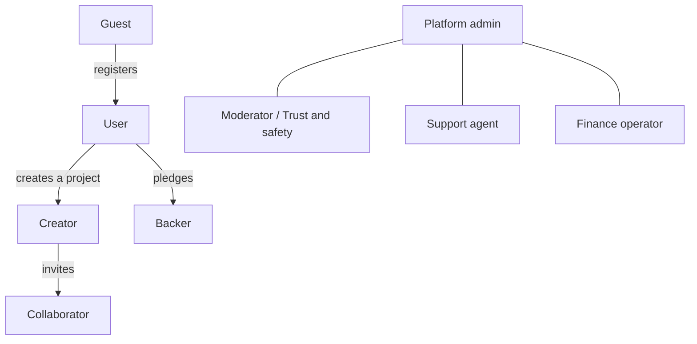
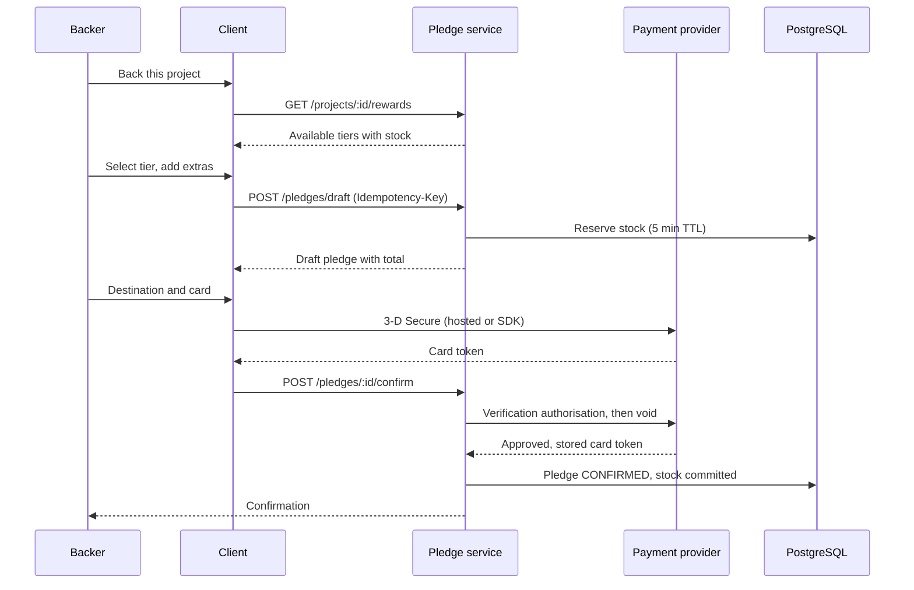
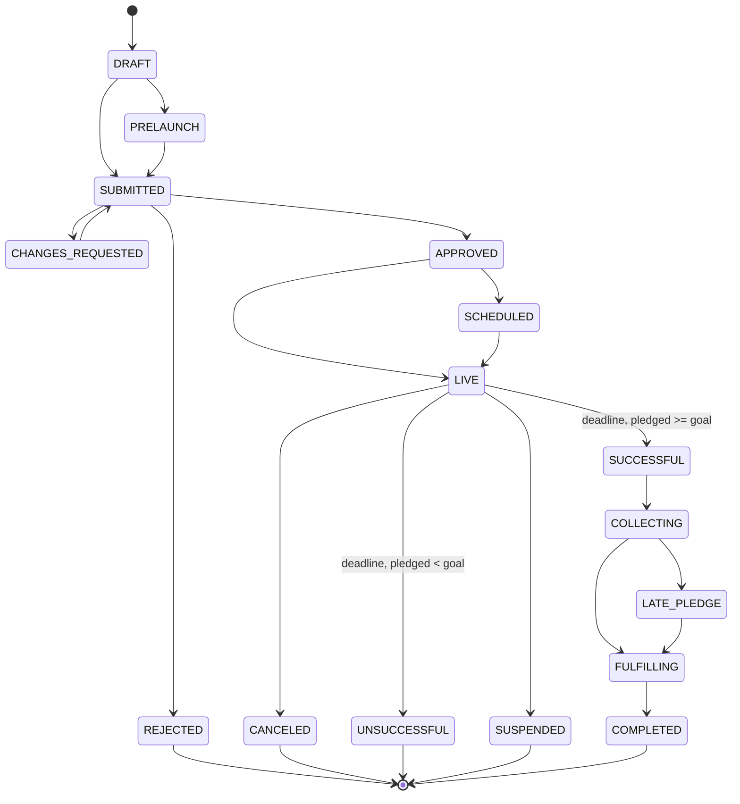
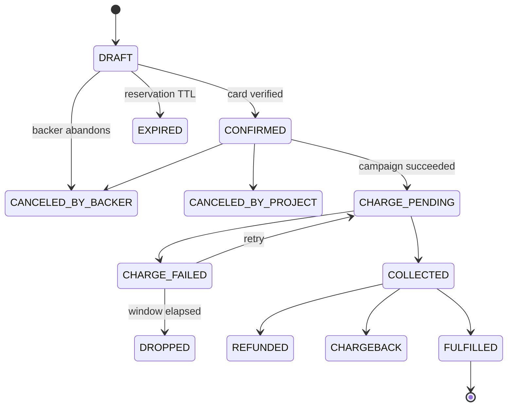
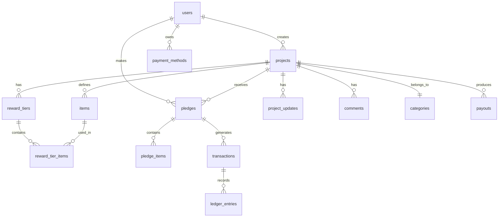
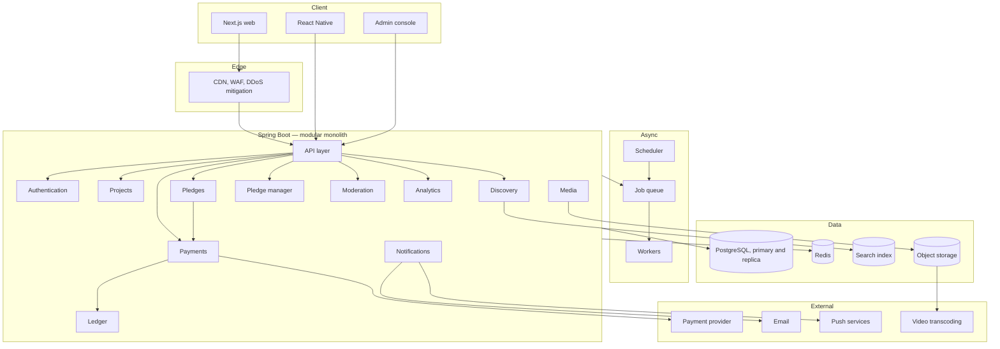
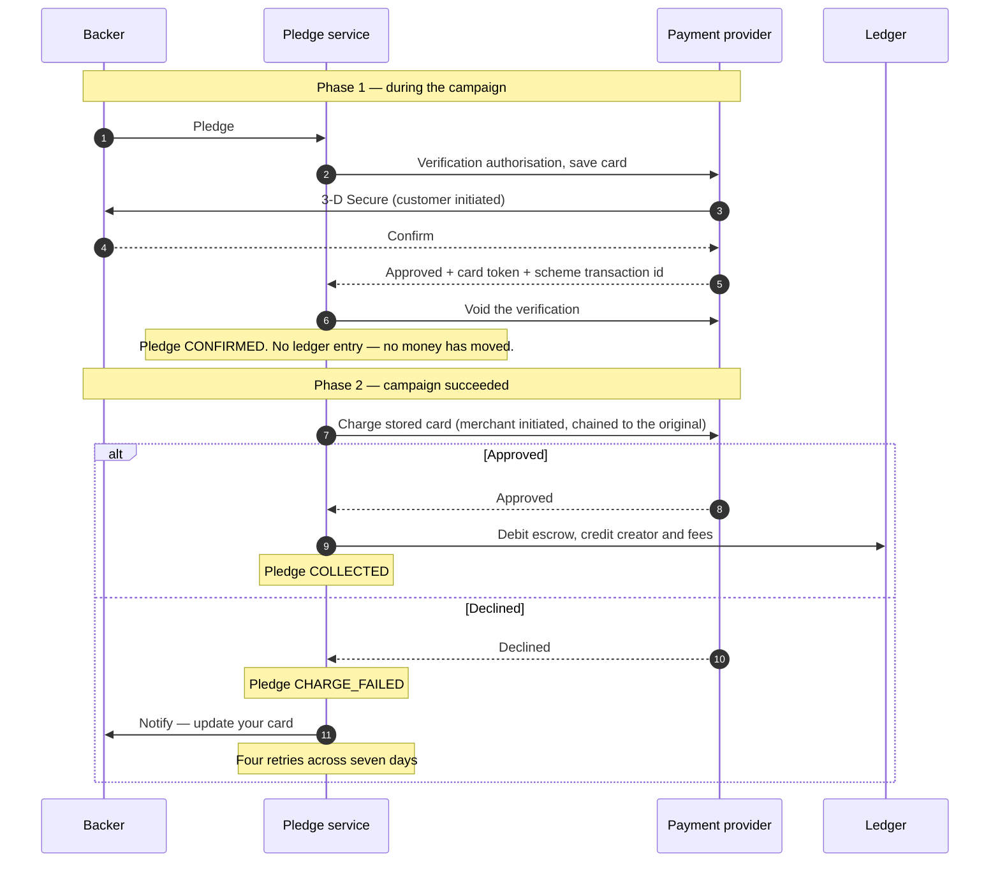
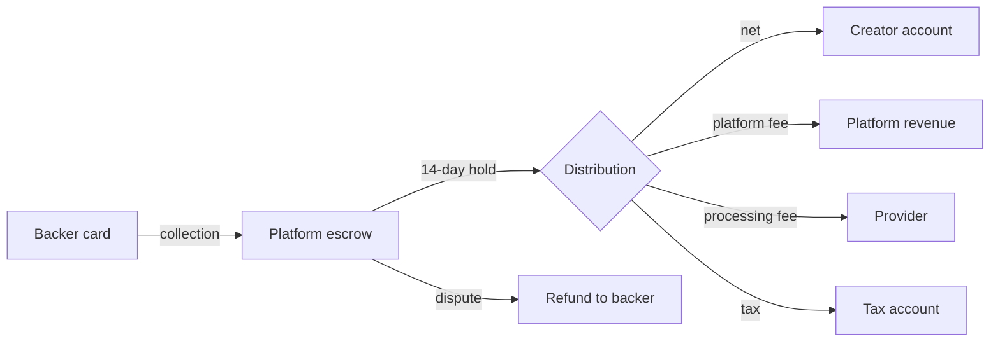
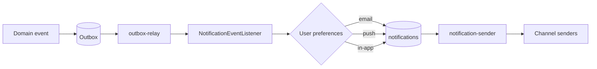

# IdeaNest — Platform Specification

**Reward-based crowdfunding. Web, mobile, and backend.**

| | |
|---|---|
| **Version** | 2.0 |
| **Status** | Draft — under review |
| **Scope** | Web (Next.js), mobile (React Native), backend (Java 21 / Spring Boot) |

---

## Contents

1. [Overview and product strategy](#1-overview-and-product-strategy)
2. [Glossary](#2-glossary)
3. [Actors and roles](#3-actors-and-roles)
4. [Functional inventory](#4-functional-inventory)
5. [Business rules](#5-business-rules)
6. [Domain model and state machines](#6-domain-model-and-state-machines)
7. [Database schema](#7-database-schema)
8. [System architecture](#8-system-architecture)
9. [Payments](#9-payments)
10. [API design](#10-api-design)
11. [Discovery and search](#11-discovery-and-search)
12. [Real-time and notifications](#12-real-time-and-notifications)
13. [Media pipeline](#13-media-pipeline)
14. [Technology stack](#14-technology-stack)
15. [Dependencies](#15-dependencies)
16. [Repository layout](#16-repository-layout)
17. [Security](#17-security)
18. [Observability](#18-observability)
19. [Infrastructure and delivery](#19-infrastructure-and-delivery)
20. [Testing strategy](#20-testing-strategy)
21. [Localisation and currency](#21-localisation-and-currency)
22. [Legal and compliance](#22-legal-and-compliance)
23. [Roadmap](#23-roadmap)
24. [Risks and open questions](#24-risks-and-open-questions)

---

## 1. Overview and product strategy

### 1.1 What we are building

A **reward-based crowdfunding platform**. Creators publish projects; backers
pledge money and receive a physical or digital reward in return. The platform
operates an **all-or-nothing** funding model: if a project does not reach its
goal by the deadline, nobody is charged.

> **This is not investment.** A backer receives no equity, no share, and no
> interest — only a product or an experience. That distinction is decisive under
> the applicable regulation (see [§22](#22-legal-and-compliance)).

### 1.2 What makes this category work

Four pillars, observed across established platforms in this category:

| Pillar | Description |
|---|---|
| **All-or-nothing funding** | A risk-reduction mechanism. The backer pays only if the project succeeds; the creator is never left with a partial budget that cannot deliver. |
| **A discovery engine** | Fifteen categories, roughly a hundred subcategories, a tag vocabulary, editorial curation, geographic filtering, and seven sort orders. A large share of traffic originates inside the platform, not from search. |
| **A story-led campaign page** | Video, rich narrative, reward tiers, a mandatory risks section, FAQ, updates, and comments. This is not a product page; it is an instrument of persuasion. |
| **Post-campaign fulfilment** | Surveys, add-on sales, late pledges, shipping calculation, tax collection, and backer reporting. The work does not end when funding closes. |

### 1.3 Product principles

1. **Trust outranks everything.** Money leaves people's accounts and they wait
   months. Transparency, moderation, and accountability are first-class
   features, not additions.
2. **Creator success is platform success.** Creator tooling — analytics,
   attribution, backer management — must be as deep as the backer experience.
3. **Mobile is not secondary.** Most traffic in this category is mobile. The
   application must fully support browsing, pledging, updates, and
   notifications.
4. **Every movement of money must be auditable.** An immutable ledger, always.
   No balance is ever *computed* — it is read from the ledger.

---

## 2. Glossary

| Term | Definition |
|---|---|
| **Project / Campaign** | A creative undertaking seeking funding |
| **Creator** | The person or organisation running a project |
| **Backer** | A user who pledges money to a project |
| **Pledge** | A financial commitment, not charged immediately |
| **Reward tier** | A package promised in exchange for a pledge amount |
| **Add-on** | An extra item purchasable alongside a reward |
| **Item** | The atomic physical or digital unit rewards are composed from |
| **Goal** | The minimum amount required for success |
| **Stretch goal** | A bonus target announced beyond the goal |
| **All-or-nothing** | No money moves unless the goal is met |
| **Funding period** | The window a campaign is open, 1–60 days |
| **Late pledge** | A pledge accepted after the deadline |
| **Pledge manager** | Post-campaign tooling for surveys, add-ons, and shipping |
| **Fulfilment** | Manufacturing and delivering rewards |
| **Collaborator** | A team member granted scoped access to a project |
| **Referrer** | The source a pledge is attributed to |
| **Escrow** | Where funds sit between collection and payout |
| **Payout** | The net amount transferred to the creator |
| **Chargeback** | A cardholder dispute raised through their bank |

---

## 3. Actors and roles



### 3.1 Permission matrix

| Action | Guest | User | Backer | Creator | Collaborator | Moderator | Admin | Finance |
|---|:-:|:-:|:-:|:-:|:-:|:-:|:-:|:-:|
| View projects | ✅ | ✅ | ✅ | ✅ | ✅ | ✅ | ✅ | ✅ |
| Search and filter | ✅ | ✅ | ✅ | ✅ | ✅ | ✅ | ✅ | ✅ |
| Save a project | ❌ | ✅ | ✅ | ✅ | ✅ | ✅ | ✅ | ✅ |
| Pledge | ❌ | ✅ | ✅ | ✅ | ✅ | ✅ | ✅ | ❌ |
| Comment | ❌ | ❌ | ✅¹ | ✅ | ✅ | ✅ | ✅ | ❌ |
| Create a project | ❌ | ✅ | ✅ | ✅ | ❌ | ❌ | ✅ | ❌ |
| Edit a project | ❌ | ❌ | ❌ | ✅ | ✅² | ❌ | ✅ | ❌ |
| Publish an update | ❌ | ❌ | ❌ | ✅ | ✅² | ❌ | ✅ | ❌ |
| View the backer report | ❌ | ❌ | ❌ | ✅ | ✅² | ❌ | ✅ | ✅ |
| Initiate a payout | ❌ | ❌ | ❌ | ❌ | ❌ | ❌ | ❌ | ✅ |
| Suspend a project | ❌ | ❌ | ❌ | ❌ | ❌ | ✅ | ✅ | ❌ |
| Apply an editorial badge | ❌ | ❌ | ❌ | ❌ | ❌ | ✅ | ✅ | ❌ |
| Ban a user | ❌ | ❌ | ❌ | ❌ | ❌ | ✅ | ✅ | ❌ |
| Issue a refund | ❌ | ❌ | ❌ | ❌ | ❌ | ❌ | ✅ | ✅ |

¹ Only backers of that project and its creator may comment. **As shipped in #84
this is enforced by half**: a signed-in account and a campaign it may see, but
not "has an active pledge here", which no module publishes an answer to. §4.9
has the argument for why that fails open rather than closed, and what closes it.
² Subject to the granular grants the creator issued.

---

## 4. Functional inventory

Marked `[W]` web, `[M]` mobile, `[A]` admin.

### 4.1 Authentication and account

| # | Capability | Platform | Note |
|---|---|---|---|
| A-01 | Email and password registration | W, M | Verification required |
| A-02 | Email verification link or code | W, M | 24-hour token |
| A-03 | Sign in | W, M | Rate limited: 5 attempts / 15 min |
| A-04 | Google sign-in | W, M | Client obtains an ID token; the server verifies it against Google's JWKS |
| A-05 | Apple sign-in | W, M | Required by the iOS store once social sign-in exists. Same path, Apple's issuer and keys |
| A-06 | Password reset | W, M | Single-use token, 1 hour |
| A-07 | Two-factor via authenticator app | W, M | Mandatory for payout actions |
| A-08 | Two-factor via SMS | W, M | Fallback |
| A-09 | Active session management | W, M | Device list, remote revocation |
| A-10 | Account deletion | W, M | 30-day delay, then anonymisation |
| A-11 | Personal data export | W | Machine-readable archive |
| A-12 | Email change | W, M | Confirmation to both addresses |
| A-13 | Password change | W, M | Requires the current password |
| A-14 | Biometric unlock | M | Refresh token in secure device storage |

### 4.2 Profile

| # | Capability | Platform |
|---|---|---|
| P-01 | Avatar upload and crop | W, M |
| P-02 | Name, bio, location, website | W, M |
| P-03 | Social links | W, M |
| P-04 | Backed projects archive (no amounts) | W, M |
| P-05 | Created projects | W, M |
| P-06 | About tab | W, M |
| P-07 | Profile visibility | W, M |
| P-08 | Blocked users | W |
| P-09 | Notification preferences | W, M |
| P-10 | Language and currency | W, M |

### 4.3 Discovery and search `[W] [M]`

**Categories (15).** Art, Comics, Crafts, Dance, Design, Fashion, Film & Video,
Food, Games, Journalism, Music, Photography, Publishing, Technology, Theatre.

Each carries between four and nineteen subcategories — roughly a hundred in
total. The taxonomy is data, not code: it must be editable without a deployment,
and each entry needs a translation per supported locale.

**Filters**

| Filter | Values |
|---|---|
| Status | Upcoming, live, late pledge, successful, unsuccessful |
| Category | 15 primary plus subcategories, each with a live count |
| Location | Country, city, or proximity |
| Goal amount | Bands plus a custom range |
| Amount raised | Bands plus a custom range |
| Completion | Under 25%, 25–50%, 50–75%, 75–100%, over 100% |
| Show only | Recommended, editorially featured, saved |
| Tags | Free vocabulary |
| Programmes | Themed open calls |

**Sort orders**

| Sort | Logic |
|---|---|
| Relevance | Composite of §11.2's weighted terms. Live today: text match, completion, curation, recency. Momentum and personalisation are inert — see §11.2 |
| Popularity | Pledge velocity with time decay |
| Newest | `launched_at DESC` |
| Ending soon | `deadline ASC` |
| Most funded | `pledged_amount DESC` |
| Most backed | `backers_count DESC` |
| Near me | Geographic distance |

> **Decisions this table leaves open, resolved by `GET /v1/discover` (#42).** They
> live in `az.ideanest.discovery.domain` — `DiscoveryStatus`, `CompletionBand`,
> `AmountBand`, `DiscoverySort` — with the reasoning beside each.
>
> **Status is a grouping, not a state.** The five words above are discovery-facing
> names for sets of the sixteen states in §6.1: *upcoming* is `PRELAUNCH`; *live* is
> `LIVE`; *late pledge* is `LATE_PLEDGE`; *successful* is `SUCCESSFUL`,
> `COLLECTING`, `LATE_PLEDGE`, `FULFILLING`, and `COMPLETED` together, because
> reaching the goal is one event and everything after it is fulfilment; and
> *unsuccessful* is `UNSUCCESSFUL` alone. `CANCELED` is publicly visible and belongs
> to no grouping — the creator withdrew it, which is not a claim about whether it
> found backers. **`DRAFT`, `SUBMITTED`, `CHANGES_REQUESTED`, `REJECTED`,
> `APPROVED`, `SCHEDULED`, and `SUSPENDED` are never returned by discovery, under
> any filter or sort.**
>
> **Bands are closed below and open above** — `[lower, upper)` — so that the five
> partition the line rather than overlapping at four boundaries. A campaign at
> exactly its goal is "over 100%": the question is "did it make it", and it did. The
> money bands are `<1000`, `1000–5000`, `5000–20000`, `20000–50000`, `>50000` in the
> campaign currency, and a custom range alongside them is inclusive at both ends.
>
> **Multiple values within one dimension are OR'd, except tags, which are AND'd.** A
> campaign has one state, one category, and one band, so AND there returns nothing;
> it has several tags, and ticking a second tag is a refinement like every other
> control on the panel.
>
> **The default sort is newest.** It is the only order that is meaningful with no
> filter: ending-soon opens an unfiltered feed on whatever finished longest ago, and
> the two amount orders open on the same handful of campaigns for everybody for
> ever.
>
> **Relevance is served (#44) and so is near-me (#47).** What is still refused is
> an RFC 9457 problem detail naming the issue rather than a quiet fall back to a
> different order: *saved* (no saved-projects table exists) and *recommended*
> (D-07; see below). Nothing in the sort column above is refused any more.
>
> **Location is one dimension with three controls (#47).** `country` is ISO
> 3166-1 alpha-2; `city` is a `locations.slug`, folded by §11.3 so `Bakı`,
> `BAKI` and `baki` are one filter — and the localised exonym deliberately is
> not, because a slug is a handle from an open vocabulary exactly as `category`
> and `programme` are, and the facet panel is where a client gets it. `near=lat,lon`
> with an optional `radiusKm` is the third. All three count as **one** facet
> dimension, so the country counts are computed with the city filter and the
> radius excluded too — the same rule that makes category and subcategory one
> dimension.
>
> **The origin comes from the request and never from a profile, and it is
> quantised to two decimal places — about a kilometre — before it reaches a query,
> a cursor, a log, or an ETag.** Three reasons that agree. It is already finer
> than the data: a campaign is located at a city centroid. Precise coordinates in
> a query string end up in access logs, `Referer` headers and shared caches, and
> §17.4's position is that data the platform does not need is data it does not
> keep. And `/v1/discover` is public and cached for a minute; a key that varied at
> ten centimetres would never be hit twice, whereas at a kilometre everybody in a
> neighbourhood shares one entry. A profile-supplied origin was rejected for the
> reason `showOnly=recommended` is: the endpoint is unauthenticated *because* that
> is what makes §20's thousand requests a second reachable.
>
> **A radius is bounded at 500 km and refused above it**, not clamped — Azerbaijan
> is about 500 km across, so a larger circle contains every campaign on the
> platform and is "everywhere" with arithmetic attached; and clamping would
> silently narrow somebody's search, which is the direction that hides results. The
> boundary is **inclusive**.
>
> **A campaign with no location sorts last under near-me and is excluded by a
> radius.** Near-me is a sort and proximity is a filter, and the two answer
> differently on purpose: a sort that dropped rows would take a reader who changed
> order and silently remove most of the platform from their feed, while a campaign
> whose location is unknown genuinely cannot be shown to be within fifty kilometres
> of anywhere. Nulls last, like `newest` and `ending_soon`, with the same null-tail
> branch in the cursor.
>
> **`sort=near_me` with no origin is refused, not resolved to another order** —
> unlike `sort=best_match` with no `q`, which falls back to `newest` because a text
> score over no text is zero for every campaign. A distance from no origin is
> undefined rather than zero.
>
> **Relevance is opt-in, not a default.** An unstated sort still resolves to
> *newest* while browsing and *best match* while searching. Making the composite
> the default would change what every existing shared link means and would make the
> web client's sort control show an order that is not the one in force; it stays
> `?sort=relevance` until it has been measured against the two defaults, which is
> what §11.2's tunable weights and its per-campaign diagnostic exist for. Three of
> §11.2's eight terms are live and five are inert; §11.2 says which and why.
>
> **Editorially featured and Programmes are served (#48).** `showOnly=featured` and
> `?programme={slug}` compose with every filter, every sort, and the cursor, and both
> appear in the facet panel under the same exclude-own-dimension rule as everything
> else. *Featured* is **derived, not a flag**: a campaign is featured exactly when it
> is a member of a published, in-window collection whose `grants_badge` is set, which
> is what the `project_editorial_badges` view says and the only place it is said.
> `projects.is_featured` is still deliberately absent — V6 refused it because
> "curation is an editorial workflow, not a boolean somebody sets by hand", and a
> per-project badge flag would be that boolean with a timestamp on it. *Programmes*
> narrows to one open call, and only to collections of kind `OPEN_CALL` that are
> published and inside their window, so a slug that leaked from an admin screen is not
> a way to read an unpublished list.
>
> **Show-only is one filter with three values and two of them are still refused**, on
> purpose. *Recommended* is personalisation (§11.2's `w6`, D-07), and it survived #44:
> the composite ranks campaigns and does not know who is reading, because
> `/v1/discover` is unauthenticated and publicly cached — which is what makes §20's
> thousand requests a second reachable. So `w6` is inert and this filter is still
> refused, now naming D-07 rather than #44. Answering it out of the composite would
> tell every reader that a feed computed identically for all of them had been
> assembled for them personally; answering it with the platform's staff picks would
> present an editorial decision as a personal one.
>
> **Free text is served (#43).** `?q=` composes with every filter, every sort, the
> cursor, and the facet counts on both `/v1/discover` and `/v1/search`. It narrows
> the set the facets are counted over rather than being a facet dimension of its
> own — there is no filter control for the search box, and counts that ignored what
> was typed would describe a different result set from the one on screen.
>
> **D-02's suggestions are `GET /v1/search/suggest`.** Campaign titles, categories,
> subcategories and tags, each row saying which of the four it is so the client
> knows where it leads; drawn round robin so no one source fills the list; bounded
> at ten by default and twenty at most; and empty — not everything — for a blank or
> one-character fragment.
>
> **There is an eighth sort, `best_match`,** and it is not relevance. It is
> `ts_rank` over the search vector — a title match above a blurb match above a
> story match — and it is what an unstated sort resolves to when `?q=` is present,
> because ordering search results by launch date puts the campaign that mentions
> the word once in its ninth paragraph above the one named after it. §11.2's
> relevance is a composite of eight terms, none of which is about what the reader
> typed. **#44 landed and `best_match` did become its text term rather than being
> replaced by it** — the composite adds a ninth term which is this same `ts_rank`
> expression, so the two orders share one definition of a good text match and
> neither changed meaning. `sort=best_match` with no `q` has nothing to rank and
> still resolves back to newest.

**Additional**

| # | Capability |
|---|---|
| D-01 | Full-text search across title, summary, story, and creator |
| D-02 | Autocomplete and suggestions |
| D-03 | Misspelling tolerance |
| D-04 | Cursor-paginated infinite scroll |
| D-05 | Project card: image, title, creator, completion, days left, badge |
| D-06 | Similar projects |
| D-07 | Personalised feed |
| D-08 | Curated collections and open-call landing pages |
| D-09 | Trending tags |
| D-10 | Live faceted counts |
| D-11 | Search history (mobile) |
| D-12 | Shareable filter URLs |

### 4.4 Project page `[W] [M]`

**Header:** media player (poster-first, no autoplay), editorial badge,
subcategory and location links, amount raised, backer count, live countdown,
progress bar, primary call to action, reminder control, share, save, and an
explicit all-or-nothing statement with the deadline in the viewer's timezone.

**Trust block** — fixed copy on every project:

> The platform connects creators with backers. Rewards are not guaranteed, but
> creators must keep backers informed. You are only charged if the project
> reaches its goal by the deadline.

**Tabs**

| Tab | Contents |
|---|---|
| **Campaign** | Rich narrative with images, video, and embeds; auto-generated section navigation; a **mandatory risks and challenges section**; a reporting link |
| **Rewards** | Available and exhausted tiers separately. Each: price, backer count, shipping destinations, estimated delivery, remaining quantity, included items with quantities, images |
| **Creator** | Biography, history, previous projects, contact |
| **FAQ** | Creator-managed question and answer list |
| **Updates** | Numbered updates, public or backers-only, with comments |
| **Comments** | Chronological thread, creator replies highlighted |
| **Community** | Backer statistics: countries, new versus returning, cities |

> **Both backer counts on this page come from one place (#57).**
> `GET /v1/projects/{id}/backers/public` answers the header's backer count and the
> Rewards tab's count beside each tier in one body. The campaign's total is its own
> query rather than a sum of the tiers, because a sum of the tiers omits every
> pledge that took no reward — §4.5's PL-02 — and the omission is invisible on a
> campaign where nobody happens to have done that.
>
> The count is taken from `pledges`, not from `projects.backers_count`. That
> denormalised counter exists (V6) and discovery reads it, but nothing writes it
> yet, so today it is zero for every campaign. Whichever issue starts maintaining
> it owns reconciling the two.
>
> **This page names no backer, and that is a decision rather than a gap.** Every
> public surface here is an aggregate: a count in the header, a count per tier, and
> the Community tab's statistics. Whether a campaign should publish *who* backed it
> is **#209**, which is open and labelled `status: needs-decision`. §4.5 has what
> #57 built against the day it is answered.
>
> **The Community tab's statistics are not built, and #209 has to be settled
> first.** Countries and cities are aggregates, but a small aggregate is an
> identifier: "1 backer in Georgia" beside any list of names identifies that person,
> and it identifies them whether or not they asked to be anonymous. Publishing those
> counts needs a minimum cell size — suppress any bucket below *k* — and *k* is a
> product and legal question rather than an implementation detail.

### 4.5 Pledge flow `[W] [M]`



| # | Capability | Note |
|---|---|---|
| PL-01 | Reward tier selection | Live stock check |
| PL-02 | Pledge without a reward | Support only |
| PL-03 | Bonus support above the tier price | |
| PL-04 | Add-on selection with quantities | Campaign or pledge manager; a limited add-on holds stock like a tier |
| PL-05 | Shipping destination | Drives the shipping charge |
| PL-06 | Total calculation | Reward + add-ons + shipping + tax |
| PL-07 | Card entry or stored card | Card data never reaches our servers |
| PL-08 | 3-D Secure | Mandatory |
| PL-09 | Edit a pledge | Until the deadline |
| PL-10 | Cancel a pledge | Releases reserved stock |
| PL-11 | Replace the card | After a failed collection |
| PL-12 | Anonymous pledging | Hidden from public lists |
| PL-13 | Stock reservation | A DRAFT pledge, expiring five minutes after it is made |
| PL-14 | Idempotency | `Idempotency-Key` prevents duplicates |
| PL-15 | Secret rewards | Reachable only by a private URL |
| PL-16 | Late pledge | If the creator enables it |

> **PL-13 used to say "Redis TTL", and #51 changed it after building the
> feature**, exactly as #47 changed §7.3's PostGIS row. §7.2 had already
> described the other mechanism — "reservation increments `reserved_quantity`
> under a row lock and relies on this constraint refusing the transaction when it
> gets that wrong" — and V7 had built the constraint for it, so the two halves of
> this document disagreed and the database half won.
>
> The deciding argument is that **taking the place and recording who took it are
> one fact**. A Redis key and `reward_tiers.reserved_quantity` are two records of
> it in two systems with no transaction across them, and the process that writes
> one and then the other can die in between; whichever half survives is now lying,
> and nothing reconciles them. The constraint that refuses an oversold tier also
> lives in PostgreSQL, so a reservation held anywhere else is one it cannot see.
> Against that, Redis buys expiry without a sweep — and §8.4 already lists the
> sweep.
>
> The sequence diagram above is unchanged and still correct: "Reserve stock (5 min
> TTL)" is what happens, and the five minutes are configuration
> (`ideanest.pledge.reservation.ttl`). V17's header carries the whole argument and
> the reverse.

> **PL-13 covers PL-04's add-ons too, and for one release it did not (#203).** An
> add-on is a `reward_tiers` row with `is_addon` set, so a limited one has the same
> `limit_quantity` and the same constraint over the same two counters — but #52 quoted
> it without holding it, and nothing incremented anything, so two backers could each
> take the last one and the database could not refuse either. What a pledge reserves
> is now every tier it names: one place on its reward, and PL-04's quantity on each
> add-on, taken and released together. All of a quantity or none of it, so a backer
> asking for three of something with two left is refused rather than sold two —
> §10.4's `REWARD_SOLD_OUT`, naming the add-on and offering the campaign's other
> add-ons rather than its reward tiers, which are not a substitute for one.
>
> The five minutes are unchanged and are the draft's, not the line's: an abandoned
> checkout gives back its reward's place and its add-ons' quantities in the same sweep
> and the same transaction. See §7.2's `pledge_addons`.

> **PL-14 is built (#52), and it is more than a unique column.** §10.3 has the four
> answers a key can produce and §7.2 has the table; the part worth stating beside
> the capability is that a replay returns *the original response* rather than a
> fresh one, so the guarantee covers the mutations that create no row to find — the
> cancellation of PL-10 in particular, where a retry has to answer 204 and there is
> no pledge left in an active state to carry a key.
>
> The diagram's `POST /pledges/:id/confirm` is also built, minus one step: the
> provider call beside it is #55, blocked on #60, and §9.2 carries what that means
> and why the transition is correct without it.

> **PL-09 and PL-10 are built (#56), and "until the deadline" turned out to be two
> rules rather than one.** A backer may change or withdraw a pledge when **both**
> of these hold, and the pair is composed in exactly one place —
> `PledgeService.requireEditable`:
>
> 1. **The pledge is `DRAFT` or `CONFIRMED`** (`PledgeState.EDITABLE`). A draft is
>    a checkout in progress; a confirmed pledge is PL-09's real case, a backer who
>    committed and has since changed their mind. `EXPIRED` and the two cancelled
>    states are over, and a pledge that ended cannot be edited back into existence
>    — the backer's move is to pledge again, which §7.2's partial index permits
>    precisely because those states are not active. `CHARGE_PENDING` onwards are
>    past the campaign's close, where money is moving or has moved: changing an
>    amount there is a refund or a second charge, not an edit.
> 2. **The campaign is still accepting pledges** — launched, `LIVE`, and before its
>    deadline. This is not a second rule that could drift from the checkout's; it
>    is `PledgeAcceptance`, the same call `POST /v1/pledges/draft` makes, so a
>    campaign that will not take a new pledge will not take a change to an old one
>    either. A closed campaign is therefore answered `PROJECT_NOT_LIVE` rather than
>    `PLEDGE_NOT_EDITABLE`, with the deadline in `meta`; `PLEDGE_NOT_EDITABLE` is
>    left to mean the thing only it can mean, which is that the pledge itself has
>    moved on.
>
> **An edit does not extend a draft's reservation.** `reservation_expires_at` is
> left exactly where it was, and PL-13's five minutes therefore run from when the
> draft was *made* and not from when it was last touched. The alternative is worse
> in a way that is hard to see: a backer who could restart the clock by editing
> would be able to hold a limited tier's last place indefinitely by changing their
> mind every four minutes, and it would look like an ordinary checkout rather than
> like abuse. The cost is real and falls the right way — a backer who spends their
> window deciding gets what is left of it, and if it runs out the sweep releases
> the place and they start again, which is what the window is for. Clearing the
> column is not representable in any case: `pledges_drafts_are_time_bounded`
> refuses a draft without one.
>
> **Cancellation refunds nothing, because nothing was collected** (§9.7). There is
> no refund path on `DELETE /v1/pledges/{id}` and there should not be one; the
> refund of a pledge that really was collected is #67's. What cancellation does
> move is stock, and *which* stock depends on the pledge: a `DRAFT` gives back a
> **reserved** place and a `CONFIRMED` pledge gives back a **claimed** one. They
> are separate statements against separate columns, because releasing the wrong one
> leaves the tier counting a place nobody holds while it is short of one somebody
> does — and the sum, which is what the limit is checked against, still looks
> correct.
>
> **Add-ons move the same two columns (#203), and an edit moves the difference.**
> Cancelling gives back every place the pledge held — the reward's and each add-on's
> quantity — from whichever column was counting them. An edit takes what the new
> selection needs more of and releases what it needs less of: two mugs held and three
> wanted takes one more, two held and one wanted gives one back, and an edit that
> changes only a destination or a name writes to `reward_tiers` not at all.
>
> **Everything is taken before anything is given back**, across every line at once and
> not merely for the reward. That is the same rule as switching tiers and for the same
> reason: an edit that is refused — because the add-on the backer wanted more of has
> run out — must leave them holding exactly what they had, and the other order would
> briefly leave them holding nothing.

> **PL-12 is built (#57), and what it needed was not a column.** `is_anonymous` was
> already stored and already accepted from `POST /v1/pledges/draft` (#52). What was
> missing was the guarantee.
>
> **Anonymity hides who, never how many.** An anonymous backer is counted in the
> campaign's backer count and in the per-tier counts of §4.4, exactly like anybody
> else. A count that excluded the people who asked not to be named would understate
> the campaign to everybody, including the creator reading their own page, and would
> turn a privacy preference into a funding penalty. That is the half of PL-12 the
> platform serves today, at `GET /v1/projects/{id}/backers/public`.
>
> **The ledger is untouched.** `pledges.backer_id` is retained on an anonymous
> pledge exactly as on any other, because §7.2 and §17.4 both require "pledge #123
> was made by user X" to stay true. Anonymity is a decision about rendering on the
> way out, never a redaction of the row, and it does not reach the creator: they
> have to ship the reward to somebody, and their list is `GET
> /v1/projects/{id}/backers` under Dashboard.
>
> **The other half has nothing to hide from yet, and the scope is stated rather than
> implied.** There is no public per-backer list on this platform. §4.4's public
> surfaces are all aggregates, the creator's list is #97, and the pledge manager is
> epic #72 — so "hidden from public lists" was, and remains, a guarantee about a
> surface that does not exist. Whether it should exist is **#209**
> (`status: needs-decision`): §4.4 never asks for one, and `CLAUDE.md` §5 is explicit
> that an endpoint is not the place to answer a question like that by default.
>
> What #57 built for that day is `PublicBacker`, a sealed pair of `Named` and
> `Anonymous` in which the anonymous variant has no field an identity could be read
> out of — not the name, and not the account identifier either, which is the join key
> to §4.2's profile and would resolve back to the name. A rule spelled
> `if (!pledge.isAnonymous())` at each call site is a rule that survives until the
> second call site; a shape with nowhere to put a name does not need remembering.
> **It has no consumer today**, deliberately and with the argument written on the
> type: whoever implements #209 is writing a query, a response, and a controller, and
> the anonymity rule would be one line of their diff — the line that is easy to get
> subtly wrong. If #209 comes back "no public list", the type and its tests are
> deleted in one commit.
>
> Note that #97's creator backer list is **not** a future consumer of it. The creator
> sees every backer by name, anonymous ones included, because they have to ship — a
> different projection with the opposite rule.
>
> One more thing #57 did not do: it did not make `is_anonymous` patchable after the
> draft. That is PL-09's edit endpoint and belongs to #56.

### 4.6 Campaign editor `[W]`

**Basics** — title (≤60 characters), summary (≤135), category and subcategory,
location with geocoding, cover image (min 1024×576), video, goal and currency,
duration (1–60 days), scheduled launch, late-pledge toggle, pre-launch page.

**Rewards** — atomic **items** first, then **tiers** composed from them:
title, description, price, included items with quantities, images, estimated
delivery, quantity limit, shipping scope, per-country rates, early-bird windows,
featured and secret flags, reordering, duplication. **Add-ons** are items
sold alongside a tier.

> **Two notes on how the editor delivers this** (#34).
>
> **Reordering is a pair of move controls per tier, not dragging.** Dragging is
> unreachable by keyboard, by switch control, and on every touch device, and an
> accessibility failure is a build error rather than a nicety (CLAUDE.md §2).
> Each control names the tier it moves and the move is announced with its new
> position. Pointer dragging remains a layer that can be added on top of that;
> it is not a substitute for it.
>
> **A tier's images are its items' images.** `reward_tiers` has no image column
> and neither does its response — §7.2 puts `image_url` on `items` — so the
> pictures a backer sees for a tier are the pictures of what is in it. Both
> become references into the media pipeline (§13) when there is one.

**Story** — rich text editor (headings, emphasis, lists, quotes, rules), inline
media, third-party embeds, section headings that generate anchor navigation, a
**mandatory risks and challenges** field, FAQ editor, autosave and version
history.

**People** — creator profile, collaborator invitations with granular grants,
team display.

**Account** — identity verification, individual or legal entity, tax
identification, bank account for payout, address verification.

**Promotion** — custom referrer links, share templates, pre-launch link.

**Review and launch** — automated completeness checklist, submission,
moderation outcome, launch (scheduled or immediate).

### 4.7 Creator dashboard `[W]` `[M read-only]`

| # | Capability |
|---|---|
| CD-01 | Live totals: raised, backers, completion, time remaining |
| CD-02 | Pledge trend over time |
| CD-03 | **Referrer attribution** — top sources with pledge count, value, and share. Built (#94, §7.2). The rule is **last non-direct touch inside a thirty-day window**: a visit carrying a source is recorded against an opaque visitor token, and a confirmed pledge belongs to the most recent such visit that was not direct, ignoring any past its window and any recorded after the pledge. A pledge with none is reported as `DIRECT` rather than left out, so a share is a share of the campaign and not of the part that could be explained. Nothing in the report names a backer: `referral_attributions` has nowhere to put one |
| CD-04 | Device split per source |
| CD-05 | Visitor-to-backer conversion |
| CD-06 | Video engagement |
| CD-07 | Sales per reward tier |
| CD-08 | Geographic distribution |
| CD-09 | New versus returning backers |
| CD-10 | Backer report with filtering and segmentation |
| CD-11 | Export in fulfilment-partner formats |
| CD-12 | Publish updates, public or backers-only, scheduled |
| CD-13 | Bulk message a segment |
| CD-14 | Comment moderation |
| CD-15 | FAQ management |
| CD-16 | Financial summary: gross, fees, tax, net |
| CD-17 | Collection status and failed-payment tracking |
| CD-18 | Stretch goal announcements |
| CD-19 | Automated and manual reminders to backers with failed payments |

### 4.8 Pledge manager `[W] [M]`

The most valuable and most complex module. It begins when funding closes.

| # | Capability | Actor |
|---|---|---|
| PM-01 | Survey builder with dynamic questions | Creator |
| PM-02 | Questions conditional on reward tier | Creator |
| PM-03 | Question types: text, choice, multi-choice, address, date | Creator |
| PM-04 | Send surveys to backers | Creator |
| PM-05 | Complete a survey | Backer |
| PM-06 | Edit responses until a cut-off | Backer |
| PM-07 | Address collection and validation | Backer |
| PM-08 | Lock addresses | Creator |
| PM-09 | Upgrade a reward tier | Backer |
| PM-10 | Post-campaign add-on store | Backer |
| PM-11 | Shipping calculated after the campaign | Creator |
| PM-12 | Weight-based or flat rates | Creator |
| PM-13 | Rates varying by region, item, or tier | Creator |
| PM-14 | Tax calculation and collection | System |
| PM-15 | Customs and duty handling | Creator |
| PM-16 | Charge the additional amount | System |
| PM-17 | **Backer report** with segmentation and export | Creator |
| PM-18 | Bulk address editing | Creator |
| PM-19 | Digital reward distribution | Creator |
| PM-20 | Tracking number import | Creator |
| PM-21 | Tracking visible to the backer | Backer |
| PM-22 | Fulfilment status | Both |
| PM-23 | Late pledges | Backer |
| PM-24 | Reminders to non-responders | System |

### 4.9 Community `[W] [M]`

| # | Capability |
|---|---|
| C-01 | Project comments |
| C-02 | Creator replies visually distinguished |
| C-03 | Threaded replies |
| C-04 | Comment reactions |
| C-05 | Comments on updates |
| C-06 | Report a project |
| C-07 | Report a comment |
| C-08 | Block a user |
| C-09 | Save a project |
| C-10 | Follow a creator |
| C-11 | Launch reminders |
| C-12 | Direct messages between creator and backer |
| C-13 | Sharing, native sheet on mobile |
| C-14 | Deep links opening the mobile app |

> **Project updates (#83) and comments (#84) are built; the rest of this section
> is not.** §4.4's Updates tab and §4.7's CD-12 — numbered updates, public or
> backers-only, with scheduling — behind §10.2's two endpoints; and C-01, C-02,
> C-03 and CD-14 behind the community module's four comment endpoints, with
> C-07 behind the moderation module's fifth. C-04 reactions,
> C-05 comments *on* an update, C-08 blocking, C-09 saving, C-10 following, C-11
> reminders, C-12 direct messages and C-13/C-14 sharing are not built.
>
> **A comment thread is two levels deep, and the bound is structural.** A reply
> answers a root; a reply to a reply is a 422 naming the bound. Not a preference:
> an unbounded tree is a read whose cost depends on how deep the argument went,
> paged by something no keyset can express, and a page that has to be assembled
> in memory before any of it can be sent. The rule is stated three times, on
> purpose — `Comment.replyTo` refuses it, V25's
> `comments_reply_hangs_below_its_parent` refuses it under a support script too,
> and every row carries `acceptsReplies` so a client places the reply control
> rather than discovering the rule by being refused.
>
> **The creator highlight is computed at write time, from what the server
> knows.** C-02 asks for the campaign's own replies to be distinguished, so
> `by_creator` is settled once, by `ProjectAccess`, at the moment the comment is
> written — never accepted from the request body, where it would be a claim of
> authority made by the side making the claim, and never derived on read, where
> a year-old comment would silently lose its highlight the day its author left
> the team.
>
> **Deleting a comment is a tombstone, not a removal.** The row stays, its body
> stays, and the read serves neither: `body: null`, `authorId: null`,
> `deleted: true`. Three separate reasons, each sufficient — replies must not be
> orphaned when their root is removed, a moderator holding a report about the
> comment has to be able to read what it said, and "removed" printed beside a
> name is an accusation published to everybody on the campaign page. Author,
> campaign team (CD-14) and staff (AD-09) may all remove; the removal is audited
> unless the author is withdrawing their own, which is not a privileged action.
> It is idempotent, so a retry cannot rewrite who removed it.
>
> **Who may comment is enforced by half, and the missing half is named.** §3.1
> says "backers of that project and its creator". Enforced: a signed-in account
> outside §17.4's deletion grace period, and a campaign in one of §6.1's public
> states. Not enforced: "has an active pledge on this campaign", which is a
> statement about `pledges` that the pledge module's application layer does not
> publish — `PublicBackers` counts backers and exposes none of them (#209).
> **This fails open where `ProjectUpdateService` fails closed, deliberately.** A
> backers-only update shown to the public cannot be taken back; a comment box
> open to a signed-in non-backer costs spam, which is rate limited, reportable,
> and removable by the campaign's team. Closing it is one method on the pledge
> module's application layer and one line in `CommentService`.
>
> **§17.3 names no number for commenting, so the budget is argued rather than
> quoted.** The table names a CAPTCHA for "bot traffic: challenge on
> registration and comment", and this platform has none — so the limiter is the
> whole of the defence on a public write surface. Ten comments per account and a
> hundred per source address per five minutes, the second much looser because
> registration is already limited per address and a tight number here refuses
> the office NAT a real backer sits behind. **One budget across posting and
> replying**, or a flood simply moves one level down; **and none spent by
> deleting**, or a creator clearing a flood is stopped part way through by the
> control that exists to stop it.
>
> **There is no edit endpoint.** §10.2 gives a comment none. Withdrawing is the
> delete, and a comment nobody can quietly rewrite is what makes a screenshot of
> a thread worth anything.
>
> **Scheduling is a timestamp, not a state machine and not a job.**
> `project_updates.published_at` in the future is the whole of it: the public read
> filters on `published_at <= now()`, so an update becomes visible at the instant
> it was scheduled for, with no sweep in between and therefore no window in which a
> scheduled update is late because a job did not fire. That is why §8.4 gains no
> row here. What a timestamp cannot do is *send* anything at that moment: §4.10's
> "new update published" needs the notification service (#85), and until it exists
> a scheduled update appears on the page and nobody is told.
>
> **The number is stored, not derived.** "Update 7 said the moulds were late" is a
> thing a person says to support six months later, so the number is allocated once
> — `max + 1` per campaign, behind a lock on the newest row — and never recomputed.
> A `row_number()` at read time would renumber every earlier update the first time
> one was withdrawn. It also fixes the order: because the page is ordered by a
> number allocated on insert, an update may not be scheduled *before* the one that
> precedes it, or update 6 would appear a week after update 7.
>
> **`BACKERS_ONLY` is stored and enforced, and not yet against backers.** The
> column, the write path and the public filter are all real; what is missing is the
> question "has this account an active pledge on this campaign", which is a
> statement about `pledges` that the pledge module's application layer does not
> publish — `PublicBackers` counts backers and deliberately exposes none of them
> (#209). Rather than reach into another module's tables, the read fails closed: a
> backers-only update is withheld from everybody outside the campaign's team. That
> is a promise kept too tightly, rather than the other failure, which cannot be
> taken back. Closing it is one method on the pledge module's application layer and
> one line in `ProjectUpdateService`.
>
> **Publishing is authorised as `PUBLISH_UPDATES` (#236).** It used to be the
> coarse "may this account edit this campaign at all", because the deciding enum
> lives in the project module's `domain` package and the community module could
> not name it — so a collaborator invited to price reward tiers could make an
> announcement in the campaign's name to everybody following it, and no endpoint
> takes one back. §16.1 is the contract that closed it. Reading is a different
> question and stays coarse: the timeline decides which updates a caller *sees*,
> and any editing capability is the right answer to "does this account work on
> this campaign".
>
> **There is no edit endpoint and no withdrawal.** §10.2 gives an update neither,
> and the row is immutable to match: an update is a statement to people who have
> already read it. Withdrawing one is AD-09's content moderation of updates, which
> is not built — and it is why `project_updates` has no `deleted_at` yet. A
> nullable column nothing writes and every read has to remember to filter on is a
> trap rather than a policy.

### 4.10 Notifications

| Event | Email | Push | In-app |
|---|:-:|:-:|:-:|
| Pledge confirmed | ✅ | ✅ | ✅ |
| Pledge edited | ✅ | ❌ | ✅ |
| Goal reached | ✅ | ✅ | ✅ |
| 48 hours remaining | ✅ | ✅ | ✅ |
| 24 hours remaining | ❌ | ✅ | ✅ |
| Campaign succeeded | ✅ | ✅ | ✅ |
| Campaign unsuccessful | ✅ | ✅ | ✅ |
| Payment collected | ✅ | ✅ | ✅ |
| **Payment failed** | ✅ | ✅ | ✅ |
| Final payment warning | ✅ | ✅ | ✅ |
| New update published | ✅ | ✅ | ✅ |
| Reply to your comment | ✅ | ✅ | ✅ |
| Direct message | ✅ | ✅ | ✅ |
| Survey available | ✅ | ✅ | ✅ |
| Survey overdue | ✅ | ✅ | ✅ |
| Reward shipped | ✅ | ✅ | ✅ |
| Followed creator launched | ✅ | ✅ | ✅ |
| Reminder: project launched | ✅ | ✅ | ✅ |
| Saved project ending soon | ✅ | ✅ | ✅ |
| Project approved | ✅ | ✅ | ✅ |
| Payout sent | ✅ | ✅ | ✅ |
| Sign-in from a new device | ✅ | ✅ | ✅ |

Preferences are per category and per channel, with a digest option.

> **"Reminder: project launched" is the first row of this table with anything
> behind it, and only one of its three channels is expressible.** #39 built who
> gets told and when it is decided, behind a port in the project module; there is
> no device registry, no `notifications` table, and no preference model, so a port
> with three methods would be two methods nobody could implement. The notification
> service (#85) is what fans one event out to email, push, and the in-app inbox,
> and transactional email itself is #86 — until then the adapter writes a log line
> saying what would have been sent.

### 4.11 Administration `[A]`

| # | Module | Capabilities |
|---|---|---|
| AD-01 | Project moderation | Queue, approve, reject, request changes, notes, history |
| AD-02 | Trust and safety | Report queue, fraud signals, suspension. Reporting and the queue are built (#102, §7.2's `content_reports`); fraud signals and suspension are not |
| AD-03 | Curation | Editorial badges, collections, open calls, placement |
| AD-04 | User management | Search, inspect, ban, verification status, audited impersonation |
| AD-05 | Finance | Payment log, ledger, payout queue, approvals, disputes |
| AD-06 | Refunds | Full and partial with reason codes |
| AD-07 | Chargebacks | Notification, evidence, outcome |
| AD-08 | Taxonomy | Category and tag management with translations |
| AD-09 | Content moderation | Comments, updates, profiles |
| AD-10 | Support | Tickets with user context and action history |
| AD-11 | Fee configuration | Platform and processing rates, exceptions |
| AD-12 | Feature flags | Gradual rollout, experiments |
| AD-13 | Analytics | Volume, success rate, average pledge, cohorts, funnels |
| AD-14 | Audit log | Immutable record of privileged actions. The record is built (#107, §7.2); the screen that reads it belongs to this epic |
| AD-15 | Email templates | Edit, preview, test send |
| AD-16 | System health | Queue depth, failed jobs, provider status |

> **AD-02's intake and queue, as #102 built them.** Reporting is
> `POST /v1/projects/{id}/report` (§10.2, C-06) and `POST /v1/users/{id}/report`
> — the second is not in §10.2's list and is what AD-09's "profiles" and AD-04's
> ban are decided from, since a complaint about a person filed against one of
> their campaigns is filed against the wrong object. Both require a signed-in
> account: duplicate suppression is unstateable without an identity to compare,
> and the open-report count is the queue's only triage signal, so an
> unauthenticated form would make that number one script's to choose. Both are
> limited per account and per source address.
>
> The queue is `GET /v1/admin/moderation/reports` with
> `?state=&after=&limit=`, plus `GET`, `POST …/{id}/uphold` and
> `POST …/{id}/dismiss` on a single report. Staff-only through the same
> configured moderator list AD-01 uses, because there is no role model until
> epic #100 and two lists that can disagree about who is staff is worse than one
> dependency that #100 deletes. Both resolutions are terminal and both are
> written to `audit_logs` in the transaction that performs them — including the
> dismissals, since "who dismissed the fourteen reports about this campaign" is
> the question an investigation starts from.
>
> **`POST /v1/comments/{id}/report` is published as of #84, and it cost no
> migration.** It was withheld by #102 because with no `comments` table an
> identifier could not be checked and a moderator would open a report with
> nothing behind it — but `COMMENT` was already in the taxonomy and in the
> table's check constraint, so publishing the route was a controller method and
> a `ReportTargets` branch. That is the whole of the bet #102 made by
> enumerating the value early, and it paid. The comment is resolved through the
> community module's `PublicComments` rather than by the moderation module
> reading `comments` itself, and **a removed comment is deliberately
> unreportable**, for the same reason a suspended campaign is: it is already off
> the page, so a further report adds a queue row and no information. A report
> filed *before* the removal stays open and stays readable — which is what V25's
> tombstone keeps the body for. Deduplication is unchanged: a comment is a
> target like any other, so a second report on one comment by one reporter is
> the same 202 carrying the report already on file.
>
> **Two things are still deliberately absent.** `PROJECT_UPDATE` has no report
> route at all — §10.2 gives an update none, and AD-09's moderation of updates
> is not built — and it stays in the taxonomy and the check constraint on the
> same argument. **Deciding a report does not act on what was reported** — this
> epic's suspension, AD-04's ban, and AD-09's removal are separate privileged
> actions, and folding them in would mean a moderator could not agree with a
> report without also taking somebody's funding down. And nothing is hidden
> automatically on a report count: auto-hiding is the mechanism by which a
> competitor removes a campaign with fifty free accounts.

### 4.12 Mobile-specific `[M]`

| # | Capability |
|---|---|
| MB-01 | Push notifications |
| MB-02 | Deep links and universal links |
| MB-03 | Biometric authentication |
| MB-04 | Offline cache for saved projects and pledges |
| MB-05 | Native share sheet |
| MB-06 | Camera capture for avatars |
| MB-07 | Haptic feedback on pledge confirmation |
| MB-08 | Pull to refresh |
| MB-09 | Skeleton loading states |
| MB-10 | Image gallery with pinch and swipe |
| MB-11 | Video player with fullscreen and picture-in-picture |
| MB-12 | Wallet payment, provider permitting |
| MB-13 | Over-the-air updates |
| MB-14 | Dark mode |
| MB-15 | Dynamic type and accessibility sizing |
| MB-16 | Proximity search |

---

## 5. Business rules

### 5.1 All-or-nothing

```
IF pledged_total >= goal AND now >= deadline
    → SUCCESSFUL
    → collect every confirmed pledge
    → open a 7-day retry window for failures
    → after 7 days, compute the payout

ELSE IF pledged_total < goal AND now >= deadline
    → UNSUCCESSFUL
    → collect nothing
    → delete stored card tokens within 30 days
    → charge no fee
```

### 5.2 Fees

| Component | Rate | When |
|---|---|---|
| Platform fee | 5% of the amount raised | Successful projects only |
| Processing fee | Roughly 2.5–3% plus a fixed amount per pledge | Per successful collection |
| Small pledge fee | An alternative rate below a threshold | Optional |
| Unsuccessful project | **Zero** | No fee of any kind |

Rates are configuration, not code — a `fee_schedules` table, so a category or an
individual agreement can differ without a deployment.

### 5.3 Validation

| Rule | Value |
|---|---|
| Title | 1–60 characters |
| Summary | 1–135 characters |
| Goal | Minimum and maximum are configurable |
| Duration | 1–60 days (30 recommended) |
| Cover image | Required, minimum 1024×576 |
| Story | Minimum 500 characters |
| Risks and challenges | **Required**, minimum 200 characters |
| Reward tiers | 0–100 |
| Reward price | At least the smallest chargeable amount |
| Goal or deadline after launch | **Immutable** |
| Delete a reward with backers | **Forbidden** — it may only be hidden |
| Reward price after launch | **Immutable** |
| Increase reward quantity | Permitted |
| Decrease reward quantity | Only above the number already claimed |

> **The first nine rules are the submission checklist.** They are evaluated by a
> single class — `SubmissionChecklist`, a pure type in the project module's domain
> package with no Spring and no database — and that class has exactly two callers:
> `GET /v1/projects/{id}/checklist`, which advises the creator, and
> `POST /v1/projects/{id}/submit`, which refuses with `409 PROJECT_NOT_SUBMITTABLE`
> and names every unmet requirement. One implementation, two callers, so the screen
> and the write cannot disagree about whether a campaign is ready. The endpoint is
> advice; the refusal is the enforcement, and it holds for a client that skipped the
> endpoint, cached its answer, or is not ours.
>
> Facts about reward tiers reach that class through a port the project module
> declares (`RewardFacts`) and the reward module implements. The reverse call would
> be a cycle: the reward module already depends on the project module for
> authorisation.
>
> **Blocking and advisory are separate lists.** §5.3's nine rules refuse a
> submission. Beside them the checklist reports four things that are permitted and
> weaker — no subcategory, no scheduled launch, a story with no images or embeds, and
> no reward tiers at all (§5.3 allows zero). They travel in a different array from
> the blocking ones so that an interface cannot present a suggestion as a barrier.
> The completeness score is a percentage over both, with a blocking requirement
> weighing twice an advisory one: built from blockers alone it would be a boolean
> wearing a percent sign, and every legal-but-bare campaign would read 100.
>
> **What the goal bounds and the reward floor are.** §5.3 calls them configurable and
> they are: `ideanest.project.submission.{goal-minimum, goal-maximum,
> reward-price-minimum}`. The goal bounds are a commercial position and the reward
> floor belongs to the payment provider (§9.3); neither is ours to compile in.
>
> **What the checklist cannot check.** That a cover image really is 1024×576 — the
> dimensions are measured in the creator's browser and sent alongside the URL,
> because there is no media pipeline (§13) and nothing on the server has ever seen
> the file, so a client could claim any size. It becomes a real check when ingestion
> measures the file itself. §5.4's prohibited content and §5.5's obligations are not
> properties of a row at all; they are what moderation is for.
>
> **How the reward rules are enforced today.** Deleting a claimed tier is
> `409 REWARD_HAS_BACKERS`, and "hidden" is expressed as `available_until` in the
> past — that withdraws the tier from sale without deleting it, and it needs no
> column §7.2 does not already list. Until pledges exist (epic #50)
> `claimed_quantity` is the only signal available, so the check is written against it
> and is always zero in practice; #52 is what makes it bite.
>
> Lowering a quantity is refused below `claimed_quantity + reserved_quantity` rather
> than below `claimed_quantity` alone: a reservation is somebody entering their card
> details, and it is as taken as a confirmed pledge.
>
> The 0–100 bound on tiers is checked on the one path that creates one, not as a
> constraint — a count across rows cannot be one, and a trigger or a denormalised
> counter costs more than a limit on the length of a reward list is worth.
>
> **Immutability after launch is one table, in the domain.** `ProjectEditLocks` maps
> every state of §6.1 to the fields §5.3 has frozen in it, and the two services that
> write — `ProjectEditingService` for a campaign, `RewardService` for a tier — ask it
> rather than each deciding for themselves. Written twice, the rule becomes two rules,
> and the first time one of them is extended a campaign's goal and its reward prices
> disagree about when a campaign counts as launched.
>
> **Launched is a state, not a timestamp.** The lock applies from `LIVE` onwards —
> the same nine states `projects_public_states_are_fully_specified` calls the ones
> the public has seen. `launched_at` would answer almost the same question; the state
> was chosen because it is what the client already reads beside `lockedFields`, what
> the audit trail records, and what keeps the rule a function of one enum and its test
> a unit test with no database in it. An **ended** campaign therefore locks exactly
> what a live one locks and keeps it locked: a cancelled or unsuccessful campaign is
> not editable as though it were a draft, because its goal, its deadline, and its
> prices are the record of what backers were asked for. It deliberately locks no
> *more* — the title, the story, and the risks section stay editable, because §5.5
> obliges a creator to keep backers informed of delays and the campaign page is where
> they do it. `REJECTED` is the one terminal state that locks nothing: it was never
> public, nobody pledged to it, and nothing follows it.
>
> **The deadline is frozen through the two fields it is made of.** `deadline` is
> computed once, at launch, from `launched_at` and `duration_days`; freezing it means
> refusing `durationDays` and `scheduledLaunchAt` after launch.
>
> **A refused edit is `409`, not `400`.** `PROJECT_FIELD_LOCKED` and
> `REWARD_FIELD_LOCKED`, each with the field and the campaign's state in `meta`. A
> 400 says "fix the value" and the value is fine — 6000 is a perfectly good goal, and
> it would have been accepted an hour earlier. What refuses it is the state the
> campaign is in, frequently the state a scheduled launch put it in while the editor
> was open, which is the same reasoning that makes a forbidden transition a 409. A
> present key is a write under merge-patch, so mentioning a locked field is refused
> even when the value is unchanged; comparing values instead would make the rule
> depend on whether a client sent `5000` or `5000.00`.
>
> **`lockedFields` is the same table, read forwards.** Every editor response carries
> the names — `goal`, `durationDays`, `scheduledLaunchAt` — as the keys of the `PATCH`
> body, so a client disables its own inputs without a rule of its own. A tier's
> `price` is frozen by the same table and is deliberately absent from that list: it is
> not a field of that body, and a client told to disable an input it does not have
> would eventually show one.
>
> **The quantity lock is directional.** Raising a limit after launch is permitted;
> lowering it is `409`. Unlimited counts as the largest limit there is, so clearing a
> limit on a live tier is a raise and adding one where there was none is a reduction.
> The pre-launch floor — `claimed_quantity + reserved_quantity` — is a different rule
> and still answers `400`, because a limit below what is taken is wrong in every
> state.

### 5.4 Prohibited content

Products claiming to diagnose, treat, or cure illness; contests, lotteries, and
raffles; energy foods and drinks; offensive material; discriminatory content;
genetically modified organisms as rewards; alcohol as a reward; financial,
telecommunications, travel, and business-marketing services; political
fundraising; pornography; already-existing or repackaged products; resale goods;
drugs, tobacco, and nicotine; weapons, accessories, and replicas.

Additionally: every reward must be new and unique, produced or designed by the
project or a collaborator, and no project may misrepresent facts.

### 5.5 Creator obligations

- Publish an update at least monthly after a successful campaign
- Inform backers of delays
- Offer a refund where a reward cannot be delivered
- Respond to questions and complaints

---

## 6. Domain model and state machines

### 6.1 Project



> **`SUBMITTED → CHANGES_REQUESTED → SUBMITTED` needs the note to be readable.**
> The moderator's reason is written on the `project_state_transitions` row, and the
> creator reads it back on `GET /v1/projects/{id}/checklist` as `moderation`: the
> outcome, the note, when it was decided, and whether the campaign is still in the
> state that decision produced. It rides there rather than on `ProjectEdit` —
> which answers every autosave, and would then query the transition table several
> times a minute for a value one screen renders — and rather than on an endpoint of
> its own, because the note and the state have to be read together or a client can
> show a decision the campaign has already moved past. `current` is computed
> server-side for exactly that reason: after a resubmission the newest note is
> still the change request's, and a client comparing two enums to work that out is
> a client that will eventually shout at somebody whose campaign is fine.
>
> **Submission is checked against §5.3 before the edge is taken**, so a campaign
> with no goal or no deadline cannot reach `APPROVED` and therefore cannot be
> launched from there. `PROJECT_NOT_LAUNCHABLE` is consequently unreachable through
> the API and is kept: the scheduled launch of §8.4 moves `SCHEDULED → LIVE` on a
> timer, from a row somebody may have edited since.

### 6.2 Pledge



> **`DRAFT --> CANCELED_BY_BACKER` is new, and #56 added it while building
> PL-10.** The diagram had one edge out of a draft that ends it —
> `DRAFT --> EXPIRED: reservation TTL` — and that edge is about nobody doing
> anything. A backer who presses "cancel" on a checkout they have decided against
> is a different fact, and recording it as `EXPIRED` would say a timer ran out
> when somebody made a decision. The two are told apart by every screen that
> reports why a reward's place came back, and by any later question about how many
> checkouts are abandoned deliberately rather than left open.
>
> Both edges release the same reserved place and both stamp `canceled_at`, which
> is why V17 gave that column to "the pledge stopped being active" rather than to
> one cause of it. The `state` column is what distinguishes them.
>
> **An edit is not on this diagram, deliberately.** PL-09 changes what a pledge is
> for, not what state it is in: a draft that is edited is still a draft and a
> confirmed pledge that is edited is still confirmed. Sending a confirmed pledge
> back to `DRAFT` to re-price it would put a committed backer behind a
> five-minute timer and hand their place to §8.4's sweep.

### 6.3 Payout

```
PENDING → HOLD (14 days) → APPROVED → PROCESSING → PAID
                              ↓
                           BLOCKED (fraud or dispute)
```

---

## 7. Database schema

**PostgreSQL 16 or newer.** Below is the structural outline, not full DDL.

### 7.1 Core relationships



### 7.2 Principal tables

#### `users`
`id` (uuid), `email` (citext, unique), `email_verified_at`, `name`, `slug`,
`avatar_url`, `bio`, `location_id`, `locale`, `currency`, `kyc_status`,
`two_factor_enabled`, `banned_at`, `deleted_at`, `deletion_requested_at`,
`deletion_scheduled_at`, `anonymised_at`, timestamps.

The three deletion columns are the whole state machine. `deletion_requested_at`
and `deletion_scheduled_at` are set together and cleared together — a
constraint enforces it — and `deleted_at` stays null while they are set, because
every finder excludes soft-deleted rows and the account has to stay findable to
be recovered. `anonymised_at` is set once, by the job, and is what makes it
idempotent: the work is claimed under `WHERE anonymised_at IS NULL`.

> **The password hash is not here.** It lives in `user_credentials`, keyed by
> `user_id`. A user who signs in through a provider has no password at all, so
> the column would be null for a growing share of rows and say nothing about
> why; and a hash stored beside the profile is read into memory by every query
> that only wanted a display name.
>
> `location_id`, `kyc_status`, and `banned_at` are not in the schema yet. Each
> arrives with the feature that owns it — locations with discovery,
> `kyc_status` with #105, `banned_at` with #104 — rather than as a column
> nothing writes to.
>
> **`two_factor_enabled` was planned here and is deliberately not a column.**
> Whether two-factor is on is `user_two_factor.confirmed_at IS NOT NULL`, and a
> boolean beside it would be a second answer to the same question — one that
> can disagree with the first after a failed transaction, and that says nothing
> about *when* it was switched on. What a payout action actually asks is
> narrower still: not "does this account have two-factor" but "did this session
> prove it", which is `sessions.two_factor_at`.

#### `user_credentials`
`user_id` (uuid, primary key), `password_hash` (Argon2id, encoded with its
parameters), `algorithm`, `password_changed_at`, timestamps.

`password_changed_at` exists separately from `updated_at` because sessions
issued before a password change are revoked, and that comparison needs a
timestamp that moves only when the password does.

#### `sessions`
`id` (uuid), `user_id`, `device_label`, `user_agent`, `ip_address` (inet),
`created_at`, `last_seen_at`, `expires_at`, `two_factor_at`, `revoked_at`,
`revoked_reason`.

**A session is the refresh token family.** Rotation issues a new refresh token
into the same session; presenting a token that was already rotated means a copy
is in circulation, and the response is to revoke the session rather than the
single token — revoking the token alone leaves whichever party holds the newest
one signed in, and which of the two that is cannot be known.

`revoked_reason` is constrained to `SIGNED_OUT`, `USER_REVOKED`, `TOKEN_REUSE`,
`PASSWORD_CHANGED`, `ADMIN_ACTION`, and a revoked session must carry one. A
session that died without a recorded reason is what makes a theft incident
unreconstructable a week later.

`two_factor_at` records that *this sign-in* proved a second factor, and is null
for a session started with a password alone. It is a property of the session
rather than of the account on purpose: an account can switch two-factor on and
still hold sessions that predate it, and blessing those retroactively would let
a token minted before the change satisfy a payout check made after it.

#### `refresh_tokens`
`id` (uuid), `session_id`, `token_hash` (bytea, SHA-256), `issued_at`,
`expires_at`, `used_at`, `replaced_by`.

Stored hashed, never in the clear, so a backup or a log contains nothing anyone
can sign in with. No salt and no work factor: the input is 256 bits we
generated, so there is no dictionary to attack, and the hash is computed on
every refresh.

**A used token is kept, not deleted.** Deleting it would make a replayed token
indistinguishable from one that never existed, and that difference is the entire
theft signal.

#### `verification_tokens`
`id` (uuid), `user_id`, `purpose` (`EMAIL_VERIFICATION`, `PASSWORD_RESET`),
`token_hash` (bytea, SHA-256), `created_at`, `expires_at`, `consumed_at`.

Single use, spent by setting `consumed_at` rather than by deleting the row, so
that a second attempt with the same link can be told apart from a token that
never existed. The purpose is checked on redemption: without it, a token issued
to prove an address would also reset the password on that account.

#### `user_two_factor`
`user_id` (uuid, primary key), `secret` (bytea, 20 bytes), `algorithm`
(`TOTP_SHA1`), `confirmed_at`, `last_used_step`, timestamps.

**Enrolment and enablement are two states of one row.** A row with
`confirmed_at` null is a secret that was generated and never proved, and it
changes nothing about signing in. Anything else locks out the user whose phone
dies between scanning the code and entering one, and on a funding platform a
lockout means somebody cannot reach their money.

The secret cannot be hashed the way a token is — verifying a code means
recomputing the HMAC, so the server needs the value back. Encryption at rest
with a managed key is the control that belongs here, and there is no key
management in the platform yet; until there is, the secret is protected exactly
as well as the database is.

`last_used_step` is the replay defence: a code is accepted only if its time step
is strictly greater than the last accepted one, so a code works once rather than
for the ninety seconds the skew window covers.

#### `two_factor_recovery_codes`
`id`, `user_id`, `code_hash` (bytea, SHA-256), `created_at`, `used_at`.

Ten codes of a hundred bits each, generated at confirmation and shown once.
Stored as an unsalted SHA-256 with no work factor, for the same reason a refresh
token is: the input is not something a person chose, so there is no dictionary
to attack. Argon2 would be actively wrong here — the codes are checked on an
endpoint reachable with a stolen challenge, and a memory-hard hash there lets an
attacker spend 19 MiB of ours per guess.

#### `two_factor_challenges`
`id`, `user_id`, `challenge_hash` (bytea, SHA-256), `device_label`,
`user_agent`, `ip_address` (inet), `created_at`, `expires_at`, `consumed_at`.

The state between the two halves of a sign-in. A correct password with
two-factor on produces one of these and **no session**; the second call spends
it together with a code. A row rather than a signed token because it has to be
single-use and revocable, and nothing that is merely signed can promise either.
Five minutes, and retired when a new one is issued for the same user.
#### `provider_identities`
`id` (uuid), `user_id`, `provider` (`GOOGLE`, `APPLE`), `subject`, `email`
(citext), `email_verified`, `is_private_email`, `linked_at`,
`last_authenticated_at`, timestamps.

**Unique:** `(provider, subject)`, and `(user_id, provider)`.

**The link is the provider's `subject`, never the address.** Both providers let
a person change the email on their account, and Apple's relay address can be
switched off entirely. An identity matched on the address means whoever holds
that address next inherits the account it used to point at — an account takeover
performed with nothing but legitimate credentials. `sub` is issuer-scoped,
immutable, and never reassigned. The address is recorded beside it as a fact
about the account, and nothing authenticates against it.

`(user_id, provider)` is unique because one person has one Google account here.
A second would make "which Google account is this" a question with two answers.

A user who only ever signs in this way has no row in `user_credentials`, which
is what that table was separated for.

#### `projects`
`id`, `creator_id`, `slug`, `title` (varchar 60), `blurb` (varchar 135),
`category_id`, `subcategory_id`, `location_id`, `state`, `goal_amount`
(numeric 14,2), `currency`, `pledged_amount` (denormalised), `backers_count`
(denormalised), `launched_at`, `deadline`, `duration_days`, `story` (jsonb),
`risks` (required), `main_image_id`, `video_id`, `is_featured`,
`late_pledge_enabled`, `late_pledge_ends_at`, `pledge_manager_state`,
`search_vector` (tsvector), `geo_point` (geography).

Indexes: `(state, deadline)`, `(category_id, state)`, `(creator_id)`, unique
`(creator_id, slug)`, GIN on `search_vector`, `(location_id)` partial,
`(is_featured, launched_at DESC)`.

Plus five that discovery reads through (V12), each **partial over the nine publicly
visible states of §4.3** — which is the whole of what discovery can ever return, so
the partial predicate is not an optimisation of a common case. Four are keyset
orders and each carries `id` as its last column, matching the `ORDER BY` exactly
because the cursor resumes on `(sort key, id)`:
`(launched_at DESC NULLS LAST, id)`, `(deadline ASC NULLS LAST, id)`,
`(pledged_amount DESC, id)`, `(backers_count DESC, id)`. The fifth,
`(category_id, subcategory_id)`, serves the taxonomy filter and is also the
cheapest way to enumerate the publicly visible rows for a facet count. The null
direction is spelled out because PostgreSQL defaults to `NULLS FIRST` for `DESC`,
and an index that disagrees with the `ORDER BY` is simply not used.

There is deliberately no index for `sort=popularity`: the score is an expression
over two columns and a request parameter, so PostgreSQL sorts the matching rows.

`search_vector` arrived with #43 (V13), and two more partial indexes with it: GIN
on the vector for D-01, and GIN with `gin_trgm_ops` on `ideanest_fold(title)` for
D-03 and for the suggestion endpoint. It is **maintained by triggers, not
generated**: a `GENERATED ALWAYS AS` column may reference only its own row, and
D-01 puts the *creator's* name in the index. One trigger on `projects` rebuilds the
vector when the title, blurb, story, or creator changes; one on `users` rebuilds
every campaign's vector when an account is renamed — which §17.4's anonymisation
is, so without it the index would go on serving the name of somebody who asked to
be forgotten.

> **Not all of these columns exist yet.** `is_featured` and
> `pledge_manager_state` arrive with curation and with the pledge manager — each
> with the feature that owns it, rather than as a column nothing writes to.
>
> **`location_id` arrived with #47 (V16) and `geo_point` did not, deliberately.**
> The column is nullable and no endpoint sets it: the location picker belongs to
> the campaign editor, and §5.3 does not make a location a submission requirement,
> so `NOT NULL` is the contract half and needs both of those first. There is no
> `geo_point` and no `GIST on geo_point` because the point lives on `locations` —
> a campaign points at a place rather than carrying its own coordinates, which is
> what makes two campaigns in Baku the same Baku. The index that ships instead is
> `(location_id)`, partial over the nine publicly visible states; see §7.3.
>
> **The cover image is three interim columns**, `cover_image_url`,
> `cover_image_width`, and `cover_image_height`, and not `main_image_id`. There is
> no `media` table and no uploader, and §5.3 still makes an image of at least
> 1024×576 a submission requirement — a completeness checklist cannot check a
> column that does not exist. The media pipeline replaces them with
> `main_image_id` under expand-then-contract, and until it does the dimensions are
> the ones the client reported rather than ones we measured.
>
> `state` is `text` with a check constraint listing the sixteen states of §6.1,
> not a native enum type. Adding a state is then an ordinary migration that runs
> inside a transaction, and no query silently inherits the type's declaration
> order as its sort order.

#### `project_state_transitions` — append only
`id`, `project_id`, `from_state` (null on creation), `to_state`, `actor_id`
(null only for the scheduler), `actor_role` (`CREATOR`, `COLLABORATOR`,
`MODERATOR`, `SYSTEM`), `note`, `created_at`.

> **Never updated, never deleted.** `projects.state` says where a campaign is;
> this says how it got there, and the two are written in one transaction by one
> service. Approving a campaign lets it collect money from the public, so "who
> decided this, in what capacity, and what were they told" has to be answerable by
> somebody who was not in the room — and a single mutable column answers none of
> it. A creator's cancellation reason and a moderator's note live here for the
> same reason: they are shown to people, so they are part of the record.

#### `collaborators`
`id`, `project_id`, `account_id` (null until accepted), `invited_email` (citext),
`invitation_token_hash` (bytea, SHA-256), `invited_by`, `created_at`,
`updated_at`, `expires_at`, `accepted_at`, `revoked_at`, `revoked_by`, plus
`collaborator_capabilities` (`collaborator_id`, `capability`) — one row per
granted capability, from `EDIT_BASICS`, `EDIT_REWARDS`, `EDIT_STORY`,
`SUBMIT_FOR_REVIEW`, `PUBLISH_UPDATES`, `RESPOND_TO_COMMENTS`, `VIEW_FINANCES`,
`MANAGE_COLLABORATORS`.

> **One row is an invitation and the grant it becomes.** Two tables would mean
> the second holding a copy of the first's capability set, and the copy is what
> eventually disagrees.
>
> **The creator is not in here.** Their authority comes from
> `projects.creator_id` and is implicit. A row for them could be revoked or
> narrowed, which would be a way to lock somebody out of their own campaign.
>
> The invitation token is stored only as its SHA-256 and expires, exactly as
> `verification_tokens` does, and acceptance is single use — spent by setting
> `accepted_at`, never by deleting the row. An invitation to an address with no
> account is legal, and is claimed when that address registers and follows the
> link. Constraints keep the states coherent: `(accepted_at IS NULL) =
> (account_id IS NULL)`, `(revoked_at IS NULL) = (revoked_by IS NULL)`, and one
> live row per address and per account per campaign.
>
> Nobody may grant more than they hold, and only the creator may grant
> `MANAGE_COLLABORATORS`. Launching and cancelling are deliberately **not**
> capabilities: both are irreversible money decisions and stay with the creator.
>
> **`PATCH /v1/projects/{id}` is authorised field by field.** One endpoint carries
> the basics, the story, and the risks section, so the body is the only thing that
> says which grant a request needs: `story` and `risks` need `EDIT_STORY`,
> everything else needs `EDIT_BASICS`, and a body mentioning both needs both.
> Accepting any editing capability on the write path would make the three grants
> one grant with three names — a collaborator invited to write the story could move
> the funding goal. A mixed body is refused whole, with `403
> CAPABILITY_NOT_GRANTED` naming only what was missing, so half of a patch can
> never land. Opening the editor is the looser check: any editing capability, since
> somebody granted one has to be able to reach the field they were granted.
>
> **Other modules enforce the capability that belongs to them, not a coarser
> one.** Reward tiers and items need `EDIT_REWARDS`, publishing an update needs
> `PUBLISH_UPDATES`, and the referral report needs `VIEW_FINANCES` — each asked
> for by name through the contract in §16.1, because a check that accepted any
> editing capability would make those grants indistinguishable from each other
> outside the project module in exactly the way the paragraph above refuses inside
> it.

#### `items`
Atomic units: `id`, `project_id`, `name`, `description`, `image_id`,
`weight_grams`, `is_digital`, `sku`.

> **The image is an interim column**, `image_url`, and not `image_id`. There is no
> `media` table and no uploader (§13), so the reference has nothing to point at; the
> media pipeline replaces it with `image_id` under expand-then-contract, exactly as
> planned for `projects.cover_image_url`. Nothing outside the reward module reads it,
> so the contract half touches one module.
>
> `sku` is unique within a campaign and only where it is present, and a digital item
> may not carry a `weight_grams` — a weight against a file would be summed into a
> shipping quote for something that is not shipped.

#### `reward_tiers`
`id`, `project_id`, `title`, `description`, `amount` (numeric 14,2), `currency`,
`estimated_delivery`, `limit_quantity`, `claimed_quantity`, `reserved_quantity`,
`shipping_type`, `is_early_bird`, `is_featured`, `is_secret`, `secret_token`,
`is_addon`, `sort_order`, `available_from`, `available_until`, `version`.

**Constraint:** `claimed_quantity + reserved_quantity <= limit_quantity`.

> **In the database, not only in Java.** A limit enforced in application code is
> oversold stock the first time two checkouts race, and the code that checked would
> not be wrong — merely not serialised. Reservation (#51) increments
> `reserved_quantity` under a row lock and relies on this constraint refusing the
> transaction when it gets that wrong. A null `limit_quantity` is unlimited.
>
> **The counters apply to an add-on exactly as to a reward (#203)**, because an
> add-on is one of these rows with `is_addon` set. The difference is the quantity: a
> pledge holds one place on its reward tier — §7.2 gives it a single `reward_tier_id`
> — and `pledge_addons.quantity` places on each add-on, so every statement that moves
> stock moves *n* and evaluates `claimed + reserved + n <= limit` inside the `UPDATE`.
> At *n* = 1 that is the expression #51 shipped. See `pledge_addons` below.
>
> **What the constraint cannot catch is stock that is never written.** It bounds a
> number; it cannot notice that nothing incremented it, which is exactly how a limited
> add-on oversold for one release. The count agreeing with the pledges is a property
> of the code and is asserted by `ReservationTests` with real threads, because nothing
> in this schema can hold it.
>
> `claimed_quantity` and `reserved_quantity` are written by the pledge module and by
> reservation, never by the campaign editor: they are mapped read-only, which is also
> why duplicating a tier cannot copy them.
>
> `secret_token` is stored **in the clear**, unlike `verification_tokens`. It is a
> capability the creator distributes by hand rather than a credential we verify, so a
> hash would mean the creator could never read back the link they are sending. It is
> present exactly when `is_secret`, and a secret tier may not also be featured.
>
> An early-bird tier carries either an `available_until` or a `limit_quantity`:
> without one of the two it is an ordinary tier with a label that hurries a backer.
>
> `estimated_delivery` is a `date`. A month is what a creator can honestly promise,
> and a timestamp would render as an hour nobody committed to.

#### `reward_tier_items`
`reward_tier_id`, `item_id`, `quantity`.

> Carries `project_id` as well, so that both foreign keys are composite —
> `(reward_tier_id, project_id)` and `(item_id, project_id)`. Without it a tier from
> one campaign could be composed out of another campaign's items, and no
> single-column reference can refuse that. The reference to `items` is
> `ON DELETE NO ACTION DEFERRABLE INITIALLY DEFERRED`: deleting an item a tier
> contains is refused, because it would change what a backer was promised, while
> deleting the whole campaign still cascades.

#### `shipping_rules`
`reward_tier_id`, `country_code`, `amount`, `additional_item_amount`.

> No currency column: shipping is charged in the campaign's currency, which the tier
> already carries. Both amounts are `numeric(14,2)` and cross the wire as strings, as
> all money does. One row per destination per tier, and the whole table for a tier is
> replaced by `PUT /v1/rewards/{id}/shipping-rules` — a rate table is read as a whole
> by whatever quotes from it, and merging would leave a creator shipping to a country
> they believe they removed.

#### `pledges`
`id`, `project_id`, `backer_id`, `reward_tier_id` (nullable), `state`,
`base_amount`, `addons_amount`, `bonus_amount`, `shipping_amount`,
`tax_amount`, `total_amount` (generated), `currency`, `payment_method_id`,
`shipping_country`, `is_anonymous`, `is_late_pledge`, `referrer_code`,
`idempotency_key`, `confirmed_at`, `collected_at`, `canceled_at`.

**Unique:** `(project_id, backer_id)` where the pledge is active — one pledge per
backer per project.

**Unique:** `(backer_id, idempotency_key)` where the key is present.

> **The idempotency key is unique per backer, not globally**, and #52 changed it
> from the second to the first when it started writing the column. A key is minted
> by a client and belongs to the account that minted it — `idempotency_keys` is
> keyed the same way, and for the stronger reason that a global key would let one
> caller reach another's recorded response by guessing theirs. Over the key alone,
> two backers who happened to generate the same UUID would have the second of them
> refused by a constraint violation rather than served.
>
> What the index is for is unchanged: it is the second line under §10.3, so that
> even a total failure of the machinery in `shared` cannot produce two pledges from
> one backer's one key. The guarantee itself — including the recorded response a
> replay is answered with — is `idempotency_keys`.

> **`is_anonymous` changes nothing about this row (#57).** `backer_id` is `NOT NULL`
> and is written on an anonymous pledge exactly as on any other, and it does not
> cascade from `users` — §17.4 anonymises an account rather than deleting it,
> precisely so that "pledge #123 was made by user X" survives the person leaving.
> PL-12 is a rule about what a *public* projection may carry, and it is enforced by
> the shape of that projection rather than by anything here: see §4.5. A schema that
> tried to hold the guarantee — a nullable `backer_id`, a second anonymised copy of
> the row — would trade a rendering decision for a broken ledger.

#### `pledge_addons`
`pledge_id`, `reward_tier_id`, `project_id`, `quantity`. Primary key
`(pledge_id, reward_tier_id)`.

> **An addition to this section rather than a reading of it (#52).** `pledges`
> carries an `addons_amount` and a sum cannot be unpacked, and three readers need
> the lines rather than the total: the backer, who is shown what they selected on
> every screen after the draft; the edit endpoint, which re-quotes a changed
> selection and cannot re-quote a number; and the creator, who has to put the right
> things in the box.
>
> A table rather than a jsonb column, because these are references to `reward_tiers`
> rows: a jsonb array cannot be a foreign key, and a tier deleted out from under a
> pledge that names it is what the composite reference on `pledges.reward_tier_id`
> already exists to refuse. Both references here are composite on `project_id` for
> that reason, so an add-on from another campaign cannot be recorded against this
> one.
>
> **`quantity` is stock, and it is held (#203).** An add-on is a `reward_tiers` row
> with `is_addon` set, so it carries `limit_quantity`, `claimed_quantity` and
> `reserved_quantity` like any other tier and the constraint above applies to it. For
> one release it did not: #52 quoted an add-on into `addons_amount` and wrote the line
> here, and nothing ever moved the tier's counters — so two backers could each take
> the last of a limited add-on, and the constraint could not refuse it, because the
> number it guards never changed. What a pledge holds is therefore not one place but a
> map from tier to a count: one for the reward, `quantity` for each of these rows.
>
> The five paths that move it are the reward tier's five, taking *n* places rather
> than one: the draft takes them, confirmation moves them from reserved to claimed,
> cancellation gives them back from whichever column held them, an edit moves the
> **difference** in each direction, and §8.4's `reservation-cleaner` walks this table
> when a draft lapses. All of *n* or none of it — a backer who asked for three of
> something with two left is refused, not quietly sold two, because three is what they
> were quoted and what the creator was told to ship.
>
> **The rows are taken in one order, by `reward_tier_id`.** Two checkouts selecting
> the same two add-ons in opposite orders would each hold the row the other wanted
> next; PostgreSQL would break the deadlock by aborting one of them, and the backer
> who lost would get a 500 on a campaign with stock to spare. A single global order
> makes the cycle unconstructible.

#### `payment_methods`
`id`, `user_id`, `provider`, `provider_token` (**token only, never a card
number**), `scheme_transaction_id`, `brand`, `last4`, `exp_month`, `exp_year`,
`is_default`, `verified_at`.

#### `transactions` — insert only
`id`, `pledge_id`, `type` (verification, charge, refund, chargeback,
chargeback_reversal, payout), `status`, `amount`, `currency`, `provider`,
`provider_transaction_id` (unique), `provider_response` (jsonb), `failure_code`,
`failure_message`, `attempt_number`, `idempotency_key` (unique), `created_at`.

> This table is **never updated or deleted**. Corrections are new rows.

#### `ledger_entries` — double entry
`id` (bigserial), `transaction_id`, `account` (escrow, `creator:{id}`,
platform_fee, psp_fee, tax_payable, refunds), `direction` (debit/credit),
`amount`, `currency`, `project_id`, `created_at`.

**Invariant:** for every `transaction_id`, `SUM(debit) = SUM(credit)`. Enforced
by a database constraint and verified by a nightly reconciliation job.

#### `payouts`
`id`, `project_id`, `creator_id`, `gross_amount`, `platform_fee`, `psp_fee`,
`tax_withheld`, `net_amount`, `state`, `bank_account_id`, `scheduled_at`,
`paid_at`, `provider_reference`, `approved_by`, `second_approver`.

#### Supporting tables

| Table | Purpose |
|---|---|
| `categories`, `subcategories` | The two-level taxonomy: slug, display order, and — for one more release — the interim `name_az` / `name_en` columns V6 created |
| `category_translations`, `subcategory_translations` | One name per taxon per locale, keyed by `(taxon_id, locale)`. Every taxon has an `az` row; §21.1's other three arrive as data rather than as a deployment |
| `tags`, `project_tags` | Tag vocabulary. `tags.slug` is the folded, comparable form and `tags.label` is the word as it was written; `usage_count` is denormalised and maintained by discovery |
| `locations`, `location_translations` | Where a campaign is (#47). Shared reference data with a closed vocabulary, so two campaigns in Baku are in the *same* Baku and the city facet counts one city rather than five spellings: a folded `slug`, an ISO 3166-1 alpha-2 `country_code`, and a centroid as `numeric(6,4)`/`numeric(7,4)` degrees. One name per place per locale keyed by `(location_id, locale)`, where the mandatory `az` row is the **endonym** and the others are exonyms; the fallback chain is requested locale → `az` → slug, so a language with no row falls back to what the place calls itself. **No write path creates a row**: the eighteen Azerbaijani cities V16 seeds are the whole of the vocabulary until the campaign editor gains a location picker, and adding one then is a privileged, audited action |
| `collections`, `collection_translations`, `collection_projects` | Curation and open calls (#48). One row per list, one title and description per locale keyed by `(collection_id, locale)`, and membership carrying the curator's explicit `position` — a collection is an edited sequence, not a set |
| `curation_events` | Append-only audit of every editorial decision: who added or removed what, from which collection, when, and why. Never updated, never deleted; neither foreign key cascades, so a curated campaign cannot be hard deleted and the record cannot be removed by removing what it was about |
| `project_editorial_badges` *(view)* | The only definition of "editorially featured" (§3.2, §4.4, D-05). One row per campaign per badge-granting collection currently in force; read by `showOnly=featured`, by the card, and by §11.2's `w4` |
| `project_updates` | Numbered updates (#83). One row per post: a `number` allocated on insert as `max + 1` per campaign and never recomputed — it is what a link and a support conversation name — a `title` and a prose `body`, a `visibility` of `PUBLIC` or `BACKERS_ONLY`, the `author_id`, and a `published_at`. **`published_at` in the future is the whole of "scheduled"**: the public read filters on it, so there is no state column to fall out of step with it and no §8.4 job to be late. `body` is `text` rather than `jsonb` because nothing in §4.7's CD-12 gives an update the story's block editor, and storing an unvalidated document on a public page is the one thing §10.4 says not to do with creator content; the day updates gain that editor it becomes `jsonb` by an expand-then-contract pair. No `deleted_at` yet, deliberately — see §4.9 |
| `comments` | The conversation under a campaign (#84). Two levels and no more: a root and its replies, `parent_id` null on a root, a denormalised `thread_id` and a `depth` of 0 or 1. **The bound is a foreign key, not a check.** `parent_depth` is `GENERATED ALWAYS AS (depth - 1)`, and `(parent_id, parent_depth, thread_id)` references `(id, depth, thread_id)` — so a reply's parent must be the row one level above it *in the same thread*, which is "replies attach to roots and to nothing else" with no way to write around it from a support script. A depth check alone would still accept a reply hanging under a reply that had claimed depth 1. `thread_id` is a column rather than `coalesce(parent_id, id)` because one page of roots then costs one further query for all of their replies, keyset on `(thread_id, id)`. `by_creator` is C-02's highlight, **decided at write time** from the authorisation then in force: derived on read it would change on a year-old comment the day somebody left the campaign's team, and accepted from the client it would be a claim of authority taken from the side making it. **Deletion is a tombstone** — `deleted_at`/`deleted_by`, both or neither — and the row and its body stay: a removed root still heads its thread so its replies are not orphaned, and an open report in `content_reports` still resolves to something a moderator can read. `CommentResponse` is the single place a tombstone becomes `body: null`, `authorId: null`. Cascades on the campaign, like `project_updates`; no `ON DELETE` on `author_id`, since §17.4 anonymises in place |
| `faqs` | Question and answer pairs |
| `saves`, `follows` | Backer signals |
| `reminders` | Who asked to be told when a campaign opens, and whether they were |
| `collaborators` | Scoped grants |
| `surveys`, `survey_questions`, `survey_responses` | Pledge manager |
| `shipping_addresses` | Encrypted at rest |
| `fulfilments` | Tracking and status |
| `notifications`, `notification_preferences` | Delivery and settings |
| `media` | Metadata and transcoding state |
| `referral_touches`, `referral_attributions` | Attribution (#94). §7.2 asked for one table called `referrers` and one table cannot hold this: a **touch** is a visit that carried a source — evidence, only for as long as the attribution window says, and most of them lead to nothing — while an **attribution** is the answer for one pledge, decided once and never moving, because a creator who read "the newsletter brought forty pledges" last week has to read the same number this week. One table would mean either deleting rows a report is made of or retaining browsing evidence for as long as financial records. The attribution therefore **copies** the source rather than joining to the touch, so the touch stays prunable. A visitor is a SHA-256 of an opaque 256-bit token the server minted — never anything derived from `users.id`, because a derivable code turns "guess a code" into "enumerate the platform's users" — and the token itself is never stored. `referral_attributions` carries **no backer identifier at all**, deliberately: a creator who could see which named person a source brought would be told what §4.5's PL-12 spends a column on not telling them. `pledge_id` is unique and has no foreign key, for V19's reason about `outbox_events.aggregate_id`: the row is written by a consumer of a published event, and the uniqueness is what makes redelivery harmless. **No retention job sweeps expired touches yet** — the index for it exists, the schedule does not |
| `project_analytics_daily`, `project_analytics_daily_channels` | Pre-aggregated daily metrics (#95). **This row used to say `project_analytics_daily`, "pre-aggregated metrics", and did not say what a day is.** The grain is one row per campaign per **calendar day in one platform zone** — `ideanest.analytics.aggregation.zone`, `Asia/Baku` — and that is the correctness question in this feature rather than a detail. Baku is UTC+4, so a UTC day ends at four in the morning locally and every pledge taken between midnight and 04:00, the tail of the evening where a campaign's traffic actually peaks, would be reported against the previous day; the dashboard would disagree with the creator's own calendar and nothing on screen would explain why. The campaign's own zone is the honest answer and `projects` has no column for one (V6), so it would be a column nobody sets; the reader's zone is worse than either, because the same campaign would then report different numbers to a creator and to a collaborator abroad looking at the same screen. So: one zone, read by the writer and by the reader from one property, and **frozen onto every row** in `time_zone`, so that reconfiguring it is visible at the read side rather than retroactively re-labelling history that was never recomputed. Derived entirely from `referral_attributions` and therefore safe to rebuild: a day's row is a **pure function of the attributions in it**, nothing is accumulated onto what was there before, and the running totals are recomputed from the campaign's first pledge on every pass — so `(project_id, day)` as the conflict target of an upsert is the whole of the idempotency, and a re-run is a repair rather than a double count. **A day with no pledges gets no row**: absence means "nothing happened", the alternative grows the table by campaigns × days whether or not anything ever happens, and the cumulative columns are what make the gaps harmless. Late-arriving attributions — the outbox retries, and `pledged_at` is when the pledge was confirmed rather than when the event arrived — are answered by a **bounded re-rollup window**, `ideanest.analytics.aggregation.re-rollup-window`, three days, beyond which a day stops moving until somebody re-runs the range by hand. A campaign whose attributions are not all in one currency is **left out and named in the log** rather than reported as the addition of two different kinds of thing (§7.3, §21.2). The channel split is `ReferralChannel` **only**: `source`, `campaign` and `referrer_code` are free text that arrived in a URL, so at a daily grain they are an unbounded number of rows per campaign per day, and the full breakdown stays in `GET /referrers`, which folds it at read time. `computed_at` is returned by the read side because it is the only thing that distinguishes a quiet week from an aggregator that stopped on Tuesday |
| `content_reports` | Trust and safety (#102). **This row used to say `moderation_cases`, `reports`, and #102 renamed the second and did not build the first.** "Reports" already means something else three times over in this specification — CD-10's and PM-17's backer report, and §3.1's "view the backer report" — none of which is a moderation object, so a table called `reports` beside a backer report yet to be built is a table the first support query gets wrong. One row per complaint: what was reported as a `target_type`/`target_id` pair with **no foreign key**, for V19's and V21's reason about `aggregate_id` and `entity_id` — it names `projects` and `users` today and `comments` and `project_updates` when §4.9 exists, no single reference can point at four tables, and the consequence is the right one here: a report outlives what it was about, so a campaign hard deleted during an investigation cannot take the complaint with it. The reporter is never null, which is what makes duplicate suppression expressible at all; that suppression is a **unique index partial on `state = 'OPEN'`** rather than a service check, because a read-then-write loses the race between two taps and the open-report count is the queue's only triage signal. Partial rather than absolute so that a reporter whose complaint was dismissed in March can report the same campaign again in June — dropping that while showing them a success is the worst failure a safety feature has. `OPEN → UPHELD` or `DISMISSED`, both terminal, both audited. `moderation_cases` — grouping many reports about one target into one case — is **not built**: the queue answers the same question with a count per target, and a case table that nothing opens or closes is a join nobody needs yet |
| `audit_logs` | Privileged actions (#107). Append-only in PostgreSQL rather than by convention: a statement-level `BEFORE UPDATE OR DELETE OR TRUNCATE` trigger raises `restrict_violation`, chosen over a rewrite rule — which would succeed silently — and over a revoked grant, which names a role the migration does not know, does not bind the owner, and does not survive a restore. Carries the actor and, for an impersonated action, whom they acted for; the entity, the outcome, the source address and user agent, and the correlation identifiers. The write is `Propagation.MANDATORY`, so the row and the change it describes are one commit and a failed audit takes the action with it. Deliberately **not** partitioned yet: a statement trigger on a partitioned parent does not fire for a statement aimed at a partition directly, so partitioning today would weaken the guarantee the table exists for |
| `fee_schedules` | Configurable rates |
| `outbox_events` | Transactional outbox (#135). One row per recorded event, written by the same transaction as the business change it describes — which is the whole of the guarantee: the commit that creates the pledge is the commit that creates the event, so neither can exist without the other. Carries the stable `id` a consumer deduplicates on, an `aggregate_type`/`aggregate_id` that is the ordering key and deliberately not a foreign key (an event stays true after its aggregate is deleted, and no single reference can point at four tables), the serialised `payload` as `text` rather than `jsonb` so a consumer receives the bytes the transaction committed, a database-assigned `sequence_no` that decides dispatch order, and `PENDING → PUBLISHED` or `PENDING → DEAD` with `attempts`, `next_attempt_at`, and `last_error`. A relay claims one row at a time with `FOR UPDATE SKIP LOCKED`, so replicas divide the queue rather than double-publishing, and will not dispatch an event while an earlier `PENDING` one for the same aggregate exists. Published rows are not swept yet |
| `idempotency_keys` | Replay protection (#52). One row per `(account_id, idempotency_key)`, carrying the operation, a SHA-256 fingerprint of the request, and the status and exact bytes of the response the first attempt answered with. The row is inserted *before* the work as a claim — the unique index is what makes two identical requests arriving at once resolve to one — and completed with the response afterwards, in the same transaction as the work. Only successes are recorded; a refusal releases the key so that a client can retry it. Swept after §17.2's 24 hours |

### 7.3 Data decisions

| Decision | Reason |
|---|---|
| PostgreSQL | ACID, exact numerics, JSONB, full-text search, PostGIS, partial indexes |
| **`numeric(14,2)` for money** | Never floating point. Rounding error here is somebody's pledge |
| `BigDecimal` in Java | The same discipline in the application layer, behind one type: `az.ideanest.shared.money.Money` (#133) |
| UUID v7 primary keys | Sortable, index-friendly, and they do not leak volume |
| Soft delete | Audit and recovery |
| Selective denormalisation | Read performance; the ledger remains the source of truth |
| **`cube` + `earthdistance`, not PostGIS** | Proximity search (#47). See below |
| Monthly partitioning | `transactions`, `ledger_entries`, `audit_logs` — none of them yet. For `audit_logs` it is how retention will ever remove a row at all, since `DELETE` is refused; see the row above for why that is a later change rather than the first one |
| Read replica | Discovery and analytics |

> **This table used to say PostGIS, and #47 changed it after building the
> feature.** V6 declined to enable an extension "for a feature nobody has built";
> V16 is the migration that builds it, and it takes `cube` + `earthdistance`
> instead. The deciding argument is the shape of the data rather than a
> preference: **a location is shared reference data**, so the number of distinct
> points the platform measures distance to is the size of a city gazetteer —
> eighteen rows today — and not the number of campaigns. Every question §4.3 asks
> resolves against that small table and reaches `projects` as a membership test on
> `location_id`. PostGIS's real advantages — spheroid accuracy to the millimetre,
> spatial joins over millions of geometries, polygon containment — are advantages
> this query shape cannot spend, and its cost is a managed-database dependency
> that has to be present at the same version on both sides of every `pg_upgrade`
> and in every restore rehearsal (§17.4). `earthdistance` is contrib, like
> `pg_trgm` and `pgcrypto` already are, and measures on a sphere: under half a
> percent from a spheroid anywhere, against points that are city centroids.
>
> **The decision is reversible because the coordinates are stored as plain
> `numeric` degrees rather than as an extension type.** Moving to PostGIS later is
> one migration — add `geography`, backfill from `latitude`/`longitude`, swap one
> expression — with no data conversion. What would trigger it: a second
> geospatial consumer that needs polygons (shipping rules by administrative
> region, "draw a region on a map"), or a per-campaign point rather than a
> per-location one. V16's comment has the whole argument and the measurements.
>
> **`GIST on geo_point` is therefore not built either**, and `projects.geo_point`
> does not exist: the point lives on `locations`, and a GiST index over eighteen
> rows is one the planner declines to use — measured, with the plan, in V16. What
> is indexed is `projects (location_id)`, partial over the nine publicly visible
> states like every other discovery index, and that one the planner does use.

> **Soft delete has one documented exception: `reminders`.** A withdrawn reminder
> is deleted outright rather than stamped, because soft delete exists for audit
> and recovery and there is nothing to audit about "somebody asked not to be
> emailed" beyond not emailing them. Keeping their address in order to remember
> that they left is exactly the retention §17.4 refuses, and nothing references
> the table, so there is no referential reason to keep the row either.

---

## 8. System architecture

### 8.1 Overview



### 8.2 Modular monolith, not microservices

**Decision:** start as a modular monolith. Extract only when a specific,
demonstrated need appears.

| Reason | Detail |
|---|---|
| **Transactional integrity** | Pledge, ledger, and payment writes must share a transaction. Microservices replace that guarantee with sagas and compensating actions — added complexity in the one place the product cannot afford to be wrong |
| Team size | Early microservices produce a distributed monolith |
| Velocity | One deployment, one test suite, one migration path |
| Reversibility | Explicit Spring module boundaries with internal contracts keep extraction cheap later |

**First candidates for extraction, when justified:** media and transcoding
(CPU-bound, different scaling profile); discovery (read-heavy, different cache
strategy); notifications (I/O-bound fan-out); analytics (an entirely separate
load profile).

### 8.3 Patterns

| Pattern | Where | Why |
|---|---|---|
| **Transactional outbox** | `shared/outbox`, available to every module | A commit and its published event must not diverge |
| **Idempotency keys** | Every payment mutation | A network retry must not charge twice |
| **Double-entry ledger** | Finance | Auditable; the balance proves itself |
| **Optimistic locking** | Reward stock | A `version` column prevents overselling |
| **Distributed lock** | Campaign finalisation | One campaign must never be finalised twice |
| **Saga** | Payout | Multi-step and requires compensation |
| **CQRS (light)** | Discovery | Write to the database, read from the search index |
| **Circuit breaker** | Provider calls | Contain a provider outage |
| **Rate limiting** | Auth, pledge, search | Abuse protection |
| **Feature flags** | New capability | Safe rollout |

> **The outbox is built (#135), and `pledge.confirmed` is the first event to route
> through it (#235).** The mechanism
> is `shared/outbox`: `Outbox.record` is `MANDATORY`, so an event can only be
> recorded inside a transaction that is making a change, and the row and the change
> commit together or not at all. `OutboxRelay` polls, `OutboxDispatch` claims one
> row per transaction with `FOR UPDATE SKIP LOCKED`, dispatches, and then commits
> that it dispatched — which makes delivery **at-least-once**: a crash between the
> transport accepting a message and that commit republishes it. The other order
> would lose events instead, and a loss is visible to nobody.
>
> **The catalogue, which is one event.**
>
> | Event | `aggregate_type` | Recorded by | Payload |
> |---|---|---|---|
> | `pledge.confirmed` | `pledge`, keyed on the pledge | `PledgeService.confirm`, inside §6.2's `DRAFT → CONFIRMED` transaction | `pledgeId`, `projectId`, `backerId`, `total` as §10.3's `{"amount", "currency"}` object with a **string** amount, `referrerCode` when the pledge carries one, `confirmedAt` |
>
> The payload is the contract, not a Java type. The producer and the consumer each
> declare their own record of the same six fields and neither imports the other: two
> modules sharing a class are one module that cannot be deployed separately, and here
> the shared type would have to be imported by the *producer*, making a module depend
> on the one whose only purpose is to react to it. `ModuleBoundaryTests` does **not**
> catch a renamed field — its rules are about `domain`/`infrastructure` reach and about
> cycles, and a rename compiles on both sides — so the six names are asserted literally
> in `PledgeConfirmedEventTests`.
>
> `total` and `confirmedAt` travel on the event rather than being looked up because a
> consumer cannot read `pledges`: attribution (#94) is the first one, and a rule
> applied to a message delivered an hour late has to produce the answer it would have
> produced on time.
>
> **Every handler therefore has to tolerate redelivery**, keyed on the event's `id`,
> which is stable across attempts. `shared/idempotency` is deliberately not reused
> for that: it answers "what did we answer this account when it last sent this key",
> and its rows carry an `account_id`, an HTTP status, a response body, and §17.2's
> 24-hour retention — none of which describes a consumer's "have I handled event X".
>
> **The transport is a seam, not an integration.** `OutboxDispatcher` is one method,
> and the only implementation republishes in process, which is where the platform's
> consumers are today. A broker implements the same interface and nothing else
> changes. What is *not* done: `AuthEvents`, `ProjectEvents`, and
> `LaunchReminderDelivery` still publish from after-commit listeners and still admit
> in their own comments that a crash in that window loses the message. Moving them
> across is per-feature work, and each move is a behaviour change to a notification
> that deserves its own review.

### 8.4 Scheduled work

| Job | Frequency | Purpose |
|---|---|---|
| `campaign-launcher` | Every minute | Scheduled to live |
| `campaign-finalizer` | Every minute | Determine success at the deadline |
| `charge-processor` | Every minute | Process pending collections in rate-limited batches |
| `charge-retry` | Every 6 hours | Retry failures within the window |
| `payout-scheduler` | Daily | Prepare payouts once the hold elapses |
| `reservation-cleaner` | Every minute | Release expired stock reservations |
| `search-indexer` | Event-driven plus nightly full | Keep the index current |
| `analytics-aggregator` | Hourly | Populate daily rollups |
| `reminder-sender` | Every minute | Launch and deadline reminders |
| `survey-nudge` | Daily | Chase non-responders |
| `ledger-reconciliation` | Daily | Verify the balance invariant, compare to settlement |
| `token-cleaner` | Daily | Purge tokens from unsuccessful campaigns |
| `denormalization-sync` | Hourly | Correct cached counters |
| `account-anonymiser` | Hourly | Anonymise accounts whose deletion grace period has elapsed |
| `idempotency-key-cleaner` | Hourly | Remove idempotency keys past §17.2's 24-hour retention |
| `outbox-relay` | Every second | Publish recorded events, in order within an aggregate |
| `notification-sender` | Every second | Send what §12.2's fan-out queued, one row per transaction |

> **The scheduler underneath all of them is built (#134).** Every trigger in this
> table now claims a lease in `scheduled_jobs` before it runs, so a job fires once
> across the fleet rather than once per replica. The lease is a conditional
> `UPDATE`, not `pg_advisory_lock`: an advisory lock's lifetime is a *pooled
> connection's* rather than a run's, so a missed unlock survives until Hikari
> retires the connection, and it records nothing while the table has to exist for
> the retry state regardless.
>
> **Every replica still keeps its own timer.** A scheduler on one elected replica
> is a single point of failure with an election to get wrong; a lease is the
> cheaper answer to the same question. What the lease bounds is a holder that dies
> mid-run — at most `ideanest.jobs.lock-lease`, a minute by default, which is
> longer than any bounded pass below and short enough that a crash costs a minute
> of one job. **The honest half of that trade:** a run that outlasts its lease is
> joined by a second replica part-way through, so what still prevents a pledge
> being expired twice is each job's own row-level claim, not the lease.
>
> Failures retry on the outbox's policy and in the outbox's vocabulary — five
> seconds doubling to a ten-minute cap, `DEAD` after eight consecutive failures
> with the last error kept — because two retry vocabularies in one codebase is one
> too many. None of the five jobs below *needed* the lease for correctness: each
> already claimed its own rows. What they gained is the retry accounting and the
> end of N replicas doing the same reads to find the same nothing.

> **`reminder-sender` is half built.** #39 implemented the launch half: it sweeps
> every campaign that is `LIVE` and still owes somebody the notice they asked for,
> claiming each row with a conditional update inside the transaction that sends,
> so a crash mid-launch neither drops the rest nor tells anybody twice. Deadline
> reminders — the "48 hours remaining" and "24 hours remaining" rows of §4.10 —
> are not here: they need a notification preference model that does not exist, and
> half a job that looks finished is worse than a job that says what it does.
>
> A domain event published when a campaign goes live starts the same sweep
> immediately, so a creator does not watch their followers be told a minute later.
> **The event is latency, not the guarantee.** The sweep is what makes the
> delivery correct, which is why a launch performed by `campaign-launcher` needs
> no code of its own here.
>
> Both, like `account-anonymiser`, run on the durable scheduler since #134. They
> were already safe on more than one replica rather than merely tolerable, because
> the claim is a conditional update and exactly one caller wins; the lease removed
> the redundant sweeps rather than a correctness problem.

> **`reservation-cleaner` is built (#51), on the same terms.** It sweeps every
> DRAFT pledge whose `reservation_expires_at` has passed, expiring the pledge and
> giving its places back in one transaction around one row — a draft that says
> `EXPIRED` while `reserved_quantity` still counts it is a place nothing will ever
> release. The claim is the same conditional update, so two replicas sweeping at once
> credit the tier once.
>
> **Its places, plural, since #203**: it walks `pledge_addons` as well as the pledge's
> reward tier. A sweep that released the reward's place and left a limited add-on's
> quantity held would leak stock for the life of the campaign, and no constraint in
> V7 can see stock that is merely never given back — the count would simply be wrong,
> quietly.
>
> **This job is the price of §4.5's reservation living in PostgreSQL rather than
> in a key with a TTL**, and it is the whole of that price. A minute late here is
> a minute in which a limited tier looks sold out while a place is actually free:
> a lost sale rather than a wrong one, which is why an in-process timer is
> tolerable for it and would not be for anything that moves money.

> **`idempotency-key-cleaner` is built (#52), on the same terms, and is the
> simplest of the three.** §17.2 retains keys for 24 hours; a retention period that
> nothing enforces is a comment, and the table otherwise grows by one row per
> payment mutation for ever — every one of them a record of something somebody
> bought, kept long after the retry it existed to catch became impossible.
>
> Unlike the two above it needs no claim. Expiring a reservation has a second
> effect — the tier's place has to go back — so the row is claimed with a
> conditional update and exactly one caller credits the tier. Deleting a key has no
> second effect at all: the delete *is* the work, so two replicas sweeping at once
> means one of them removes the row and the other finds nothing to remove. The whole
> job is one bounded `DELETE`, oldest first.
>
> Late is cheap. A missed hour is an hour of rows outliving their purpose, and never
> a wrong answer: a key is matched against its own `expires_at` when it is read,
> not against whether the sweep has been past.

> **`outbox-relay` is built (#135), on the same terms, and is the one job here where
> latency is user-visible.** It polls `outbox_events` every second, because §12.1's
> pledge counter and the notification behind a confirmation both wait on it — a
> minute would be the difference between a page that updates and a page that looks
> broken.
>
> Like `reservation-cleaner` it needs a claim, and the claim is not a conditional
> update: it is `SELECT … FOR UPDATE SKIP LOCKED LIMIT 1` inside the transaction that
> dispatches. Two replicas polling at once therefore divide the queue between them
> and never meet on a row, and ordering within an aggregate survives it, because a
> row being dispatched is still `PENDING` and so blocks its own successors from the
> other replica. Skipping rather than waiting is deliberate: a relay that queued
> behind the lock would acquire it the instant the holder committed and publish a row
> that had just been published.
>
> A missed tick costs latency and never a message — the row stays `PENDING` until
> some relay takes it — which is what makes an in-process timer adequate for
> something this close to money. **#134 has since moved the trigger onto the durable
> scheduler and the `@Scheduled` annotation is gone**; the claim, the ordering, and
> the retry policy are in the relay and did not change with the thing that calls it,
> which was the point of writing them there.

---

## 9. Payments

> The highest-risk area of the platform.

### 9.1 The core problem

All-or-nothing requires holding a payment obligation for **30 to 60 days**, then
collecting it.

| Approach | Problem |
|---|---|
| **Card authorisation hold** | Holds typically expire after 7 days, occasionally 30. A 30–60 day campaign outlives them. **Unworkable.** |
| **Charge immediately, refund on failure** | Mass refunds on unsuccessful campaigns: high cost, poor experience, and it makes us hold client funds |
| **Stored card, charge at close** | ✅ **The selected approach.** |

### 9.2 Card-on-file with merchant-initiated collection



> **Phase 1 is not built, and confirmation ships without it (#52).** The
> verification authorisation, 3-D Secure, the stored card token and scheme
> transaction identifier, and the void are #55, which is blocked on #60 — every one
> of those steps is a provider's API, and there is no neutral way to write them
> against a provider nobody has chosen. A stub returning an approval would be worse
> than nothing: it would make this path look finished and would have told clients
> that cards were verified when no card was ever seen.
>
> What `POST /v1/pledges/{id}/confirm` does today is the rest of the diagram: §6.2's
> `DRAFT → CONFIRMED`, and the reward tier's held place becoming a claimed one, in
> one transaction. That is correct and complete on its own precisely because of what
> this section already says — **no money moves at confirmation and no ledger entry
> is written**, under any circumstances; the charge is phase 2, at the close of a
> successful campaign, and belongs to epic #59.
>
> So that no client infers more than that, the pledge response carries
> `cardVerified`, which is `false` on every confirmed pledge the platform holds and
> becomes true when #55 lands. `pledges.payment_method_id` is accepted and stored in
> the meantime — a nullable column with no foreign key, because `payment_methods` is
> #55's table — so the shape a client sends does not change then either.
>
> **The web confirmation screen is written from those two fields rather than from
> this paragraph** (#204). "No card has been charged" and "no payment method was
> collected" are true today and are read from `cardVerified` and
> `paymentMethodId` on the response, so the day #55 lands the screen stops making
> a claim nobody was told to go and correct.

### 9.3 Provider requirements

**Confirm each of these in writing before signing.** Without them the design
does not work.

| # | Requirement | Why it is critical |
|---|---|---|
| R-01 | Card tokenisation (card-on-file) | Charge later without storing card data |
| R-02 | **Merchant-initiated transactions** | Collect without the backer present |
| R-03 | Scheme transaction chaining | Scheme rules require the later charge to reference the original |
| R-04 | 3-D Secure | Liability shift |
| R-05 | Zero or minimal-value verification | Validate the card at pledge time |
| R-06 | Full and partial refunds | Cancellation, dispute |
| R-07 | Signed webhooks | Asynchronous outcomes |
| R-08 | Idempotency | Prevent double collection |
| R-09 | Batch throughput and documented rate limits | Thousands of charges at close |
| R-10 | Split payment or sub-merchant support | Optional, simplifies payout |
| R-11 | Multi-currency | International backers |
| R-12 | Wallet payments | Mobile conversion |
| R-13 | Chargeback notifications | Dispute handling |
| R-14 | Sandbox | Testing |

**Candidate providers**

| Provider | Observed capability | Status |
|---|---|---|
| **Payriff** | Pre-authorisation operation and completion, refunds, AZN/USD/EUR | Card-on-file and merchant-initiated require written confirmation |
| **Epoint** | API integration, split payments across parties | Split suits a marketplace model; merchant-initiated needs confirmation |
| **Azericard** | National processing centre, major card schemes certified | Direct integration is typically bank-intermediated |
| **Bank acquiring** | Terms are negotiated individually | — |

> **Integrate at least two providers.** If the primary is unavailable on the day
> a large campaign closes, the entire business stops.

### 9.4 Provider abstraction

```java
public interface PaymentProvider {

    ProviderName name();

    /** Verify a card and create a stored token (customer initiated, 3-D Secure). */
    TokenizationSession beginTokenization(TokenizationRequest request);

    TokenizationResult resolveTokenization(String sessionId);

    /** Collect at campaign close, without the customer present. */
    ChargeResult chargeStoredCard(StoredCardChargeRequest request);

    RefundResult refund(RefundRequest request);

    PayoutResult payout(PayoutRequest request);

    /** Verify the signature and return a normalised event. */
    PaymentEvent parseWebhook(byte[] rawBody, Map<String, String> headers);

    ProviderCapabilities capabilities();
}

public record ProviderCapabilities(
    boolean cardOnFile,
    boolean merchantInitiated,
    Integer preAuthHoldDays,      // null when unsupported
    boolean splitPayment,
    boolean partialRefund,
    Set<WalletType> wallets,
    Set<Currency> currencies
) {}
```

Every request and result type carries an idempotency key. No provider SDK is
called anywhere except behind this interface — changing provider must be a
single-file change.

### 9.5 Money flow



**Why the hold exists:** it absorbs some chargeback risk, allows fraud detection
time, lets the 7-day retry window close, and gives the creator time to publish a
first update.

### 9.6 Failed collections

Industry experience puts failure at **5–15%** of pledges at campaign close —
expired cards, limits, and issuer declines.

| Attempt | Timing | Channel |
|---|---|---|
| 1 | Immediately after close | — |
| 2 | +24 hours | Email and push |
| 3 | +72 hours | Email, push, in-app banner |
| 4 | +5 days | Email, final warning |
| — | +7 days | Pledge dropped |

> **A rule that matters:** success is decided at the deadline from **confirmed**
> pledges, and never revisited. Later failures reduce the payout; they do not
> retroactively fail the campaign. Anything else would let a campaign flip to
> failure days after backers were told it succeeded.

### 9.7 Refund policy

| Scenario | Outcome |
|---|---|
| Campaign unsuccessful | Nothing was collected |
| Creator cancels | Full refund of collected pledges |
| Moderator suspends | Full refund |
| Creator cannot deliver | Creator offers a refund; the platform mediates |
| Backer changes their mind while live | Cancel — nothing was collected (built: #56) |
| Backer changes their mind after collection | Creator's decision; not compelled |
| Fraud established | Full refund and account action |

### 9.8 Chargebacks

1. The provider notifies us by webhook
2. A `chargeback` transaction is recorded with the matching ledger reversal
3. The creator is notified and has an evidence window
4. Evidence is submitted to the provider
5. The outcome is recorded as a reversal either way
6. If lost, the amount and any fee are deducted from the payout

---

## 10. API design

### 10.1 Style

| Layer | Choice | Reason |
|---|---|---|
| Public API | **REST with OpenAPI 3.1** | Simple, cacheable, predictable for mobile |
| Discovery | REST with cursor pagination | Infinite scroll |
| Admin | REST | Internal |
| Real-time | **WebSocket** | Live counters and comments |

> GraphQL is not the default choice. It is common in this category, but usually
> as a consequence of many teams and legacy systems. For a new platform, REST
> with a generated specification means less operational surface and simpler
> caching for mobile. A gateway-level GraphQL layer remains possible later.

### 10.2 Endpoints

```
# Authentication
POST   /v1/auth/register
POST   /v1/auth/login
POST   /v1/auth/refresh
POST   /v1/auth/logout
POST   /v1/auth/verify-email
POST   /v1/auth/forgot-password
POST   /v1/auth/reset-password
POST   /v1/auth/2fa/enable      # starts an enrolment; does not switch it on
POST   /v1/auth/2fa/confirm     # a current code switches it on, returns recovery codes
POST   /v1/auth/2fa/verify      # second half of a sign-in: challenge + code
POST   /v1/auth/2fa/disable     # password AND a code, or a recovery code
GET    /v1/auth/sessions
DELETE /v1/auth/sessions/{id}
POST   /v1/auth/oauth/{provider}

# Account
GET    /v1/me
PATCH  /v1/me
GET    /v1/me/backed
GET    /v1/me/created
GET    /v1/me/saved
GET    /v1/me/notifications
PATCH  /v1/me/notification-preferences
GET    /v1/me/export
POST   /v1/me/deletion
DELETE /v1/me/deletion
GET    /v1/users/{slug}

# Discovery
GET    /v1/discover
GET    /v1/discover/facets
GET    /v1/search
GET    /v1/search/suggest
GET    /v1/categories
GET    /v1/collections
GET    /v1/collections/{slug}

# Project — public
GET    /v1/projects/{creatorSlug}/{projectSlug}
GET    /v1/projects/{id}/rewards/public
GET    /v1/projects/{id}/backers/public
GET    /v1/projects/{id}/updates
GET    /v1/projects/{id}/comments
GET    /v1/projects/{id}/faqs
GET    /v1/projects/{id}/community
GET    /v1/projects/{id}/similar
GET    /v1/projects/{id}/prelaunch
POST   /v1/projects/{id}/save
DELETE /v1/projects/{id}/save
POST   /v1/projects/{id}/remind
DELETE /v1/projects/{id}/remind
POST   /v1/projects/{id}/report

# Project — creator
POST   /v1/projects
GET    /v1/projects/{id}/edit
PATCH  /v1/projects/{id}
POST   /v1/projects/{id}/prelaunch
POST   /v1/projects/{id}/submit
POST   /v1/projects/{id}/launch
POST   /v1/projects/{id}/cancel
GET    /v1/projects/{id}/checklist
GET    /v1/projects/{id}/items
POST   /v1/projects/{id}/items
PATCH  /v1/items/{id}
DELETE /v1/items/{id}
GET    /v1/projects/{id}/rewards
POST   /v1/projects/{id}/rewards
PATCH  /v1/rewards/{id}
DELETE /v1/rewards/{id}
POST   /v1/rewards/{id}/duplicate
PATCH  /v1/projects/{id}/rewards/reorder
PUT    /v1/rewards/{id}/shipping-rules
POST   /v1/projects/{id}/updates
POST   /v1/projects/{id}/faqs
GET    /v1/projects/{id}/collaborators
POST   /v1/projects/{id}/collaborators
PATCH  /v1/collaborators/{id}
DELETE /v1/collaborators/{id}
POST   /v1/collaborators/invitations/{token}/accept

# Pledge
POST   /v1/pledges/draft
GET    /v1/pledges/{id}
POST   /v1/pledges/{id}/confirm
PATCH  /v1/pledges/{id}
DELETE /v1/pledges/{id}
GET    /v1/pledges/{id}/receipt

# Payment methods
GET    /v1/payment-methods
POST   /v1/payment-methods/setup
POST   /v1/payment-methods/setup/{sessionId}/resolve
DELETE /v1/payment-methods/{id}

# Dashboard
GET    /v1/projects/{id}/dashboard
GET    /v1/projects/{id}/analytics
GET    /v1/projects/{id}/referrers
POST   /v1/projects/{id}/referral-visits     # public; the other half of CD-03
GET    /v1/projects/{id}/backers
POST   /v1/projects/{id}/backers/export
GET    /v1/projects/{id}/finance

# Pledge manager
POST   /v1/projects/{id}/surveys
POST   /v1/surveys/{id}/send
GET    /v1/surveys/{id}/responses
GET    /v1/me/surveys
POST   /v1/surveys/{id}/respond
PATCH  /v1/pledges/{id}/shipping-address
POST   /v1/pledges/{id}/upgrade
POST   /v1/pledges/{id}/addons
POST   /v1/projects/{id}/shipping-rules
POST   /v1/projects/{id}/fulfilments/import
GET    /v1/me/fulfilments

# Community
POST   /v1/projects/{id}/comments
POST   /v1/comments/{id}/reply
DELETE /v1/comments/{id}
POST   /v1/comments/{id}/report

# Media
POST   /v1/media/upload-url
POST   /v1/media/{id}/complete

# Webhooks
POST   /v1/webhooks/psp/{provider}

# Administration
GET    /v1/admin/moderation/queue
POST   /v1/admin/moderation/{id}/approve
POST   /v1/admin/moderation/{id}/reject
POST   /v1/admin/moderation/{id}/request-changes
POST   /v1/admin/projects/{id}/suspend
GET    /v1/admin/users
POST   /v1/admin/users/{id}/ban
GET    /v1/admin/finance/payouts
POST   /v1/admin/finance/payouts/{id}/approve
POST   /v1/admin/finance/refunds
GET    /v1/admin/audit-logs
GET    /v1/admin/collections
POST   /v1/admin/collections
GET    /v1/admin/collections/{slug}
PUT    /v1/admin/collections/{slug}
POST   /v1/admin/collections/{slug}/publish
POST   /v1/admin/collections/{slug}/unpublish
POST   /v1/admin/collections/{slug}/projects
POST   /v1/admin/collections/{slug}/projects/{projectId}/remove
PUT    /v1/admin/collections/{slug}/projects/order
```

> **Two-factor is four endpoints rather than two.** `2fa/verify` is the second
> half of a sign-in, so it has to be reachable without a session; confirming an
> enrolment and switching two-factor off must both require one. One endpoint
> serving both authentication models, with a branch deciding which applies, is
> exactly the shape a bypass hides in — so enrolment confirmation is
> `2fa/confirm` and removal is `2fa/disable`.
>
> `POST /v1/auth/login` therefore has two response shapes. With two-factor off
> it returns tokens. With two-factor on it returns `200` with
> `{"twoFactorRequired": true, "challenge": "…", "expiresInSeconds": …}` and no
> tokens at all — not a `401`, because nothing was refused: the password was
> accepted and the flow is halfway through.

> **Moderation has three outcomes, not two.** `request-changes` was added to the
> two above it because rejection is terminal (§6.1): a queue whose only outcomes
> are approve and reject forces a moderator to end a campaign over a fixable
> summary. It moves the project to `CHANGES_REQUESTED`, and the note is required —
> it is the entire content of that state.
>
> The creator's lifecycle endpoints (`submit`, `launch`, `cancel`) and the three
> moderation endpoints all return the same editor projection, and every one of
> them refuses a move §6.1 does not allow with `409` and
> `code: PROJECT_TRANSITION_NOT_ALLOWED`, carrying the state the project is
> actually in and what it can reach from there.
>
> **Who is a moderator is configuration, until there is a role model.** Nothing in
> the schema or the access token distinguishes platform staff, and epic #100 owns
> that. Until then the three endpoints check the caller's verified address against
> `ideanest.project.moderation.moderator-emails` and answer `403` with
> `code: NOT_A_MODERATOR` otherwise. **The list is empty by default**, so no
> account can moderate anything until a deployment says who can — the opposite
> default is a creator approving their own campaign, and it has no symptom until a
> campaign that should never have launched is live. The check runs before the
> project is loaded, so a caller who is not staff learns nothing about which
> identifiers exist. This is the one refusal in the module that is not the `404`
> a confidential draft gets.
>
> **`GET /v1/categories` is filed under discovery and implemented in the project
> module**, which is where the taxonomy tables and their seed live. It is public,
> read-only, and returns each category with its subcategories nested. **It
> localises.** Each taxon carries a `name` resolved against `Accept-Language`
> through an explicit chain — the requested locale, then `az`, then the slug —
> and a `names` map of every translation held, for a client that renders its own
> language switcher. It also still carries `nameAz` and `nameEn`, which are
> interim: they are the columns V6 created, they are read by no first-party
> client any more, and they are removed together with the columns by the contract
> half of V11 once no cached web build can still ask for them. `ETag` and
> `Cache-Control: public, max-age=3600` per §10.3, the tag being a digest of the
> content — **including the resolved locale** — rather than a hash that varies per
> instance, plus `Vary: Accept-Language` on both the `200` and the `304`. A cache
> that returns Azerbaijani names to a client that asked for English is worse than
> no cache. The faceted, counted version discovery needs replaces this; the
> campaign editor cannot ask a creator to choose from a list nothing will send
> them, so it does not wait for that.
>
> **`GET /v1/collections` and `GET /v1/collections/{slug}` are public, and an
> unpublished collection answers `404` rather than `403`** (#48). Which campaigns the
> platform is about to put its name behind — and by implication which it passed over —
> is confidential until it is published, and a `403` confirms the slug exists to
> anybody who guesses it. A collection outside its display window is the same answer.
> The landing page carries the collection's translated title and description plus its
> campaigns **in the curator's order**, cursor-paginated on the same `?cursor=&limit=`
> conventions and with the same token type `/v1/discover` issues, and it reuses the
> discovery module's project card rather than a second card shape. `ETag`,
> `Cache-Control: public, max-age=60` and `Vary: Accept-Language` on both, as for
> `/v1/discover`: the copy is translated and the cards carry amounts that move.
> Membership and visibility are two different things — a curator may add a campaign
> that is later suspended, the membership row stays because deleting it would rewrite
> the editorial record, and the read excludes it from the cards *and* from
> `projectCount`.
>
> **Curation is written through `/v1/admin/collections`, and who may is the same
> configured list moderation uses.** §4.11's AD-03 names Curation as an admin module
> and §3.2 grants "apply an editorial badge" to moderators and admins alone; there is
> still no role model, so `ideanest.project.moderation.moderator-emails` is reused
> rather than a second directory being invented for epic #100 to find and delete. Every
> mutation writes exactly one `curation_events` row in the same transaction, and the
> four that change what the public sees — publish, unpublish, add, remove — require a
> note, because a discretionary editorial decision's only surviving record of *why* is
> that row. There is deliberately **no delete** (withdrawing a list is unpublishing it)
> and **no endpoint over the audit trail** (AD-14 is epic #100's, and a curation-only
> view of it now would be a surface to replace rather than extend).
>
> **There is no `/v1/tags` route, and that is deliberate.** `tags` and
> `project_tags` exist as schema, entities, and repositories; nothing writes to
> them. Attaching a tag to a campaign is a field of the campaign editor and
> belongs with the surface that owns the words, and the cap on tags per campaign
> is enforced there rather than by a trigger — a limit exceeded in a trigger
> reaches the client as a `500`, and one enforced in a service reaches it as a
> `400` naming the field.
>
> **`/v1/projects/{id}/prelaunch` is two endpoints on one path**, and the method
> is the whole difference. `POST` is the creator's `DRAFT → PRELAUNCH` transition
> — not listed in this section before #39 built it, for the reason
> `POST /v1/admin/moderation/{id}/request-changes` was not either: §6.1 has had
> the edge since the state machine was written and no endpoint performed it. It
> belongs to the campaign's creator alone, because opening the page publishes the
> campaign and there is no edge back. `GET` is the page itself, public, and served
> only for a campaign in `PRELAUNCH` or `SCHEDULED`; every other state answers
> `404`, including a draft that exists, so the endpoint cannot be used to find out
> what somebody is preparing. The filter chain permits the `GET` and only the
> `GET`.
>
> **That projection is not the public project page.** It carries the title,
> summary, cover image, scheduled launch, and follower count — what a pre-launch
> page renders — and deliberately not the creator, the goal, the story, or the
> category. Each of those is a field of
> `GET /v1/projects/{creatorSlug}/{projectSlug}`, which belongs to the discovery
> epic, and deciding its shape from a teaser page would be deciding it by
> accident.
>
> **`POST /v1/projects/{id}/remind` is unauthenticated**, which is the feature
> rather than an oversight: the followers a pre-launch page exists to collect have
> not registered, and a signup behind a sign-in wall collects nobody. A signed-in
> caller's reminder is registered against their account and an anonymous one
> against the address they give — §17.4 for the shape and why. It is idempotent
> through a unique index rather than a check in the service, bounded per source
> address and per email address, and answers identically whether or not the caller
> was already on the list: a response that distinguished the two would answer "does
> this address follow this campaign" for anybody who asked. `DELETE` takes the
> unsubscribe token from the launch notice, or the caller's own access token, and
> is never refused for the campaign's state — a `409` on an unsubscribe is how a
> platform ends up in a spam folder.
>
> **A campaign's reward tiers are two endpoints, and the audience is the whole
> difference.** `GET /v1/projects/{id}/rewards` is the **creator's** list and moved
> into the section above when #37 built it: it requires the creator, and it returns
> secret tiers on purpose, because a creator who cannot see a secret tier in their own
> editor cannot edit or withdraw it. `GET /v1/projects/{id}/rewards/public` is what a
> backer sees, and is the call §4.5's sequence diagram opens the pledge flow with. It
> is public, it answers `404` for a campaign in any state §6.1 does not make public —
> a suspended campaign included, and identically to an identifier that never existed —
> and it omits three things: secret tiers (PL-15, returned only for a request carrying
> the tier's `secret_token` as `?token=`), tiers outside their `available_from` /
> `available_until` window, and every field that belongs to the creator rather than to
> a backer. The reservation counts and the token itself are in that last group;
> `remainingQuantity` — `limit_quantity` less what is claimed and reserved, null when
> unlimited — is what replaces them, and it is PL-01's live stock check. Add-ons are a
> separate array from selectable tiers, and each tier carries its contents and its
> per-country shipping rates, without which PL-05 leaves a client unable to quote a
> total.
>
> **Its caching is deliberately not the discovery feed's.** `ETag` per §10.3, and
> `Cache-Control: private, no-cache` — revalidate every time, rather than a
> `max-age` window. A card showing last minute's pledged total misleads nobody; a
> reward list showing three places left when there are none is exactly what PL-01
> exists to prevent, and it is discovered by the backer after they have chosen. The
> tag covers `remainingQuantity` along with everything else, so a conditional request
> is still cheap when nothing has moved. `no-store` was rejected for the same reason:
> it would throw away the `304` as well. No cache header can make stock true at the
> moment it is read — `POST /v1/pledges/draft` refusing with `REWARD_SOLD_OUT` is what
> settles it — but it can refuse to make the list older than it has to be.

> **A campaign's backers are two endpoints as well, and for the same reason (#57).**
> `GET /v1/projects/{id}/backers` is the **creator's**, it is listed under Dashboard,
> it is #97, and it names every backer including the anonymous ones — a creator who
> cannot see who to ship to cannot ship. `GET /v1/projects/{id}/backers/public` is
> what a visitor sees. It is public, it answers `404` for a campaign in any state
> §6.1 does not make public, and it carries two things: `backerCount` for the header,
> and `rewardTiers` for the Rewards tab's per-tier count.
>
> The two must not share a path, even though only one of them names anybody today.
> One URL whose body depends on whether a token was presented is a URL no cache can
> be told the truth about, and it is one review away from the creator's projection
> reaching a stranger. This is the split `/rewards/public` already makes, spelling
> included.
>
> **The public one names nobody**, because §4.4 publishes backer data only in
> aggregate and whether that should change is #209. It carries no amounts either, and
> no per-backer tier: a tier with one backer would identify them from the reward list
> beside it, which is the re-identification PL-12 exists to prevent, while the
> per-tier *counts* say how many chose each without saying who. A draft is not a
> backing — a five-minute reservation is not a commitment, and counting one would make
> the number rise and fall as people opened and abandoned checkouts.
>
> **Caching is the discovery feed's rather than the reward list's:** `ETag` per §10.3
> and `Cache-Control: public, max-age=60`. The body is two integers and a list of
> integers, so there is no personal data in it for a shared cache to hold and nothing
> a stale copy could reveal about a person; what goes stale is a count, and a backer
> count a minute old misleads nobody. That is exactly the distinction the reward list
> draws when it refuses any `max-age` for a body carrying live stock.
>
> There is no `?limit=` and no cursor, because the response is a fixed-size summary
> plus one row per reward tier, and §5.3 caps a campaign's tiers. If #209 decides a
> public list should exist, pagination and the ordering a cursor commits this API to
> are questions for whoever builds it.

### 10.3 Conventions

| Convention | Rule |
|---|---|
| Versioning | URL prefix `/v1/` |
| Authentication | `Authorization: Bearer` — 15-minute access token; refresh in an httpOnly cookie on web, secure storage on mobile |
| Idempotency | `Idempotency-Key` **required** on every payment mutation |
| Pagination | Cursor based: `?cursor=&limit=`, response carries `nextCursor` |
| Errors | RFC 9457 problem details |
| Rate limiting | `X-RateLimit-Limit`, `-Remaining`, `-Reset` (seconds, matching `Retry-After`), and the IETF draft's `RateLimit` / `RateLimit-Policy` alongside them — on the allowed response as well as the refusal, so a client can slow down before it is refused. The policy is deliberately unnamed: naming the bucket that ran out would tell a caller that somebody else has been trying that email address |
| Caching | `ETag` and `Cache-Control` on public reads |
| Localisation | `Accept-Language` |
| Dates | ISO 8601 in UTC |
| **Money** | `{"amount": "599.00", "currency": "AZN"}` — **a string, never a number** |

Money crosses the wire as a string because JSON numbers are IEEE 754 doubles.
Serialising `599.00` as a number invites a client to parse it into a value that
cannot represent it exactly.

**`Idempotency-Key` is a UUID and it is required, not advisory.** A payment
mutation without one is refused (`IDEMPOTENCY_KEY_REQUIRED`) rather than run
unprotected: treating an absent header as "this client does not want replay
protection" makes the guarantee opt-in for exactly the clients most likely to need
it. Four answers are possible, and #52 built all four:

| Situation | Answer |
|---|---|
| A key nobody has used | The work runs, and its response is recorded against the key |
| The same key, the same request, the first one finished | **The recorded response**, verbatim — same status, same bytes. Not a re-execution and not a 409 |
| The same key, a *different* request | 409 `IDEMPOTENCY_KEY_REUSED` |
| The same key, the first request still running | 409 `IDEMPOTENT_REQUEST_IN_PROGRESS`, with `Retry-After` |

Keys are scoped to the account that spent them, so one caller can neither replay
another's request nor be handed its response. Two identical requests arriving at
the same instant are resolved by `idempotency_keys`' unique index and never by a
read: both insert a claim, exactly one succeeds, and the loser reads what the
winner wrote.

**What a client does with the fourth answer.** `IDEMPOTENT_REQUEST_IN_PROGRESS`
is not a failure and must not be shown as one: it is what a double-click
produces, and the work is already being done, exactly once, by the request that
got there first. The correct behaviour is to wait the `Retry-After` and send the
**same key** again — a fresh one would be the duplicate the mechanism exists to
prevent — with a bound on how many times and how long, because the refusal says
the first attempt is still running and a client that asked forever would be
asking hardest at the moment asking helps least. The other two are refusals of
the *request* rather than of the pledge: `IDEMPOTENCY_KEY_REQUIRED` and
`IDEMPOTENCY_KEY_INVALID` cannot be reached by a client that sends a UUID, so
they are a bug report and not a state a user can act on.

### 10.4 Error shape

```json
{
  "type": "https://api.ideanest.az/errors/reward-sold-out",
  "title": "Reward tier exhausted",
  "status": 409,
  "detail": "The Super Early Bird tier has no remaining places.",
  "instance": "/v1/pledges/draft",
  "code": "REWARD_SOLD_OUT",
  "meta": {
    "rewardTierId": "0193f2a1-...",
    "availableAlternatives": ["0193f2a2-...", "0193f2a3-..."]
  }
}
```

---

## 11. Discovery and search

### 11.1 Two tiers

| Tier | When | Technology |
|---|---|---|
| **1 (initial)** | Until §11.4's trigger fires | PostgreSQL `tsvector` with GIN indexes and `pg_trgm` |
| **2 (scale)** | On the trigger, and not before | A dedicated search engine |

Start with tier 1 behind a `SearchService` interface so the migration is a
substitution rather than a rewrite. **§11.4 is when.** The row count this table
used to carry — "roughly ten thousand projects" — is not a number anything can
act on, for the reason given there.

**Proximity (#47) is tier 1's, not an exception to it.** §4.3's near-me sort and
its radius filter are `cube` + `earthdistance` over `locations`, measured at 19.7 ms
for an unfiltered first page against 20,000 publicly visible campaigns and 2.7 ms
with a city filter — cheaper than `sort=popularity`, because distance is a property
of a location rather than of a campaign and eighteen distances are computed once in
a materialised CTE rather than once per row. A tier-2 implementation has geo
primitives of its own; what has to survive the move is the wire vocabulary, the
quantised origin, the cursor encoding, and the two capabilities — see
`DiscoveryCapability`.

`az.ideanest.discovery.application.SearchService` is that interface, and
`infrastructure.PostgresSearchService` is tier 1. Nothing in the signatures is SQL,
JDBC, a Spring Data type, or a column name: a `DiscoveryQuery` in, a `DiscoveryPage`
and `FacetCounts` out. What a second implementation additionally has to satisfy —
visibility, keyset ordering, exact money, facets that exclude their own dimension —
is written out on the interface, because the interface alone does not say it.

Tier 1 serves free text (#43) from `projects.search_vector`: title at weight A,
blurb at B, the creator's name at C, and the story's prose at D, all folded by
§11.3 **in the database**, so the index and the query cannot disagree about what
`seçənək` means — a query folded in the application and a document folded in the
database is a failure that answers 200 with an empty list. The weights are the
point of the column: measured, a title match ranks ten times a story match.

`GET /v1/search` is a thin alias over the same query object, the same binder, the
same service and the same response as `/v1/discover`, differing only in requiring
`q`. A second implementation would be a second copy of every filter, and two
cursor encodings that could not page into each other.

**An implementation declares what it cannot do**, through
`SearchService.capabilities()` and `DiscoveryCapability`. `DiscoveryQuery` can
express every filter §4.3 lists, including the ones no implementation supports yet,
so that #43, #44, #47 and #48 each add a capability rather than widening the query
object; a query asking for one that is not declared is refused with a problem detail
naming the issue that owns it. Accepting a parameter and silently ignoring it is the
failure this exists to prevent — a backer who typed a search term and was shown
every campaign on the platform has been told the search works.

### 11.2 Ranking

```
relevance =
    w1 × normalise(pledge velocity, 48h)
  + w2 × normalise(backer velocity, 48h)
  + w3 × sigmoid(completion)            // saturating at the goal
  + w4 × editorial bonus
  + w5 × normalise(view-to-pledge conversion)
  + w6 × personalisation
  + w7 × recency decay
  - w8 × spam signal
```

Weights are configuration and must be tunable without a deployment, so ranking
can be measured rather than argued about.

**Served as `sort=relevance` (#44), with three of these eight terms live and five
inert.** The formula above is the specification and stays as written; what
follows is what actually runs, because a ranking that quietly dropped five of its
terms is exactly what the sentence above exists to prevent.

| Term | State | Reads | Blocked by |
|---|---|---|---|
| `w1` pledge velocity, 48h | **inert** | — | #50 — `pledged_amount` is a running total with no time series |
| `w2` backer velocity, 48h | **inert** | — | #50 — `backers_count` likewise |
| `w3` completion | **live** | `pledged_amount`, `goal_amount` | — |
| `w4` editorial bonus | **live** | `project_editorial_badges` (#48) | — |
| `w5` view-to-pledge | **inert** | — | #95 — nothing records a view |
| `w6` personalisation | **inert** | — | D-07 — the feed is anonymous and publicly cached |
| `w7` recency decay | **live** | `launched_at` | — |
| `w8` spam signal | **inert** | — | #108 — no automated fraud signal exists |
| `w0` **text match** | **live** | `search_vector` (#43) | — |

**There is a ninth term, `w0`, and it is not in the formula above by oversight.**
§4.3 settled it when #43 landed: `best_match` "becomes its text term rather than
being replaced by it". The composite's text term is the identical `ts_rank`
expression, clamped into `[0, 1]`, and it is zero for every campaign when there
is no query — so one sort serves a browsing feed and a searched one. Without it,
`sort=relevance&q=robot` would rank the campaign named "Robot" exactly as it
ranks one that has never used the word.

**An inert term is visibly zero, not silently absent.** Every term has a row in
`ranking_weights` (V15) carrying its weight, whether it is active, and a
`blocked_by` naming what has to land first; `GET /v1/admin/ranking/weights`
returns all nine; and the per-campaign diagnostic reports an inert term with *no
value at all* rather than a zero, because "this campaign has no momentum" and
"this platform does not measure momentum" are different facts. A CHECK constraint
refuses to let a term with a `blocked_by` be made active, so switching one on is
the pull request that computes it rather than a configuration change that appears
to work.

**"Normalise" is against a fixed scale, not against the result set.** Every term
is a closed-form function of one row, mapping into `[0, 1]`. Normalising against
the matching set — divide by the largest score in it — is the reading that spreads
scores best and it cannot be paged: page two is a different set, so its maximum is
a different number, so the cursor's key means nothing on the page it is replayed
against and the scroll duplicates and drops cards. Completion is the Hill function
`pledged² / (pledged² + goal²)` — a sigmoid with its midpoint at exactly the goal,
saturating above it, with no `exp` and no division by the goal. Recency is
`168 / (168 + age_hours)`: half value at seven days, never quite zero. Both are
`numeric` throughout, because the composite is the keyset cursor's sort key and is
compared for exact equality.

**Weights are read from the table with a bounded 60-second staleness window** —
the same window the feed is cached for, and the same one the popularity sort
buckets to. The instance that takes a tuning request re-reads immediately; the
others converge within the window. `LISTEN`/`NOTIFY` was rejected for its failure
mode: a dropped listener serves the weights it had at start-up for ever and
nothing reports it.

**A cursor is bound to a digest of the weights as well as to the query.** #42
pinned the decay clock so a score could not move on its own between pages; a
weight is a sort key whose *definition* is mutable at run time, so a tuning change
mid-scroll is refused with `DISCOVERY_CURSOR_MISMATCH` and the client restarts
rather than being served a silently reshuffled feed. What no cursor can pin is
`pledged_amount`, so the surviving guarantee is the one every order over a mutable
column makes: a row that moves is seen once or not at all, and no row that stayed
still is duplicated or dropped.

**Changing a weight is an audited privileged action.** It moves every campaign in
every feed at once — a larger act than any single curation decision — so
`/v1/admin/ranking` is moderator-only, requires a stated reason, and writes an
append-only `ranking_weight_changes` row carrying the value before as well as
after. The read is privileged too: the weights describe how to rank highly, and a
campaign that knew them would know what to optimise.

**`showOnly=recommended` is still refused.** It is `w6` wearing a filter's
clothes, and `w6` is inert.

> **`w4`'s input came from #48.** The `project_editorial_badges` view carries one
> row per campaign per badge-granting collection currently in force, with the
> publication and window predicates already inside it — so a badge cannot outlive
> the collection that grants it and the ranking query does not have to know that
> rule. #44 reads it as a **binary** one-or-zero rather than as a count: a campaign
> in two staff selections has not been endorsed twice as hard, and a term that
> rewarded list membership per list would make "add it to another collection" a
> ranking lever with no editorial meaning.

### 11.3 Locale-aware text handling

The index must fold locale-specific characters — `ə→e`, `ı→i`, `ö→o`, `ü→u`,
`ğ→g`, `ş→s`, `ç→c` — because users type both forms interchangeably. A query
without diacritics must match text with them, and the reverse.

**`ideanest_fold(text)`** (V13) is that fold: an explicit `translate` of the
fourteen characters, then `lower()`, in that order. **Not `unaccent`**, for two
independent reasons. It does not fold `ə` at all — measured,
`unaccent('Əşya ışıq öz üçün')` is `Əsya isiq oz ucun` — because the schwa is a
letter of the Azerbaijani alphabet rather than an accented `e`, and it is the
character this section names first. And it is `STABLE`, not `IMMUTABLE`, because
it reads a dictionary file, so PostgreSQL refuses it in an index expression; the
usual workaround is an immutable wrapper that lies about what it calls, and the
lie comes true the day somebody edits `unaccent.rules`.

Folding before lower-casing is deliberate: `lower('İ')` is an `i` with a combining
dot above under some ctypes and a plain `i` under others, so `İ` is mapped
straight to `i`. That is what lets Java and SQL agree — `Slugs.fold` is the Java
half, used for tag slugs and for matching the in-memory category tree, and a test
pins the two to each other over a shared table of cases.

**Misspelling tolerance (D-03) is a second tier, not a widening of the first.**
The `tsvector` match is exact on whole lexemes, so `pg_trgm`'s `word_similarity`
over the folded title is the fallback — and it engages only when the exact tier
matches nothing at all, so a search that works never pays for it and an exact
match can never be displaced by an approximate one. The threshold is **0.4**,
measured rather than chosen: every single-character error tested scored 0.455 or
above and every unrelated word 0.143 or below. A search box that answers gibberish
with a page of unrelated campaigns is worse than one that answers it with nothing,
because the reader cannot tell that it did not understand.

The text configuration is **`simple`** — no stemming, no stop words. `english` is
worse than nothing here: §21.1 puts four languages in one column with no marker
saying which, and the English stop-word list contains `at` ("horse"), `on`
("ten"), `an` ("moment") and `il` ("year"), so a campaign titled "At" would index
to an empty vector and be unfindable by its own name.

### 11.4 When tier 1 stops being enough

#### A row count cannot be the trigger

§11.1 originally said "roughly ten thousand projects". Nobody can act on that,
and the evidence is in this epic's own measurements. Three implementations
benchmarked the same feed with `EXPLAIN (ANALYZE, BUFFERS)`:

| Measured | Rows | Result |
|---|---|---|
| #42 | 50,000 (12,500 public) | `newest` 0.09 ms, `popularity` 35 ms, facets 118 ms |
| #44 | 20,000 public | `newest` 0.44 ms, `relevance` 62 ms, `popularity` **138 ms** |
| #47 | 20,000 public | `newest` 0.07 ms, `near_me` 19.7 ms, `popularity` **28.6 ms** |

`sort=popularity` is one query. On the same 20,000 rows it measured 138 ms and
28.6 ms — a factor of five, on different hardware in different cache states. That
spread is **wider than the gap between different sorts**, and it is wider than any
row-count band would be. A threshold expressed in rows would have fired, or failed
to fire, on whichever machine happened to run the benchmark.

Nor does the count describe the load. Facets cost more than the feed, filtered
queries cost *less* than unfiltered ones because the bitmap narrows before the
sort, and `near_me` is nearly free because distance is a property of eighteen
locations rather than of twenty thousand campaigns. Doubling the campaigns changes
each of those differently. **What matters is whether the platform is meeting §20,
not how many rows it holds.**

#### The trigger

Tier 2 is justified when **production telemetry** shows one of the following,
sustained over **two weeks** — long enough that a campaign launch spike is not
mistaken for a trend:

| # | Condition | Why this one |
|---|---|---|
| T-1 | `GET /v1/discover` p99 above **300 ms** (§20) in any week, with the database as the dominant span | The stated target, missed. This is the trigger; the rest are its early warnings |
| T-2 | `GET /v1/discover/facets` p99 above **300 ms** | Facets were already the most expensive read at tier-1 scale (118 ms of a 300 ms budget with no filters at all). This is where the ceiling arrives first |
| T-3 | p99 for any single sort above **150 ms** — half the budget on one term | Leaves room to act before T-1 fires, rather than after backers have felt it |
| T-4 | Query planning falls back to a sequential scan on the feed at p50 | The indexes have stopped covering the shape of real traffic |
| T-5 | A filter §4.3 requires cannot be expressed in one round trip without a new materialised view per facet | "When faceting becomes complex", made concrete |
| T-6 | Discovery read load forces a database instance size chosen for search rather than for the ledger | The point at which search stops being a tenant and starts being the landlord |

T-1 through T-4 are latency; T-5 and T-6 are shape and cost. **Any one is
sufficient.** None is a row count, and none can be evaluated from a seeded
database.

#### The trigger cannot be observed yet

Every condition above is a statement about production percentiles, and the
platform has **no metrics, tracing, or alerting** — that is #138. Until #138
lands, the honest position is that tier 1 is adequate because nothing has
demonstrated otherwise, which is not the same claim as tier 1 being adequate.

> **#138 is a precondition for the decision, not for the migration.** It does not
> block building tier 2; it blocks *knowing whether to*. Migrating without it
> would replace a measured system with an unmeasured one and call the result an
> improvement.

The instrumentation the trigger needs is specific, and cheaper to add while
building #138 than to retrofit: request duration by endpoint **and by sort**,
because the sorts differ by three orders of magnitude and one aggregate hides all
of it; the database span as a fraction of request time, which distinguishes T-1
from an application-side regression; and the count of queries whose plan chose a
sequential scan, for T-4.

#### What is not a reason to migrate

- **A benchmark on a seeded database.** None of the numbers above is a load test;
  that is #141. They compare shapes, not capacities.
- **Row count alone**, for the reason this section opens with.
- **A single slow query.** #42 found `power(a, 1.5)` costing 237 ms and rewrote it
  as `a * sqrt(a)` for 35 ms; #47 found an inline distance expression costing
  118.7 ms and moved eighteen rows into a materialised CTE for 19.7 ms. Both were
  arithmetic, not storage. **Exhaust the plan before replacing the engine** — a
  dedicated engine executing the same bad expression is a bad expression with an
  operational dependency attached.
- **Wanting a feature an engine advertises.** Every capability §4.3 asks for is
  serving from PostgreSQL today.

#### The migration, when the trigger fires

The seam is `SearchService`, and what a second implementation must satisfy —
visibility, keyset ordering, exact money, facets that exclude their own dimension,
the band boundaries, §11.3's fold on both sides of the index — is written on the
interface itself rather than here, because that is where an implementer reads it.
Two properties of the current design carry the migration:

- **`DiscoveryCapability` makes cutover partial.** A tier-2 implementation need
  not serve everything on day one. It declares what it has; a query needing more
  is refused by name, exactly as `relevance` and `near_me` were refused before
  #44 and #47. Free text can move to an engine while facets stay in PostgreSQL.
- **`DiscoveryQuery` is already storage-neutral.** No caller holds a SQL
  fragment, a JDBC type, a `Pageable`, or a column name, so a second
  implementation is a bean definition rather than an edit to a controller.

The order of operations:

1. **Index feed.** The transactional outbox (#135) is scoped by §8.3 to pledges
   and payments; feeding an index means widening it to carry project mutations
   *and* project state transitions. The state transitions are the load-bearing
   half, and the reason this step comes first: the failure tier 2 must not have is
   a campaign suspended after it was indexed staying visible in a public feed.
   Tier 1 cannot have that failure, because visibility is a predicate evaluated at
   read time; tier 2 needs an eviction path, and a nightly rebuild is not one.
2. **Shadow read.** Run both implementations against live traffic, serve tier 1,
   and record where they disagree — on the result set, on the order, and on every
   facet count. Disagreement is the deliverable; a shadow that only compares
   latency has verified nothing about correctness.
3. **Reconcile.** Every difference is a bug in one of the two, and the tier-1
   behaviour is the specification because it is what the tests, the web client,
   and every shared filter URL already encode. Money at band boundaries, the fold,
   and facet exclusion are where the differences will be.
4. **Cut over by capability**, one at a time, each reversible by removing a
   constant from `capabilities()`.
5. **Keep tier 1 runnable** for at least one release after the last capability
   moves. Deleting `PostgresSearchService` is the contract half and needs its own
   release, per the expand-then-contract rule.

Rollback at any step is removing a capability constant, which is a configuration
change rather than a deployment — the same property that makes the cutover safe
makes the retreat cheap.

---

## 12. Real-time and notifications

### 12.1 Channels

| Channel | Event | Audience |
|---|---|---|
| `project:{id}` | Pledge created — counter update | Viewers of the page |
| `project:{id}` | Goal reached | Everyone |
| `project:{id}:comments` | Comment created | The comments tab |
| `project:{id}:updates` | Update published | The project page |
| `user:{id}` | Notification created | That user |
| `project:{id}:dashboard` | Metric tick | The creator |

Scaling uses a Redis-backed pub/sub adapter. On high-traffic projects the pledge
counter is **aggregated into one-second windows** before broadcast, rather than
emitting an event per pledge.

### 12.2 Delivery



**There is one queue, not three.** The earlier sketch of this section gave email
and push a queue each and let in-app be a table; what #85 built is a single
`notifications` table with a `channel` column and a state machine. A per-channel
queue would mean three retry policies, three dead-letter stores and three places
to look when somebody was not told something, for three transports that differ
only in the last hop.

**The fan-out runs inside the dispatch transaction and sends nothing.** Writing
the rows in the same transaction that marks the event delivered makes "the event
was delivered" and "the notifications exist" one fact. Sending is deliberately
not in it, because a sent email cannot be rolled back — which is the whole reason
a notification has a state.

**`notification-sender` is the second hop, and it is at-least-once.** It claims
one row with `FOR UPDATE SKIP LOCKED`, sends, and commits, in that order. A crash
between the channel accepting the message and the commit therefore sends it
again. That is chosen rather than tolerated: the other order — commit, then send
— turns every crash into a notification nobody receives and nothing afterwards
can tell that anything was lost. A duplicate is visible to the person who got it
and collapsible by a provider given an idempotency key; the key is
`notifications.id`, stable across every attempt.

**Preferences resolve per (category, channel), and absence is the common case.** A
user who has never opened the settings page has no rows at all, so the default is
policy in `DeliveryPolicy` rather than rows written at sign-up — a default stored
as data is a default that cannot be changed later without a migration over every
account. A mandatory category ignores what is stored: the person who would want a
security alert silenced is the one who stole the account.

**An event naming somebody who is not an account tells nobody, and says so.** It
is not treated as a malformed event, because the dispatcher publishes one message
to every listener in one transaction — so failing would dead-letter an event that
other modules also consume, and no number of retries makes an account exist. A
payload that cannot be read, or that omits a field, still fails loudly.

> **What is not built.** Digest mode is stored, resolved and written — a
> notification in a digest is `HELD` rather than `PENDING`, and
> `notification-sender` will not claim it — but **the job that combines held rows
> into one message does not exist**, so a user who selects digest currently
> receives nothing on that channel. Email (#86) and push (#87) have no transport:
> both are registered as `UndeliverableChannelSender`, which logs at `WARN` and
> returns, so their rows say `SENT` for messages that reached a log file. In-app
> is real. §4.10's audiences that are a list the platform computes — a campaign's
> backers, its followers — cannot be translated yet, because the recipient comes
> from the event and reading `pledges` from this module is the coupling the module
> boundary exists to prevent; "goal reached" therefore notifies the creator only.

---

## 13. Media pipeline

### 13.1 Images

Client requests a pre-signed URL, uploads directly to object storage, then
notifies the API, which enqueues processing.

**Variants:** thumbnail (160w), card (640w), hero (1440w), original.
**Formats:** AVIF primary, WebP fallback, JPEG last.

**Safety:**

- MIME type verified by magic bytes, never by file extension
- Size limits: 20MB images, 4GB video
- **EXIF stripped** — GPS coordinates in an uploaded photo are a privacy leak
- Optional virus scanning
- Automated adult-content detection routing to the moderation queue

**The placeholder is a variant, not an afterthought.** Ingestion also emits a
16-pixel-wide sample, base64'd into the media record beside the URL and the
dimensions, so a blur placeholder arrives in the same response as the image it
belongs to and costs no extra request. Sixteen pixels is small enough that no
recognisable detail survives, which matters because a placeholder is shown
before moderation has looked at anything.

#### Delivery — what the browser is offered today

Ingestion is not built. Delivery is, and it is separable: `next/image` and
`apps/web/next.config.mjs` do the optimiser's half of this section against
whatever addresses exist, which today are addresses creators typed by hand.

| Concern | Setting | Reason |
|---|---|---|
| Formats | `['image/avif', 'image/webp']` | Content-negotiated, in that order, with the source encoding last. Nothing is feature-detected in the client |
| Candidate widths | `deviceSizes` to 1440, `imageSizes` from 16 | The widest box in the product is 720 CSS px — 1440 at 2× — so the framework's 2048 and 3840 candidates encode photographs nobody can see. 1440 is this section's `hero`; 160 is its `thumbnail` |
| `sizes` | Derived per surface in `apps/web/src/lib/images/sizes.ts` | Read off the Tailwind classes that produce each layout, and asserted in tests, because a stale `sizes` renders perfectly and costs bandwidth on every request |
| Cache | 30 days | The cache key is a URL a human controls. A year is right for content-addressed storage and wrong until the keys below are immutable |
| `remotePatterns` | `https` on any host | **Named as a cost.** With no storage, an allowlist matches nothing and no cover is ever converted. It leaves `/_next/image` usable as an image proxy for HTTPS URLs — bandwidth rather than network access, since private and loopback addresses are refused |
| Aspect ratio | `MediaFrame`, every call site | The box is reserved before the bytes arrive. See [`ui-kit.md`](./ui-kit.md) §7.16 |

**Two things this pipeline owes the front end when it lands, and they are part
of its definition of done:**

1. **`remotePatterns` narrows to the storage origin.** Every cover is then on
   one host, the wildcard goes, and the proxy stops existing.
2. **The media record carries `blurDataUrl`.** Until it does, a blur placeholder
   only exists where the browser is holding the bytes — the campaign editor,
   which samples the image it has just loaded to measure
   (`apps/web/src/lib/images/lqip.ts`, the same algorithm at the same width).
   That placeholder is not persisted, because `cover_image_url`,
   `cover_image_width` and `cover_image_height` are the only three columns
   there are. A statically imported image needs neither: Next reads the file at
   build time and attaches `blurDataURL` to the import.

**Where the optimiser is not used, and why.** The campaign editor's previews
render a plain ``. A preview has to show the creator the bytes they
supplied rather than a re-encode of them, and the file is already in the
browser cache from the measurement a moment earlier — so the optimiser would
add a request rather than remove one, on the surface
[`motion-system.md`](./motion-system.md) §5 gives the tightest budget in the
product. Public read surfaces — discovery, prelaunch — go through it.

### 13.2 Video

| Step | Approach |
|---|---|
| Upload | Multipart, pre-signed |
| Transcoding | A managed service initially |
| Formats | Adaptive bitrate: 360p, 480p, 720p, 1080p |
| Poster | Automatic, with manual frame selection |
| Captions | Optional |
| Analytics | Views, completion, drop-off points |

> Use managed transcoding first. Operating an encoding cluster is a substantial
> commitment that adds nothing to the product early on.

---

## 14. Technology stack

### 14.1 Backend

| Concern | Choice | Reason |
|---|---|---|
| Language | **Java 21 (LTS)** | Virtual threads, records, pattern matching, sealed types |
| Framework | **Spring Boot 4.1** | Mature transaction management, deep ecosystem. The 3.x line left open-source support, so the service tracks the maintained major version. Spring Boot 4 brings Spring Framework 7, Spring Security 7, Hibernate 7, Jackson 3, and Testcontainers 2 with it — see §15.2 |
| Build | **Gradle 8.14 (Kotlin DSL)** | Fast incremental builds, good multi-module support |
| Persistence | **Spring Data JPA** plus **jOOQ** for complex reads | JPA for aggregates; jOOQ where the query is the point |
| Migrations | **Flyway** | Versioned, reversible, applied automatically |
| Validation | **Jakarta Bean Validation** | Declarative, standard |
| API documentation | **springdoc-openapi** | Specification generated from the code |
| Security | **Spring Security** with JWT | Standard, auditable |
| Password hashing | **Argon2id** | Memory-hard |
| Job queue | **Spring Scheduler** plus a durable queue | Retries, backoff, distributed locking |
| Caching | **Redis** via Spring Cache | |
| Real-time | **Spring WebSocket** with a Redis relay | |
| Email | **Spring Mail** with typed templates | |
| Object storage | **AWS SDK v2** | S3-compatible |
| Money | **`BigDecimal`** | Exact decimal arithmetic |
| Resilience | **Resilience4j** | Circuit breaker, retry, bulkhead |
| Testing | **JUnit 5**, **Testcontainers**, **AssertJ**, **WireMock** | Real database in tests, provider stubbed |
| Observability | **Micrometer**, **OpenTelemetry**, **Logback** with JSON | |

> **Why Java rather than a single-language stack.** The decisive factors are
> `BigDecimal` in the standard library, mature declarative transaction
> boundaries, and an ecosystem built for financial and audit work. The cost is
> real: domain rules must be expressed twice, once in Java and once in
> TypeScript for the clients. That cost is contained by generating the client
> from the OpenAPI specification, so types stay in step even though logic does
> not.

### 14.2 Web

| Concern | Choice |
|---|---|
| Framework | **Next.js 16** (App Router). 15 cannot drive the TypeScript 7 compiler API and refuses to build against it |
| Language | **TypeScript 7**, strict, `noUncheckedIndexedAccess` |
| UI | **React 19** |
| Styling | **Tailwind 4** on design tokens |
| Components | `@ideanest/ui` |
| Server state | **TanStack Query 5** |
| Client state | **Zustand 5** |
| Forms | **React Hook Form** with **Zod** |
| Rich text | **TipTap** |
| Tables | **TanStack Table** |
| Charts | **Recharts** |
| Motion | **Motion** and **GSAP**, reached through `@ideanest/ui/motion` (#126) — a static re-export is followed whether or not the binding is used, so a barrel shipped the animation runtime to a checkout that animates nothing |
| Fonts | **Inter**, self-hosted and subsetted to `latin` + `latin-ext` (#126). `latin-ext` is not optional: `ə`, `Ə`, `ğ`, `ş` and `İ` live in `U+0100-02BA` and a missing `ə` is a broken product in this market |
| Structured data | Hand-written JSON-LD, one `@graph` per page (#121). No library — the whole sanitiser is escaping `<`, and a dependency in the critical path of every rendered page buys nothing for it |
| Dates | **date-fns** with timezone support |
| Money | **decimal.js** |
| Internationalisation | **next-intl** |
| Real-time | WebSocket client |
| Analytics | Product analytics with feature flags |
| Errors | Error tracking with source maps |

### 14.3 Mobile

| Concern | Choice |
|---|---|
| Framework | **React Native 0.76** (new architecture) |
| Toolchain | **Expo SDK 52** |
| Navigation | **Expo Router** |
| Styling | **NativeWind 4** on the same tokens |
| Server state | **TanStack Query 5** — shared queries with web |
| Storage | **MMKV**, secure store for tokens |
| Lists | **FlashList** |
| Animation | **Reanimated 3** |
| Push | Expo notifications over the platform services |
| Payments | Provider SDK or a hosted page in a web view |

### 14.4 Data and infrastructure

| Concern | Choice |
|---|---|
| Primary database | **PostgreSQL 16** with `pg_trgm`, `postgis`, `pgcrypto`, `citext` |
| Cache and queue | **Redis 7** |
| Search | Dedicated engine at tier 2 |
| Object storage | S3-compatible |
| CDN | Edge network with WAF |
| Containers | **Docker** |
| Orchestration | **Kubernetes** or a managed container platform |
| Infrastructure as code | **Terraform** |
| CI/CD | **GitHub Actions** |
| Secrets | A managed secret store |
| Monitoring | **Prometheus**, **Grafana**, **Loki** |

---

## 15. Dependencies

### 15.1 Backend — `build.gradle.kts`

```kotlin
dependencies {
    // Core
    implementation("org.springframework.boot:spring-boot-starter-web")
    implementation("org.springframework.boot:spring-boot-starter-data-jpa")
    implementation("org.springframework.boot:spring-boot-starter-validation")
    implementation("org.springframework.boot:spring-boot-starter-security")
    implementation("org.springframework.boot:spring-boot-starter-data-redis")
    implementation("org.springframework.boot:spring-boot-starter-websocket")
    implementation("org.springframework.boot:spring-boot-starter-mail")
    implementation("org.springframework.boot:spring-boot-starter-actuator")
    implementation("org.springframework.boot:spring-boot-starter-oauth2-client")

    // Database
    runtimeOnly("org.postgresql:postgresql")
    // The starter, not flyway-core alone: Spring Boot 4 moved Flyway's
    // auto-configuration into its own module, and without it nothing runs the
    // migrations.
    implementation("org.springframework.boot:spring-boot-starter-flyway")
    implementation("org.flywaydb:flyway-database-postgresql")
    implementation("org.jooq:jooq")                       // complex read queries
    implementation("net.postgis:postgis-jdbc")            // proximity search

    // Security
    implementation("org.springframework.security:spring-security-oauth2-jose")
    implementation("de.mkammerer:argon2-jvm")             // password hashing
    // dev.samstevens.totp:totp is NOT used — see §15.2

    // Resilience — the provider will be unavailable at some point
    implementation("io.github.resilience4j:resilience4j-spring-boot3")

    // API documentation
    implementation("org.springdoc:springdoc-openapi-starter-webmvc-ui")

    // Storage and media
    implementation("software.amazon.awssdk:s3")
    implementation("software.amazon.awssdk:s3-transfer-manager")
    implementation("com.drewnoakes:metadata-extractor")   // EXIF inspection
    implementation("org.apache.tika:tika-core")           // magic-byte type check

    // Content safety — creator story content is untrusted HTML
    implementation("org.owasp.antisamy:antisamy")

    // Export
    implementation("org.apache.poi:poi-ooxml")            // spreadsheet export
    implementation("com.opencsv:opencsv")

    // Templating
    implementation("org.thymeleaf:thymeleaf-spring6")     // email templates

    // Observability
    implementation("io.micrometer:micrometer-registry-prometheus")
    implementation("io.opentelemetry.instrumentation:opentelemetry-spring-boot-starter")
    implementation("net.logstash.logback:logstash-logback-encoder")

    // Utility
    implementation("com.github.f4b6a3:uuid-creator")      // sortable identifiers
    compileOnly("org.projectlombok:lombok")

    // Testing
    testImplementation("org.springframework.boot:spring-boot-starter-test")
    testImplementation("org.springframework.boot:spring-boot-resttestclient") // TestRestTemplate
    testImplementation("org.springframework.security:spring-security-test")
    // Testcontainers 2 prefixes every module with the project's own name.
    testImplementation("org.testcontainers:testcontainers-postgresql") // real database, not a fake
    testImplementation("org.testcontainers:testcontainers-junit-jupiter")
    testImplementation("com.redis:testcontainers-redis")
    testImplementation("org.wiremock:wiremock-standalone") // provider stub
    testImplementation("net.jqwik:jqwik")                 // property tests for money
    testImplementation("org.assertj:assertj-core")
}
```

### 15.2 Critical dependency decisions

| Decision | Reason |
|---|---|
| **`BigDecimal` everywhere for money** | `double` cannot represent `0.10`. On a funding platform that is somebody's pledge. Rounding mode is declared once and applied uniformly |
| **AntiSamy is mandatory** | Creator story content is HTML supplied by an untrusted party. Sanitise server-side on write **and** on read |
| **Testcontainers over an in-memory database** | An in-memory substitute does not reproduce PostgreSQL locking, constraints, or `numeric` semantics — precisely the behaviour that matters here |
| **Property-based tests for money** | Rounding bugs hide in specific values that example-based tests never reach |
| **Jackson 3 lives under `tools.jackson`** | Spring Boot 4 ships Jackson 3, which relocated the streaming and databind packages from `com.fasterxml.jackson.core`/`.databind` to `tools.jackson.core`/`.databind`. The **annotations did not move** — `@JsonFormat`, `@JsonInclude`, `@JsonSerialize` are still `com.fasterxml.jackson.annotation` (and `tools.jackson.databind.annotation` for the databind ones) — which is why §10.3's "money crosses the wire as a string" is unaffected. Jackson 3 also made its exceptions unchecked: `JsonProcessingException` is gone and `tools.jackson.core.JacksonException` extends `RuntimeException`, so any code that wrapped a serialisation failure must still catch it explicitly rather than let it escape |
| **WireMock for the provider** | Decline, timeout, and duplicate-webhook paths must be exercised. They cannot be with a real sandbox |
| **Resilience4j** | The payment provider *will* be unavailable during a campaign close |
| **jOOQ alongside JPA** | JPA is right for aggregates and wrong for faceted discovery queries. Use both, deliberately |
| **Never call a provider SDK directly** | Always behind `PaymentProvider`. A provider change must touch one file |
| **RFC 6238 is written out rather than depended on** | `dev.samstevens.totp` was the plan and is not maintained: last commit November 2020, no release since 1.7.1, 28 open issues — sitting on the authentication path and pulling a QR-code generator in with it for a picture the client renders anyway. The specification is an HMAC, a counter, and a truncation; `az.ideanest.auth.domain.Totp` is that, over `javax.crypto`, checked against the RFC's own test vectors. The same argument would not justify writing our own Argon2, because that one is a primitive and this one is forty lines of arithmetic on top of one |

### 15.3 Frontend

See `packages/ui/package.json` and the application manifests. The rules that
matter:

| Rule | Reason |
|---|---|
| **`decimal.js` is mandatory** | JavaScript numbers cannot hold money |
| **Zod schemas are shared** | One schema is the API contract, the form validation, and the TypeScript type |
| **`FlashList`, not `FlatList`** | Discovery renders hundreds of cards |
| **`MMKV`, not `AsyncStorage`** | Asynchronous storage blocks the UI on cache reads |

---

## 16. Repository layout

```
ideanest/
├── apps/
│   ├── api/                          Spring Boot service
│   │   ├── src/main/java/az/ideanest/
│   │   │   ├── auth/
│   │   │   ├── user/
│   │   │   ├── project/
│   │   │   │   ├── domain/           entities, state machine
│   │   │   │   ├── application/      services, use cases
│   │   │   │   ├── infrastructure/   repositories
│   │   │   │   └── api/              controllers, DTOs
│   │   │   ├── reward/
│   │   │   ├── pledge/
│   │   │   ├── payment/
│   │   │   │   └── provider/         one adapter per provider
│   │   │   ├── ledger/
│   │   │   ├── payout/
│   │   │   ├── discovery/
│   │   │   ├── pledgemanager/
│   │   │   ├── community/
│   │   │   ├── notification/
│   │   │   ├── media/
│   │   │   ├── moderation/
│   │   │   ├── analytics/
│   │   │   ├── admin/
│   │   │   └── shared/               money, outbox, idempotency, audit
│   │   │       └── access/           the cross-module permission contract (§16.1)
│   │   └── src/main/resources/db/migration/
│   │
│   ├── web/                          Next.js
│   ├── mobile/                       Expo
│   └── admin/                        Internal console
│
├── packages/
│   ├── design-tokens/
│   ├── ui/
│   ├── api-client/                   generated from OpenAPI
│   ├── schemas/                      shared Zod schemas
│   └── config/
│
├── infra/
│   ├── terraform/
│   └── docker/
│
└── docs/
```

Package-by-feature, not layer-by-layer. Everything about pledging lives under
`pledge/`, which keeps the extraction boundary visible if a module ever needs to
become a service.

### 16.1 Crossing a module boundary

A module reaches another module through its `application` layer only. Reaching
into another module's `domain` or `infrastructure` couples the two to each
other's internals and removes the point of the boundary. `ModuleBoundaryTests`
checks it, together with the acyclicity of the module graph.

**What that rule cost, and what pays for it.** `Capability` — the eight granular
grants of §7.2 — lives in `project.domain`, so no other module could name one.
Four modules in turn wanted a fine-grained permission check, found they could not
ask for it, and settled for the coarsest question the project module published:
"may this account edit this campaign at all". That produced an authorisation
defect rather than an untidiness. A collaborator granted only `EDIT_REWARDS`
could publish a project update in the campaign's name and read its referral
report, because both asked the coarse question and both got yes.

The answer is not to relax the boundary. It is `shared/access`, which publishes
the **vocabulary and nothing else**:

| Type | What it is |
|---|---|
| `ProjectCapability` | the eight names, one-for-one with `project.domain.Capability` |
| `ProjectAuthorisation` | `requireCapability(projectId, accountId, capability)` |
| `PlatformStaff` | `isStaff` / `requireStaff`, until epic #100 replaces it |

Both ports are implemented inside the project module — `ProjectAccess` and
`ModeratorDirectory` — which stays the one place either question is answered. No
campaign, no grant row and no state crosses through the contract; a caller that
needs something back asks the project module's application layer for it, as the
reward module does for `EditLocks`. Nothing in `shared/access` may depend on a
module, so the ports describe their refusals in prose rather than declaring
them: the exceptions belong to the module that decides.

| Module | Asks for |
|---|---|
| `reward` | `EDIT_REWARDS`, for items and tiers alike |
| `community` | `PUBLISH_UPDATES`, on the write path |
| `analytics` | `VIEW_FINANCES`, for the referral report |
| `moderation` | `PlatformStaff`, for the report queue |

> **Why the vocabulary rather than a predicate per capability.** The alternative
> was `project.application` exposing `mayPublishUpdates(accountId, projectId)`,
> then `mayViewFinances`, then one more for every capability any module ever
> wants. That keeps the enum private at the price of a published surface that
> grows without bound, and of a caller having to get another module changed
> before it can ask a question the permission model already answers. Naming the
> capability as a value costs one enum and answers all eight at once.
>
> **The cost is two enums that have to agree.** `project.domain.Capability`
> carries its published counterpart on each constant and refuses to initialise if
> one is unmapped, and `ProjectCapabilityContractTests` asserts the two name sets
> are identical in both directions and paired constant for constant. A drift is a
> build failure rather than a permission that quietly cannot be asked for.
>
> **`Capability` itself stays forbidden.** `ModuleBoundaryTests` fails any class
> outside `az.ideanest.project` that names it, and asserts that reward, community
> and analytics do name `ProjectCapability` — so a regression to the coarse check
> fails the boundary test rather than passing quietly.
>
> **Reading is not always the same question as writing.** Community's update
> timeline still asks the coarse "does this account work on this campaign",
> because that is what decides which updates a caller sees rather than what they
> may do. Narrowing it to `PUBLISH_UPDATES` would hide a campaign's own scheduled
> updates from the person writing its story.
>
> **Every module that asks translates the refusal itself.** The decision is made
> in one place, but the 403 reporting it belongs to the advice in front of the
> endpoint that was called, so each module asking for a named capability carries a
> `CAPABILITY_NOT_GRANTED` handler beside its `PROJECT_NOT_FOUND` one. The reward
> module did not, because under the coarse check every collaborator who could
> reach its endpoints at all held one of the editing capabilities that question
> accepts — the refusal was practically unreachable, and escaped as a 500 on the
> rare path that did reach it. Asking for `EDIT_REWARDS` by name made it the
> ordinary refusal, and the gap visible.

---

## 17. Security

### 17.1 Authentication

| Control | Detail |
|---|---|
| Password hashing | Argon2id, memory-hard parameters |
| Access token | JWT, 15 minutes, asymmetric signature |
| Refresh token | Opaque, stored hashed, 30 days, rotating |
| **Token theft detection** | Reuse of a rotated refresh token invalidates the whole family |
| Access token revocation | Not possible before expiry. Verification reads no state, so revoking a session takes effect within the access token's lifetime and not sooner. That window is the reason the lifetime is fifteen minutes |
| Client requirement | Refresh must be **single-flight**. Two concurrent refreshes present the same token, which is indistinguishable from theft and signs the user out |
| Web storage | Refresh in an httpOnly, secure, same-site cookie; access in memory, never local storage |
| Mobile storage | Platform secure storage |
| Two-factor | Time-based one-time password: RFC 6238, HMAC-SHA1, six digits, thirty-second steps, one step of skew either side. Enrolment does not enable it — a current code must be entered first, or a phone that dies mid-flow is a lockout |
| Two-factor sign-in | A correct password returns a **single-use challenge and no session**. The second call spends the challenge with a code. A code cannot be replayed inside its own window: the accepted time step is recorded and only a strictly greater one is taken |
| Two-factor guessing | Five code attempts per challenge; a new challenge costs the password again. This is *the* control on a six-digit secret — three codes are valid at any moment once skew is allowed |
| Recovery codes | Ten, a hundred bits each, shown once, stored as SHA-256, single use |
| Removing two-factor | The current password **and** a code or a recovery code. Either alone would make the whole control worth one password |
| Payout actions | Require two-factor **for the session**, not for the account: `sessions.two_factor_at` and the `amr` claim on the access token. Enforcement lands with payouts (#69) — this release exposes the capability |
| Password policy | Length only: at least 12 characters, at most 256, and it may not contain the address it protects. Composition rules produce `Password1!` and a note on a monitor |
| Verification and reset tokens | 256 bits, single use, stored as SHA-256, spent by a conditional update so two simultaneous redemptions cannot both succeed |

#### Signing in with Google and Apple

`POST /v1/auth/oauth/{provider}` takes an ID token the client obtained from the
provider — through a native SDK or the web flow — and returns exactly the session
a password sign-in returns.

| Control | Detail |
|---|---|
| Signature | Verified against the provider's JWKS, fetched from configuration. Never from the token's own `jku` |
| Algorithm | Pinned to RS256. A decoder that trusts the token's `alg` accepts `alg: none`, and accepts an HMAC token signed with the public key as its secret |
| `iss` | Must be the configured issuer |
| `aud` | Must be one of our client identifiers. **The check most often left out**: Google issues valid tokens to every developer who asks, and this is what makes one ours rather than theirs |
| `exp` | Checked, with a small clock skew |
| Age | `iat` must be within `ideanest.auth.oauth.max-token-age` (5 minutes). Expiry is the provider's hour; a token from the sign-in happening now is seconds old |
| `nonce` | Must equal the nonce the client bound its authorisation request to. Client-supplied for now, which binds the token to the request but does not prove freshness — server-issued nonces need shared storage, which #134 did not provide: it gave the fleet a lease table, not a key-value store |
| Client assertions | None. The request carries a token and a nonce. Subject, address, and verification status are read out of the token after verification |
| Configuration | `ideanest.auth.oauth.providers.*`. Client identifiers come from the environment; a provider without them is not enabled and its endpoint answers 501. A provider configured **in part** stops start-up |

**Account linking.** The rule, in order:

| Situation | Result |
|---|---|
| `(provider, subject)` already linked | Sign in as that user. The address is not consulted |
| Provider address absent or unverified | Refused, with the ordinary authentication message. It creates nothing and links to nothing |
| Verified address, no account here | Account created through `UserAccounts`, address already verified, no password |
| Verified address, account here that has **verified** the same address | Linked automatically and signed in |
| Verified address, account here that has **not** verified it | Refused, 409, with instructions |

The last row is the one that looks over-cautious and is not. Registration
creates an account before the address is proven, so anyone can register
`victim@example.com`, choose the password, and wait; auto-linking the victim's
later Google sign-in would leave the attacker holding a password to an account
that is now somebody else's. This is the pre-registration attack, and the
condition that defeats it is that **both sides must have proven the address**.
The user's way out is the verification email already sitting in the inbox they
have just proven they control.

Refusing that case says more than "those credentials are not valid", which the
rest of auth refuses to do. It can afford to: the caller has proven ownership of
the address to Google or Apple, so they learn nothing they could not learn by
asking for a password reset. The unverified-address case gets the generic
refusal precisely because the caller has proven nothing.

**Apple specifics.** Apple sends the user's name **once**, in the body of the
first authorisation response — never in the ID token and never on a later
sign-in. The client forwards it, and it is used only when an account is created;
it never modifies an existing one. Apple's address may be a Hide My Email relay
that forwards until the user revokes it, recorded as `is_private_email` because
a shipping survey to a revoked relay bounces silently. Apple sends
`email_verified` as the string `"true"`, so both spellings are read. Apple's
*client secret* is a signed ES256 JWT rather than a static string — that belongs
to the authorisation-code exchange and the token-revocation endpoint, neither of
which this flow uses; it becomes necessary for account deletion (#28), which
Apple requires to revoke the token.

> **The rate limiter is currently in-process.** It is correct for one instance
> and wrong for two: each replica enforces the limit separately, so the
> effective limit multiplies by the number of instances. The shared counter is
> #142. Until then the deployment is single-instance and the limiter is honest
> protection against a script rather than against a botnet.

### 17.2 Payments

| Control | Detail |
|---|---|
| **PCI scope** | Target SAQ A: card data never traverses our servers. Hosted fields or the provider SDK only |
| Card data in logs | **Never.** Redaction rules enforced in the logging configuration |
| Webhooks | HMAC signature, timestamp check against replay, source allowlist |
| Idempotency | Required on all payment mutations; keys retained 24 hours |
| Payout approval | Dual approval above a configured threshold |
| Fraud signals | Velocity, geography mismatch, new-account risk |

### 17.3 Application

| Threat | Control |
|---|---|
| **Cross-site scripting** | Story HTML sanitised server-side with an allowlist, on write and on read. Strict content security policy |
| SQL injection | Parameterised queries; jOOQ builds SQL rather than concatenating it |
| Cross-site request forgery | Same-site cookies plus a required custom header |
| Insecure direct object reference | Ownership checked in a security layer, not in controllers |
| Mass assignment | Explicit request DTOs; entities are never bound to input |
| Rate limiting | Sign-in 5/15min per address; registration 5/15min per address and 3/15min per email; two-factor codes 5 per challenge and enrolment changes 10/15min per user; pledge 10/min per user; search 60/min per address, spent by the feed, its facets and search together because all three run the same query; autocomplete 300/min per address, counted apart because a suggestion is one request per keystroke. **The counter is per replica (#142):** with three instances every number here is really three times itself. Closing that needs shared storage, which the platform still does not have — the durable scheduler (#134) gave the fleet a lease table, not a key-value store |
| **Account enumeration** | Registration answers identically whether or not the address is known. The address itself is told which of the two happened |
| Bot traffic | Challenge on registration and comment |
| File upload | Magic-byte validation, size caps, served from a separate origin |
| Server-side request forgery | Allowlist for outbound fetches; internal ranges blocked |
| Supply chain | Dependency scanning and automated updates |
| Secrets | Never in the repository; scanning on push |

### 17.4 Data protection

| Data | Control |
|---|---|
| Shipping addresses | Encrypted at rest with application-managed keys |
| Identity documents | Separate bucket, restricted access, automatic deletion after a retention period |
| Bank details | Encrypted; only the last four digits are ever displayed |
| Personal data in logs | Redacted: email, phone, address, card, token, password |
| Backups | Encrypted, cross-region, restore rehearsed quarterly |
| Retention | On deletion: 30-day delay, then anonymisation. Financial records retained for the statutory period |

#### Deletion, in detail

Closing an account takes the password as well as the access token. A deletion
that needed only a bearer credential would be a vandalism tool: an access token
is fifteen minutes of trust that a cross-site scripting bug, a shared machine,
or a proxy log can leak, and the password is the thing only the owner knows.

The request starts a **30-day grace period** and revokes every session. During
it the account may sign in — that is the only route back — read itself, export
its data, and cancel. It may do nothing else, and the rule is enforced in the
filter chain rather than per endpoint: the access token carries the account's
standing, and everything outside those three paths requires the authority a
closing account does not get.

Cancelling inside the window restores the account completely. Nothing has been
overwritten yet. The sessions stay revoked.

**After the window, anonymisation — not deletion.**

| Overwritten | Retained |
|---|---|
| `email` → `deleted-<id>@anonymised.invalid` | `id`, `created_at`, `deleted_at`, `anonymised_at` |
| `name` → `Deleted account` | `locale`, `currency` |
| `slug` → `deleted-<id>` | `sessions` rows: start, end, and revocation reason |
| `avatar_url`, `bio`, `email_verified_at` → null | `refresh_tokens` rows (a SHA-256 of 256 bits we generated) |
| `user_credentials` row deleted | every financial row referring to `users.id` |
| `verification_tokens` rows deleted | |
| `sessions.device_label`, `user_agent`, `ip_address` → null | |

The row survives because the alternative breaks the ledger. A pledge is a
financial record and "pledge #123 was made by user X" has to stay true after X
leaves; every one of those rows is a foreign key to `users.id`. Severing the
identity and keeping the reference is exactly what anonymisation is for.

The password hash goes rather than being kept, because it is a credential and
not a record: people reuse passwords, so retaining it is a liability to the
person's other accounts and an asset to nobody here.

**The address is released.** It is held for the whole grace period — the row
still contains it, so it cannot be registered again while the account can still
come back — and it is gone once the account is anonymised. Reserving it
permanently would mean keeping the address, or a hash of it (and the space of
email addresses is small enough to enumerate), forever: retaining personal data
in order to prove we no longer hold it. The hazard that reservation would guard
against is a new owner inheriting the old account's mail, and anonymisation
closes it directly instead — the stored address is overwritten and every
outstanding verification and reset link is deleted, so nothing maps that address
to the old account. What remains is that mail already sent has already been
sent, which no database change reaches.

> **Open, and legal rather than technical.** How long financial records must be
> retained, and whether the counterparty's identity must be retained with them,
> is question "Personal data" in §22.1 and is unanswered. Until it is answered
> the financial rows are kept indefinitely rather than to a guessed period, and
> the identity link is severed at anonymisation. If the answer is that identity
> must survive on financial records, anonymisation has to become selective and
> this section changes.

#### An address belonging to somebody with no account

`reminders` is the first table that holds the personal data of a person who has
never registered — a launch reminder is asked for by whoever is looking at a
pre-launch page, and requiring an account first is how a follower list stays
empty. Four decisions follow from that, and they are the ones worth stating:

| Question | Answer |
|---|---|
| **What is stored** | An account **reference** for a signed-in follower, so anonymisation reaches it without this table being swept; a bare **address** only for somebody with no account, because there is nowhere else it could go. Exactly one of the two per row, enforced by a check constraint |
| **Consent** | The row *is* the consent. It exists because somebody asked for exactly one message, `created_at` is when they asked, and it buys one message and nothing else. There is no separate consent record because there is nothing a second row would say that this one does not |
| **Deletion** | Withdrawal deletes the row rather than stamping it — see §7.3. A signed-in follower withdraws with their access token; everybody else with the token in the launch notice, which is minted with the message it travels in. **Gap, named rather than hidden:** somebody with no account who changes their mind *before* the campaign opens has no way to withdraw, because there is no message yet to carry the link. Closing it needs transactional email (#86) |
| **When that person later registers** | Nothing happens automatically, and nothing should: the platform cannot know that an address it was given and an address somebody registers belong to one person until that person proves it. The one case where it *is* provable is a signed-in registration whose account address already has an anonymous row here, and that row is superseded — otherwise they would be told twice |

> **Open.** How long a reminder that has already been sent may be kept is a
> retention question with the same legal answer as the financial records above,
> and it does not have one yet. Until it does the rows stay, rather than being
> purged to a guessed period. The durable scheduler (#134) is now there to run
> such a job; what is missing is the answer it would enforce.

---

## 18. Observability

### 18.1 Logs

Structured JSON. Every line carries `traceId`, `spanId`, `userId`, `projectId`,
`requestId`.

Always logged: every payment operation (amount, status, provider response code —
never card data), every state transition, every privileged action, authentication
failures, and rate-limit rejections.

**As implemented** (`shared/observability`, `logback-spring.xml`):

| Field | Where it comes from |
|---|---|
| `requestId` | The caller's `X-Request-Id` when it matches `[A-Za-z0-9_-]{8,64}`, otherwise a UUID v7. Returned on the response as `X-Request-Id` |
| `traceId`, `spanId` | The trace of the caller's `traceparent` (W3C Trace Context) when it parses, otherwise minted. The span is always ours — continuing a trace is not adopting a span. `traceId` is returned as `X-Trace-Id` |
| `userId` | The access token's subject, added after authentication by a second filter |
| `projectId` | **Not populated yet.** It belongs to an operation rather than to a request, and nothing puts it in the MDC today |

An inbound identifier is validated rather than trusted: it ends up on every line
of the request, so a newline in it would forge a log entry and a megabyte of it
would forge an outage. Anything outside the shape above is dropped and replaced.
The MDC is cleared in a `finally`, so a pooled container thread cannot write the
previous caller's identifier onto the next caller's lines. Work handed to an
executor keeps the identifiers, and work started by the scheduler is given a
fresh set per run.

Format follows the profile: JSON outside `local` and `test`, Spring Boot's
console format inside them. **Redaction does not follow the profile.** Both
appenders wrap their encoder in `RedactingEncoder`, which masks the bytes the
encoder produced — message, MDC, exception message and stack trace alike, since
by then they are one string. §17.4's list is enforced there rather than at each
call site, by field name (`password`, `email`, `city`, `recoveryCodes`, …) and by
shape (address, card, phone, JWT, IBAN, `otpauth://`). Card rules require an
issuer prefix and Luhn, so a thirteen-digit epoch timestamp is not mistaken for a
primary account number. `LogFields` is the other direction: a builder with a
method per safe shape and none that takes free text.

### 18.2 Metrics

| Metric | Type | Why |
|---|---|---|
| `http_server_requests` | Timer | Latency and error rate |
| `pledge_created_total` | Counter | Business volume |
| `pledge_amount_total` | Counter | Gross volume |
| `payment_charge_duration` | Timer | Provider performance |
| `payment_charge_total{status,provider}` | Counter | **Failure rate — critical** |
| `queue_depth{queue}` | Gauge | Backlog |
| `queue_job_failed_total` | Counter | |
| `hikaricp_connections_active` | Gauge | Pool saturation |
| `ledger_imbalance_detected_total` | Counter | **Any value above zero is a severity-one incident** |
| `websocket_sessions_active` | Gauge | |

### 18.3 Alerts

| Alert | Condition | Severity |
|---|---|---|
| Ledger imbalance | Any occurrence | **P0** |
| Collection failure rate | Above 20% over 5 minutes | **P0** |
| Provider unavailable | Circuit breaker open | **P0** |
| Finaliser delayed | Last run over 5 minutes ago | **P0** |
| Error rate | 5xx above 1% over 5 minutes | P1 |
| Latency | p99 above 2s over 10 minutes | P1 |
| Queue backlog | Depth above threshold | P1 |
| Connection pool saturated | Sustained waiting threads | P1 |

---

## 19. Infrastructure and delivery

### 19.1 Environments

| Environment | Purpose | Data |
|---|---|---|
| Local | Development | Docker Compose: PostgreSQL, Redis, object storage, mail catcher |
| Preview | Per pull request | Ephemeral database, provider sandbox |
| Staging | Production-like | Anonymised snapshot, provider sandbox |
| Production | Live | — |

### 19.2 Pipeline

```
lint          → formatting and static analysis
test-unit     → JUnit, Vitest
test-int      → Testcontainers: real PostgreSQL and Redis
test-e2e      → Playwright (web), Maestro (mobile)
security      → dependency scan, secret scan, static analysis
build         → Gradle and Turborepo, both cached
perf          → First Load JS against a committed budget per route (#124)
migrate       → migration dry run against staging
deploy        → main to staging automatically; tag to production with approval
```

**Deployment:** rolling updates by default, blue-green for releases touching
payments. Web deploys atomically with instant rollback. Mobile ships through
staged rollout, with over-the-air updates reserved for JavaScript-only changes.

### 19.3 Migrations

| Rule | Detail |
|---|---|
| **Expand then contract** | Never add and remove in one release. Add, deploy, migrate reads, then remove in a later release |
| Backward compatibility | A migration must work with the previous application version, because both run during a rolling deploy |
| Large tables | Concurrent index creation; batched updates |
| Lock timeout | Set explicitly — a long lock takes production down |
| Rollback | Every migration has a documented reversal |

Three of those rules are enforced rather than trusted. `MigrationConventionTests`
fails the build when a migration is misnamed, reuses a version, carries no
`-- Reverse:` block, or drops something without a `-- Contract:` block saying
which release stopped using it. The reversal is a comment because Flyway's
community edition has no `undo`; what matters is that it is written and reviewed
alongside the forward change rather than invented during an incident.

Concurrent index creation and explicit lock timeouts are not yet enforced by
anything. They become checkable once there is a table large enough for either to
matter.

### 19.4 Recovery

| Objective | Target |
|---|---|
| Recovery point | 5 minutes, via point-in-time recovery |
| Recovery time | 1 hour |
| Backups | Daily full plus continuous write-ahead log archiving |
| Restore rehearsal | **Quarterly**, measured and documented |

Runbooks are required for: provider outage, database failover, and mass
collection failure.

### 19.5 Scaling

| Condition | Response |
|---|---|
| Normal | Baseline application and worker instances |
| Campaign close | Collection workers scale on queue depth |
| Viral project | Project and discovery pages served from the edge with a short cache; WebSocket scales separately |
| Database pressure | Reads to replicas; connection pooling in front of PostgreSQL |

---

## 20. Testing strategy

### 20.1 Shape

```
        /\
       /E2E\          ~5%   Playwright, Maestro
      /------\
     / Integr.\       ~25%  Testcontainers: real PostgreSQL and Redis
    /----------\
   /    Unit    \     ~70%  JUnit, Vitest
  /--------------\
```

### 20.2 Non-negotiable coverage

| Area | Kind | Why |
|---|---|---|
| **Money arithmetic** | Unit and property-based | A rounding error is real money |
| **Ledger invariant** | Integration | Debits must equal credits in every scenario |
| **State transitions** | Unit | Both permitted and forbidden paths |
| **Idempotency** | Integration | The same key twice must produce one effect |
| **Stock reservation** | Concurrency | 100 parallel pledges against 10 places must yield exactly 10 — and, for an add-on taken *n* at a time, exactly ⌊10 ÷ *n*⌋ |
| **All-or-nothing finalisation** | Integration | Boundary cases: exactly at goal, one unit short |
| **Payment flows** | Integration with a stubbed provider | Approve, decline, timeout, partial failure |
| **Webhook idempotency** | Integration | The same event three times must produce one effect |
| **Authorisation** | Integration | Every endpoint against every role |
| **Shipping calculation** | Unit | Destination × quantity × weight combinations |

### 20.3 End-to-end scenarios

1. Register, verify, complete a profile
2. Create a project, add rewards, submit, moderate, launch
3. Find a project, pledge, receive confirmation
4. Edit then cancel a pledge
5. Campaign succeeds, collection runs, payout is computed
6. Campaign fails, nothing is collected
7. Collection fails, backer updates their card, collection succeeds
8. Survey sent, completed, address collected
9. Add-on purchased, additional amount collected
10. Comment posted, creator replies, moderator acts

### 20.4 Load

| Scenario | Target |
|---|---|
| Discovery feed | 1,000 requests/second, p99 under 300ms |
| Project page | 2,000 requests/second, p99 under 200ms cached |
| Pledge creation | 100 requests/second, p99 under 1s |
| **Campaign close** | 10,000 collections within 10 minutes |

---

## 21. Localisation and currency

### 21.1 Languages

| Language | Code | Phase |
|---|---|---|
| Azerbaijani | `az` | **Primary** |
| English | `en` | 1 |
| Russian | `ru` | 1 |
| Turkish | `tr` | 3 |

All interface text is key-based; hard-coded strings are rejected in review.
Plurals use ICU message format. Dates and numbers use platform
internationalisation APIs.

**Creator content is never machine-translated.** It is displayed in the language
it was written in.

### 21.2 Currency

| Aspect | Decision |
|---|---|
| Project currency | Chosen by the creator, immutable after launch |
| Phase 1 | AZN |
| Phase 2 | AZN, USD, EUR, TRY, RUB |
| Display currency | User preference, shown as an **approximation**; collection occurs in the project currency |
| Rate source | Central bank rates, cached hourly |
| Rate retention | The rate used is stored on the pledge, for audit |
| **Rounding** | **`HALF_EVEN`, at the currency's minor unit.** Declared once, in `MoneyRounding`, and applied by everything that touches money |
| Splitting | `Money.allocate` — the parts always sum to the whole; a remainder is handed out one minor unit at a time |
| Mixed currencies | Never combined. Any arithmetic or comparison between two currencies is refused, because §21.2's rate is an approximation shown to a user and never the basis of a collection |

**Why `HALF_EVEN` and not `HALF_UP`** (#133): the values being rounded are computed
ones — §5.2's 5% platform fee, the per-collection processing fee, §9.5's split of a
collection. `HALF_UP` resolves every halfway case away from zero, so the bias always
favours whichever side of the split the code happened to compute. An amount that
arrives from a client or from the database is not rounded at all: a place the currency
does not have is **refused**, because rounding it would charge a card a figure nobody
typed.

---

## 22. Legal and compliance

> This section is a technical assessment, not legal advice. Obtain a written
> opinion from a lawyer specialising in financial regulation before launch.

### 22.1 Regulatory position

| Fact | Detail |
|---|---|
| Statute | The Law of the Republic of Azerbaijan on Crowdfunding |
| Published | 24 July 2026 |
| In force | 24 January 2027 |
| Scope | **Investment-based crowdfunding only** — equity and debt |
| Regulator | Central Bank of Azerbaijan |
| Operator form | Limited liability or joint stock company |
| Capital | A minimum set by the regulator |
| Investor limits | Set by the regulator |
| Cooling-off | Seven days |

**Assessment:** our model is **reward-based**. A backer receives a product, not
equity, interest, or a share of revenue. On its face this falls **outside** the
statute's scope.

**However**, the following require specific legal answers:

| Area | Question | Priority |
|---|---|---|
| **Payment services licensing** | Does holding backer funds between collection and payout require authorisation as a payment institution or e-money issuer? | Critical |
| **Merchant of record** | If the platform is the seller of record, who bears the VAT obligation? | Critical |
| **Value added tax** | Is a reward a supply of goods? Is the platform fee separately taxable? | Critical |
| **Withholding** | Must tax be withheld on payouts to individuals as distinct from companies? | Critical |
| **Anti-money laundering** | Identity verification thresholds for creators | High |
| **Consumer protection** | Platform liability where a reward is never delivered | High |
| **Personal data** | Registration obligations under the data protection statute | High |
| **Cross-border** | Who is the importer of record for international reward delivery? | Medium |

### 22.2 Required documents

Terms of use (stating the platform's role as intermediary), privacy policy,
cookie policy with consent, platform rules, creator agreement (fees, payout
terms, obligations), backer agreement (risk statement), delivery and refund
policy, and a dispute resolution policy.

### 22.3 Transparency in the product

These reduce legal exposure and are product requirements, not legal boilerplate:

- A fixed risk statement on every project page
- A **mandatory** risks and challenges section written by the creator
- "Rewards are not guaranteed" stated within the pledge flow
- The creator's project history visible
- A reporting mechanism
- Clear fee disclosure

---

## 23. Roadmap

### Phase 0 — Foundation (4–6 weeks)

Monorepo and CI. Database schema and migrations. Authentication. Profiles. Media
upload. Design system and component library. **Provider negotiation and sandbox
integration**, running in parallel from day one.

### Phase 1 — Minimum viable product (10–14 weeks)

Campaign creation (basics, rewards, story). Moderation and a minimal admin
console. Project page. Discovery with database-backed search. Pledge flow with
card tokenisation. All-or-nothing finalisation. Collection with retry. The
double-entry ledger. Payout with manual approval. Email notifications. A basic
creator dashboard. **Mobile version one** — discovery, project view, pledging,
notifications.

### Phase 2 — Growth (10–12 weeks)

**Pledge manager** — surveys, addresses, add-ons, shipping. Late pledges. Backer
reports and export. Referral attribution. Video upload and transcoding.
Collaborators. Pre-launch pages and reminders. Editorial curation. Full push
notifications. Migration to a dedicated search engine. Multi-language. Trust and
safety tooling.

### Phase 3 — Scale (ongoing)

Personalised recommendations. Multi-currency. International payment providers.
Fulfilment partner integrations. Creator marketing tools. Tax automation. Public
API. Analytics warehouse. Experimentation platform.

---

## 24. Risks and open questions

### 24.1 Risks

| # | Risk | Impact | Mitigation |
|---|---|---|---|
| R1 | **The provider does not support stored-card merchant-initiated transactions** | **Blocking** — the model collapses | Obtain written confirmation in phase 0. Fallbacks: campaigns of seven days or fewer, or an escrow model |
| R2 | **Holding funds requires a licence** | **Blocking** | Legal opinion in phase 0. Alternative: provider-side split payment so we never hold funds |
| R3 | **Mass collection failure at close** | High | Batching, rate limiting, a seven-day retry window, and a second provider |
| R4 | **Ledger imbalance** | High | Double entry, database constraints, daily reconciliation, severity-one alert |
| R5 | Stock race conditions | Medium | Optimistic locking, reservations, and concurrency tests |
| R6 | Fraudulent creators | Medium | Identity verification, moderation, payout hold, backer reporting |
| R7 | Chargeback wave | Medium | Hold period, evidence collection, deduction from payout |
| R8 | Viral traffic | Medium | Edge caching, read replicas, autoscaling, event aggregation |
| R9 | Store rejection over digital rewards | Low | Review in-app purchase policy before submission |
| R10 | Incorrect tax treatment | Medium | Tax advice; record the treatment on every transaction |

### 24.2 Open questions

| # | Question | Owner |
|---|---|---|
| Q1 | Which payment provider, and are the required capabilities confirmed in writing? | Business and engineering |
| Q2 | Is the platform the merchant of record, or purely an intermediary? | Legal |
| Q3 | May individuals be creators, or only registered entities? | Legal and business |
| Q4 | Is a 5% fee plus processing appropriate for this market? | Business |
| Q5 | Will digital rewards be supported, given store purchase policies? | Product |
| Q6 | Are international backers accepted in phase 1? | Business |
| Q7 | What is the minimum project goal? | Product |
| Q8 | Is moderation manual, assisted, or automated — and at what staffing level? | Operations |
| Q9 | Is the admin console a separate application or a route in the web app? | Engineering |
| Q10 | Which team members are available for Java, and at what level? | Engineering |

Questions Q1 and Q2 gate the payment design. Everything downstream of them is
provisional until they are answered.
