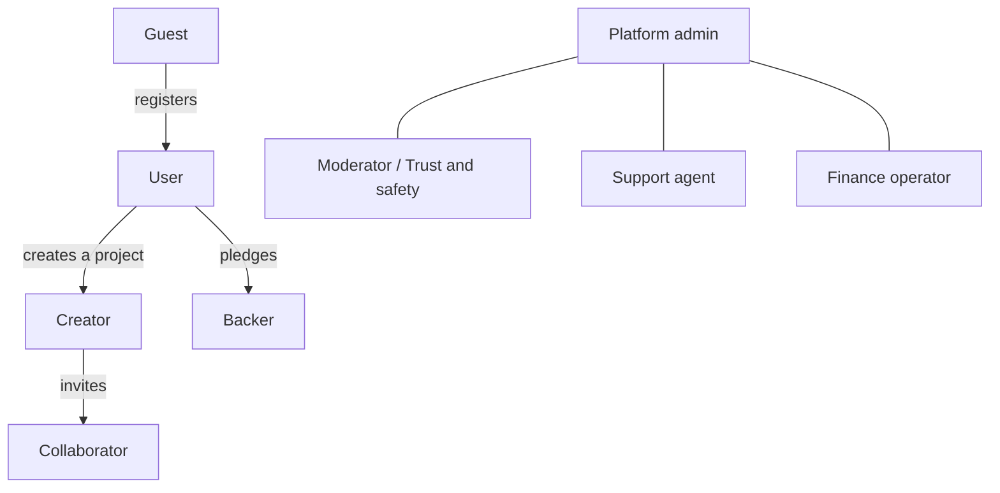
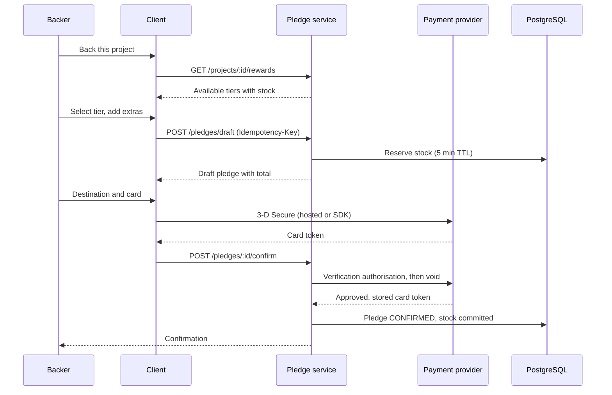
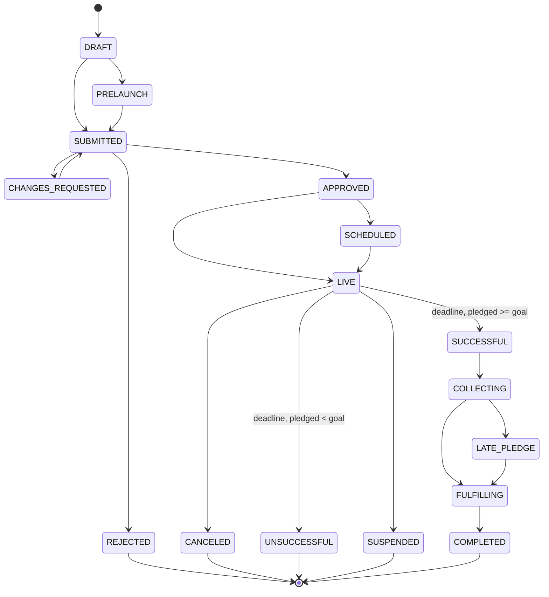
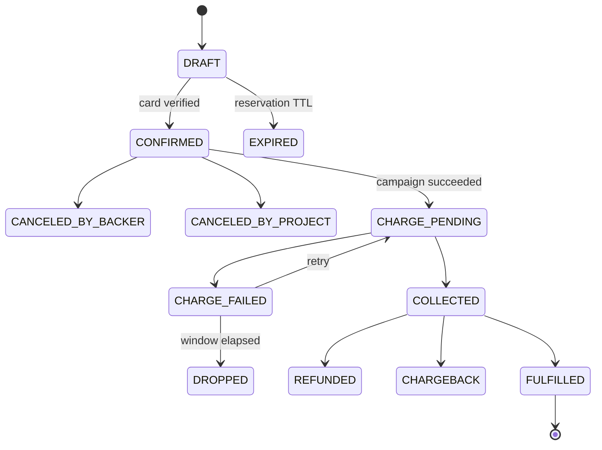
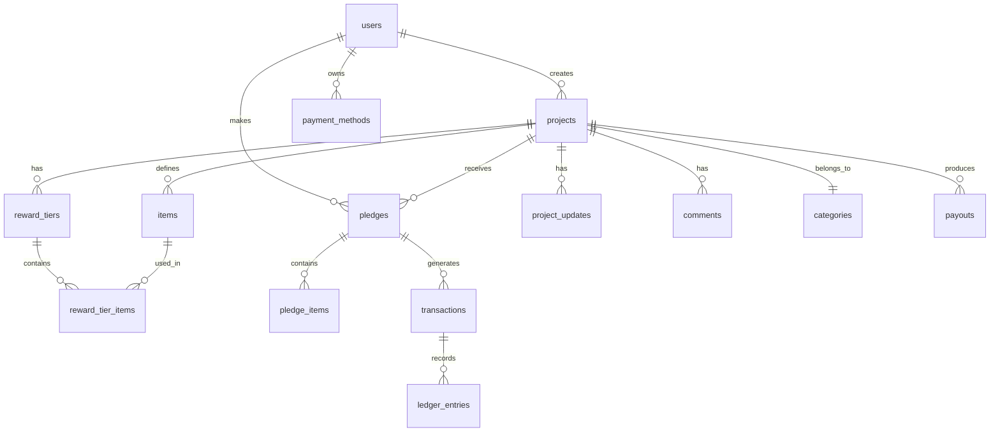
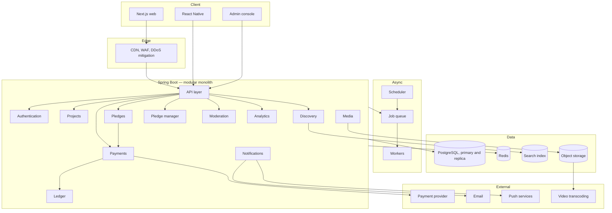
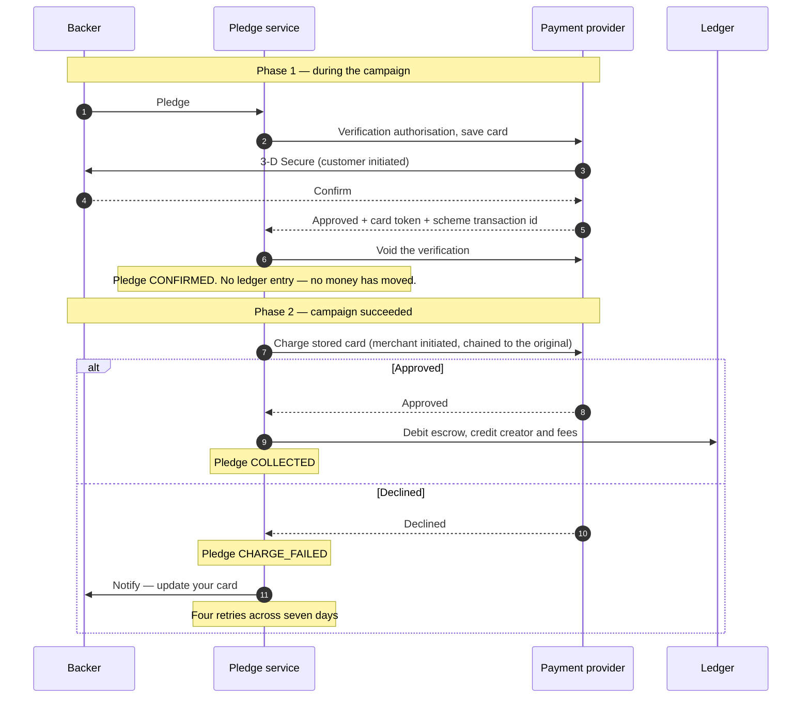
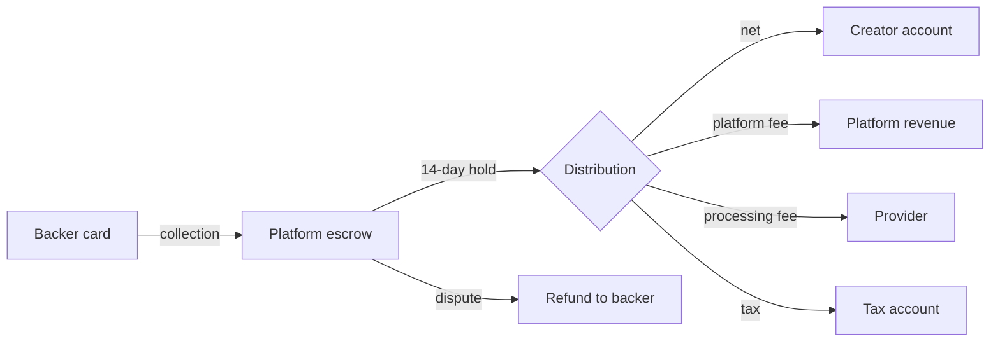
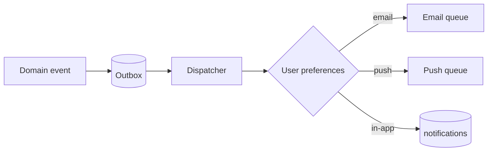

# IdeaNest — Platform Specification

**Reward-based crowdfunding. Web, mobile, and backend.**

| | |
|---|---|
| **Version** | 2.0 |
| **Status** | Draft — under review |
| **Scope** | Web (Next.js), mobile (React Native), backend (Java 21 / Spring Boot) |

---

## Contents

1. [Overview and product strategy](#1-overview-and-product-strategy)
2. [Glossary](#2-glossary)
3. [Actors and roles](#3-actors-and-roles)
4. [Functional inventory](#4-functional-inventory)
5. [Business rules](#5-business-rules)
6. [Domain model and state machines](#6-domain-model-and-state-machines)
7. [Database schema](#7-database-schema)
8. [System architecture](#8-system-architecture)
9. [Payments](#9-payments)
10. [API design](#10-api-design)
11. [Discovery and search](#11-discovery-and-search)
12. [Real-time and notifications](#12-real-time-and-notifications)
13. [Media pipeline](#13-media-pipeline)
14. [Technology stack](#14-technology-stack)
15. [Dependencies](#15-dependencies)
16. [Repository layout](#16-repository-layout)
17. [Security](#17-security)
18. [Observability](#18-observability)
19. [Infrastructure and delivery](#19-infrastructure-and-delivery)
20. [Testing strategy](#20-testing-strategy)
21. [Localisation and currency](#21-localisation-and-currency)
22. [Legal and compliance](#22-legal-and-compliance)
23. [Roadmap](#23-roadmap)
24. [Risks and open questions](#24-risks-and-open-questions)

---

## 1. Overview and product strategy

### 1.1 What we are building

A **reward-based crowdfunding platform**. Creators publish projects; backers
pledge money and receive a physical or digital reward in return. The platform
operates an **all-or-nothing** funding model: if a project does not reach its
goal by the deadline, nobody is charged.

> **This is not investment.** A backer receives no equity, no share, and no
> interest — only a product or an experience. That distinction is decisive under
> the applicable regulation (see [§22](#22-legal-and-compliance)).

### 1.2 What makes this category work

Four pillars, observed across established platforms in this category:

| Pillar | Description |
|---|---|
| **All-or-nothing funding** | A risk-reduction mechanism. The backer pays only if the project succeeds; the creator is never left with a partial budget that cannot deliver. |
| **A discovery engine** | Fifteen categories, roughly a hundred subcategories, a tag vocabulary, editorial curation, geographic filtering, and seven sort orders. A large share of traffic originates inside the platform, not from search. |
| **A story-led campaign page** | Video, rich narrative, reward tiers, a mandatory risks section, FAQ, updates, and comments. This is not a product page; it is an instrument of persuasion. |
| **Post-campaign fulfilment** | Surveys, add-on sales, late pledges, shipping calculation, tax collection, and backer reporting. The work does not end when funding closes. |

### 1.3 Product principles

1. **Trust outranks everything.** Money leaves people's accounts and they wait
   months. Transparency, moderation, and accountability are first-class
   features, not additions.
2. **Creator success is platform success.** Creator tooling — analytics,
   attribution, backer management — must be as deep as the backer experience.
3. **Mobile is not secondary.** Most traffic in this category is mobile. The
   application must fully support browsing, pledging, updates, and
   notifications.
4. **Every movement of money must be auditable.** An immutable ledger, always.
   No balance is ever *computed* — it is read from the ledger.

---

## 2. Glossary

| Term | Definition |
|---|---|
| **Project / Campaign** | A creative undertaking seeking funding |
| **Creator** | The person or organisation running a project |
| **Backer** | A user who pledges money to a project |
| **Pledge** | A financial commitment, not charged immediately |
| **Reward tier** | A package promised in exchange for a pledge amount |
| **Add-on** | An extra item purchasable alongside a reward |
| **Item** | The atomic physical or digital unit rewards are composed from |
| **Goal** | The minimum amount required for success |
| **Stretch goal** | A bonus target announced beyond the goal |
| **All-or-nothing** | No money moves unless the goal is met |
| **Funding period** | The window a campaign is open, 1–60 days |
| **Late pledge** | A pledge accepted after the deadline |
| **Pledge manager** | Post-campaign tooling for surveys, add-ons, and shipping |
| **Fulfilment** | Manufacturing and delivering rewards |
| **Collaborator** | A team member granted scoped access to a project |
| **Referrer** | The source a pledge is attributed to |
| **Escrow** | Where funds sit between collection and payout |
| **Payout** | The net amount transferred to the creator |
| **Chargeback** | A cardholder dispute raised through their bank |

---

## 3. Actors and roles



### 3.1 Permission matrix

| Action | Guest | User | Backer | Creator | Collaborator | Moderator | Admin | Finance |
|---|:-:|:-:|:-:|:-:|:-:|:-:|:-:|:-:|
| View projects | ✅ | ✅ | ✅ | ✅ | ✅ | ✅ | ✅ | ✅ |
| Search and filter | ✅ | ✅ | ✅ | ✅ | ✅ | ✅ | ✅ | ✅ |
| Save a project | ❌ | ✅ | ✅ | ✅ | ✅ | ✅ | ✅ | ✅ |
| Pledge | ❌ | ✅ | ✅ | ✅ | ✅ | ✅ | ✅ | ❌ |
| Comment | ❌ | ❌ | ✅¹ | ✅ | ✅ | ✅ | ✅ | ❌ |
| Create a project | ❌ | ✅ | ✅ | ✅ | ❌ | ❌ | ✅ | ❌ |
| Edit a project | ❌ | ❌ | ❌ | ✅ | ✅² | ❌ | ✅ | ❌ |
| Publish an update | ❌ | ❌ | ❌ | ✅ | ✅² | ❌ | ✅ | ❌ |
| View the backer report | ❌ | ❌ | ❌ | ✅ | ✅² | ❌ | ✅ | ✅ |
| Initiate a payout | ❌ | ❌ | ❌ | ❌ | ❌ | ❌ | ❌ | ✅ |
| Suspend a project | ❌ | ❌ | ❌ | ❌ | ❌ | ✅ | ✅ | ❌ |
| Apply an editorial badge | ❌ | ❌ | ❌ | ❌ | ❌ | ✅ | ✅ | ❌ |
| Ban a user | ❌ | ❌ | ❌ | ❌ | ❌ | ✅ | ✅ | ❌ |
| Issue a refund | ❌ | ❌ | ❌ | ❌ | ❌ | ❌ | ✅ | ✅ |

¹ Only backers of that project and its creator may comment.
² Subject to the granular grants the creator issued.

---

## 4. Functional inventory

Marked `[W]` web, `[M]` mobile, `[A]` admin.

### 4.1 Authentication and account

| # | Capability | Platform | Note |
|---|---|---|---|
| A-01 | Email and password registration | W, M | Verification required |
| A-02 | Email verification link or code | W, M | 24-hour token |
| A-03 | Sign in | W, M | Rate limited: 5 attempts / 15 min |
| A-04 | Google sign-in | W, M | Client obtains an ID token; the server verifies it against Google's JWKS |
| A-05 | Apple sign-in | W, M | Required by the iOS store once social sign-in exists. Same path, Apple's issuer and keys |
| A-06 | Password reset | W, M | Single-use token, 1 hour |
| A-07 | Two-factor via authenticator app | W, M | Mandatory for payout actions |
| A-08 | Two-factor via SMS | W, M | Fallback |
| A-09 | Active session management | W, M | Device list, remote revocation |
| A-10 | Account deletion | W, M | 30-day delay, then anonymisation |
| A-11 | Personal data export | W | Machine-readable archive |
| A-12 | Email change | W, M | Confirmation to both addresses |
| A-13 | Password change | W, M | Requires the current password |
| A-14 | Biometric unlock | M | Refresh token in secure device storage |

### 4.2 Profile

| # | Capability | Platform |
|---|---|---|
| P-01 | Avatar upload and crop | W, M |
| P-02 | Name, bio, location, website | W, M |
| P-03 | Social links | W, M |
| P-04 | Backed projects archive (no amounts) | W, M |
| P-05 | Created projects | W, M |
| P-06 | About tab | W, M |
| P-07 | Profile visibility | W, M |
| P-08 | Blocked users | W |
| P-09 | Notification preferences | W, M |
| P-10 | Language and currency | W, M |

### 4.3 Discovery and search `[W] [M]`

**Categories (15).** Art, Comics, Crafts, Dance, Design, Fashion, Film & Video,
Food, Games, Journalism, Music, Photography, Publishing, Technology, Theatre.

Each carries between four and nineteen subcategories — roughly a hundred in
total. The taxonomy is data, not code: it must be editable without a deployment,
and each entry needs a translation per supported locale.

**Filters**

| Filter | Values |
|---|---|
| Status | Upcoming, live, late pledge, successful, unsuccessful |
| Category | 15 primary plus subcategories, each with a live count |
| Location | Country, city, or proximity |
| Goal amount | Bands plus a custom range |
| Amount raised | Bands plus a custom range |
| Completion | Under 25%, 25–50%, 50–75%, 75–100%, over 100% |
| Show only | Recommended, editorially featured, saved |
| Tags | Free vocabulary |
| Programmes | Themed open calls |

**Sort orders**

| Sort | Logic |
|---|---|
| Relevance | Composite: recent momentum × social signal × curation × personalisation |
| Popularity | Pledge velocity with time decay |
| Newest | `launched_at DESC` |
| Ending soon | `deadline ASC` |
| Most funded | `pledged_amount DESC` |
| Most backed | `backers_count DESC` |
| Near me | Geographic distance |

**Additional**

| # | Capability |
|---|---|
| D-01 | Full-text search across title, summary, story, and creator |
| D-02 | Autocomplete and suggestions |
| D-03 | Misspelling tolerance |
| D-04 | Cursor-paginated infinite scroll |
| D-05 | Project card: image, title, creator, completion, days left, badge |
| D-06 | Similar projects |
| D-07 | Personalised feed |
| D-08 | Curated collections and open-call landing pages |
| D-09 | Trending tags |
| D-10 | Live faceted counts |
| D-11 | Search history (mobile) |
| D-12 | Shareable filter URLs |

### 4.4 Project page `[W] [M]`

**Header:** media player (poster-first, no autoplay), editorial badge,
subcategory and location links, amount raised, backer count, live countdown,
progress bar, primary call to action, reminder control, share, save, and an
explicit all-or-nothing statement with the deadline in the viewer's timezone.

**Trust block** — fixed copy on every project:

> The platform connects creators with backers. Rewards are not guaranteed, but
> creators must keep backers informed. You are only charged if the project
> reaches its goal by the deadline.

**Tabs**

| Tab | Contents |
|---|---|
| **Campaign** | Rich narrative with images, video, and embeds; auto-generated section navigation; a **mandatory risks and challenges section**; a reporting link |
| **Rewards** | Available and exhausted tiers separately. Each: price, backer count, shipping destinations, estimated delivery, remaining quantity, included items with quantities, images |
| **Creator** | Biography, history, previous projects, contact |
| **FAQ** | Creator-managed question and answer list |
| **Updates** | Numbered updates, public or backers-only, with comments |
| **Comments** | Chronological thread, creator replies highlighted |
| **Community** | Backer statistics: countries, new versus returning, cities |

### 4.5 Pledge flow `[W] [M]`



| # | Capability | Note |
|---|---|---|
| PL-01 | Reward tier selection | Live stock check |
| PL-02 | Pledge without a reward | Support only |
| PL-03 | Bonus support above the tier price | |
| PL-04 | Add-on selection with quantities | Campaign or pledge manager |
| PL-05 | Shipping destination | Drives the shipping charge |
| PL-06 | Total calculation | Reward + add-ons + shipping + tax |
| PL-07 | Card entry or stored card | Card data never reaches our servers |
| PL-08 | 3-D Secure | Mandatory |
| PL-09 | Edit a pledge | Until the deadline |
| PL-10 | Cancel a pledge | Releases reserved stock |
| PL-11 | Replace the card | After a failed collection |
| PL-12 | Anonymous pledging | Hidden from public lists |
| PL-13 | Stock reservation | Redis TTL, guards against races |
| PL-14 | Idempotency | `Idempotency-Key` prevents duplicates |
| PL-15 | Secret rewards | Reachable only by a private URL |
| PL-16 | Late pledge | If the creator enables it |

### 4.6 Campaign editor `[W]`

**Basics** — title (≤60 characters), summary (≤135), category and subcategory,
location with geocoding, cover image (min 1024×576), video, goal and currency,
duration (1–60 days), scheduled launch, late-pledge toggle, pre-launch page.

**Rewards** — atomic **items** first, then **tiers** composed from them:
title, description, price, included items with quantities, images, estimated
delivery, quantity limit, shipping scope, per-country rates, early-bird windows,
featured and secret flags, drag-to-reorder, duplication. **Add-ons** are items
sold alongside a tier.

**Story** — rich text editor (headings, emphasis, lists, quotes, rules), inline
media, third-party embeds, section headings that generate anchor navigation, a
**mandatory risks and challenges** field, FAQ editor, autosave and version
history.

**People** — creator profile, collaborator invitations with granular grants,
team display.

**Account** — identity verification, individual or legal entity, tax
identification, bank account for payout, address verification.

**Promotion** — custom referrer links, share templates, pre-launch link.

**Review and launch** — automated completeness checklist, submission,
moderation outcome, launch (scheduled or immediate).

### 4.7 Creator dashboard `[W]` `[M read-only]`

| # | Capability |
|---|---|
| CD-01 | Live totals: raised, backers, completion, time remaining |
| CD-02 | Pledge trend over time |
| CD-03 | **Referrer attribution** — top sources with pledge count, value, and share |
| CD-04 | Device split per source |
| CD-05 | Visitor-to-backer conversion |
| CD-06 | Video engagement |
| CD-07 | Sales per reward tier |
| CD-08 | Geographic distribution |
| CD-09 | New versus returning backers |
| CD-10 | Backer report with filtering and segmentation |
| CD-11 | Export in fulfilment-partner formats |
| CD-12 | Publish updates, public or backers-only, scheduled |
| CD-13 | Bulk message a segment |
| CD-14 | Comment moderation |
| CD-15 | FAQ management |
| CD-16 | Financial summary: gross, fees, tax, net |
| CD-17 | Collection status and failed-payment tracking |
| CD-18 | Stretch goal announcements |
| CD-19 | Automated and manual reminders to backers with failed payments |

### 4.8 Pledge manager `[W] [M]`

The most valuable and most complex module. It begins when funding closes.

| # | Capability | Actor |
|---|---|---|
| PM-01 | Survey builder with dynamic questions | Creator |
| PM-02 | Questions conditional on reward tier | Creator |
| PM-03 | Question types: text, choice, multi-choice, address, date | Creator |
| PM-04 | Send surveys to backers | Creator |
| PM-05 | Complete a survey | Backer |
| PM-06 | Edit responses until a cut-off | Backer |
| PM-07 | Address collection and validation | Backer |
| PM-08 | Lock addresses | Creator |
| PM-09 | Upgrade a reward tier | Backer |
| PM-10 | Post-campaign add-on store | Backer |
| PM-11 | Shipping calculated after the campaign | Creator |
| PM-12 | Weight-based or flat rates | Creator |
| PM-13 | Rates varying by region, item, or tier | Creator |
| PM-14 | Tax calculation and collection | System |
| PM-15 | Customs and duty handling | Creator |
| PM-16 | Charge the additional amount | System |
| PM-17 | **Backer report** with segmentation and export | Creator |
| PM-18 | Bulk address editing | Creator |
| PM-19 | Digital reward distribution | Creator |
| PM-20 | Tracking number import | Creator |
| PM-21 | Tracking visible to the backer | Backer |
| PM-22 | Fulfilment status | Both |
| PM-23 | Late pledges | Backer |
| PM-24 | Reminders to non-responders | System |

### 4.9 Community `[W] [M]`

| # | Capability |
|---|---|
| C-01 | Project comments |
| C-02 | Creator replies visually distinguished |
| C-03 | Threaded replies |
| C-04 | Comment reactions |
| C-05 | Comments on updates |
| C-06 | Report a project |
| C-07 | Report a comment |
| C-08 | Block a user |
| C-09 | Save a project |
| C-10 | Follow a creator |
| C-11 | Launch reminders |
| C-12 | Direct messages between creator and backer |
| C-13 | Sharing, native sheet on mobile |
| C-14 | Deep links opening the mobile app |

### 4.10 Notifications

| Event | Email | Push | In-app |
|---|:-:|:-:|:-:|
| Pledge confirmed | ✅ | ✅ | ✅ |
| Pledge edited | ✅ | ❌ | ✅ |
| Goal reached | ✅ | ✅ | ✅ |
| 48 hours remaining | ✅ | ✅ | ✅ |
| 24 hours remaining | ❌ | ✅ | ✅ |
| Campaign succeeded | ✅ | ✅ | ✅ |
| Campaign unsuccessful | ✅ | ✅ | ✅ |
| Payment collected | ✅ | ✅ | ✅ |
| **Payment failed** | ✅ | ✅ | ✅ |
| Final payment warning | ✅ | ✅ | ✅ |
| New update published | ✅ | ✅ | ✅ |
| Reply to your comment | ✅ | ✅ | ✅ |
| Direct message | ✅ | ✅ | ✅ |
| Survey available | ✅ | ✅ | ✅ |
| Survey overdue | ✅ | ✅ | ✅ |
| Reward shipped | ✅ | ✅ | ✅ |
| Followed creator launched | ✅ | ✅ | ✅ |
| Reminder: project launched | ✅ | ✅ | ✅ |
| Saved project ending soon | ✅ | ✅ | ✅ |
| Project approved | ✅ | ✅ | ✅ |
| Payout sent | ✅ | ✅ | ✅ |
| Sign-in from a new device | ✅ | ✅ | ✅ |

Preferences are per category and per channel, with a digest option.

### 4.11 Administration `[A]`

| # | Module | Capabilities |
|---|---|---|
| AD-01 | Project moderation | Queue, approve, reject, request changes, notes, history |
| AD-02 | Trust and safety | Report queue, fraud signals, suspension |
| AD-03 | Curation | Editorial badges, collections, open calls, placement |
| AD-04 | User management | Search, inspect, ban, verification status, audited impersonation |
| AD-05 | Finance | Payment log, ledger, payout queue, approvals, disputes |
| AD-06 | Refunds | Full and partial with reason codes |
| AD-07 | Chargebacks | Notification, evidence, outcome |
| AD-08 | Taxonomy | Category and tag management with translations |
| AD-09 | Content moderation | Comments, updates, profiles |
| AD-10 | Support | Tickets with user context and action history |
| AD-11 | Fee configuration | Platform and processing rates, exceptions |
| AD-12 | Feature flags | Gradual rollout, experiments |
| AD-13 | Analytics | Volume, success rate, average pledge, cohorts, funnels |
| AD-14 | Audit log | Immutable record of privileged actions |
| AD-15 | Email templates | Edit, preview, test send |
| AD-16 | System health | Queue depth, failed jobs, provider status |

### 4.12 Mobile-specific `[M]`

| # | Capability |
|---|---|
| MB-01 | Push notifications |
| MB-02 | Deep links and universal links |
| MB-03 | Biometric authentication |
| MB-04 | Offline cache for saved projects and pledges |
| MB-05 | Native share sheet |
| MB-06 | Camera capture for avatars |
| MB-07 | Haptic feedback on pledge confirmation |
| MB-08 | Pull to refresh |
| MB-09 | Skeleton loading states |
| MB-10 | Image gallery with pinch and swipe |
| MB-11 | Video player with fullscreen and picture-in-picture |
| MB-12 | Wallet payment, provider permitting |
| MB-13 | Over-the-air updates |
| MB-14 | Dark mode |
| MB-15 | Dynamic type and accessibility sizing |
| MB-16 | Proximity search |

---

## 5. Business rules

### 5.1 All-or-nothing

```
IF pledged_total >= goal AND now >= deadline
    → SUCCESSFUL
    → collect every confirmed pledge
    → open a 7-day retry window for failures
    → after 7 days, compute the payout

ELSE IF pledged_total < goal AND now >= deadline
    → UNSUCCESSFUL
    → collect nothing
    → delete stored card tokens within 30 days
    → charge no fee
```

### 5.2 Fees

| Component | Rate | When |
|---|---|---|
| Platform fee | 5% of the amount raised | Successful projects only |
| Processing fee | Roughly 2.5–3% plus a fixed amount per pledge | Per successful collection |
| Small pledge fee | An alternative rate below a threshold | Optional |
| Unsuccessful project | **Zero** | No fee of any kind |

Rates are configuration, not code — a `fee_schedules` table, so a category or an
individual agreement can differ without a deployment.

### 5.3 Validation

| Rule | Value |
|---|---|
| Title | 1–60 characters |
| Summary | 1–135 characters |
| Goal | Minimum and maximum are configurable |
| Duration | 1–60 days (30 recommended) |
| Cover image | Required, minimum 1024×576 |
| Story | Minimum 500 characters |
| Risks and challenges | **Required**, minimum 200 characters |
| Reward tiers | 0–100 |
| Reward price | At least the smallest chargeable amount |
| Goal or deadline after launch | **Immutable** |
| Delete a reward with backers | **Forbidden** — it may only be hidden |
| Reward price after launch | **Immutable** |
| Increase reward quantity | Permitted |
| Decrease reward quantity | Only above the number already claimed |

### 5.4 Prohibited content

Products claiming to diagnose, treat, or cure illness; contests, lotteries, and
raffles; energy foods and drinks; offensive material; discriminatory content;
genetically modified organisms as rewards; alcohol as a reward; financial,
telecommunications, travel, and business-marketing services; political
fundraising; pornography; already-existing or repackaged products; resale goods;
drugs, tobacco, and nicotine; weapons, accessories, and replicas.

Additionally: every reward must be new and unique, produced or designed by the
project or a collaborator, and no project may misrepresent facts.

### 5.5 Creator obligations

- Publish an update at least monthly after a successful campaign
- Inform backers of delays
- Offer a refund where a reward cannot be delivered
- Respond to questions and complaints

---

## 6. Domain model and state machines

### 6.1 Project



### 6.2 Pledge



### 6.3 Payout

```
PENDING → HOLD (14 days) → APPROVED → PROCESSING → PAID
                              ↓
                           BLOCKED (fraud or dispute)
```

---

## 7. Database schema

**PostgreSQL 16 or newer.** Below is the structural outline, not full DDL.

### 7.1 Core relationships



### 7.2 Principal tables

#### `users`
`id` (uuid), `email` (citext, unique), `email_verified_at`, `name`, `slug`,
`avatar_url`, `bio`, `location_id`, `locale`, `currency`, `kyc_status`,
`two_factor_enabled`, `banned_at`, `deleted_at`, `deletion_requested_at`,
`deletion_scheduled_at`, `anonymised_at`, timestamps.

The three deletion columns are the whole state machine. `deletion_requested_at`
and `deletion_scheduled_at` are set together and cleared together — a
constraint enforces it — and `deleted_at` stays null while they are set, because
every finder excludes soft-deleted rows and the account has to stay findable to
be recovered. `anonymised_at` is set once, by the job, and is what makes it
idempotent: the work is claimed under `WHERE anonymised_at IS NULL`.

> **The password hash is not here.** It lives in `user_credentials`, keyed by
> `user_id`. A user who signs in through a provider has no password at all, so
> the column would be null for a growing share of rows and say nothing about
> why; and a hash stored beside the profile is read into memory by every query
> that only wanted a display name.
>
> `location_id`, `kyc_status`, and `banned_at` are not in the schema yet. Each
> arrives with the feature that owns it — locations with discovery,
> `kyc_status` with #105, `banned_at` with #104 — rather than as a column
> nothing writes to.
>
> **`two_factor_enabled` was planned here and is deliberately not a column.**
> Whether two-factor is on is `user_two_factor.confirmed_at IS NOT NULL`, and a
> boolean beside it would be a second answer to the same question — one that
> can disagree with the first after a failed transaction, and that says nothing
> about *when* it was switched on. What a payout action actually asks is
> narrower still: not "does this account have two-factor" but "did this session
> prove it", which is `sessions.two_factor_at`.

#### `user_credentials`
`user_id` (uuid, primary key), `password_hash` (Argon2id, encoded with its
parameters), `algorithm`, `password_changed_at`, timestamps.

`password_changed_at` exists separately from `updated_at` because sessions
issued before a password change are revoked, and that comparison needs a
timestamp that moves only when the password does.

#### `sessions`
`id` (uuid), `user_id`, `device_label`, `user_agent`, `ip_address` (inet),
`created_at`, `last_seen_at`, `expires_at`, `two_factor_at`, `revoked_at`,
`revoked_reason`.

**A session is the refresh token family.** Rotation issues a new refresh token
into the same session; presenting a token that was already rotated means a copy
is in circulation, and the response is to revoke the session rather than the
single token — revoking the token alone leaves whichever party holds the newest
one signed in, and which of the two that is cannot be known.

`revoked_reason` is constrained to `SIGNED_OUT`, `USER_REVOKED`, `TOKEN_REUSE`,
`PASSWORD_CHANGED`, `ADMIN_ACTION`, and a revoked session must carry one. A
session that died without a recorded reason is what makes a theft incident
unreconstructable a week later.

`two_factor_at` records that *this sign-in* proved a second factor, and is null
for a session started with a password alone. It is a property of the session
rather than of the account on purpose: an account can switch two-factor on and
still hold sessions that predate it, and blessing those retroactively would let
a token minted before the change satisfy a payout check made after it.

#### `refresh_tokens`
`id` (uuid), `session_id`, `token_hash` (bytea, SHA-256), `issued_at`,
`expires_at`, `used_at`, `replaced_by`.

Stored hashed, never in the clear, so a backup or a log contains nothing anyone
can sign in with. No salt and no work factor: the input is 256 bits we
generated, so there is no dictionary to attack, and the hash is computed on
every refresh.

**A used token is kept, not deleted.** Deleting it would make a replayed token
indistinguishable from one that never existed, and that difference is the entire
theft signal.

#### `verification_tokens`
`id` (uuid), `user_id`, `purpose` (`EMAIL_VERIFICATION`, `PASSWORD_RESET`),
`token_hash` (bytea, SHA-256), `created_at`, `expires_at`, `consumed_at`.

Single use, spent by setting `consumed_at` rather than by deleting the row, so
that a second attempt with the same link can be told apart from a token that
never existed. The purpose is checked on redemption: without it, a token issued
to prove an address would also reset the password on that account.

#### `user_two_factor`
`user_id` (uuid, primary key), `secret` (bytea, 20 bytes), `algorithm`
(`TOTP_SHA1`), `confirmed_at`, `last_used_step`, timestamps.

**Enrolment and enablement are two states of one row.** A row with
`confirmed_at` null is a secret that was generated and never proved, and it
changes nothing about signing in. Anything else locks out the user whose phone
dies between scanning the code and entering one, and on a funding platform a
lockout means somebody cannot reach their money.

The secret cannot be hashed the way a token is — verifying a code means
recomputing the HMAC, so the server needs the value back. Encryption at rest
with a managed key is the control that belongs here, and there is no key
management in the platform yet; until there is, the secret is protected exactly
as well as the database is.

`last_used_step` is the replay defence: a code is accepted only if its time step
is strictly greater than the last accepted one, so a code works once rather than
for the ninety seconds the skew window covers.

#### `two_factor_recovery_codes`
`id`, `user_id`, `code_hash` (bytea, SHA-256), `created_at`, `used_at`.

Ten codes of a hundred bits each, generated at confirmation and shown once.
Stored as an unsalted SHA-256 with no work factor, for the same reason a refresh
token is: the input is not something a person chose, so there is no dictionary
to attack. Argon2 would be actively wrong here — the codes are checked on an
endpoint reachable with a stolen challenge, and a memory-hard hash there lets an
attacker spend 19 MiB of ours per guess.

#### `two_factor_challenges`
`id`, `user_id`, `challenge_hash` (bytea, SHA-256), `device_label`,
`user_agent`, `ip_address` (inet), `created_at`, `expires_at`, `consumed_at`.

The state between the two halves of a sign-in. A correct password with
two-factor on produces one of these and **no session**; the second call spends
it together with a code. A row rather than a signed token because it has to be
single-use and revocable, and nothing that is merely signed can promise either.
Five minutes, and retired when a new one is issued for the same user.
#### `provider_identities`
`id` (uuid), `user_id`, `provider` (`GOOGLE`, `APPLE`), `subject`, `email`
(citext), `email_verified`, `is_private_email`, `linked_at`,
`last_authenticated_at`, timestamps.

**Unique:** `(provider, subject)`, and `(user_id, provider)`.

**The link is the provider's `subject`, never the address.** Both providers let
a person change the email on their account, and Apple's relay address can be
switched off entirely. An identity matched on the address means whoever holds
that address next inherits the account it used to point at — an account takeover
performed with nothing but legitimate credentials. `sub` is issuer-scoped,
immutable, and never reassigned. The address is recorded beside it as a fact
about the account, and nothing authenticates against it.

`(user_id, provider)` is unique because one person has one Google account here.
A second would make "which Google account is this" a question with two answers.

A user who only ever signs in this way has no row in `user_credentials`, which
is what that table was separated for.

#### `projects`
`id`, `creator_id`, `slug`, `title` (varchar 60), `blurb` (varchar 135),
`category_id`, `subcategory_id`, `location_id`, `state`, `goal_amount`
(numeric 14,2), `currency`, `pledged_amount` (denormalised), `backers_count`
(denormalised), `launched_at`, `deadline`, `duration_days`, `story` (jsonb),
`risks` (required), `main_image_id`, `video_id`, `is_featured`,
`late_pledge_enabled`, `late_pledge_ends_at`, `pledge_manager_state`,
`search_vector` (tsvector), `geo_point` (geography).

Indexes: `(state, deadline)`, `(category_id, state)`, `(creator_id)`,
GIN on `search_vector`, GIST on `geo_point`, `(is_featured, launched_at DESC)`.

#### `items`
Atomic units: `id`, `project_id`, `name`, `description`, `image_id`,
`weight_grams`, `is_digital`, `sku`.

#### `reward_tiers`
`id`, `project_id`, `title`, `description`, `amount` (numeric 14,2), `currency`,
`estimated_delivery`, `limit_quantity`, `claimed_quantity`, `reserved_quantity`,
`shipping_type`, `is_early_bird`, `is_featured`, `is_secret`, `secret_token`,
`is_addon`, `sort_order`, `available_from`, `available_until`, `version`.

**Constraint:** `claimed_quantity + reserved_quantity <= limit_quantity`.

#### `reward_tier_items`
`reward_tier_id`, `item_id`, `quantity`.

#### `shipping_rules`
`reward_tier_id`, `country_code`, `amount`, `additional_item_amount`.

#### `pledges`
`id`, `project_id`, `backer_id`, `reward_tier_id` (nullable), `state`,
`base_amount`, `addons_amount`, `bonus_amount`, `shipping_amount`,
`tax_amount`, `total_amount` (generated), `currency`, `payment_method_id`,
`shipping_country`, `is_anonymous`, `is_late_pledge`, `referrer_code`,
`idempotency_key` (unique), `confirmed_at`, `collected_at`, `canceled_at`.

**Unique:** `(project_id, backer_id)` where the pledge is active — one pledge per
backer per project.

#### `payment_methods`
`id`, `user_id`, `provider`, `provider_token` (**token only, never a card
number**), `scheme_transaction_id`, `brand`, `last4`, `exp_month`, `exp_year`,
`is_default`, `verified_at`.

#### `transactions` — insert only
`id`, `pledge_id`, `type` (verification, charge, refund, chargeback,
chargeback_reversal, payout), `status`, `amount`, `currency`, `provider`,
`provider_transaction_id` (unique), `provider_response` (jsonb), `failure_code`,
`failure_message`, `attempt_number`, `idempotency_key` (unique), `created_at`.

> This table is **never updated or deleted**. Corrections are new rows.

#### `ledger_entries` — double entry
`id` (bigserial), `transaction_id`, `account` (escrow, `creator:{id}`,
platform_fee, psp_fee, tax_payable, refunds), `direction` (debit/credit),
`amount`, `currency`, `project_id`, `created_at`.

**Invariant:** for every `transaction_id`, `SUM(debit) = SUM(credit)`. Enforced
by a database constraint and verified by a nightly reconciliation job.

#### `payouts`
`id`, `project_id`, `creator_id`, `gross_amount`, `platform_fee`, `psp_fee`,
`tax_withheld`, `net_amount`, `state`, `bank_account_id`, `scheduled_at`,
`paid_at`, `provider_reference`, `approved_by`, `second_approver`.

#### Supporting tables

| Table | Purpose |
|---|---|
| `categories`, `subcategories` | Taxonomy with translations |
| `tags`, `project_tags` | Tag vocabulary |
| `collections`, `collection_projects` | Curation and open calls |
| `project_updates` | Numbered updates |
| `comments` | Self-referencing threads |
| `faqs` | Question and answer pairs |
| `saves`, `follows`, `reminders` | Backer signals |
| `collaborators` | Scoped grants |
| `surveys`, `survey_questions`, `survey_responses` | Pledge manager |
| `shipping_addresses` | Encrypted at rest |
| `fulfilments` | Tracking and status |
| `notifications`, `notification_preferences` | Delivery and settings |
| `media` | Metadata and transcoding state |
| `referrers` | Attribution |
| `project_analytics_daily` | Pre-aggregated metrics |
| `moderation_cases`, `reports` | Trust and safety |
| `audit_logs` | Privileged actions |
| `fee_schedules` | Configurable rates |
| `outbox_events` | Transactional outbox |
| `idempotency_keys` | Replay protection |

### 7.3 Data decisions

| Decision | Reason |
|---|---|
| PostgreSQL | ACID, exact numerics, JSONB, full-text search, PostGIS, partial indexes |
| **`numeric(14,2)` for money** | Never floating point. Rounding error here is somebody's pledge |
| `BigDecimal` in Java | The same discipline in the application layer |
| UUID v7 primary keys | Sortable, index-friendly, and they do not leak volume |
| Soft delete | Audit and recovery |
| Selective denormalisation | Read performance; the ledger remains the source of truth |
| PostGIS | Proximity search |
| Monthly partitioning | `transactions`, `ledger_entries`, `audit_logs` |
| Read replica | Discovery and analytics |

---

## 8. System architecture

### 8.1 Overview



### 8.2 Modular monolith, not microservices

**Decision:** start as a modular monolith. Extract only when a specific,
demonstrated need appears.

| Reason | Detail |
|---|---|
| **Transactional integrity** | Pledge, ledger, and payment writes must share a transaction. Microservices replace that guarantee with sagas and compensating actions — added complexity in the one place the product cannot afford to be wrong |
| Team size | Early microservices produce a distributed monolith |
| Velocity | One deployment, one test suite, one migration path |
| Reversibility | Explicit Spring module boundaries with internal contracts keep extraction cheap later |

**First candidates for extraction, when justified:** media and transcoding
(CPU-bound, different scaling profile); discovery (read-heavy, different cache
strategy); notifications (I/O-bound fan-out); analytics (an entirely separate
load profile).

### 8.3 Patterns

| Pattern | Where | Why |
|---|---|---|
| **Transactional outbox** | Pledges, payments | A commit and its published event must not diverge |
| **Idempotency keys** | Every payment mutation | A network retry must not charge twice |
| **Double-entry ledger** | Finance | Auditable; the balance proves itself |
| **Optimistic locking** | Reward stock | A `version` column prevents overselling |
| **Distributed lock** | Campaign finalisation | One campaign must never be finalised twice |
| **Saga** | Payout | Multi-step and requires compensation |
| **CQRS (light)** | Discovery | Write to the database, read from the search index |
| **Circuit breaker** | Provider calls | Contain a provider outage |
| **Rate limiting** | Auth, pledge, search | Abuse protection |
| **Feature flags** | New capability | Safe rollout |

### 8.4 Scheduled work

| Job | Frequency | Purpose |
|---|---|---|
| `campaign-launcher` | Every minute | Scheduled to live |
| `campaign-finalizer` | Every minute | Determine success at the deadline |
| `charge-processor` | Every minute | Process pending collections in rate-limited batches |
| `charge-retry` | Every 6 hours | Retry failures within the window |
| `payout-scheduler` | Daily | Prepare payouts once the hold elapses |
| `reservation-cleaner` | Every minute | Release expired stock reservations |
| `search-indexer` | Event-driven plus nightly full | Keep the index current |
| `analytics-aggregator` | Hourly | Populate daily rollups |
| `reminder-sender` | Every minute | Launch and deadline reminders |
| `survey-nudge` | Daily | Chase non-responders |
| `ledger-reconciliation` | Daily | Verify the balance invariant, compare to settlement |
| `token-cleaner` | Daily | Purge tokens from unsuccessful campaigns |
| `denormalization-sync` | Hourly | Correct cached counters |
| `account-anonymiser` | Hourly | Anonymise accounts whose deletion grace period has elapsed |

---

## 9. Payments

> The highest-risk area of the platform.

### 9.1 The core problem

All-or-nothing requires holding a payment obligation for **30 to 60 days**, then
collecting it.

| Approach | Problem |
|---|---|
| **Card authorisation hold** | Holds typically expire after 7 days, occasionally 30. A 30–60 day campaign outlives them. **Unworkable.** |
| **Charge immediately, refund on failure** | Mass refunds on unsuccessful campaigns: high cost, poor experience, and it makes us hold client funds |
| **Stored card, charge at close** | ✅ **The selected approach.** |

### 9.2 Card-on-file with merchant-initiated collection



### 9.3 Provider requirements

**Confirm each of these in writing before signing.** Without them the design
does not work.

| # | Requirement | Why it is critical |
|---|---|---|
| R-01 | Card tokenisation (card-on-file) | Charge later without storing card data |
| R-02 | **Merchant-initiated transactions** | Collect without the backer present |
| R-03 | Scheme transaction chaining | Scheme rules require the later charge to reference the original |
| R-04 | 3-D Secure | Liability shift |
| R-05 | Zero or minimal-value verification | Validate the card at pledge time |
| R-06 | Full and partial refunds | Cancellation, dispute |
| R-07 | Signed webhooks | Asynchronous outcomes |
| R-08 | Idempotency | Prevent double collection |
| R-09 | Batch throughput and documented rate limits | Thousands of charges at close |
| R-10 | Split payment or sub-merchant support | Optional, simplifies payout |
| R-11 | Multi-currency | International backers |
| R-12 | Wallet payments | Mobile conversion |
| R-13 | Chargeback notifications | Dispute handling |
| R-14 | Sandbox | Testing |

**Candidate providers**

| Provider | Observed capability | Status |
|---|---|---|
| **Payriff** | Pre-authorisation operation and completion, refunds, AZN/USD/EUR | Card-on-file and merchant-initiated require written confirmation |
| **Epoint** | API integration, split payments across parties | Split suits a marketplace model; merchant-initiated needs confirmation |
| **Azericard** | National processing centre, major card schemes certified | Direct integration is typically bank-intermediated |
| **Bank acquiring** | Terms are negotiated individually | — |

> **Integrate at least two providers.** If the primary is unavailable on the day
> a large campaign closes, the entire business stops.

### 9.4 Provider abstraction

```java
public interface PaymentProvider {

    ProviderName name();

    /** Verify a card and create a stored token (customer initiated, 3-D Secure). */
    TokenizationSession beginTokenization(TokenizationRequest request);

    TokenizationResult resolveTokenization(String sessionId);

    /** Collect at campaign close, without the customer present. */
    ChargeResult chargeStoredCard(StoredCardChargeRequest request);

    RefundResult refund(RefundRequest request);

    PayoutResult payout(PayoutRequest request);

    /** Verify the signature and return a normalised event. */
    PaymentEvent parseWebhook(byte[] rawBody, Map<String, String> headers);

    ProviderCapabilities capabilities();
}

public record ProviderCapabilities(
    boolean cardOnFile,
    boolean merchantInitiated,
    Integer preAuthHoldDays,      // null when unsupported
    boolean splitPayment,
    boolean partialRefund,
    Set<WalletType> wallets,
    Set<Currency> currencies
) {}
```

Every request and result type carries an idempotency key. No provider SDK is
called anywhere except behind this interface — changing provider must be a
single-file change.

### 9.5 Money flow



**Why the hold exists:** it absorbs some chargeback risk, allows fraud detection
time, lets the 7-day retry window close, and gives the creator time to publish a
first update.

### 9.6 Failed collections

Industry experience puts failure at **5–15%** of pledges at campaign close —
expired cards, limits, and issuer declines.

| Attempt | Timing | Channel |
|---|---|---|
| 1 | Immediately after close | — |
| 2 | +24 hours | Email and push |
| 3 | +72 hours | Email, push, in-app banner |
| 4 | +5 days | Email, final warning |
| — | +7 days | Pledge dropped |

> **A rule that matters:** success is decided at the deadline from **confirmed**
> pledges, and never revisited. Later failures reduce the payout; they do not
> retroactively fail the campaign. Anything else would let a campaign flip to
> failure days after backers were told it succeeded.

### 9.7 Refund policy

| Scenario | Outcome |
|---|---|
| Campaign unsuccessful | Nothing was collected |
| Creator cancels | Full refund of collected pledges |
| Moderator suspends | Full refund |
| Creator cannot deliver | Creator offers a refund; the platform mediates |
| Backer changes their mind while live | Cancel — nothing was collected |
| Backer changes their mind after collection | Creator's decision; not compelled |
| Fraud established | Full refund and account action |

### 9.8 Chargebacks

1. The provider notifies us by webhook
2. A `chargeback` transaction is recorded with the matching ledger reversal
3. The creator is notified and has an evidence window
4. Evidence is submitted to the provider
5. The outcome is recorded as a reversal either way
6. If lost, the amount and any fee are deducted from the payout

---

## 10. API design

### 10.1 Style

| Layer | Choice | Reason |
|---|---|---|
| Public API | **REST with OpenAPI 3.1** | Simple, cacheable, predictable for mobile |
| Discovery | REST with cursor pagination | Infinite scroll |
| Admin | REST | Internal |
| Real-time | **WebSocket** | Live counters and comments |

> GraphQL is not the default choice. It is common in this category, but usually
> as a consequence of many teams and legacy systems. For a new platform, REST
> with a generated specification means less operational surface and simpler
> caching for mobile. A gateway-level GraphQL layer remains possible later.

### 10.2 Endpoints

```
# Authentication
POST   /v1/auth/register
POST   /v1/auth/login
POST   /v1/auth/refresh
POST   /v1/auth/logout
POST   /v1/auth/verify-email
POST   /v1/auth/forgot-password
POST   /v1/auth/reset-password
POST   /v1/auth/2fa/enable      # starts an enrolment; does not switch it on
POST   /v1/auth/2fa/confirm     # a current code switches it on, returns recovery codes
POST   /v1/auth/2fa/verify      # second half of a sign-in: challenge + code
POST   /v1/auth/2fa/disable     # password AND a code, or a recovery code
GET    /v1/auth/sessions
DELETE /v1/auth/sessions/{id}
POST   /v1/auth/oauth/{provider}

# Account
GET    /v1/me
PATCH  /v1/me
GET    /v1/me/backed
GET    /v1/me/created
GET    /v1/me/saved
GET    /v1/me/notifications
PATCH  /v1/me/notification-preferences
GET    /v1/me/export
POST   /v1/me/deletion
DELETE /v1/me/deletion
GET    /v1/users/{slug}

# Discovery
GET    /v1/discover
GET    /v1/discover/facets
GET    /v1/search
GET    /v1/search/suggest
GET    /v1/categories
GET    /v1/collections
GET    /v1/collections/{slug}

# Project — public
GET    /v1/projects/{creatorSlug}/{projectSlug}
GET    /v1/projects/{id}/rewards
GET    /v1/projects/{id}/updates
GET    /v1/projects/{id}/comments
GET    /v1/projects/{id}/faqs
GET    /v1/projects/{id}/community
GET    /v1/projects/{id}/similar
POST   /v1/projects/{id}/save
DELETE /v1/projects/{id}/save
POST   /v1/projects/{id}/remind
POST   /v1/projects/{id}/report

# Project — creator
POST   /v1/projects
GET    /v1/projects/{id}/edit
PATCH  /v1/projects/{id}
POST   /v1/projects/{id}/submit
POST   /v1/projects/{id}/launch
POST   /v1/projects/{id}/cancel
GET    /v1/projects/{id}/checklist
POST   /v1/projects/{id}/items
PATCH  /v1/items/{id}
POST   /v1/projects/{id}/rewards
PATCH  /v1/rewards/{id}
POST   /v1/rewards/{id}/duplicate
PATCH  /v1/projects/{id}/rewards/reorder
POST   /v1/projects/{id}/updates
POST   /v1/projects/{id}/faqs
POST   /v1/projects/{id}/collaborators

# Pledge
POST   /v1/pledges/draft
GET    /v1/pledges/{id}
POST   /v1/pledges/{id}/confirm
PATCH  /v1/pledges/{id}
DELETE /v1/pledges/{id}
GET    /v1/pledges/{id}/receipt

# Payment methods
GET    /v1/payment-methods
POST   /v1/payment-methods/setup
POST   /v1/payment-methods/setup/{sessionId}/resolve
DELETE /v1/payment-methods/{id}

# Dashboard
GET    /v1/projects/{id}/dashboard
GET    /v1/projects/{id}/analytics
GET    /v1/projects/{id}/referrers
GET    /v1/projects/{id}/backers
POST   /v1/projects/{id}/backers/export
GET    /v1/projects/{id}/finance

# Pledge manager
POST   /v1/projects/{id}/surveys
POST   /v1/surveys/{id}/send
GET    /v1/surveys/{id}/responses
GET    /v1/me/surveys
POST   /v1/surveys/{id}/respond
PATCH  /v1/pledges/{id}/shipping-address
POST   /v1/pledges/{id}/upgrade
POST   /v1/pledges/{id}/addons
POST   /v1/projects/{id}/shipping-rules
POST   /v1/projects/{id}/fulfilments/import
GET    /v1/me/fulfilments

# Community
POST   /v1/projects/{id}/comments
POST   /v1/comments/{id}/reply
DELETE /v1/comments/{id}
POST   /v1/comments/{id}/report

# Media
POST   /v1/media/upload-url
POST   /v1/media/{id}/complete

# Webhooks
POST   /v1/webhooks/psp/{provider}

# Administration
GET    /v1/admin/moderation/queue
POST   /v1/admin/moderation/{id}/approve
POST   /v1/admin/moderation/{id}/reject
POST   /v1/admin/projects/{id}/suspend
GET    /v1/admin/users
POST   /v1/admin/users/{id}/ban
GET    /v1/admin/finance/payouts
POST   /v1/admin/finance/payouts/{id}/approve
POST   /v1/admin/finance/refunds
GET    /v1/admin/audit-logs
```

> **Two-factor is four endpoints rather than two.** `2fa/verify` is the second
> half of a sign-in, so it has to be reachable without a session; confirming an
> enrolment and switching two-factor off must both require one. One endpoint
> serving both authentication models, with a branch deciding which applies, is
> exactly the shape a bypass hides in — so enrolment confirmation is
> `2fa/confirm` and removal is `2fa/disable`.
>
> `POST /v1/auth/login` therefore has two response shapes. With two-factor off
> it returns tokens. With two-factor on it returns `200` with
> `{"twoFactorRequired": true, "challenge": "…", "expiresInSeconds": …}` and no
> tokens at all — not a `401`, because nothing was refused: the password was
> accepted and the flow is halfway through.

### 10.3 Conventions

| Convention | Rule |
|---|---|
| Versioning | URL prefix `/v1/` |
| Authentication | `Authorization: Bearer` — 15-minute access token; refresh in an httpOnly cookie on web, secure storage on mobile |
| Idempotency | `Idempotency-Key` **required** on every payment mutation |
| Pagination | Cursor based: `?cursor=&limit=`, response carries `nextCursor` |
| Errors | RFC 9457 problem details |
| Rate limiting | `X-RateLimit-*` headers |
| Caching | `ETag` and `Cache-Control` on public reads |
| Localisation | `Accept-Language` |
| Dates | ISO 8601 in UTC |
| **Money** | `{"amount": "599.00", "currency": "AZN"}` — **a string, never a number** |

Money crosses the wire as a string because JSON numbers are IEEE 754 doubles.
Serialising `599.00` as a number invites a client to parse it into a value that
cannot represent it exactly.

### 10.4 Error shape

```json
{
  "type": "https://api.ideanest.az/errors/reward-sold-out",
  "title": "Reward tier exhausted",
  "status": 409,
  "detail": "The Super Early Bird tier has no remaining places.",
  "instance": "/v1/pledges/draft",
  "code": "REWARD_SOLD_OUT",
  "meta": {
    "rewardTierId": "0193f2a1-...",
    "availableAlternatives": ["0193f2a2-...", "0193f2a3-..."]
  }
}
```

---

## 11. Discovery and search

### 11.1 Two tiers

| Tier | When | Technology |
|---|---|---|
| **1 (initial)** | Up to roughly ten thousand projects | PostgreSQL `tsvector` with GIN indexes and `pg_trgm` |
| **2 (scale)** | Beyond that, or when faceting becomes complex | A dedicated search engine |

Start with tier 1 behind a `SearchService` interface so the migration is a
substitution rather than a rewrite.

### 11.2 Ranking

```
relevance =
    w1 × normalise(pledge velocity, 48h)
  + w2 × normalise(backer velocity, 48h)
  + w3 × sigmoid(completion)            // saturating at the goal
  + w4 × editorial bonus
  + w5 × normalise(view-to-pledge conversion)
  + w6 × personalisation
  + w7 × recency decay
  - w8 × spam signal
```

Weights are configuration and must be tunable without a deployment, so ranking
can be measured rather than argued about.

### 11.3 Locale-aware text handling

The index must fold locale-specific characters — `ə→e`, `ı→i`, `ö→o`, `ü→u`,
`ğ→g`, `ş→s`, `ç→c` — because users type both forms interchangeably. A query
without diacritics must match text with them, and the reverse.

---

## 12. Real-time and notifications

### 12.1 Channels

| Channel | Event | Audience |
|---|---|---|
| `project:{id}` | Pledge created — counter update | Viewers of the page |
| `project:{id}` | Goal reached | Everyone |
| `project:{id}:comments` | Comment created | The comments tab |
| `project:{id}:updates` | Update published | The project page |
| `user:{id}` | Notification created | That user |
| `project:{id}:dashboard` | Metric tick | The creator |

Scaling uses a Redis-backed pub/sub adapter. On high-traffic projects the pledge
counter is **aggregated into one-second windows** before broadcast, rather than
emitting an event per pledge.

### 12.2 Delivery



Where a user selects digest mode, notifications accumulate and a scheduled job
combines them into a single message.

---

## 13. Media pipeline

### 13.1 Images

Client requests a pre-signed URL, uploads directly to object storage, then
notifies the API, which enqueues processing.

**Variants:** thumbnail (160w), card (640w), hero (1440w), original.
**Formats:** AVIF primary, WebP fallback, JPEG last.

**Safety:**

- MIME type verified by magic bytes, never by file extension
- Size limits: 20MB images, 4GB video
- **EXIF stripped** — GPS coordinates in an uploaded photo are a privacy leak
- Optional virus scanning
- Automated adult-content detection routing to the moderation queue

### 13.2 Video

| Step | Approach |
|---|---|
| Upload | Multipart, pre-signed |
| Transcoding | A managed service initially |
| Formats | Adaptive bitrate: 360p, 480p, 720p, 1080p |
| Poster | Automatic, with manual frame selection |
| Captions | Optional |
| Analytics | Views, completion, drop-off points |

> Use managed transcoding first. Operating an encoding cluster is a substantial
> commitment that adds nothing to the product early on.

---

## 14. Technology stack

### 14.1 Backend

| Concern | Choice | Reason |
|---|---|---|
| Language | **Java 21 (LTS)** | Virtual threads, records, pattern matching, sealed types |
| Framework | **Spring Boot 3.5** | Mature transaction management, deep ecosystem. 3.4 left open-source support before the service was written; 3.5 is the maintained line of the same major version |
| Build | **Gradle 8.14 (Kotlin DSL)** | Fast incremental builds, good multi-module support |
| Persistence | **Spring Data JPA** plus **jOOQ** for complex reads | JPA for aggregates; jOOQ where the query is the point |
| Migrations | **Flyway** | Versioned, reversible, applied automatically |
| Validation | **Jakarta Bean Validation** | Declarative, standard |
| API documentation | **springdoc-openapi** | Specification generated from the code |
| Security | **Spring Security** with JWT | Standard, auditable |
| Password hashing | **Argon2id** | Memory-hard |
| Job queue | **Spring Scheduler** plus a durable queue | Retries, backoff, distributed locking |
| Caching | **Redis** via Spring Cache | |
| Real-time | **Spring WebSocket** with a Redis relay | |
| Email | **Spring Mail** with typed templates | |
| Object storage | **AWS SDK v2** | S3-compatible |
| Money | **`BigDecimal`** | Exact decimal arithmetic |
| Resilience | **Resilience4j** | Circuit breaker, retry, bulkhead |
| Testing | **JUnit 5**, **Testcontainers**, **AssertJ**, **WireMock** | Real database in tests, provider stubbed |
| Observability | **Micrometer**, **OpenTelemetry**, **Logback** with JSON | |

> **Why Java rather than a single-language stack.** The decisive factors are
> `BigDecimal` in the standard library, mature declarative transaction
> boundaries, and an ecosystem built for financial and audit work. The cost is
> real: domain rules must be expressed twice, once in Java and once in
> TypeScript for the clients. That cost is contained by generating the client
> from the OpenAPI specification, so types stay in step even though logic does
> not.

### 14.2 Web

| Concern | Choice |
|---|---|
| Framework | **Next.js 16** (App Router). 15 cannot drive the TypeScript 7 compiler API and refuses to build against it |
| Language | **TypeScript 7**, strict, `noUncheckedIndexedAccess` |
| UI | **React 19** |
| Styling | **Tailwind 4** on design tokens |
| Components | `@ideanest/ui` |
| Server state | **TanStack Query 5** |
| Client state | **Zustand 5** |
| Forms | **React Hook Form** with **Zod** |
| Rich text | **TipTap** |
| Tables | **TanStack Table** |
| Charts | **Recharts** |
| Motion | **Motion** and **GSAP** |
| Dates | **date-fns** with timezone support |
| Money | **decimal.js** |
| Internationalisation | **next-intl** |
| Real-time | WebSocket client |
| Analytics | Product analytics with feature flags |
| Errors | Error tracking with source maps |

### 14.3 Mobile

| Concern | Choice |
|---|---|
| Framework | **React Native 0.76** (new architecture) |
| Toolchain | **Expo SDK 52** |
| Navigation | **Expo Router** |
| Styling | **NativeWind 4** on the same tokens |
| Server state | **TanStack Query 5** — shared queries with web |
| Storage | **MMKV**, secure store for tokens |
| Lists | **FlashList** |
| Animation | **Reanimated 3** |
| Push | Expo notifications over the platform services |
| Payments | Provider SDK or a hosted page in a web view |

### 14.4 Data and infrastructure

| Concern | Choice |
|---|---|
| Primary database | **PostgreSQL 16** with `pg_trgm`, `postgis`, `pgcrypto`, `citext` |
| Cache and queue | **Redis 7** |
| Search | Dedicated engine at tier 2 |
| Object storage | S3-compatible |
| CDN | Edge network with WAF |
| Containers | **Docker** |
| Orchestration | **Kubernetes** or a managed container platform |
| Infrastructure as code | **Terraform** |
| CI/CD | **GitHub Actions** |
| Secrets | A managed secret store |
| Monitoring | **Prometheus**, **Grafana**, **Loki** |

---

## 15. Dependencies

### 15.1 Backend — `build.gradle.kts`

```kotlin
dependencies {
    // Core
    implementation("org.springframework.boot:spring-boot-starter-web")
    implementation("org.springframework.boot:spring-boot-starter-data-jpa")
    implementation("org.springframework.boot:spring-boot-starter-validation")
    implementation("org.springframework.boot:spring-boot-starter-security")
    implementation("org.springframework.boot:spring-boot-starter-data-redis")
    implementation("org.springframework.boot:spring-boot-starter-websocket")
    implementation("org.springframework.boot:spring-boot-starter-mail")
    implementation("org.springframework.boot:spring-boot-starter-actuator")
    implementation("org.springframework.boot:spring-boot-starter-oauth2-client")

    // Database
    runtimeOnly("org.postgresql:postgresql")
    implementation("org.flywaydb:flyway-core")
    implementation("org.flywaydb:flyway-database-postgresql")
    implementation("org.jooq:jooq")                       // complex read queries
    implementation("net.postgis:postgis-jdbc")            // proximity search

    // Security
    implementation("org.springframework.security:spring-security-oauth2-jose")
    implementation("de.mkammerer:argon2-jvm")             // password hashing
    // dev.samstevens.totp:totp is NOT used — see §15.2

    // Resilience — the provider will be unavailable at some point
    implementation("io.github.resilience4j:resilience4j-spring-boot3")

    // API documentation
    implementation("org.springdoc:springdoc-openapi-starter-webmvc-ui")

    // Storage and media
    implementation("software.amazon.awssdk:s3")
    implementation("software.amazon.awssdk:s3-transfer-manager")
    implementation("com.drewnoakes:metadata-extractor")   // EXIF inspection
    implementation("org.apache.tika:tika-core")           // magic-byte type check

    // Content safety — creator story content is untrusted HTML
    implementation("org.owasp.antisamy:antisamy")

    // Export
    implementation("org.apache.poi:poi-ooxml")            // spreadsheet export
    implementation("com.opencsv:opencsv")

    // Templating
    implementation("org.thymeleaf:thymeleaf-spring6")     // email templates

    // Observability
    implementation("io.micrometer:micrometer-registry-prometheus")
    implementation("io.opentelemetry.instrumentation:opentelemetry-spring-boot-starter")
    implementation("net.logstash.logback:logstash-logback-encoder")

    // Utility
    implementation("com.github.f4b6a3:uuid-creator")      // sortable identifiers
    compileOnly("org.projectlombok:lombok")

    // Testing
    testImplementation("org.springframework.boot:spring-boot-starter-test")
    testImplementation("org.springframework.security:spring-security-test")
    testImplementation("org.testcontainers:postgresql")   // real database, not a fake
    testImplementation("org.testcontainers:junit-jupiter")
    testImplementation("com.redis:testcontainers-redis")
    testImplementation("org.wiremock:wiremock-standalone") // provider stub
    testImplementation("net.jqwik:jqwik")                 // property tests for money
    testImplementation("org.assertj:assertj-core")
}
```

### 15.2 Critical dependency decisions

| Decision | Reason |
|---|---|
| **`BigDecimal` everywhere for money** | `double` cannot represent `0.10`. On a funding platform that is somebody's pledge. Rounding mode is declared once and applied uniformly |
| **AntiSamy is mandatory** | Creator story content is HTML supplied by an untrusted party. Sanitise server-side on write **and** on read |
| **Testcontainers over an in-memory database** | An in-memory substitute does not reproduce PostgreSQL locking, constraints, or `numeric` semantics — precisely the behaviour that matters here |
| **Property-based tests for money** | Rounding bugs hide in specific values that example-based tests never reach |
| **WireMock for the provider** | Decline, timeout, and duplicate-webhook paths must be exercised. They cannot be with a real sandbox |
| **Resilience4j** | The payment provider *will* be unavailable during a campaign close |
| **jOOQ alongside JPA** | JPA is right for aggregates and wrong for faceted discovery queries. Use both, deliberately |
| **Never call a provider SDK directly** | Always behind `PaymentProvider`. A provider change must touch one file |
| **RFC 6238 is written out rather than depended on** | `dev.samstevens.totp` was the plan and is not maintained: last commit November 2020, no release since 1.7.1, 28 open issues — sitting on the authentication path and pulling a QR-code generator in with it for a picture the client renders anyway. The specification is an HMAC, a counter, and a truncation; `az.ideanest.auth.domain.Totp` is that, over `javax.crypto`, checked against the RFC's own test vectors. The same argument would not justify writing our own Argon2, because that one is a primitive and this one is forty lines of arithmetic on top of one |

### 15.3 Frontend

See `packages/ui/package.json` and the application manifests. The rules that
matter:

| Rule | Reason |
|---|---|
| **`decimal.js` is mandatory** | JavaScript numbers cannot hold money |
| **Zod schemas are shared** | One schema is the API contract, the form validation, and the TypeScript type |
| **`FlashList`, not `FlatList`** | Discovery renders hundreds of cards |
| **`MMKV`, not `AsyncStorage`** | Asynchronous storage blocks the UI on cache reads |

---

## 16. Repository layout

```
ideanest/
├── apps/
│   ├── api/                          Spring Boot service
│   │   ├── src/main/java/az/ideanest/
│   │   │   ├── auth/
│   │   │   ├── user/
│   │   │   ├── project/
│   │   │   │   ├── domain/           entities, state machine
│   │   │   │   ├── application/      services, use cases
│   │   │   │   ├── infrastructure/   repositories
│   │   │   │   └── api/              controllers, DTOs
│   │   │   ├── reward/
│   │   │   ├── pledge/
│   │   │   ├── payment/
│   │   │   │   └── provider/         one adapter per provider
│   │   │   ├── ledger/
│   │   │   ├── payout/
│   │   │   ├── discovery/
│   │   │   ├── pledgemanager/
│   │   │   ├── community/
│   │   │   ├── notification/
│   │   │   ├── media/
│   │   │   ├── moderation/
│   │   │   ├── analytics/
│   │   │   ├── admin/
│   │   │   └── shared/               money, outbox, idempotency, audit
│   │   └── src/main/resources/db/migration/
│   │
│   ├── web/                          Next.js
│   ├── mobile/                       Expo
│   └── admin/                        Internal console
│
├── packages/
│   ├── design-tokens/
│   ├── ui/
│   ├── api-client/                   generated from OpenAPI
│   ├── schemas/                      shared Zod schemas
│   └── config/
│
├── infra/
│   ├── terraform/
│   └── docker/
│
└── docs/
```

Package-by-feature, not layer-by-layer. Everything about pledging lives under
`pledge/`, which keeps the extraction boundary visible if a module ever needs to
become a service.

---

## 17. Security

### 17.1 Authentication

| Control | Detail |
|---|---|
| Password hashing | Argon2id, memory-hard parameters |
| Access token | JWT, 15 minutes, asymmetric signature |
| Refresh token | Opaque, stored hashed, 30 days, rotating |
| **Token theft detection** | Reuse of a rotated refresh token invalidates the whole family |
| Access token revocation | Not possible before expiry. Verification reads no state, so revoking a session takes effect within the access token's lifetime and not sooner. That window is the reason the lifetime is fifteen minutes |
| Client requirement | Refresh must be **single-flight**. Two concurrent refreshes present the same token, which is indistinguishable from theft and signs the user out |
| Web storage | Refresh in an httpOnly, secure, same-site cookie; access in memory, never local storage |
| Mobile storage | Platform secure storage |
| Two-factor | Time-based one-time password: RFC 6238, HMAC-SHA1, six digits, thirty-second steps, one step of skew either side. Enrolment does not enable it — a current code must be entered first, or a phone that dies mid-flow is a lockout |
| Two-factor sign-in | A correct password returns a **single-use challenge and no session**. The second call spends the challenge with a code. A code cannot be replayed inside its own window: the accepted time step is recorded and only a strictly greater one is taken |
| Two-factor guessing | Five code attempts per challenge; a new challenge costs the password again. This is *the* control on a six-digit secret — three codes are valid at any moment once skew is allowed |
| Recovery codes | Ten, a hundred bits each, shown once, stored as SHA-256, single use |
| Removing two-factor | The current password **and** a code or a recovery code. Either alone would make the whole control worth one password |
| Payout actions | Require two-factor **for the session**, not for the account: `sessions.two_factor_at` and the `amr` claim on the access token. Enforcement lands with payouts (#69) — this release exposes the capability |
| Password policy | Length only: at least 12 characters, at most 256, and it may not contain the address it protects. Composition rules produce `Password1!` and a note on a monitor |
| Verification and reset tokens | 256 bits, single use, stored as SHA-256, spent by a conditional update so two simultaneous redemptions cannot both succeed |

#### Signing in with Google and Apple

`POST /v1/auth/oauth/{provider}` takes an ID token the client obtained from the
provider — through a native SDK or the web flow — and returns exactly the session
a password sign-in returns.

| Control | Detail |
|---|---|
| Signature | Verified against the provider's JWKS, fetched from configuration. Never from the token's own `jku` |
| Algorithm | Pinned to RS256. A decoder that trusts the token's `alg` accepts `alg: none`, and accepts an HMAC token signed with the public key as its secret |
| `iss` | Must be the configured issuer |
| `aud` | Must be one of our client identifiers. **The check most often left out**: Google issues valid tokens to every developer who asks, and this is what makes one ours rather than theirs |
| `exp` | Checked, with a small clock skew |
| Age | `iat` must be within `ideanest.auth.oauth.max-token-age` (5 minutes). Expiry is the provider's hour; a token from the sign-in happening now is seconds old |
| `nonce` | Must equal the nonce the client bound its authorisation request to. Client-supplied for now, which binds the token to the request but does not prove freshness — server-issued nonces need shared storage (#134) |
| Client assertions | None. The request carries a token and a nonce. Subject, address, and verification status are read out of the token after verification |
| Configuration | `ideanest.auth.oauth.providers.*`. Client identifiers come from the environment; a provider without them is not enabled and its endpoint answers 501. A provider configured **in part** stops start-up |

**Account linking.** The rule, in order:

| Situation | Result |
|---|---|
| `(provider, subject)` already linked | Sign in as that user. The address is not consulted |
| Provider address absent or unverified | Refused, with the ordinary authentication message. It creates nothing and links to nothing |
| Verified address, no account here | Account created through `UserAccounts`, address already verified, no password |
| Verified address, account here that has **verified** the same address | Linked automatically and signed in |
| Verified address, account here that has **not** verified it | Refused, 409, with instructions |

The last row is the one that looks over-cautious and is not. Registration
creates an account before the address is proven, so anyone can register
`victim@example.com`, choose the password, and wait; auto-linking the victim's
later Google sign-in would leave the attacker holding a password to an account
that is now somebody else's. This is the pre-registration attack, and the
condition that defeats it is that **both sides must have proven the address**.
The user's way out is the verification email already sitting in the inbox they
have just proven they control.

Refusing that case says more than "those credentials are not valid", which the
rest of auth refuses to do. It can afford to: the caller has proven ownership of
the address to Google or Apple, so they learn nothing they could not learn by
asking for a password reset. The unverified-address case gets the generic
refusal precisely because the caller has proven nothing.

**Apple specifics.** Apple sends the user's name **once**, in the body of the
first authorisation response — never in the ID token and never on a later
sign-in. The client forwards it, and it is used only when an account is created;
it never modifies an existing one. Apple's address may be a Hide My Email relay
that forwards until the user revokes it, recorded as `is_private_email` because
a shipping survey to a revoked relay bounces silently. Apple sends
`email_verified` as the string `"true"`, so both spellings are read. Apple's
*client secret* is a signed ES256 JWT rather than a static string — that belongs
to the authorisation-code exchange and the token-revocation endpoint, neither of
which this flow uses; it becomes necessary for account deletion (#28), which
Apple requires to revoke the token.

> **The rate limiter is currently in-process.** It is correct for one instance
> and wrong for two: each replica enforces the limit separately, so the
> effective limit multiplies by the number of instances. The shared counter is
> #142. Until then the deployment is single-instance and the limiter is honest
> protection against a script rather than against a botnet.

### 17.2 Payments

| Control | Detail |
|---|---|
| **PCI scope** | Target SAQ A: card data never traverses our servers. Hosted fields or the provider SDK only |
| Card data in logs | **Never.** Redaction rules enforced in the logging configuration |
| Webhooks | HMAC signature, timestamp check against replay, source allowlist |
| Idempotency | Required on all payment mutations; keys retained 24 hours |
| Payout approval | Dual approval above a configured threshold |
| Fraud signals | Velocity, geography mismatch, new-account risk |

### 17.3 Application

| Threat | Control |
|---|---|
| **Cross-site scripting** | Story HTML sanitised server-side with an allowlist, on write and on read. Strict content security policy |
| SQL injection | Parameterised queries; jOOQ builds SQL rather than concatenating it |
| Cross-site request forgery | Same-site cookies plus a required custom header |
| Insecure direct object reference | Ownership checked in a security layer, not in controllers |
| Mass assignment | Explicit request DTOs; entities are never bound to input |
| Rate limiting | Sign-in 5/15min per address; registration 5/15min per address and 3/15min per email; two-factor codes 5 per challenge and enrolment changes 10/15min per user; pledge 10/min per user; search 60/min |
| **Account enumeration** | Registration answers identically whether or not the address is known. The address itself is told which of the two happened |
| Bot traffic | Challenge on registration and comment |
| File upload | Magic-byte validation, size caps, served from a separate origin |
| Server-side request forgery | Allowlist for outbound fetches; internal ranges blocked |
| Supply chain | Dependency scanning and automated updates |
| Secrets | Never in the repository; scanning on push |

### 17.4 Data protection

| Data | Control |
|---|---|
| Shipping addresses | Encrypted at rest with application-managed keys |
| Identity documents | Separate bucket, restricted access, automatic deletion after a retention period |
| Bank details | Encrypted; only the last four digits are ever displayed |
| Personal data in logs | Redacted: email, phone, address, card, token, password |
| Backups | Encrypted, cross-region, restore rehearsed quarterly |
| Retention | On deletion: 30-day delay, then anonymisation. Financial records retained for the statutory period |

#### Deletion, in detail

Closing an account takes the password as well as the access token. A deletion
that needed only a bearer credential would be a vandalism tool: an access token
is fifteen minutes of trust that a cross-site scripting bug, a shared machine,
or a proxy log can leak, and the password is the thing only the owner knows.

The request starts a **30-day grace period** and revokes every session. During
it the account may sign in — that is the only route back — read itself, export
its data, and cancel. It may do nothing else, and the rule is enforced in the
filter chain rather than per endpoint: the access token carries the account's
standing, and everything outside those three paths requires the authority a
closing account does not get.

Cancelling inside the window restores the account completely. Nothing has been
overwritten yet. The sessions stay revoked.

**After the window, anonymisation — not deletion.**

| Overwritten | Retained |
|---|---|
| `email` → `deleted-<id>@anonymised.invalid` | `id`, `created_at`, `deleted_at`, `anonymised_at` |
| `name` → `Deleted account` | `locale`, `currency` |
| `slug` → `deleted-<id>` | `sessions` rows: start, end, and revocation reason |
| `avatar_url`, `bio`, `email_verified_at` → null | `refresh_tokens` rows (a SHA-256 of 256 bits we generated) |
| `user_credentials` row deleted | every financial row referring to `users.id` |
| `verification_tokens` rows deleted | |
| `sessions.device_label`, `user_agent`, `ip_address` → null | |

The row survives because the alternative breaks the ledger. A pledge is a
financial record and "pledge #123 was made by user X" has to stay true after X
leaves; every one of those rows is a foreign key to `users.id`. Severing the
identity and keeping the reference is exactly what anonymisation is for.

The password hash goes rather than being kept, because it is a credential and
not a record: people reuse passwords, so retaining it is a liability to the
person's other accounts and an asset to nobody here.

**The address is released.** It is held for the whole grace period — the row
still contains it, so it cannot be registered again while the account can still
come back — and it is gone once the account is anonymised. Reserving it
permanently would mean keeping the address, or a hash of it (and the space of
email addresses is small enough to enumerate), forever: retaining personal data
in order to prove we no longer hold it. The hazard that reservation would guard
against is a new owner inheriting the old account's mail, and anonymisation
closes it directly instead — the stored address is overwritten and every
outstanding verification and reset link is deleted, so nothing maps that address
to the old account. What remains is that mail already sent has already been
sent, which no database change reaches.

> **Open, and legal rather than technical.** How long financial records must be
> retained, and whether the counterparty's identity must be retained with them,
> is question "Personal data" in §22.1 and is unanswered. Until it is answered
> the financial rows are kept indefinitely rather than to a guessed period, and
> the identity link is severed at anonymisation. If the answer is that identity
> must survive on financial records, anonymisation has to become selective and
> this section changes.

---

## 18. Observability

### 18.1 Logs

Structured JSON. Every line carries `traceId`, `spanId`, `userId`, `projectId`,
`requestId`.

Always logged: every payment operation (amount, status, provider response code —
never card data), every state transition, every privileged action, authentication
failures, and rate-limit rejections.

### 18.2 Metrics

| Metric | Type | Why |
|---|---|---|
| `http_server_requests` | Timer | Latency and error rate |
| `pledge_created_total` | Counter | Business volume |
| `pledge_amount_total` | Counter | Gross volume |
| `payment_charge_duration` | Timer | Provider performance |
| `payment_charge_total{status,provider}` | Counter | **Failure rate — critical** |
| `queue_depth{queue}` | Gauge | Backlog |
| `queue_job_failed_total` | Counter | |
| `hikaricp_connections_active` | Gauge | Pool saturation |
| `ledger_imbalance_detected_total` | Counter | **Any value above zero is a severity-one incident** |
| `websocket_sessions_active` | Gauge | |

### 18.3 Alerts

| Alert | Condition | Severity |
|---|---|---|
| Ledger imbalance | Any occurrence | **P0** |
| Collection failure rate | Above 20% over 5 minutes | **P0** |
| Provider unavailable | Circuit breaker open | **P0** |
| Finaliser delayed | Last run over 5 minutes ago | **P0** |
| Error rate | 5xx above 1% over 5 minutes | P1 |
| Latency | p99 above 2s over 10 minutes | P1 |
| Queue backlog | Depth above threshold | P1 |
| Connection pool saturated | Sustained waiting threads | P1 |

---

## 19. Infrastructure and delivery

### 19.1 Environments

| Environment | Purpose | Data |
|---|---|---|
| Local | Development | Docker Compose: PostgreSQL, Redis, object storage, mail catcher |
| Preview | Per pull request | Ephemeral database, provider sandbox |
| Staging | Production-like | Anonymised snapshot, provider sandbox |
| Production | Live | — |

### 19.2 Pipeline

```
lint          → formatting and static analysis
test-unit     → JUnit, Vitest
test-int      → Testcontainers: real PostgreSQL and Redis
test-e2e      → Playwright (web), Maestro (mobile)
security      → dependency scan, secret scan, static analysis
build         → Gradle and Turborepo, both cached
migrate       → migration dry run against staging
deploy        → main to staging automatically; tag to production with approval
```

**Deployment:** rolling updates by default, blue-green for releases touching
payments. Web deploys atomically with instant rollback. Mobile ships through
staged rollout, with over-the-air updates reserved for JavaScript-only changes.

### 19.3 Migrations

| Rule | Detail |
|---|---|
| **Expand then contract** | Never add and remove in one release. Add, deploy, migrate reads, then remove in a later release |
| Backward compatibility | A migration must work with the previous application version, because both run during a rolling deploy |
| Large tables | Concurrent index creation; batched updates |
| Lock timeout | Set explicitly — a long lock takes production down |
| Rollback | Every migration has a documented reversal |

Three of those rules are enforced rather than trusted. `MigrationConventionTests`
fails the build when a migration is misnamed, reuses a version, carries no
`-- Reverse:` block, or drops something without a `-- Contract:` block saying
which release stopped using it. The reversal is a comment because Flyway's
community edition has no `undo`; what matters is that it is written and reviewed
alongside the forward change rather than invented during an incident.

Concurrent index creation and explicit lock timeouts are not yet enforced by
anything. They become checkable once there is a table large enough for either to
matter.

### 19.4 Recovery

| Objective | Target |
|---|---|
| Recovery point | 5 minutes, via point-in-time recovery |
| Recovery time | 1 hour |
| Backups | Daily full plus continuous write-ahead log archiving |
| Restore rehearsal | **Quarterly**, measured and documented |

Runbooks are required for: provider outage, database failover, and mass
collection failure.

### 19.5 Scaling

| Condition | Response |
|---|---|
| Normal | Baseline application and worker instances |
| Campaign close | Collection workers scale on queue depth |
| Viral project | Project and discovery pages served from the edge with a short cache; WebSocket scales separately |
| Database pressure | Reads to replicas; connection pooling in front of PostgreSQL |

---

## 20. Testing strategy

### 20.1 Shape

```
        /\
       /E2E\          ~5%   Playwright, Maestro
      /------\
     / Integr.\       ~25%  Testcontainers: real PostgreSQL and Redis
    /----------\
   /    Unit    \     ~70%  JUnit, Vitest
  /--------------\
```

### 20.2 Non-negotiable coverage

| Area | Kind | Why |
|---|---|---|
| **Money arithmetic** | Unit and property-based | A rounding error is real money |
| **Ledger invariant** | Integration | Debits must equal credits in every scenario |
| **State transitions** | Unit | Both permitted and forbidden paths |
| **Idempotency** | Integration | The same key twice must produce one effect |
| **Stock reservation** | Concurrency | 100 parallel pledges against 10 places must yield exactly 10 |
| **All-or-nothing finalisation** | Integration | Boundary cases: exactly at goal, one unit short |
| **Payment flows** | Integration with a stubbed provider | Approve, decline, timeout, partial failure |
| **Webhook idempotency** | Integration | The same event three times must produce one effect |
| **Authorisation** | Integration | Every endpoint against every role |
| **Shipping calculation** | Unit | Destination × quantity × weight combinations |

### 20.3 End-to-end scenarios

1. Register, verify, complete a profile
2. Create a project, add rewards, submit, moderate, launch
3. Find a project, pledge, receive confirmation
4. Edit then cancel a pledge
5. Campaign succeeds, collection runs, payout is computed
6. Campaign fails, nothing is collected
7. Collection fails, backer updates their card, collection succeeds
8. Survey sent, completed, address collected
9. Add-on purchased, additional amount collected
10. Comment posted, creator replies, moderator acts

### 20.4 Load

| Scenario | Target |
|---|---|
| Discovery feed | 1,000 requests/second, p99 under 300ms |
| Project page | 2,000 requests/second, p99 under 200ms cached |
| Pledge creation | 100 requests/second, p99 under 1s |
| **Campaign close** | 10,000 collections within 10 minutes |

---

## 21. Localisation and currency

### 21.1 Languages

| Language | Code | Phase |
|---|---|---|
| Azerbaijani | `az` | **Primary** |
| English | `en` | 1 |
| Russian | `ru` | 1 |
| Turkish | `tr` | 3 |

All interface text is key-based; hard-coded strings are rejected in review.
Plurals use ICU message format. Dates and numbers use platform
internationalisation APIs.

**Creator content is never machine-translated.** It is displayed in the language
it was written in.

### 21.2 Currency

| Aspect | Decision |
|---|---|
| Project currency | Chosen by the creator, immutable after launch |
| Phase 1 | AZN |
| Phase 2 | AZN, USD, EUR, TRY, RUB |
| Display currency | User preference, shown as an **approximation**; collection occurs in the project currency |
| Rate source | Central bank rates, cached hourly |
| Rate retention | The rate used is stored on the pledge, for audit |

---

## 22. Legal and compliance

> This section is a technical assessment, not legal advice. Obtain a written
> opinion from a lawyer specialising in financial regulation before launch.

### 22.1 Regulatory position

| Fact | Detail |
|---|---|
| Statute | The Law of the Republic of Azerbaijan on Crowdfunding |
| Published | 24 July 2026 |
| In force | 24 January 2027 |
| Scope | **Investment-based crowdfunding only** — equity and debt |
| Regulator | Central Bank of Azerbaijan |
| Operator form | Limited liability or joint stock company |
| Capital | A minimum set by the regulator |
| Investor limits | Set by the regulator |
| Cooling-off | Seven days |

**Assessment:** our model is **reward-based**. A backer receives a product, not
equity, interest, or a share of revenue. On its face this falls **outside** the
statute's scope.

**However**, the following require specific legal answers:

| Area | Question | Priority |
|---|---|---|
| **Payment services licensing** | Does holding backer funds between collection and payout require authorisation as a payment institution or e-money issuer? | Critical |
| **Merchant of record** | If the platform is the seller of record, who bears the VAT obligation? | Critical |
| **Value added tax** | Is a reward a supply of goods? Is the platform fee separately taxable? | Critical |
| **Withholding** | Must tax be withheld on payouts to individuals as distinct from companies? | Critical |
| **Anti-money laundering** | Identity verification thresholds for creators | High |
| **Consumer protection** | Platform liability where a reward is never delivered | High |
| **Personal data** | Registration obligations under the data protection statute | High |
| **Cross-border** | Who is the importer of record for international reward delivery? | Medium |

### 22.2 Required documents

Terms of use (stating the platform's role as intermediary), privacy policy,
cookie policy with consent, platform rules, creator agreement (fees, payout
terms, obligations), backer agreement (risk statement), delivery and refund
policy, and a dispute resolution policy.

### 22.3 Transparency in the product

These reduce legal exposure and are product requirements, not legal boilerplate:

- A fixed risk statement on every project page
- A **mandatory** risks and challenges section written by the creator
- "Rewards are not guaranteed" stated within the pledge flow
- The creator's project history visible
- A reporting mechanism
- Clear fee disclosure

---

## 23. Roadmap

### Phase 0 — Foundation (4–6 weeks)

Monorepo and CI. Database schema and migrations. Authentication. Profiles. Media
upload. Design system and component library. **Provider negotiation and sandbox
integration**, running in parallel from day one.

### Phase 1 — Minimum viable product (10–14 weeks)

Campaign creation (basics, rewards, story). Moderation and a minimal admin
console. Project page. Discovery with database-backed search. Pledge flow with
card tokenisation. All-or-nothing finalisation. Collection with retry. The
double-entry ledger. Payout with manual approval. Email notifications. A basic
creator dashboard. **Mobile version one** — discovery, project view, pledging,
notifications.

### Phase 2 — Growth (10–12 weeks)

**Pledge manager** — surveys, addresses, add-ons, shipping. Late pledges. Backer
reports and export. Referral attribution. Video upload and transcoding.
Collaborators. Pre-launch pages and reminders. Editorial curation. Full push
notifications. Migration to a dedicated search engine. Multi-language. Trust and
safety tooling.

### Phase 3 — Scale (ongoing)

Personalised recommendations. Multi-currency. International payment providers.
Fulfilment partner integrations. Creator marketing tools. Tax automation. Public
API. Analytics warehouse. Experimentation platform.

---

## 24. Risks and open questions

### 24.1 Risks

| # | Risk | Impact | Mitigation |
|---|---|---|---|
| R1 | **The provider does not support stored-card merchant-initiated transactions** | **Blocking** — the model collapses | Obtain written confirmation in phase 0. Fallbacks: campaigns of seven days or fewer, or an escrow model |
| R2 | **Holding funds requires a licence** | **Blocking** | Legal opinion in phase 0. Alternative: provider-side split payment so we never hold funds |
| R3 | **Mass collection failure at close** | High | Batching, rate limiting, a seven-day retry window, and a second provider |
| R4 | **Ledger imbalance** | High | Double entry, database constraints, daily reconciliation, severity-one alert |
| R5 | Stock race conditions | Medium | Optimistic locking, reservations, and concurrency tests |
| R6 | Fraudulent creators | Medium | Identity verification, moderation, payout hold, backer reporting |
| R7 | Chargeback wave | Medium | Hold period, evidence collection, deduction from payout |
| R8 | Viral traffic | Medium | Edge caching, read replicas, autoscaling, event aggregation |
| R9 | Store rejection over digital rewards | Low | Review in-app purchase policy before submission |
| R10 | Incorrect tax treatment | Medium | Tax advice; record the treatment on every transaction |

### 24.2 Open questions

| # | Question | Owner |
|---|---|---|
| Q1 | Which payment provider, and are the required capabilities confirmed in writing? | Business and engineering |
| Q2 | Is the platform the merchant of record, or purely an intermediary? | Legal |
| Q3 | May individuals be creators, or only registered entities? | Legal and business |
| Q4 | Is a 5% fee plus processing appropriate for this market? | Business |
| Q5 | Will digital rewards be supported, given store purchase policies? | Product |
| Q6 | Are international backers accepted in phase 1? | Business |
| Q7 | What is the minimum project goal? | Product |
| Q8 | Is moderation manual, assisted, or automated — and at what staffing level? | Operations |
| Q9 | Is the admin console a separate application or a route in the web app? | Engineering |
| Q10 | Which team members are available for Java, and at what level? | Engineering |

Questions Q1 and Q2 gate the payment design. Everything downstream of them is
provisional until they are answered.
